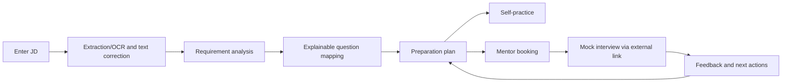

# Project Proposal — Interview Practice Platform

## 1. Document control

| Attribute | Value |
|---|---|
| Project name | Interview Practice Platform — working name |
| Team | Gia Thành, Hùng, Hưng, Trí, Luân, Tuấn Anh |
| Product Owner | Hưng |
| Project Manager / Team Leader / Timekeeper | Tuấn Anh |
| Project Planning & Estimation Analyst / Full-stack Developer | Gia Thành |
| Approving Sponsors | Lecturers Ngô Huy Biên and Ngô Ngọc Đăng Khoa |
| Proposed period | 29/06/2026–23/08/2026 (8 weeks) |
| Cash ceiling | 1,125,000 VND |
| Version | 0.4 — streamlined proposal |
| Last updated | 21/08/2026 |
| Status | Internal planning baseline; awaiting formal Sponsor approval |

The proposal explains why the project should be done and how the team intends to prove that value. [Project Vision and Scope](../Project_Vision_and_Scope/Project_Vision_and_Scope.md) and [Product Backlog and Acceptance Criteria](../Project_Vision_and_Scope/Product_Backlog_and_Acceptance_Criteria.md) control detailed requirements. Architecture and technical decisions belong to the relevant ADRs.

## 2. Proposal summary

When preparing for an internship or a first job, many students start from a specific Job Description (JD) but must figure out the requirements themselves, gather questions from many sources, and build a plan from fragmented notes. If they want a mock interview, they continue to find a suitable person, negotiate schedules over messages, and receive feedback without a common structure. As a result, candidates cannot tell whether they have covered the JD requirements or what to improve next.

Interview Practice Platform proposes a web MVP that connects these steps into one process:

```text
JD → extraction/OCR → text confirmation → requirement analysis
   → explainable question mapping → preparation plan
   → self-practice or Mentor booking → mock interview
   → rubric feedback → next actions
```

The MVP serves three roles: Student, Mentor, and Administrator. The pilot focuses on Front-end Intern/Junior candidates in Vietnam, using JavaScript, TypeScript, and React. The team uses external meeting tools, Mentors participate voluntarily, and payment is not handled. AI interviewer, automatic scoring, integrated video, recording/transcription, payouts, native mobile apps, and ATS are out of scope.

The team recommends a **conditional proceed**: complete the narrow trial and mandatory PoCs before deciding on a pilot release.

## 3. Problem, users, and needs

### 3.1 The problem

> An entry-level candidate reads a specific JD but does not know which knowledge, skills, and questions to prepare; the JD, questions, mock interview, and feedback are not yet connected in a traceable process.

Today, candidates must infer role, seniority, and skills from the JD; search questions across websites, videos, or communities; track progress in notes; then self-practice or find a Mentor through personal networks. Session goals, appointments, and feedback live in different tools, so learners find it hard to follow from the initial requirements to improvement actions.

### 3.2 Primary users and stakeholders

- **Student:** students preparing for internships, final-year students, recent graduates, or career changers at entry level with a specific Front-end JD.
- **Mentor:** people with Front-end, interviewing, or hiring experience who can offer time slots and rubric feedback.
- **Administrator:** people managing taxonomy, questions, Mentor verification, bookings, reports, and audits within their authority.
- **Sponsor and project team:** Sponsors approve the baseline and major changes; the Product Owner prioritizes value; Tuấn Anh, as Project Manager / Team Leader / Timekeeper, runs the team, time, Kanban, and risks; Gia Thành maintains planning/estimation data and contributes Full-stack development.
- **Supporting parties:** HR/content experts, universities or career clubs, Students joining UAT, and email, online meeting, OCR, or AI providers.

For power, interest, and coordination details, see [Stakeholder Analysis](../Project_Governance%20%26%20Stakeholder/Stakeholder_Analysis.md).

### 3.3 Pain points to verify

| Pain point | Symptom | Available evidence / explanation |
|---|---|---|
| Hard to know what to prepare | Unclear which requirements matter or which questions match the JD | The current-workflow analysis shows that candidates must read each JD, infer its requirements, search across separate sources, and map questions manually |
| Time-consuming | Must find, filter, and organize materials from many sources | The documented workflow contains multiple manual handoffs among job sites, search/content tools, notes, personal networks, chat/calendar, and meeting tools. See [Existing Tools Analysis](02_Existing_Tools_Analysis.md), Sections 2–4. |
| Lacking reliable feedback | Unsure whether answers are focused and clear | The existing-tools analysis records that feedback is commonly kept in messages or free-form documents, making it difficult to compare or convert into follow-up actions. See [Existing Tools Analysis](02_Existing_Tools_Analysis.md), Sections 2 and 4. |
| Hard to coordinate | Finding a Mentor and agreeing on goals/schedules over many messages | The current process uses personal networks, chat, calendars, and email; the analysis identifies long exchanges, missing context, and schedule-conflict risk. The repository contains no observed booking sample, confirmation-time measurement, or cancellation/no-show statistics. See [Existing Tools Analysis](02_Existing_Tools_Analysis.md), Sections 2–4. |
| Lacking confidence | Never tried a mock interview |  |

The process analysis provides a rational basis for investigating the first four pain points, but it is not customer validation. All five remain hypotheses until the team collects candidate interviews, surveys, task observations, or pilot data. Proposed completion, quality, booking, and confidence metrics belong to the validation plan; they are not proof that the pain points already exist.

## 4. Existing solutions and competitive context

Candidates can combine job sites, Google, YouTube, blogs, ChatGPT, LeetCode, notes, social media, calendars, and Google Meet/Zoom into a manual process. Each tool solves one step, but the data does not flow through. Candidates must still re-enter information, judge sources themselves, and connect feedback to their practice plan. [Existing Tools Analysis](Existing_Tools_Analysis.md) describes this process in detail.

The market already has question banks, peer-practice platforms, and mentor coaching services. MentorCruise, interviewing.io, Pramp/Exponent Practice, LeetCode, Mentori Vietnam, and Mentora show that each part of the need already has users. The gap the project wants to verify is not "nobody has done this", but an explainable, JD-first experience suitable for entry-level candidates in Vietnam. The full comparison is in [Competitor Analysis](Competitor_Analysis.md).

## 5. Proposed solution and business flow

The Student pastes or uploads a JD, reviews the extracted text, sees normalized requirements, and receives a question list with mapping reasons. From the preparation plan, the Student can self-practice or find an approved Mentor. The booking carries the goal plus JD or plan context; after the mock interview, feedback returns as next actions.



Each mapping result must trace to the source requirement, topic, reason, and version. Only `PUBLISHED` questions and `APPROVED` Mentors enter results. The system must prevent double booking, enforce object-level access control, and never let a notification error lose a recorded booking.

Per ADR-005, Gemini may support requirement analysis, explanation, and drafts behind a feature flag. AI results require validation and user confirmation; the rule/manual flow must still work when the provider fails. The MVP does not use Gemini as an AI interviewer or scoring tool.

## 6. Differentiation and business case

### 6.1 Differentiating value to prove

1. **Starts from a real JD:** users prepare for the opportunity they are applying to instead of learning from a generic content pool.
2. **Explainable mapping:** each question links to a source requirement, topic, reason, and version.
3. **Plan is valuable on its own:** a Student can still self-practice before wanting or being able to book a Mentor.
4. **Context flows end to end:** the JD or plan travels with the booking; feedback returns to the exact content that needs improvement.
5. **Lean MVP:** the team uses external meeting links, a free pilot, and manual fallback to focus resources on the core loop.

These points are positioning hypotheses. The team treats them as advantages only when usage data or pilot results exist.

### 6.2 Business case

An is a third-year IT student with three weeks to prepare for a Front-end Intern JD. An finds many articles and videos but does not know which requirements to prioritize, which questions fit the JavaScript/React in the JD, or whether their answers are clear enough. An spends many sessions compiling materials but may only discover weaknesses in a real interview.

With the product, An uploads the JD, fixes extraction errors, and receives a plan of questions with mapping reasons. An self-practices the fundamentals, then books a Front-end Mentor and includes the weaker topics. After the mock interview, An receives feedback with strengths, weaknesses, and next actions, then continues practicing from that same plan.

| Audience | Expected benefit | Evidence to collect |
|---|---|---|
| Student | Less compilation effort, clarity on what to prioritize, and actionable feedback | Task completion/time, usefulness, and before–after confidence |
| Mentor | Enough context, less manual coordination, clearer schedule management | Preparation time, accept/complete rates, and feedback completeness |
| Team/Sponsor | A basis for Go, Pivot, or Stop | Gate results, pilot funnel, and cost/capacity variance |

### 6.3 Assumed business model

The pilot uses the Question Bank, preparation plans, and volunteer Mentors; no payments, escrow, payouts, or commissions. The project therefore **does not yet prove unit economics**.

After the core loop demonstrates value, the team could study fees per completed booking, subscriptions for advanced content, or support packages for universities/clubs. Willingness to pay must be verified with behavior such as pricing interviews, choices between price tiers, or pre-bookings; a "yes, I'd pay" answer alone is not evidence.

## 7. MVP scope and deliverables

### In scope

- Authentication and role-based access for Student, Mentor, and Administrator.
- JD input of up to 50,000 characters or one PDF/PNG/JPEG up to 10 MB; PDFs up to 5 pages.
- Direct extraction, Vietnamese/English OCR fallback, and a text confirm/correction step.
- Requirement analysis, taxonomy/alias normalization, and explainable question mapping.
- Preparation plan, Question Bank, bookmarking, and basic practice status.
- Mentor profiles, verification, and availability.
- Booking, slot locking, rescheduling/cancelling, external meeting links, notification, and audit.
- Rubric feedback, valid reviews, reports/moderation, and a minimal admin page.
- Gemini assistance only when ADR-005's release gate passes; the rule/manual flow always exists.

The extended R1 covers only a basic progress dashboard and schedule reminders. The team selects these two items only when the Must scope and reserve remain safe.

### Out of scope

- AI interviewer, interview chatbot, automatic scoring, or voice/video analysis.
- Integrated video/audio calls, recording, or transcription.
- Automatic payment, escrow, payouts, and commissions.
- ML recommendations without deterministic guardrails.
- Native mobile, ATS/application submission, general OCR, and multi-country marketplaces.

Scope, business rules, Definition of Done, and acceptance criteria are detailed in [Project Vision and Scope](../Project_Vision_and_Scope/Project_Vision_and_Scope.md) and [Product Backlog and Acceptance Criteria](../Project_Vision_and_Scope/Product_Backlog_and_Acceptance_Criteria.md).

## 8. Time, resources, and budget

| Item | Baseline |
|---|---:|
| Members | 6 |
| Duration | 8 weeks, 29/06–23/08/2026 |
| Nominal capacity | 6 × 16 hours/week × 8 weeks = 768 hours |
| Reserve | 15% = 115.2 hours |
| Capacity for scope | About 653 hours |
| R1 Must | 27 stories, 134 SP |
| Throughput to compare | 33.5 SP/week across 4 reconstructed execution weeks |
| Direct cash | 900,000 VND |
| Cash contingency | 225,000 VND |
| **Cash ceiling** | **1,125,000 VND** |

134 SP is not yet a delivery commitment. The development team must run Planning Poker per story, update the two independent estimates, and use the actual throughput range to confirm the scope can be completed.

The six project phases are Discovery/Charter, Requirement/Prototype, Foundation, JD intake & analysis, Mentor core loop, and UAT/Release. Milestones, assignments, and detailed costs are in [Project Charter](../Project_Governance%20%26%20Stakeholder/Project_Charter.md), [Resource Plan](../Project_Resource_Plan/ResourcePlan.md), and [Cost, Time and Resources](../Project_Resource_Plan/Cost_Time_Resources.md).

## 9. Feasibility and key risks

### 9.1 Feasibility assessment

| Aspect | Assessment | Main conditions |
|---|---|---|
| Technical | Conditionally feasible | Extraction/OCR, mapping, authorization, booking consistency, notification fallback, and AI guardrails pass the gates |
| Operational | Conditionally feasible | 4 `APPROVED` Mentors with at least 3 slots each; clear policy and admin owner |
| Market | Some signals, not proven | Discovery reaches the right segment and task/value KPIs meet thresholds |
| Economic | Cash baseline exists, no unit economics | Stay within 1,125,000 VND; study pricing only after the free pilot |
| Schedule/resources | Baseline exists, no delivery commitment | Must backlog fits throughput range and ~653 hours |
| Legal/privacy | Conditionally feasible | Consent, data minimization, access control, retention/deletion, and provenance exist |

### 9.2 Priority risks

| Risk | Indicator | Response |
|---|---|---|
| Not enough Mentors for the pilot | Fewer than 4 Mentors or fewer than 3 slots each | Early outreach, concierge pilot, keep the plan independent of booking |
| Extraction/mapping insufficiently accurate | Blind recall or precision@10 below 80% | Correction gate, labeled corpus, taxonomy review, and rule fallback |
| Gemini errors or provider failure | Schema/evidence failures, quota or latency increases | Feature flag, validation, candidate constraints, and manual fallback |
| Inconsistent booking or data leakage | Double booking, invalid transitions, or unauthorized access | Transaction/unique constraints, audit, and negative tests |
| Scope beyond baseline | AI/video/payment stories pulled into Ready or forecast beyond 653 hours | Change control, cut Should/Could, and rebaseline |
| Pilot lacks evidence | Not enough Students, JDs, or bookings before the gates | Recruit from discovery and use a supported pilot when needed |

The full analysis and seven Go/No-Go gates are in [Feasibility Study](../Project_Feasibility/feasibility.md).

## 10. Expected outcomes and evaluation method

| Objective | Metric | Proposed threshold |
|---|---|---:|
| Confirm the problem | Discovery sample confirms at least one core pain | ≥70% |
| Complete JD-to-plan | Student enters JD, edits text, and creates a plan | ≥80% |
| Analysis quality | Blind requirement recall and precision@10 | ≥80% |
| Validity/explainability | Results include source/topic/reason/version; no invalid Question/Mentor | 100% |
| Activation from plan | Student opens a Question or Mentor flow from the plan | ≥80% |
| Pilot booking | Valid / `CONFIRMED` / `COMPLETED` bookings | 12 / ≥10 / ≥8 |
| Feedback quality | Completed bookings have strengths, weaknesses, and next actions | ≥90% |
| Perceived value | Usefulness score and after–before confidence | ≥4/5, average increase ≥1/5 |
| Technical quality | Critical workflow tests and pre-UAT defects | 100% pass; 0 Critical/High |

The team uses 20 legal, de-identified JDs: 12 for calibration, 8 blind. The pilot plans 12 Students and 4 Mentors. Results only evaluate the narrow trial; they do not represent the whole market.

## 11. Recommendation, approval conditions, and references

### 11.1 Recommendation

The team should continue the PoC and narrow pilot but should not treat this plan as a release commitment yet. The final decision follows three directions:

- **Go:** core KPIs met, bookings actually happen, feedback is useful, and the forecast fits capacity/budget.
- **Pivot:** the preparation plan has value but bookings are low, or the Mentor loop shows signal while JD-to-plan does not yet; adjust the value proposition based on evidence.
- **Stop/Redesign:** pain is not confirmed, extraction/mapping remains below thresholds after one remediation cycle, or there are access leaks, Mentor shortage, or the core loop exceeds the baseline.

### 11.2 Approval conditions

Before the pilot release, the team needs:

- Sponsor signatures in the Project Charter and Product Owner scope confirmation;
- Planning Poker for 27 Must stories/134 SP, both estimates updated, and a suitable throughput range;
- 20 legal/de-identified JDs, labeling instructions, and a fixed blind set;
- prototype/UAT evidence, mandatory PoCs, and release gates;
- privacy review, authorization negative tests, and a manual fallback walkthrough;
- no remaining Critical/High defects;
- a forecast within 8 weeks, ~653 hours, and 1,125,000 VND;
- a recorded Go/Pivot/Stop decision based on KPIs.

### 11.3 Reference documents

- [Project Charter](../Project_Governance%20%26%20Stakeholder/Project_Charter.md)
- [Project Vision and Scope](../Project_Vision_and_Scope/Project_Vision_and_Scope.md)
- [Product Backlog and Acceptance Criteria](../Project_Vision_and_Scope/Product_Backlog_and_Acceptance_Criteria.md)
- [Product Decision Estimation Notes](../Project_Vision_and_Scope/Product_Decision_Estimation_Notes.md)
- [Feasibility Study](../Project_Feasibility/feasibility.md)
- [Cost, Time and Resources](../Project_Resource_Plan/Cost_Time_Resources.md)
- [Software Architecture](../Project_Architecture/software_architecture.md)
- [ADR-004 — JD Processing and Question Matching](../Project_Architecture/ADR/ADR-004-JD-Processing-and-Question-Matching.md)
- [ADR-005 — Hybrid Gemini Assistance](../Project_Architecture/ADR/ADR-005-Hybrid-Gemini-Assistance.md)

The proposal follows guidance from `docs/refs/02-software-project.md` (slide 032), `docs/refs/03-1-business-requirements.md` (slides 005 and 066), `docs/refs/03-software-project-initiation.md` (slides 015, 022–023) and `docs/refs/03-2-user-requirements.md` (slide 017).

Market sources inherited from the original proposal include MentorCruise, interviewing.io, Pramp/Exponent Practice, LeetCode, Mentori Vietnam, and Mentora. The information was recorded on 09/08/2026 and must be re-verified before the team makes business or pricing decisions.
