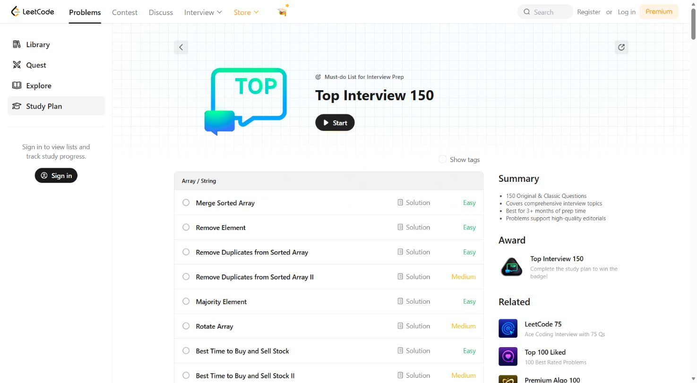
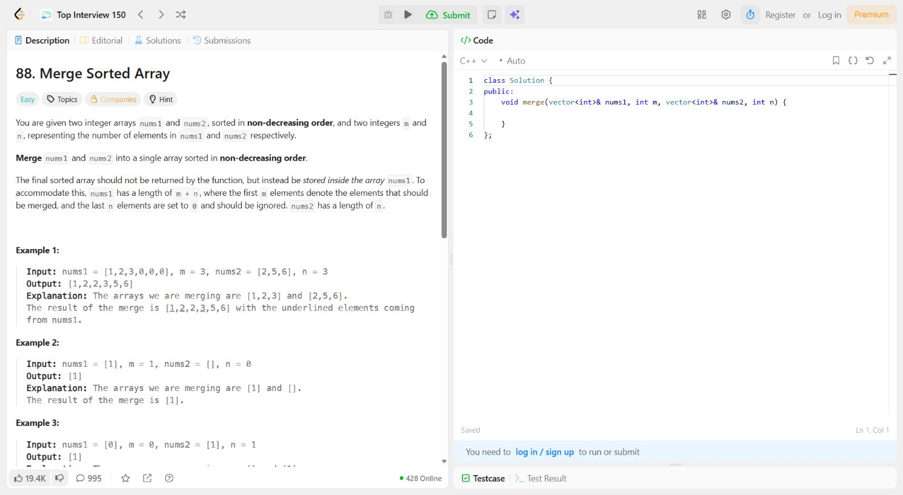
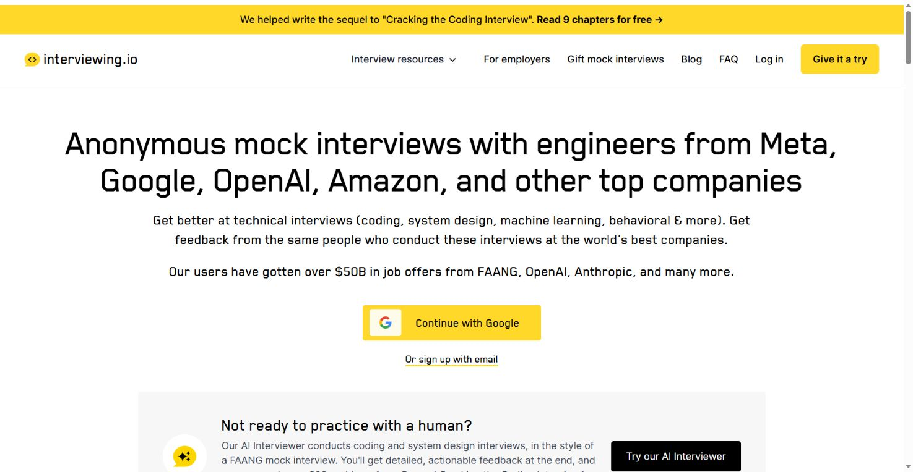
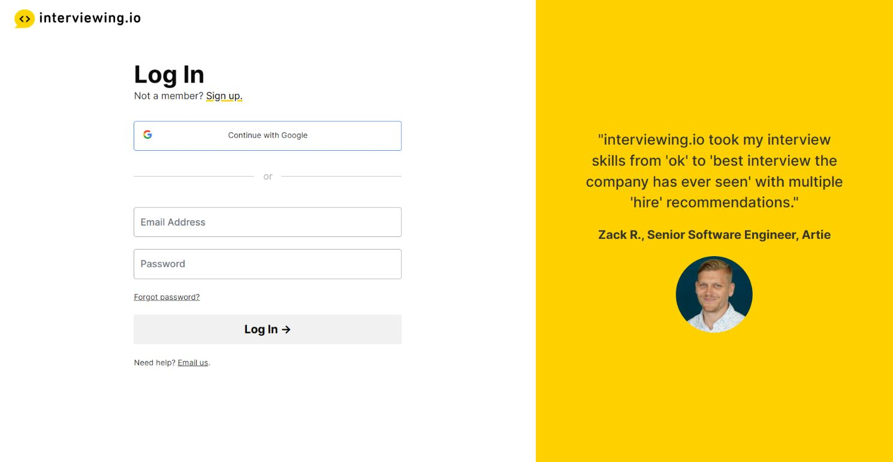
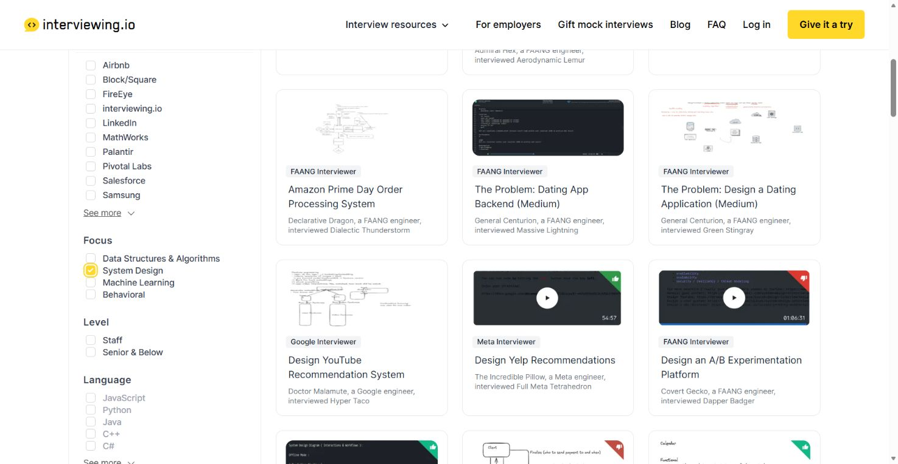
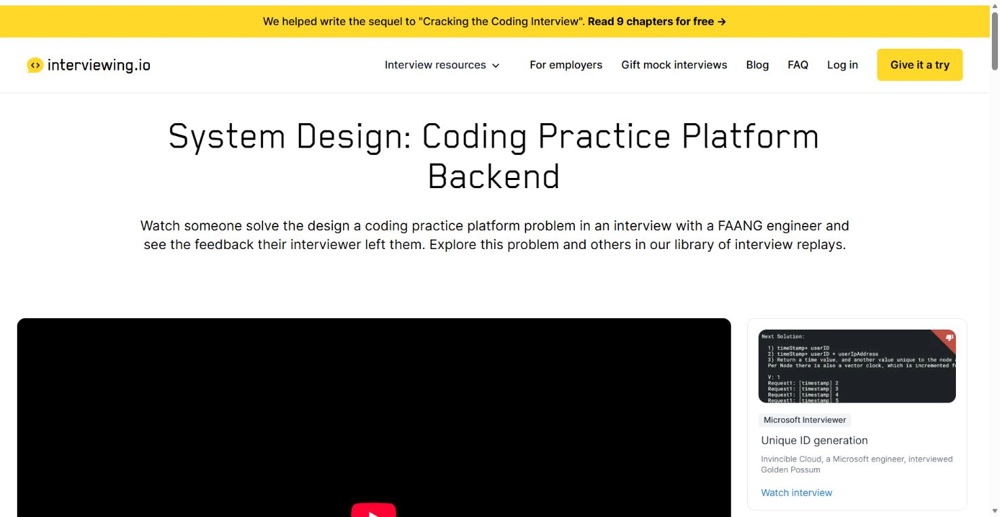
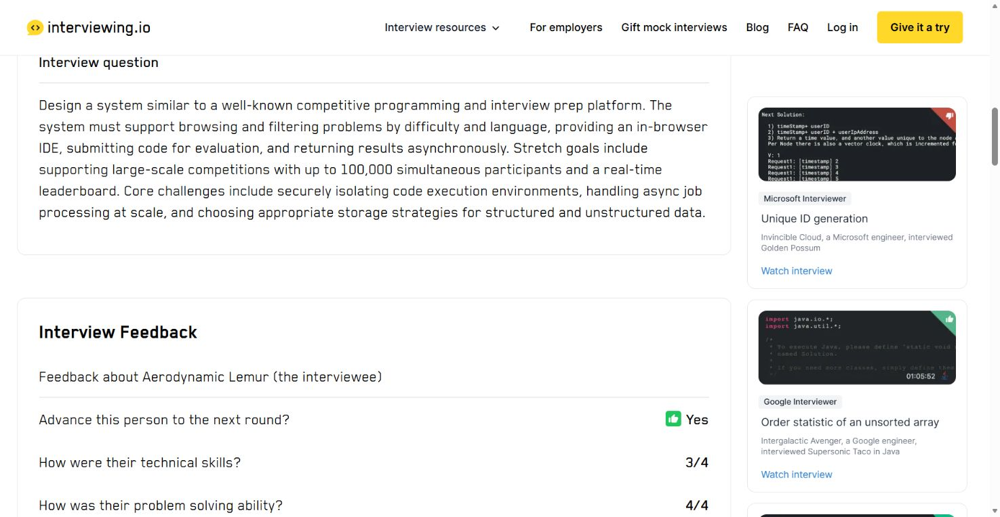

# Interview Practice Platform — Competitor Analysis

| Attribute             | Value                                                                  |
| --------------------- | ---------------------------------------------------------------------- |
| Source reference date | 09 August 2026, as recorded in the proposal                            |
| Status                | Preliminary analysis; revalidation required before a business decision |

## 1. Executive summary

The market already demonstrates demand for question banks, peer practice, and mentor coaching. The hypothesis to validate is a Vietnam-focused experience for entry-level candidates in which one specific JD becomes an explainable preparation plan and then provides shared context for questions, bookings, and feedback.

## 2. Evidence rules

- The comparison uses public descriptions from official product websites recorded in the proposal.
- A “gap” is a positioning hypothesis, not proof that a competitor lacks a capability.
- Features, prices, and policies can change and must be checked again before each analysis round.

## 3. Capability comparison

| Solution                  |              Question bank |     Mentor/coach |                Booking |                    Feedback | Primary focus                                              |
| ------------------------- | -------------------------: | ---------------: | ---------------------: | --------------------------: | ---------------------------------------------------------- |
| MentorCruise              |                    Limited |              Yes |                    Yes |                         Yes | Global coaching and mentoring                              |
| interviewing.io           |                        Yes |              Yes |                    Yes |                         Yes | Technical interviews, experienced engineers, and AI        |
| Pramp / Exponent Practice |                        Yes |             Peer |                    Yes |                         Yes | Peer-to-peer matching                                      |
| LeetCode Study Plans      |          Strong for coding |               No |                     No | Automated technical judging | Algorithms and coding practice                             |
| Mentori Vietnam           |             Career content |              Yes |      Service-dependent |            Mentor-dependent | Broad mentoring in Vietnam                                 |
| Mentora                   | Content and learning paths |              Yes |      Service-dependent |         Programme-dependent | Mentoring and training                                     |
| Proposed product          | Explainable JD mapping with deterministic guardrails | Approved mentors | Yes, linked to JD/plan | Rubric and next action | JD-first preparation for entry-level candidates in Vietnam |

## 4. Competitor assessment

- **MentorCruise:** strong global mentor supply, professional profiles, and one-to-one coaching. Pricing, recruitment context, and the learning workflow may not be optimised for Vietnamese students; this requires validation.
- **interviewing.io:** strong technical mock interviews, experienced interviewers, feedback, and AI capabilities. The proposed product may differentiate through broader entry-level roles and Vietnamese context, but this remains a hypothesis.
- **Pramp / Exponent Practice:** accessible matching, scheduling, and interview practice. Peer feedback quality depends on the match; the proposed product prioritises verified mentors.
- **LeetCode:** rich coding material, clear study plans, and automatic judging. It does not replace the full JD-to-plan-to-mentor loop or feedback on communication and follow-up questions.
- **Mentori Vietnam and Mentora:** local-market understanding, communities, and mentor connections. The proposed product specialises in JD-to-plan preparation, short mock sessions, a shared rubric, and connection to the question bank.

## 5. Competitive risks

- Existing competitors may add taxonomies, rubrics, or student segments.
- A new marketplace faces a candidate–mentor supply problem.
- A standalone question bank is easily substituted by free content and general-purpose AI.
- “Vietnam-focused” is meaningful only if content, price, mentor supply, and experience fit local users.

## 6. Advantages that still require proof

1. Users can turn a JD into corrected text and a preparation plan more easily than by manual aggregation.
2. Requirement detection and question mapping meet blind-JD thresholds, remain explainable, and retain a rule/manual fallback when the AI provider fails.
3. Mentor bookings carrying JD/plan context complete at an acceptable rate.
4. Rubric-based feedback creates clearer next actions than free-form feedback and updates the same plan.
5. Student affordability and mentor incentives must be researched after the free pilot; they cannot be inferred from it.

These hypotheses trace to the business case, KPIs, and Go/Pivot/Stop criteria in the [Project Proposal](../../../Project_Proposal/Project_Proposal.md). They are not proven advantages.

## 7. Workflow screenshots

### 7.1 LeetCode — Top Interview 150

**Step 1 — Open the Top Interview 150 study plan**

**Step 2 — Select a question by topic group and difficulty**

**Step 3 — Open the problem, code editor, and test cases**

### 7.2 interviewing.io

**Step 1 — Open interviewing.io and review the available practice paths**

**Step 2 — Open AI Interviewer and reach the login requirement**

**Step 3 — Filter public interview replays by System Design**

**Step 4 — Open the Coding Practice Platform replay**

**Step 5 — Review the structured interview feedback**

## 8. Sources

- [MentorCruise — Interview Coaching](https://mentorcruise.com/coach/interview/)
- [interviewing.io](https://interviewing.io/)
- [Pramp / Exponent Practice](https://www.pramp.com/)
- [LeetCode — Top Interview 150](https://leetcode.com/studyplan/top-interview-150/)
- [Mentori Vietnam](https://mentori.vn/c/mentori)
- [Mentora](https://mentora.edu.vn/gioi-thieu/)
