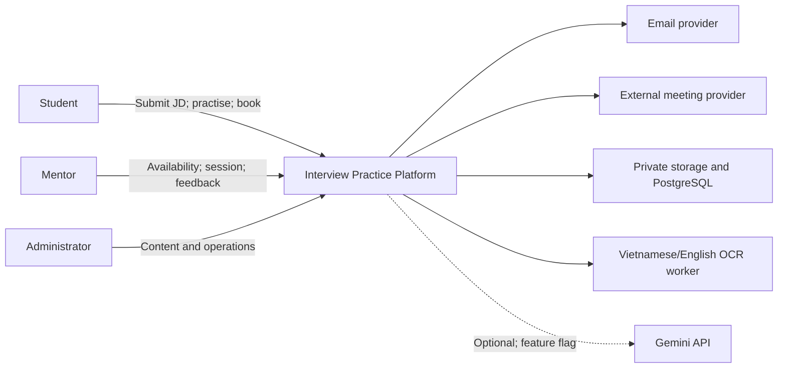

# Interview Practice Platform — Project Vision and Scope

## 1. Document control

| Item                 | Details                                                                        |
| -------------------- | ------------------------------------------------------------------------------ |
| Purpose              | Define the product direction, users, goals, MVP scope, assumptions, and limits |
| Owner in the Charter | Hưng — Product Owner/Business Analyst                                          |
| Main update          | JD-first revision in commit `7ca1f6e`, PR `#6`, 16 August 2026                 |
| Status               | Internally reconciled with ADR-005 |
| Scope reconciliation | ADR-005 accepted behind feature flags on 17/08/2026                             |

The Charter assigns Hưng as Product Owner / Business Analyst; Hùng as UI/UX Designer / Front-end Developer; Trí as PoC / Integration & E2E Developer; Luân as Architecture / Technical Lead; Tuấn Anh as Project Manager / Team Leader / Timekeeper; and Gia Thành as Project Planning & Estimation Analyst / Full-stack Developer. These assignments do not prove that each person reviewed this document.

## 2. Product overview

The Interview Practice Platform helps Vietnamese candidates prepare for a specific job description (JD). The candidate reviews the extracted JD text, sees its main requirements, receives related interview questions, and creates a preparation plan. The candidate can then self-practise or book a mock interview with a Mentor.

| Item             | Description                                                                                   |
| ---------------- | --------------------------------------------------------------------------------------------- |
| Main users       | Final-year students, internship candidates, recent graduates, and entry-level career changers |
| Main input       | JD text or a supported file                                                                   |
| Main value       | Corrected JD text, clear requirements, related questions, and a preparation plan              |
| Service provider | Approved Mentor                                                                               |
| Operator         | Administrator/content moderator                                                               |
| Value loop       | JD → Plan → Self-practice/Mentor → Feedback → Next action                                     |

## 3. Vision and mission

### Vision

> Give entry-level candidates one trusted place to understand a JD, find relevant questions, and practise with a Mentor.

### Mission

> Turn job requirements into a clear plan that candidates can practise and improve through feedback.

### Positioning

The product is for Vietnamese candidates preparing for internships or entry-level roles. It keeps a clear link from the JD to questions, practice sessions, feedback, and next actions.

This position is a hypothesis. The repository does not contain customer research that proves product–market fit.

## 4. Problem and opportunity

Candidates often have to:

- read and understand the JD without guidance;
- search many sources for questions;
- correct extraction or OCR errors themselves;
- find and schedule Mentors through separate channels; and
- turn free-form feedback into a new study plan.

The opportunity is to connect these steps with one shared taxonomy and one preparation plan. The plan provides value before a Mentor booking and gives the Mentor enough context for the session.

## 5. Target users

### Candidate

A typical user is a student preparing within a few weeks for a Front-end Intern/Junior JD that mentions JavaScript, TypeScript, or React. The user needs clear requirements, relevant questions, and a practical study plan.

### Mentor

The Mentor needs clear JD, topic, question, and session-goal context. The Mentor also needs simple availability and feedback tools.

### Administrator

The Administrator manages taxonomy, questions, Mentor approval, bookings, reports, and audit records. Access to private data must follow the user's role and ownership.

## 6. Product goals

The values below are targets. Current baselines are not recorded.

| ID     | Goal                               | Proposed measure                                                       |
| ------ | ---------------------------------- | ---------------------------------------------------------------------- |
| OBJ-01 | Confirm the JD preparation problem | At least 70% of a valid discovery sample confirms the problem          |
| OBJ-02 | Complete JD intake and review      | At least 80% of valid users complete input, extraction, and correction |
| OBJ-03 | Find expected requirements         | At least 80% recall on a labelled JD set                               |
| OBJ-04 | Give useful question mappings      | At least 80% relevance; every result has source, topic, and reason     |
| OBJ-05 | Start practice from the plan       | At least 80% open a question or Mentor flow from a valid plan          |
| OBJ-06 | Complete reliable bookings         | At least 80% of confirmed bookings are completed                       |
| OBJ-07 | Give useful feedback               | At least 90% includes strength, weakness, and next action              |
| OBJ-08 | Improve user confidence            | Average usefulness at least 4/5 and confidence increase of 1/5         |

## 7. MVP scope

### In scope

- Accounts, authentication, and role-based access for Student, Mentor, and Administrator.
- JD input by text, PDF, PNG, or JPEG.
- Direct extraction and Vietnamese/English OCR fallback.
- Student correction before analysis.
- Requirement detection, shared taxonomy, and explainable question mapping.
- Optional Gemini assistance for requirement extraction, taxonomy candidates, explanations, interview-agenda drafts, and feedback drafts, only behind feature flags and after the ADR-005 release gate passes. All output is treated as untrusted input and requires schema/domain validation plus Student or Mentor confirmation where applicable; the rule-based/manual flow remains available.
- Preparation plans and Question Bank functions.
- Mentor profile, approval, expertise, and availability.
- Booking with JD/plan context and slot-conflict protection.
- External meeting links, notifications, feedback, reviews, audit, and basic administration.

### Out of scope

- AI interviewer and automatic answer scoring.
- Gemini reranking, autonomous recommendations, or AI-controlled creation of Questions, Mentors, bookings, official feedback, or other business-state changes.
- Built-in calls, recording, or transcription.
- Payment, escrow, refund, or payout.
- Native mobile applications and applicant tracking.
- A production-scale Mentor marketplace.

## 8. Product boundary

| Capability                            | MVP |                     Future option |
| ------------------------------------- | --: | --------------------------------: |
| JD text/file input                    | Yes |                More input sources |
| Direct extraction and limited OCR     | Yes |        More formats and languages |
| Text correction before analysis       | Yes |             Better review support |
| Requirement analysis and explanations | Yes — rule/manual baseline; gated Gemini assistance | Gemini reranking only after separate validation and approval |
| Rule-based question mapping           | Yes — deterministic score and rank | Autonomous/semantic recommendation only after approval |
| Preparation plan and Question Bank    | Yes |            Personalised analytics |
| Mentor profile, approval, and booking | Yes |                Larger marketplace |
| External meeting link                 | Yes |                    Built-in video |
| Feedback and review                   | Yes |        Advanced feedback analysis |
| Payment                               |  No | Payment and payout after approval |

The platform is the source of truth for JD processing, requirements, mappings, plans, questions, users, slots, bookings, and feedback. Email, meeting, OCR, and Gemini providers must not control business state. Gemini receives only the minimum confirmed text or booking snapshot and returns untrusted output that cannot perform a business mutation.

## 9. Assumptions

- The team can prepare 20 legal and de-identified Front-end Intern/Junior JDs.
- The pilot Question Bank covers JavaScript, TypeScript, and React well enough.
- Students will correct extracted text before analysis.
- The pilot can recruit 12 Students and 4 approved volunteer Mentors.
- Each Mentor can provide at least three time slots.
- External meeting and hosting tools support a small pilot.
- The Gemini pilot can pass data-processing/retention review and the ADR-005 release gate before any related feature flag is enabled.

These are planning assumptions, not confirmed results.

## 10. Constraints

- Six members, eight weeks, and about 653 available hours after a 15% reserve; the team uses Kanban throughput to forecast release scope.
- Internal cash limit of VND 1,125,000.
- JD input limit: 50,000 characters or one file up to 10 MB; PDF up to five pages.
- OCR supports Vietnamese and English, with a 60-second timeout and two attempts.
- Mapping quality only applies to the pilot taxonomy and Question Bank.
- Private JD, Mentor, meeting, booking, and feedback data needs access and retention controls.
- Gemini flags default to off; calls are server-side, bounded by quota/timeout/retry controls, and must preserve the rule-based/manual fallback.
- A major scope change needs impact analysis, re-estimation, and approval.

## 11. Creation, review, and use

| Stage           | Evidence                                                                                                          |
| --------------- | ----------------------------------------------------------------------------------------------------------------- |
| Initial version | Added in commit `0743a68` on 13 August 2026                                                                       |
| Main update     | Changed to JD-first in `7ca1f6e`, PR `#6`, Git author `Z3n`, on 16 August 2026                                    |
| Scope reconciliation | ADR-005 accepted optional Gemini assistance behind feature flags on 17 August 2026; reflected in this print baseline without adding AI interviewer/scoring or autonomous business mutations |
| Review method   | Checked content, goal traceability, scope, measures, feasibility, resources, backlog, prototype, and architecture |
| Main changes    | Added correction, taxonomy, explainable mapping, targets, constraints, and clear exclusions                       |
| Use             | Source for the backlog, workflow, prototype, architecture, feasibility, resources, and implementation             |

Git proves that the document changed. It does not prove Product Owner acceptance, customer validation, or Sponsor approval. Named review comments and signatures are not stored in the repository.

## 12. References

- [Project Proposal](../Project_Proposal/Project_Proposal.md)
- [Product Backlog and Acceptance Criteria](Product_Backlog_and_Acceptance_Criteria.md)
- [Current-State Workflow](Current_State_Workflow.md)
- [Future-State Workflow](Future_State_Workflow.md)
- [Project Charter](../Project_Governance%20%26%20Stakeholder/Project_Charter.md)
- [Feasibility Study](../Project_Feasibility/feasibility.md)
- [Prototype Workflow](../Project_Prototype/Prototype_Workflow.md)
- [Software Architecture](../Project_Architecture/software_architecture.md)
- [ADR-005 — Hybrid Gemini Assistance](../../../Project_Architecture/ADR/ADR-005-Hybrid-Gemini-Assistance.md)
