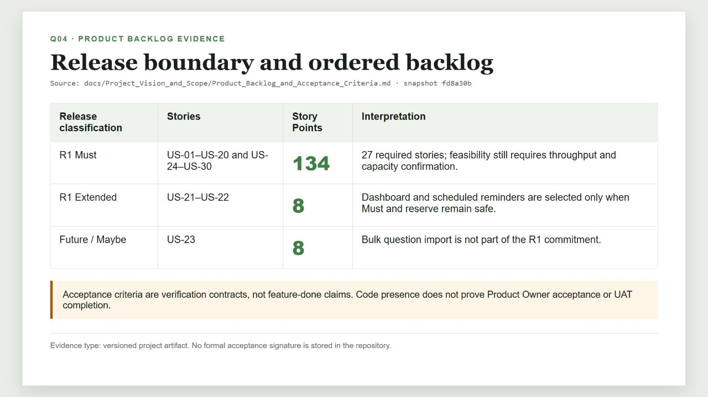
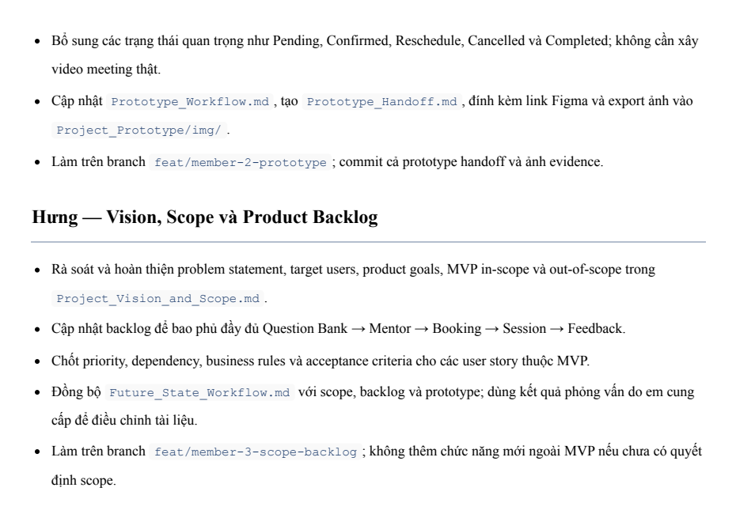

# Q04 Print Report - Software Requirements, Product Backlog, and Acceptance Criteria

## 1. Document control

| Field | Value |
|---|---|
| Project | Interview Practice Platform (PrepVI) |
| Examination topic | Q04 - Software Requirements / Product Backlog |
| Examination owner | Hưng |
| Project role | Product Owner / Business Analyst |
| W10 assignment | Member 3 - Vision, Scope, Product Backlog, Acceptance Criteria, and Future-State Workflow |
| Source-code snapshot reviewed | `fd8a30b` |
| Evidence review date | 23 August 2026 |
| Documentation basis | Working-tree report prepared from repository snapshot `fd8a30b`; Git history records the later documentation commit |
| Language | English; original Vietnamese evidence is explicitly identified |

## 2. Purpose

This report explains what the Product Backlog and acceptance criteria are, how the team created and changed them, why they are used, when the documented changes occurred, and what evidence is retained. It distinguishes a requirement baseline from implementation presence and from formal Product Owner or UAT acceptance.

## 3. Core definitions

| Term | Project meaning |
|---|---|
| Software requirement | A need or condition the product must satisfy |
| Functional requirement | A behavior or service provided by the system |
| Non-functional requirement (NFR) | A measurable quality attribute or constraint |
| Business rule (BR) | A domain policy applying across one or more stories |
| User Story | A concise actor-need-value statement |
| Acceptance Criteria (AC) | Observable pass/fail conditions used for story acceptance |
| Product Backlog | The ordered list of product work, including priority, dependencies, estimates and status |
| Definition of Ready | The common conditions required before a story is selected for delivery |
| Definition of Done | The common completion standard beyond story-specific AC |

Acceptance Criteria are verification contracts, not feature-completion claims. Passing the AC still requires retained test/UAT evidence and the applicable acceptance decision.

## 4. Inputs, ownership, and method

The backlog was derived from the Project Charter, Vision and Scope, current and future workflows, prototype, interviews, architecture constraints, and product decisions. Hưng, as Product Owner / Business Analyst, owns backlog ordering, requirement clarification, trade-off decisions, and story acceptance. The Development Team owns relative estimation.

The working method was:

1. normalize terminology and actors;
2. group requirements into product capabilities;
3. write actor-need-value stories;
4. identify dependencies and release boundaries;
5. define observable AC;
6. link BRs, NFRs, workflows, objectives and validation suites;
7. estimate with the Development Team; and
8. order the Product Backlog by value, risk and dependency.

## 5. Release boundary

| Classification | Stories | Story Points | Decision |
|---|---|---:|---|
| R1 Must | US-01-US-20 and US-24-US-30 | 134 | 27 required stories in the documented release baseline |
| R1 Extended | US-21-US-22 | 8 | Selected only when Must scope and reserve remain safe |
| Future / Maybe | US-23 | 8 | Not part of the current R1 commitment |

The 134-SP Must baseline is not a delivery commitment until capacity, throughput and Development Team estimation support it.

**Figure Q04-02.** Versioned backlog evidence at snapshot `fd8a30b`. The figure also records that code presence does not prove acceptance.

## 6. Acceptance Criteria example: US-30

**Story:** As a Student, I want to attach my JD or Preparation Plan to a booking so the Mentor receives the correct practice context.

The acceptance logic requires:

- exactly one Student-owned JD or Preparation Plan;
- an active context version;
- selected topics that are a valid subset of the context;
- an `APPROVED` Mentor whose expertise overlaps the selected topics;
- an available slot checked within the booking transaction;
- a minimum-data immutable context snapshot;
- one booking for retries using the same `Idempotency-Key`;
- non-disclosing ownership failures; and
- HTTP `409` with recovery guidance for slot conflicts.

This example connects functional behavior, authorization, privacy, consistency and error recovery in one vertical slice.

## 7. Business rules, quality requirements, and traceability

Representative controls include:

- BR-02: one slot may be held by at most one booking;
- BR-07: only valid `PUBLISHED` questions may be public or used for matching;
- BR-08: state transitions are audited and apply the 12-hour, 24-hour and 15-minute policies;
- BR-16: deterministic 40/30/15/15 matching with a minimum score of 60;
- BR-18/19: minimum booking context, ownership, privacy and retention;
- NFR-01: default-deny authorization; and
- NFR-03: exactly one winner under booking concurrency.

Example traceability chain:

`RQ-11 -> US-24/25/26 -> BR-12/13/14/19 -> AC-24/25/26 -> TC-JD -> NFR-09/11 -> OBJ-02`

This chain identifies requirement origin, delivery stories, governing rules, validation and the supported objective.

## 8. Change history and review evidence

| Commit | Date | Evidence |
|---|---|---|
| `0743a68` | 13 Aug 2026 | Initial documentation tree |
| `7ca1f6e` / PR #6 | 16 Aug 2026 | Member 3 scope and backlog completion |
| `f0292a3` / PR #23 | 23 Aug 2026 | Shared-document reconciliation and English standardization |

**Figure Q04-03.** Git proves document changes and Pull Request references. The repository does not store signed review comments, customer validation, Sponsor approval or formal Product Owner acceptance for the whole baseline.

The original W10 assignment is retained below. It is Vietnamese source evidence, not mixed-language report prose.

**Figure Q04-01.** Original W10 assignment. English translation: Hưng was assigned to complete Vision and Scope, update the end-to-end Product Backlog, finalize priority/dependencies/business rules/acceptance criteria, synchronize the Future-State Workflow, and avoid adding functions outside the MVP without a scope decision.

## 9. Implementation reconciliation at `fd8a30b`

| Item | Implementation observed | Release interpretation |
|---|---|---|
| US-01-US-20 and US-24-US-30 | Core backend modules, migrations and Student/Mentor/Admin UI routes exist | Implementation presence does not prove that all 27 stories passed UAT or were accepted |
| US-21 | Real-data Student Dashboard exists | Remains R1 Extended |
| US-22 | Reminder schema and worker behavior exist | Remains R1 Extended and is disabled by default with `BOOKING_REMINDERS_ENABLED=false` |
| US-23 | Bulk-import migration, API and Admin UI exist | Remains Future / Maybe until a Product Owner scope decision changes the baseline |
| ADR-005 Gemini assistance | Requirement analysis, explanation and Mentor drafting assistance exist behind controls | The deterministic matcher remains authoritative; no AI interviewer or automatic candidate scoring is claimed |
| Automated tests | Vitest files cover selected policies, API behavior and frontend utilities | They are partial technical evidence; the current CI workflow does not run `npm test` |

When implementation and release classification differ, the Product Backlog remains authoritative for priority and scope; the codebase remains authoritative for implementation presence. A scope change must update ordering, dependencies, estimates, traceability, affected contracts and release impact.

## 10. Evidence limitations

- No signed baseline approval or complete story-by-story UAT package is stored.
- Proposed NFR targets must not be reported as achieved without the agreed dataset, measurement and retained result.
- Pull Request references prove a review channel, not the content or outcome of every review.

## 11. Source artifacts

- [Product Backlog and Acceptance Criteria](../../Project_Vision_and_Scope/Product_Backlog_and_Acceptance_Criteria.md)
- [Project Vision and Scope](../../Project_Vision_and_Scope/Project_Vision_and_Scope.md)
- [Future-State Workflow](../../Project_Vision_and_Scope/Future_State_Workflow.md)
- [Project Charter](../../Project_Governance%20&%20Stakeholder/Project_Charter.md)
- [ADR-005 - Hybrid Gemini Assistance](../../Project_Architecture/ADR/ADR-005-Hybrid-Gemini-Assistance.md)

## 12. Final print checks

- [ ] Keep original identifiers such as US, AC, BR, RQ, NFR, OBJ and FS unchanged.
- [ ] Print figures in color and verify that captions remain with their figures.
- [ ] Do not report implementation presence as Product Owner/UAT acceptance.
- [ ] Do not include credentials, raw private JD text, meeting links or personal data.
