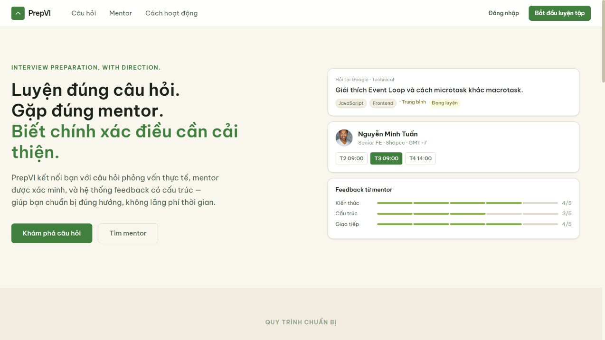

# PrepVI User Guide

## Document control

| Field | Value |
| --- | --- |
| Project | PrepVI - Interview Practice Platform |
| Version | 1.0 |
| Reporting date | 24 August 2026 |
| Audience | Students, Mentors, Administrators and demonstration operators |
| Scope | Current repository behavior; provider-dependent limitations are stated explicitly |

## 1. Purpose and access

PrepVI helps a Student turn a job description into interview requirements, relevant Question Bank items, a preparation plan and a Mentor booking. Mentors manage profiles, expertise, availability, meetings and feedback. Administrators review restricted operations, Mentor verification and Question Bank content.

Use the public deployment only with accounts and data authorized for that environment. For a reproducible local walkthrough, follow the root `README.md`, apply migrations and reference/demo seeds, then sign in with the demo accounts documented there. Never put passwords, tokens, raw private job descriptions, verification evidence or meeting links into screenshots or support reports.

## 2. Common navigation and account behavior

1. Open the home page and select the sign-in action.
2. Enter the registered email and password. The application redirects to the home page for the account role.
3. Use the top navigation to open role-specific features.
4. Use the account menu to sign out before changing accounts.
5. If a private object belongs to another user, the application may show a not-found response to avoid revealing that the object exists.

For a recoverable error, read the action shown in the error panel. Support details contain a safe reference/correlation identifier, timestamp and route; they must not contain the submitted password or private request body.

## 3. Student workflow

### 3.1 Profile and Question Bank

- Open the profile area to maintain learning goals and profile context.
- Open the Question Bank to search published questions, view details and track practice.
- Only published questions with valid taxonomy and provenance are public or eligible for deterministic matching.

### 3.2 Create and manage a job-description context

1. Open the job-description and preparation-plan area, then start a new JD analysis.
2. Paste text or upload one supported PDF/PNG/JPEG within the displayed size/page limits.
3. For a file, wait for direct extraction or OCR. If extraction fails, retry the existing extraction, upload another file or use the manual paste/edit path; do not repeatedly create duplicate contexts.
4. Review and correct the extracted text. Confirm it before analysis and matching.
5. Review detected requirements and their source badge. Gemini may assist when enabled; deterministic rule-based fallback remains valid and must be labelled.
6. Map requirements, select appropriate questions and create a preparation plan.
7. Return to the context-management page to rename, inspect or archive owned JD/plan records. Archiving removes a context from new selections but retains protected history.

### 3.3 Find a Mentor and book a session

1. Open an active preparation plan and select Mentor candidates, or open **Mentor** from navigation.
2. Check expertise and a future available slot.
3. Create a booking with exactly one owned JD or preparation plan and valid selected topics.
4. Review the booking status. A slot conflict requires another slot; a version conflict requires reloading the current context before resubmission.
5. For a confirmed session, open the interview-session detail page. A meeting link is visible only to allowed participants during the policy window.
6. Report a missing/broken link only when the interface enables that action. Follow the replacement/reschedule recovery shown by the system.
7. After completion, view Mentor feedback, explicitly apply selected next actions to the plan and submit at most one eligible review.

## 4. Mentor workflow

1. Complete onboarding, profile and consent information.
2. Submit verification evidence through the restricted verification flow. The profile and slots are not public until approval.
3. Add expertise and future availability; overlapping or past slots are rejected.
4. Open the Mentor booking inbox to review requests and use only the transitions enabled for the current state.
5. For a confirmed booking, add or replace the external meeting link within the displayed policy. Do not send credentials or unrelated Student data.
6. After the scheduled end and valid completion, submit one structured feedback record with strengths, weaknesses and next actions.

## 5. Administrator workflow

- Use **Queue** for allowlisted operation cases. Review the impact preview, provide a reason and use the current version before applying an action.
- Review Mentor verification without exposing restricted evidence outside the authorized view.
- Manage taxonomy and questions through their lifecycle; publication requires valid classifications and provenance.
- Use bulk import preview to inspect valid/invalid CSV rows. Commit creates valid rows as drafts and never silently creates taxonomy or auto-publishes content.
- Use the audit view for traceability. Do not repair normal operational cases by directly editing the production database.

## 6. Error and manual-recovery guide

| Situation | User action |
| --- | --- |
| Invalid field or unsupported file | Correct the marked field/file and submit again |
| Safe retry offered | Retry the same operation; the client keeps an idempotency key where required |
| Extraction unavailable | Retry extraction, re-upload, or paste/edit text manually |
| No question meets the 60% confidence requirement | Search the Question Bank manually; the system does not lower the requirement automatically |
| Plan has no valid topic | Return to mapping/Question Bank and add a valid topic before booking |
| Booking slot conflict | Reload availability and select another slot |
| Resource version conflict | Reload the newest version before editing or submitting |
| Provider/database unavailable | Wait and retry only when instructed; copy safe support details if the issue persists |
| Operation case created | Give the reference identifier to an authorized operator; do not include credentials/private content |

## 7. Current hosted-environment limitations

- The repository contains a background worker, but the current Render Terraform configuration does not host it. Hosted OCR, outbox delivery, scheduled reminders, retention cleanup and other worker-dependent behavior must not be assumed complete.
- The public health endpoint proves API process reachability at one time; it does not prove database readiness, worker health or every user journey.
- Gemini assistance depends on feature flags, provider configuration and quota. Rule-based fallback is the supported recovery for eligible analysis flows.
- Full UAT acceptance evidence for all Must stories is not retained in the repository.

## 8. Evidence and source artifacts

**Figure 1.** A real public PrepVI frontend window. It proves point-in-time reachability only; the operational limitations above still apply.

- [Software Requirements and Product Backlog Report](Software_Requirements_Report.md)
- [Product Backlog and Acceptance Criteria](../../Project_Vision_and_Scope/Product_Backlog_and_Acceptance_Criteria.md)
- [Manual Validation and Operations](../../Implementation/Manual_Validation_and_Operations.md)
- [Root setup and demo guide](../../../README.md)
