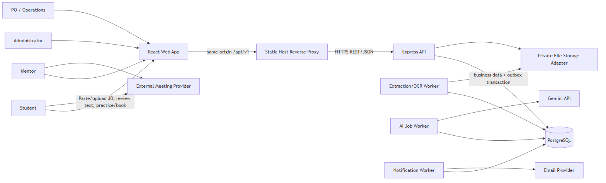
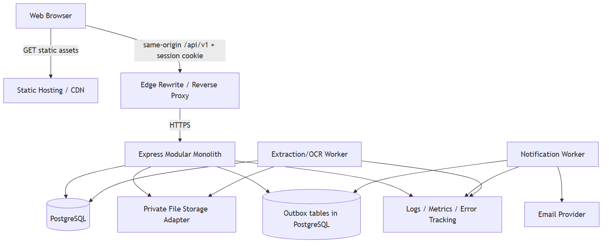
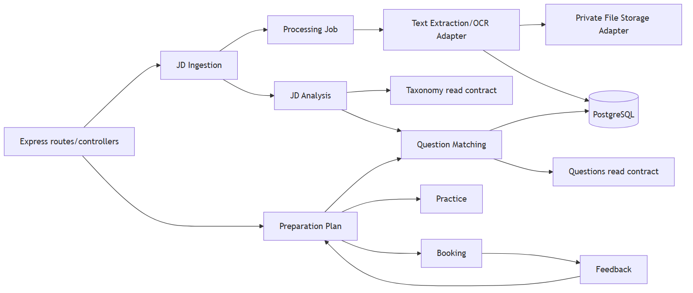
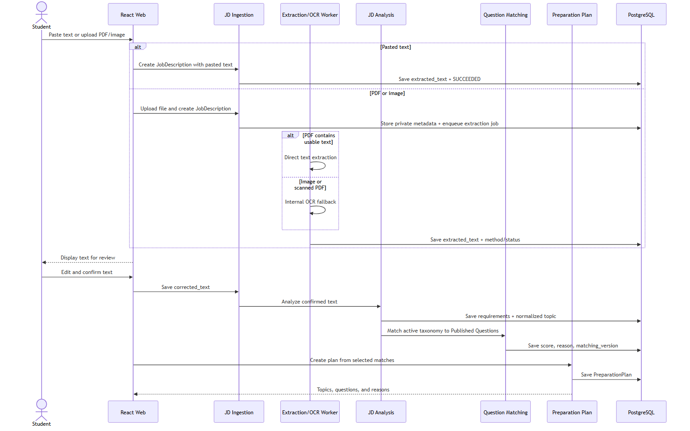
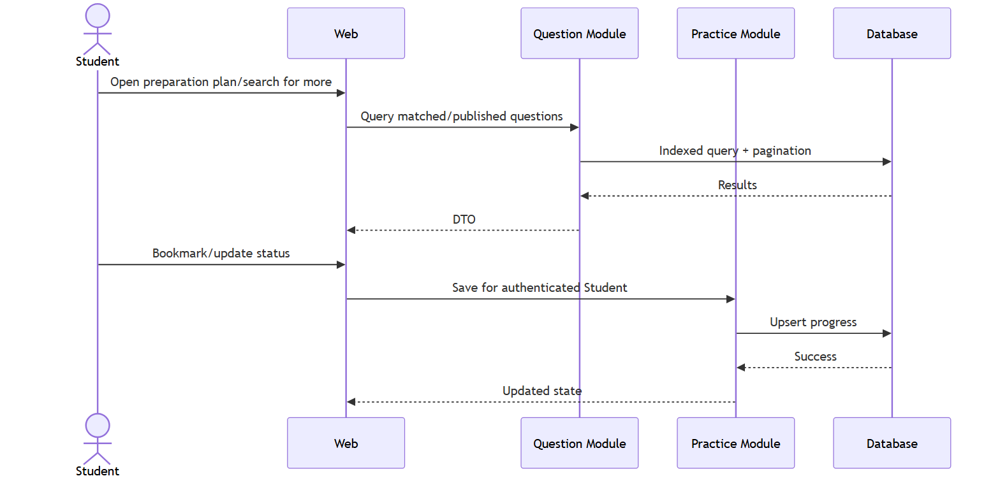
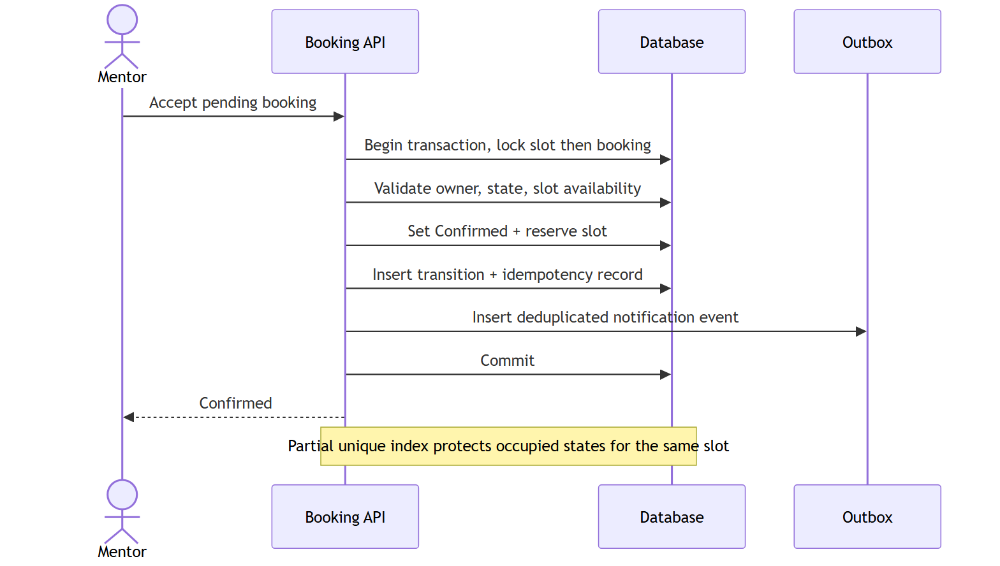
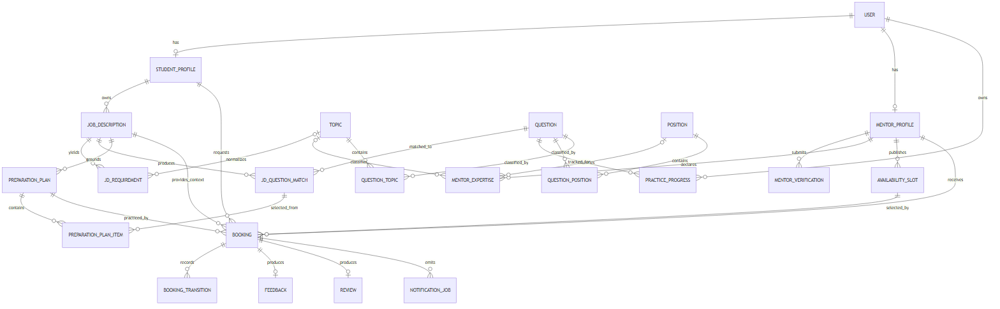
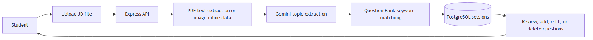

# Architecture Diagrams

This document collects the rendered versions of all Mermaid diagrams in the English Software Architecture and ADR documents. The editable Mermaid sources remain in their original Markdown files.

## 1. System Context

Source: [Software Architecture — System context](Software_Architecture_EN.md#4-system-context)

## 2. Container and Deployment View

Source: [Software Architecture — Container and deployment view](Software_Architecture_EN.md#5-container-and-deployment-view)

## 3. JD-Flow Component View

Source: [Software Architecture — JD-flow component view](Software_Architecture_EN.md#61-jd-flow-component-view)

## 4. JD to Preparation Plan

Source: [Software Architecture — JD to preparation plan](Software_Architecture_EN.md#71-jd-to-preparation-plan)

## 5. Self-Practice from a Preparation Plan

Source: [Software Architecture — Self-practice flow](Software_Architecture_EN.md#72-self-practice-from-a-preparation-plan)

## 6. Booking Confirmation and Double-Booking Prevention

Source: [Software Architecture — Booking confirmation](Software_Architecture_EN.md#74-booking-confirmation-and-double-booking-prevention)

## 7. Conceptual ER Model

Source: [Software Architecture — Conceptual ER model](Software_Architecture_EN.md#81-conceptual-er-model)

## 8. JD Processing User Flow

Source: [ADR-004 — User flow](ADR-004-JD-Processing-and-Question-Matching_EN.md#33-user-flow)

