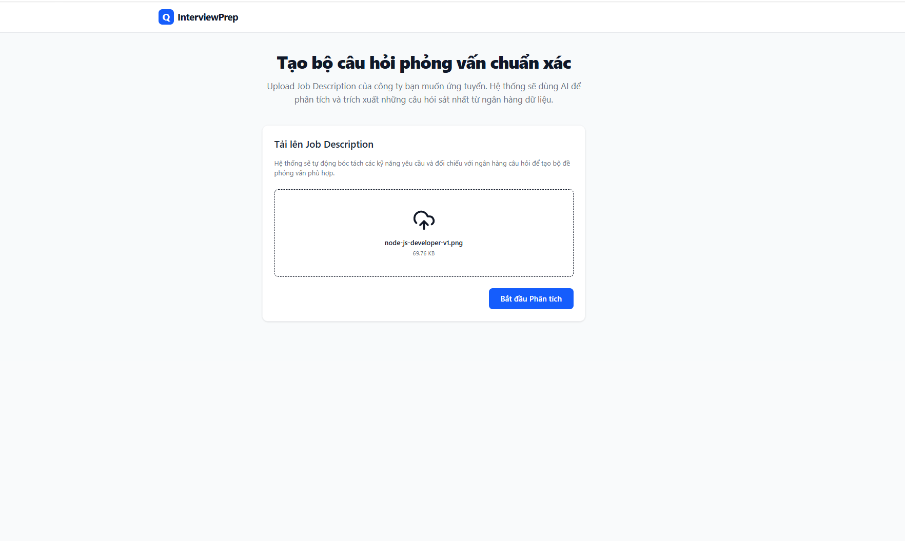
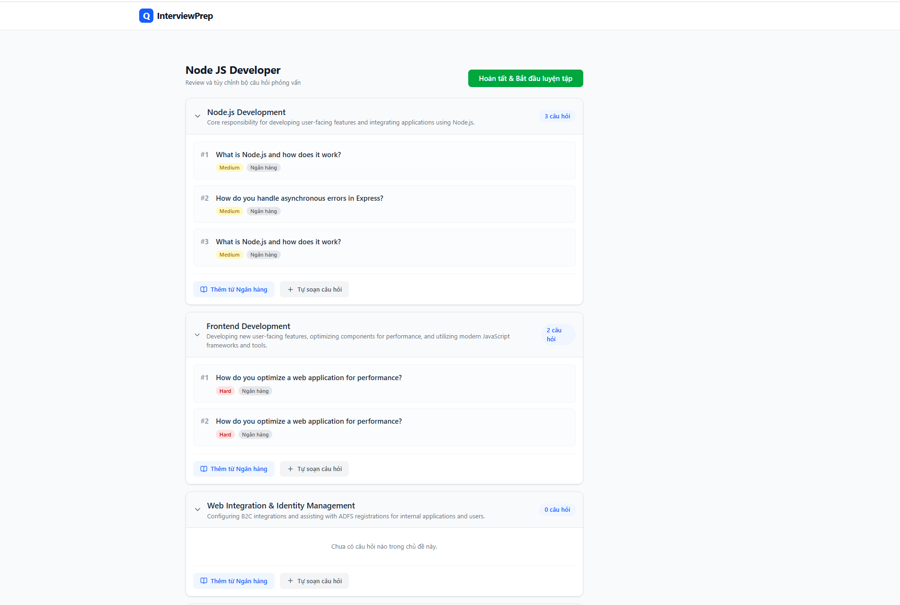
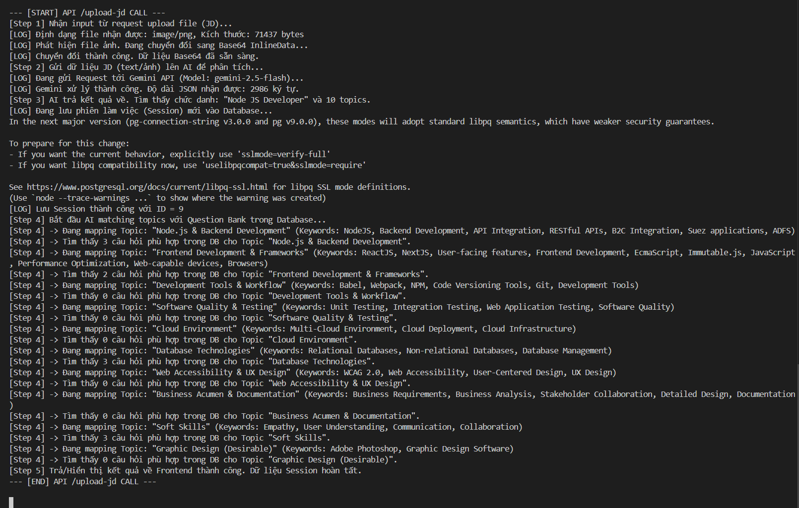

# Proof of Concept (PoC) Report

## 1. Input Interface

The system's input interface allows users (Students) to ingest Job Description (JD) content. Users can either provide text input directly or upload a file. 

Below is the interface and the sample data used for verification (e.g., Node.js Developer position):

*Figure 1: Sample Job Description (Node.js Developer) used as input data.*

*Figure 2: User interface for ingesting input information into the system.*

---

## 2. Output Interface

After the system receives and processes the input (including text extraction and semantic analysis), the platform successfully extracts core information such as: Role, Level, Skills, and specific Requirements. 

*Figure 3: Output interface displaying the results successfully parsed and extracted from the JD by the system.*

---

## 3. System Logs (Execution)

To demonstrate the background processing activities, API integrations, and data flow control, below is a screenshot of the system logs captured during the execution of the PoC codebase.

*Figure 4: Execution logs recording the background processing tasks of the PoC.*
