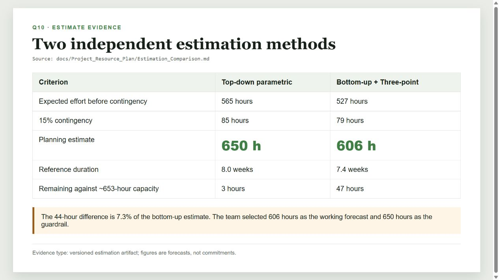
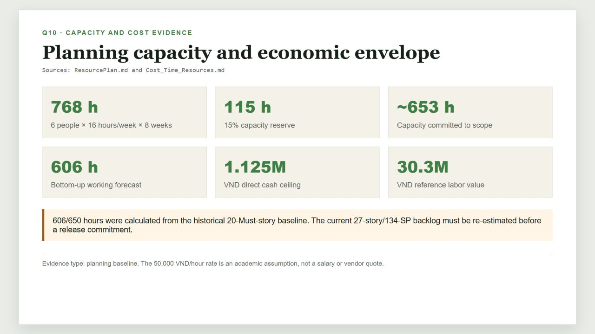

# Q10 Print Report - Project Estimate

## 1. Document control

| Field | Value |
|---|---|
| Project | Interview Practice Platform (PrepVI) |
| Examination topic | Q10 - Project Estimate |
| Examination owner | Hưng |
| Source-artifact owner in W10 | Gia Thành / Member 1 - initiation and Time-Cost-Resource estimation |
| Source-code/document snapshot | `fd8a30b` |
| Evidence review date | 23 August 2026 |
| Documentation basis | Working-tree report prepared from repository snapshot `fd8a30b`; Git history records the later documentation commit |

## 2. Purpose and ownership

This report explains the project's estimation approach, assumptions, results, decision and limitations. Hưng owns the examination answer. The underlying estimation artifacts were assigned to Gia Thành in W10 and are cited rather than re-attributed.

An estimate is a forecast of size, effort, duration or cost for a defined scope. It is not a commitment. A commitment requires an approved scope, confirmed capacity, understood risk and the appropriate Product Owner/Sponsor decision.

## 3. Scope and shared assumptions

| Input | Planning value | Evidence source |
|---|---:|---|
| Historical scope used by the estimate | 20 Must stories | Estimation Comparison |
| Team | 6 people | Resource Plan |
| Availability | 16 hours/person/week for 8 weeks | Resource Plan |
| Nominal capacity | 768 hours | `6 x 16 x 8` |
| Capacity reserve | 15% or 115 hours | Resource Plan |
| Capacity available to scope | Approximately 653 hours | Resource Plan |
| Effort contingency | 15% | Planning assumption |
| Reference labor rate | 50,000 VND/hour | Academic team assumption, not a market quote |

## 4. Method A - Top-down parametric estimate

The method counted 20 historical Must stories and used 26 hours/story as structured expert judgment. It then applied explicit adjustments:

| Calculation | Hours |
|---|---:|
| 20 stories x 26 hours/story | 520 |
| Booking/security/reliability complexity (+20%) | +104 |
| Excluded video/payment/AI (-12%, rounded) | -75 |
| Expected top-down effort | 549 |
| Cross-cutting delivery overhead | +16 |
| Forecast before contingency | 565 |
| 15% contingency | +85 |
| **Top-down planning estimate** | **650** |

This method is a guardrail. The 26-hour factor is not historical productivity data and must be recalibrated when actuals are available.

## 5. Method B - Bottom-up plus Three-point estimate

Each work package used the PERT formula:

`E = (O + 4M + P) / 6`

where `O` is optimistic, `M` is most likely and `P` is pessimistic.

| Work package | Expected hours |
|---|---:|
| Initiation, discovery and requirements | 48 |
| Foundation: architecture, CI/CD, auth/RBAC and data | 76 |
| JD intake, Question Bank and practice | 89 |
| Mentor profile, verification and availability | 57 |
| Booking, meeting handoff and notification | 103 |
| Feedback, review and moderation | 54 |
| Quality, E2E, UAT and deployment | 69 |
| Management, release notes and documentation | 31 |
| **Expected effort** | **527** |
| 15% contingency | 79 |
| **Bottom-up planning estimate** | **606** |

## 6. Comparison and decision

**Figure Q10-01.** The two forecasts differ by 44 hours, or 7.3% relative to the bottom-up estimate.

The team selected 606 hours as the working forecast because it is traceable to work packages. The 650-hour result remains an independent conservative guardrail. Against approximately 653 available hours, the forecasts leave 47 hours and 3 hours respectively; neither margin authorizes additional scope.

## 7. Capacity and cost baseline

**Figure Q10-02.** Planning capacity and economic envelope derived from the versioned resource artifacts.

| Cost element | Planning value |
|---|---:|
| Direct cash ceiling | 1,125,000 VND |
| Reference labor value | 30,300,000 VND |
| Total economic planning value | 31,425,000 VND |

The labor value supports alternative comparison only. It is not cash expenditure, payroll or a vendor quotation.

## 8. Current-baseline reconciliation

The current Product Backlog contains 27 R1 Must stories and 134 SP, while the 606/650-hour calculations use the historical 20-Must-story baseline. Therefore:

- the figures are historical working forecasts, not a commitment for the current backlog;
- the team must update the WBS/PERT and top-down count;
- the Development Team must confirm current relative estimates;
- forecast changes must be reconciled with capacity and release scope; and
- a forecast above approximately 653 hours or eight weeks requires re-estimation, scope reduction or a Product Owner/Sponsor decision.

No reliable historical velocity is stored, so Story Points must not be converted directly into hours.

## 9. Re-estimation triggers and control

Re-estimation is required when scope changes, a critical PoC fails, actual capacity differs, provider constraints change, or the forecast exceeds the time/cost tolerance. Extended/Future work is removed before access control, booking consistency, audit, testing or UAT controls are reduced.

## 10. Evidence limitations

- The project has no comparable historical actuals; Method A uses structured judgment.
- The repository does not contain complete actual effort timesheets.
- The current 134-SP backlog has not been fully recalculated into the two independent hour estimates.
- The labor rate is an academic assumption.

## 11. Source artifacts

- [Estimation Comparison](../../Project_Resource_Plan/Estimation_Comparison.md)
- [Cost, Time and Resources](../../Project_Resource_Plan/Cost_Time_Resources.md)
- [Resource Plan](../../Project_Resource_Plan/ResourcePlan.md)
- [Product Backlog and Acceptance Criteria](../../Project_Vision_and_Scope/Product_Backlog_and_Acceptance_Criteria.md)

## 12. Final print checks

- [ ] Keep forecasts separate from commitments and actuals.
- [ ] Keep cash cost separate from reference labor value.
- [ ] State the historical 20-story limitation next to the 606/650-hour figures.
- [ ] Print both evidence figures with their captions.
