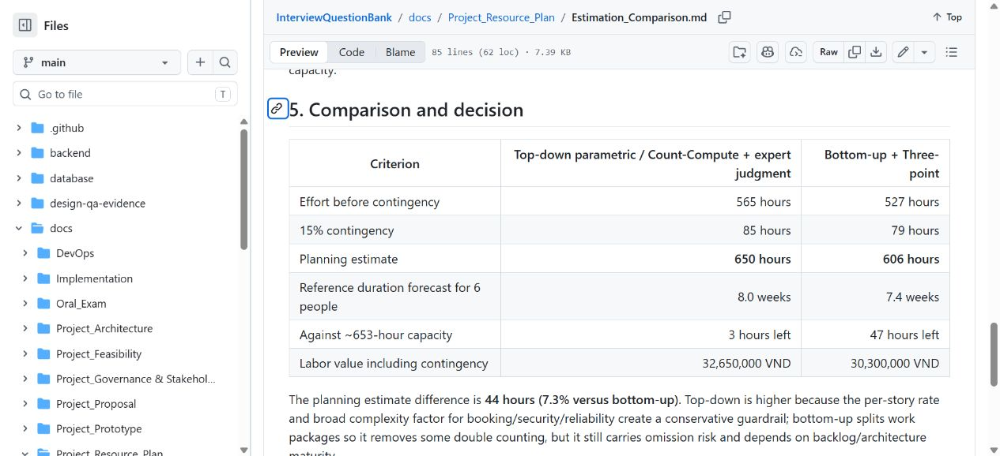
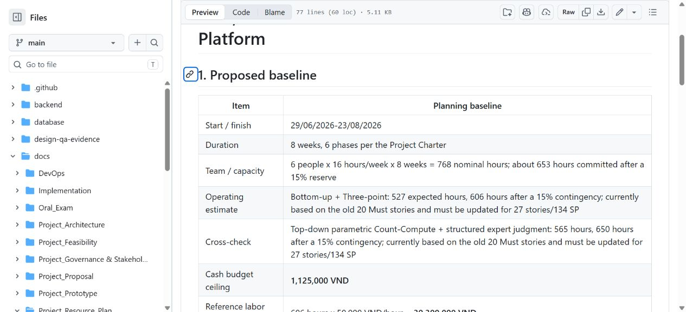

# Câu 10 - Ước lượng dự án

## 1. Nguồn tài liệu

Phần trả lời sử dụng số liệu từ các tài liệu ước lượng chung của nhóm. Các số liệu được dẫn lại đúng theo nguồn, không được trình bày như kết quả tính mới hoặc thành tích của một cá nhân.

Nguồn chính:

- `Estimation_Comparison.md`;
- `Cost_Time_Resources.md`;
- `ResourcePlan.md`;
- Product Backlog hiện hành.

## 2. Câu trả lời theo WHAT - HOW - WHY - WHEN - EVIDENCE

### WHAT - Ước lượng dự án là gì?

Ước lượng dự án là dự báo có căn cứ về quy mô, công sức, thời gian và chi phí cần thiết để hoàn thành một phạm vi xác định. Ước lượng không phải cam kết. Cam kết chỉ hình thành sau khi phạm vi, năng lực nhóm, rủi ro và người có thẩm quyền cùng chấp thuận.

### HOW - Nhóm đã ước lượng như thế nào?

Nhóm dùng hai phương pháp độc lập:

1. **Từ trên xuống theo tham số (Top-down parametric):** đếm 20 câu chuyện Must của phạm vi lịch sử, nhân hệ số 26 giờ/câu chuyện, điều chỉnh độ phức tạp, chi phí hoạt động chung và 15% dự phòng.
2. **Từ dưới lên kết hợp ba điểm (Bottom-up + Three-point):** chia công việc theo nhóm chức năng; với mỗi nhóm dùng công thức PERT `E = (O + 4M + P) / 6`, sau đó cộng 15% dự phòng.

Trong công thức PERT:

- `O` là trường hợp lạc quan;
- `M` là trường hợp có khả năng nhất;
- `P` là trường hợp bi quan;
- `E` là công sức kỳ vọng.

### WHY - Vì sao dùng hai phương pháp?

- Phương pháp từ trên xuống nhanh và tạo mức trần để cảnh báo.
- Phương pháp từ dưới lên có khả năng truy vết tốt hơn đến từng nhóm công việc.
- So sánh độc lập giúp phát hiện bỏ sót hoặc đếm trùng.
- Khoảng chênh cho thấy mức bất định thay vì tạo ảo giác về một con số tuyệt đối.

### WHEN - Khi nào ước lượng được tạo và cần cập nhật?

- Baseline khởi tạo được ghi trong commit `dfdaf1c` ngày 16/08/2026.
- Các tài liệu dùng chung được hòa giải trong `f0292a3` ngày 23/08/2026.
- Cần ước lượng lại khi phạm vi đổi, rủi ro kỹ thuật thay đổi, năng lực thực tế khác kế hoạch hoặc dự báo vượt giới hạn thời gian/chi phí.

### EVIDENCE - Minh chứng nào được dùng?

- Bảng công thức và kết quả của hai phương pháp.
- Kế hoạch nguồn lực 6 người, 16 giờ/người/tuần, 8 tuần.
- Baseline chi phí tiền mặt và giá trị công lao động.
- Lịch sử Git của các artifact ước lượng.

## 3. Kết quả hai phương pháp

| Chỉ tiêu | Từ trên xuống | Từ dưới lên + ba điểm |
|---|---:|---:|
| Công sức trước dự phòng | 565 giờ | 527 giờ |
| Dự phòng 15% | 85 giờ | 79 giờ |
| Tổng ước lượng | **650 giờ** | **606 giờ** |
| Thời lượng tham chiếu | 8,0 tuần | 7,4 tuần |
| Phần còn lại so với năng lực khoảng 653 giờ | 3 giờ | 47 giờ |

Chênh lệch là 44 giờ, tương đương 7,3% so với ước lượng từ dưới lên. Nhóm dùng 606 giờ làm dự báo làm việc vì có khả năng truy vết tốt hơn và dùng 650 giờ làm mức cảnh báo thận trọng.

## 4. Năng lực và chi phí kế hoạch

| Thành phần | Giá trị |
|---|---:|
| Năng lực danh nghĩa | `6 x 16 x 8 = 768` giờ |
| Dự phòng năng lực 15% | 115 giờ |
| Năng lực dành cho phạm vi | khoảng 653 giờ |
| Trần tiền mặt trực tiếp | 1.125.000 VND |
| Giá trị công lao động tham chiếu | 30.300.000 VND |
| Tổng giá trị kinh tế kế hoạch | 31.425.000 VND |

Mức 50.000 VND/giờ là giả định học thuật do nhóm đặt ra, không phải mức lương hoặc báo giá thị trường. Chi phí tiền mặt và giá trị công lao động phải được trình bày riêng.

## 5. Giới hạn quan trọng

Hai con số 606/650 giờ được tính từ phạm vi cơ sở lịch sử có 20 câu chuyện Must. Product Backlog hiện có 27 câu chuyện R1 Must với 134 SP. Vì vậy:

- 606/650 giờ chỉ là dự báo lịch sử, chưa phải cam kết cho backlog hiện tại;
- không được coi 47 giờ còn lại là ngân sách để thêm tính năng;
- cần cập nhật WBS/PERT, đếm lại phạm vi và chạy Planning Poker trước khi cam kết phát hành;
- dự báo vượt khoảng 653 giờ hoặc 8 tuần phải dẫn đến tái ước lượng, cắt phạm vi Extended/Future hoặc quyết định của Product Owner/Sponsor.

## 6. Câu hỏi phụ thường gặp

### Ước lượng và cam kết khác nhau thế nào?

Estimate là dự báo có thể thay đổi khi có dữ liệu mới. Commitment là thỏa thuận giao một phạm vi trong giới hạn đã được phê duyệt.

### Tại sao có cả dự phòng năng lực và dự phòng công sức?

Dự phòng năng lực bảo vệ tổng thời gian sẵn có của nhóm. Dự phòng công sức được cộng vào dự báo công việc. Không được cộng/chuyển chúng thành phạm vi mới nếu chưa phân tích để tránh đếm dự phòng hai lần.

### Story Point có đổi trực tiếp sang giờ không?

Không. Story Point là thước đo tương đối về độ lớn, phức tạp và bất định. Chỉ có thể dự báo thời gian từ Story Point khi nhóm có dữ liệu velocity đủ tin cậy; repository hiện chưa lưu velocity lịch sử đủ để làm việc đó.

## 7. Minh chứng hình ảnh

**Hình Q10-01 - Tài liệu so sánh hai phương pháp ước lượng được mở trực tiếp trên GitHub.**

**Hình Q10-02 - Baseline chi phí, thời gian và nguồn lực được mở trực tiếp trên GitHub.**

## 8. Tài liệu in kèm

- [Project Estimation Report](Project_Estimation_Report.md).
- [Estimation Comparison](../../Project_Resource_Plan/Estimation_Comparison.md).
- [Cost, Time and Resources](../../Project_Resource_Plan/Cost_Time_Resources.md).
- [Resource Plan](../../Project_Resource_Plan/ResourcePlan.md).

## 9. Checklist tự học

- [ ] Nêu được hai phương pháp và công thức PERT.
- [ ] Nhớ 650 giờ, 606 giờ, chênh 44 giờ/7,3% và năng lực khoảng 653 giờ.
- [ ] Phân biệt ước lượng với cam kết.
- [ ] Giải thích được vì sao số liệu phải cập nhật cho 27 câu chuyện/134 SP.
- [ ] Không gọi giả định 50.000 VND/giờ là lương thực tế.
