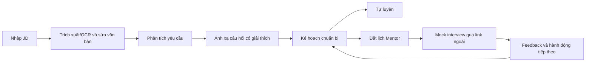

# Đề xuất dự án — Interview Practice Platform

## 1. Thông tin kiểm soát

| Thuộc tính | Giá trị |
|---|---|
| Tên dự án | Interview Practice Platform — tên làm việc |
| Nhóm thực hiện | Gia Thành, Hùng, Hưng, Trí, Luân, Tuấn Anh |
| Product Owner | Hưng |
| Project Manager / Scrum Master | Gia Thành |
| Sponsor phê duyệt | Giảng viên Ngô Huy Biên và Ngô Ngọc Đăng Khoa |
| Thời gian đề xuất | 29/06/2026–23/08/2026 (8 tuần) |
| Trần tiền mặt | 1.125.000 VNĐ |
| Phiên bản | 0.4 — bản Proposal tinh gọn |
| Ngày cập nhật | 21/08/2026 |
| Trạng thái | Planning baseline nội bộ; chờ Sponsor phê duyệt chính thức |

Proposal giải thích vì sao dự án nên được thực hiện và nhóm dự kiến chứng minh giá trị đó như thế nào. [Project Vision and Scope](../Project_Vision_and_Scope/Project_Vision_and_Scope.md) và [Product Backlog and Acceptance Criteria](../Project_Vision_and_Scope/Product_Backlog_and_Acceptance_Criteria.md) kiểm soát yêu cầu chi tiết. Kiến trúc và quyết định kỹ thuật thuộc các ADR liên quan.

## 2. Tóm tắt đề xuất

Khi chuẩn bị cho một vị trí thực tập hoặc công việc đầu tiên, nhiều sinh viên bắt đầu từ một Job Description (JD) cụ thể nhưng phải tự tìm hiểu yêu cầu, gom câu hỏi từ nhiều nguồn và lập kế hoạch bằng ghi chú rời rạc. Nếu muốn mock interview, họ tiếp tục tìm người phù hợp, trao đổi lịch qua tin nhắn và nhận feedback không theo một cấu trúc chung. Vì vậy, ứng viên khó biết mình đã ôn đủ yêu cầu trong JD hay chưa và nên cải thiện điều gì tiếp theo.

Interview Practice Platform đề xuất một web MVP nối các bước này thành một quy trình duy nhất:

```text
JD → trích xuất/OCR → xác nhận văn bản → phân tích yêu cầu
   → ánh xạ câu hỏi có giải thích → kế hoạch chuẩn bị
   → tự luyện hoặc đặt lịch với Mentor → mock interview
   → feedback theo rubric → hành động tiếp theo
```

MVP phục vụ ba vai trò Student, Mentor và Administrator. Pilot tập trung vào Front-end Intern/Junior tại Việt Nam, với JavaScript, TypeScript và React. Nhóm dùng công cụ họp bên ngoài, Mentor tham gia tự nguyện và chưa xử lý thanh toán. AI interviewer, chấm điểm tự động, video tích hợp, ghi âm/phiên âm, payout, ứng dụng mobile native và ATS nằm ngoài phạm vi.

Nhóm đề xuất **tiếp tục có điều kiện**: hoàn thành thử nghiệm hẹp và các PoC bắt buộc trước khi quyết định phát hành pilot.

## 3. Vấn đề, người dùng và nhu cầu

### 3.1 Vấn đề cần giải quyết

> Ứng viên entry-level đọc một JD cụ thể nhưng không biết cần ôn kiến thức, kỹ năng và câu hỏi nào; JD, câu hỏi, mock interview và feedback chưa được nối trong một quy trình có truy vết.

Hiện nay, ứng viên phải tự suy luận vị trí, cấp bậc và kỹ năng từ JD; tìm câu hỏi trên nhiều website, video hoặc cộng đồng; lưu tiến độ bằng ghi chú; rồi tự luyện hoặc tìm Mentor qua mạng lưới cá nhân. Mục tiêu buổi luyện, lịch hẹn và feedback nằm ở các công cụ khác nhau nên người học khó theo dõi từ yêu cầu ban đầu đến hành động cải thiện.

### 3.2 Người dùng và stakeholder chính

- **Student:** sinh viên chuẩn bị thực tập, sinh viên năm cuối, người mới tốt nghiệp hoặc người chuyển hướng ở cấp entry-level đang có một JD Front-end cụ thể.
- **Mentor:** người có kinh nghiệm Front-end, phỏng vấn hoặc tuyển dụng, có thể cung cấp khung giờ và feedback theo rubric.
- **Administrator:** người quản lý taxonomy, câu hỏi, xác minh Mentor, booking, báo cáo và audit trong phạm vi quyền hạn.
- **Sponsor và nhóm dự án:** Sponsor phê duyệt baseline và các thay đổi lớn; Product Owner ưu tiên giá trị; PM/Scrum Master theo dõi nguồn lực, tiến độ và rủi ro.
- **Các bên hỗ trợ:** HR/chuyên gia nội dung, trường hoặc CLB nghề nghiệp, Student tham gia UAT và nhà cung cấp email, họp trực tuyến, OCR hoặc AI.

Chi tiết về quyền lực, lợi ích và cách phối hợp nằm trong [Stakeholder Analysis](../Project_Governance%20%26%20Stakeholder/Stakeholder_Analysis.md).

### 3.3 Pain points cần kiểm chứng

| Pain point | Biểu hiện | Cách kiểm chứng |
|---|---|---|
| Khó xác định nội dung cần ôn | Không biết yêu cầu nào quan trọng hoặc câu hỏi nào liên quan đến JD | Tỷ lệ hoàn tất JD-to-plan, requirement recall và precision@10 |
| Tốn thời gian | Phải tìm, lọc và sắp xếp tài liệu từ nhiều nguồn | Thời gian hoàn thành tác vụ và phỏng vấn sau tác vụ |
| Thiếu feedback đáng tin cậy | Không biết câu trả lời đã đúng trọng tâm và rõ ràng hay chưa | Mức đầy đủ và hữu ích của feedback |
| Khó điều phối | Tìm Mentor và thống nhất mục tiêu, lịch hẹn qua nhiều tin nhắn | Tỷ lệ hoàn tất booking và thời gian xác nhận |
| Thiếu tự tin | Chưa từng trải qua buổi phỏng vấn mô phỏng | So sánh điểm tự tin trước và sau buổi luyện |

Đây là các giả thuyết cần customer discovery. Nhóm chưa xem chúng là kết luận về thị trường.

## 4. Giải pháp hiện tại và bối cảnh cạnh tranh

Ứng viên có thể ghép website tuyển dụng, Google, YouTube, blog, ChatGPT, LeetCode, ghi chú, mạng xã hội, calendar và Google Meet/Zoom thành một quy trình thủ công. Mỗi công cụ giải quyết được một bước, nhưng dữ liệu không đi xuyên suốt. Ứng viên vẫn phải nhập lại thông tin, tự đánh giá nguồn và tự nối feedback với kế hoạch luyện tập. [Existing Tools Analysis](Existing_Tools_Analysis.md) mô tả chi tiết quy trình này.

Thị trường đã có kho câu hỏi, nền tảng peer practice và dịch vụ mentor coaching. MentorCruise, interviewing.io, Pramp/Exponent Practice, LeetCode, Mentori Vietnam và Mentora cho thấy từng phần của nhu cầu đã có người sử dụng. Khoảng trống dự án muốn kiểm chứng không phải “chưa ai làm”, mà là trải nghiệm JD-first có giải thích, phù hợp với ứng viên entry-level tại Việt Nam. So sánh đầy đủ nằm trong [Competitor Analysis](Competitor_Analysis.md).

## 5. Giải pháp đề xuất và luồng nghiệp vụ

Student dán hoặc tải JD, kiểm tra văn bản sau khi trích xuất, xem các yêu cầu đã chuẩn hóa và nhận danh sách câu hỏi có lý do ánh xạ. Từ kế hoạch chuẩn bị, Student có thể tự luyện hoặc tìm Mentor đã được duyệt. Booking mang theo mục tiêu cùng ngữ cảnh JD hoặc kế hoạch; sau buổi mock interview, feedback quay lại thành hành động tiếp theo.



Mỗi kết quả ánh xạ phải truy vết được yêu cầu nguồn, chủ đề, lý do và phiên bản. Chỉ câu hỏi `PUBLISHED` và Mentor `APPROVED` mới được đưa vào kết quả. Hệ thống phải chống double booking, kiểm soát quyền truy cập theo đối tượng và không để lỗi notification làm mất booking đã ghi nhận.

Theo ADR-005, Gemini có thể hỗ trợ phân tích yêu cầu, giải thích và soạn nháp sau feature flag. Kết quả AI phải qua validation và người dùng xác nhận; rule/manual flow vẫn phải hoạt động khi nhà cung cấp lỗi. MVP không dùng Gemini làm AI interviewer hoặc công cụ chấm điểm.

## 6. Điểm khác biệt và Business Case

### 6.1 Giá trị khác biệt cần chứng minh

1. **Bắt đầu từ JD thật:** người dùng chuẩn bị cho cơ hội đang ứng tuyển thay vì học từ một kho nội dung chung.
2. **Ánh xạ có giải thích:** mỗi câu hỏi gắn với yêu cầu nguồn, chủ đề, lý do và phiên bản.
3. **Kế hoạch có giá trị độc lập:** Student vẫn có thể tự luyện khi chưa muốn hoặc chưa thể đặt Mentor.
4. **Ngữ cảnh đi xuyên suốt:** JD hoặc kế hoạch đi cùng booking; feedback quay lại đúng nội dung cần cải thiện.
5. **MVP gọn:** nhóm dùng link họp ngoài, pilot miễn phí và fallback thủ công để tập trung nguồn lực vào core loop.

Những điểm trên là giả thuyết định vị. Nhóm chỉ xem chúng là lợi thế khi có dữ liệu sử dụng hoặc kết quả pilot.

### 6.2 Business Case

An là sinh viên năm ba ngành Công nghệ thông tin và có ba tuần để chuẩn bị cho một JD Front-end Intern. An tìm được nhiều bài viết và video nhưng không biết yêu cầu nào cần ưu tiên, câu hỏi nào phù hợp với JavaScript/React trong JD và cách diễn đạt của mình đã rõ chưa. An mất nhiều buổi tổng hợp tài liệu nhưng vẫn có thể chỉ nhận ra điểm yếu khi bước vào buổi phỏng vấn thật.

Với sản phẩm, An tải JD, sửa lỗi trích xuất và nhận một kế hoạch gồm các câu hỏi có lý do ánh xạ. An tự luyện phần nền tảng, sau đó đặt lịch với Mentor Front-end và gửi kèm những chủ đề còn yếu. Sau mock interview, An nhận feedback gồm điểm mạnh, điểm yếu và hành động tiếp theo, rồi tiếp tục luyện theo chính kế hoạch đó.

| Đối tượng | Lợi ích kỳ vọng | Bằng chứng cần thu |
|---|---|---|
| Student | Giảm công sức tổng hợp, biết nội dung cần ưu tiên và nhận feedback có thể hành động | Task completion/time, usefulness và mức tự tin trước–sau |
| Mentor | Nhận đủ ngữ cảnh, giảm trao đổi thủ công và quản lý lịch rõ hơn | Thời gian chuẩn bị, tỷ lệ chấp nhận/hoàn thành và độ đầy đủ của feedback |
| Nhóm/Sponsor | Có căn cứ để Go, Pivot hoặc Stop | Kết quả gate, pilot funnel và sai lệch chi phí/capacity |

Kế hoạch chuẩn bị tạo giá trị trước khi Student đặt Mentor, nhờ đó rủi ro thiếu nguồn cung không làm mất toàn bộ giá trị MVP. Nếu kế hoạch hữu ích nhưng tỷ lệ booking thấp, nhóm sẽ đánh giá lại nguồn Mentor và value proposition của marketplace. Nếu JD-to-plan không đạt độ liên quan hoặc khả dụng, nhóm sẽ sửa core preparation flow trước khi mở rộng.

### 6.3 Mô hình kinh doanh giả định

Pilot dùng Question Bank, kế hoạch chuẩn bị và Mentor tự nguyện; không thu tiền, ký quỹ, payout hoặc commission. Dự án vì thế **chưa chứng minh unit economics**.

Sau khi core loop chứng minh được giá trị, nhóm có thể nghiên cứu phí trên booking hoàn thành, subscription cho nội dung nâng cao hoặc gói hỗ trợ dành cho trường/CLB. Willingness to pay phải được kiểm tra bằng hành vi như pricing interview, lựa chọn giữa nhiều mức giá hoặc pre-booking; một câu trả lời “có sẵn lòng trả tiền” chưa đủ làm bằng chứng.

## 7. Phạm vi MVP và sản phẩm bàn giao

### Trong phạm vi

- Xác thực và phân quyền cho Student, Mentor và Administrator.
- Nhập JD bằng tối đa 50.000 ký tự hoặc một PDF/PNG/JPEG tối đa 10 MB; PDF tối đa 5 trang.
- Trích xuất trực tiếp, OCR tiếng Việt/Anh dự phòng và bước xác nhận/sửa văn bản.
- Phân tích yêu cầu, chuẩn hóa taxonomy/alias và ánh xạ câu hỏi có giải thích.
- Kế hoạch chuẩn bị, Question Bank, bookmark và trạng thái luyện cơ bản.
- Hồ sơ, xác minh và lịch rảnh của Mentor.
- Booking, khóa slot, đổi/hủy lịch, link họp ngoài, notification và audit.
- Feedback theo rubric, review hợp lệ, report/moderation và trang quản trị tối thiểu.
- Gemini assistance chỉ khi release gate của ADR-005 đạt; rule/manual flow luôn tồn tại.

R1 mở rộng chỉ gồm dashboard tiến độ cơ bản và lời nhắc lịch. Nhóm chỉ chọn hai hạng mục này khi phần Must và reserve vẫn an toàn.

### Ngoài phạm vi

- AI interviewer, chatbot phỏng vấn, chấm điểm tự động hoặc phân tích giọng nói/video.
- Video/audio call, recording hoặc transcript tích hợp.
- Payment, escrow, payout và commission tự động.
- ML recommendation không có deterministic guardrail.
- Mobile native, ATS/nộp hồ sơ, OCR tổng quát và marketplace đa quốc gia.

Phạm vi, business rules, Definition of Done và acceptance criteria chi tiết thuộc [Project Vision and Scope](../Project_Vision_and_Scope/Project_Vision_and_Scope.md) và [Product Backlog and Acceptance Criteria](../Project_Vision_and_Scope/Product_Backlog_and_Acceptance_Criteria.md).

## 8. Thời gian, nguồn lực và ngân sách

| Hạng mục | Baseline |
|---|---:|
| Thành viên | 6 |
| Thời lượng | 8 tuần, từ 29/06 đến 23/08/2026 |
| Capacity danh nghĩa | 6 × 16 giờ/tuần × 8 tuần = 768 giờ |
| Reserve | 15% = 115,2 giờ |
| Capacity cho phạm vi | Khoảng 653 giờ |
| R1 Must | 27 story, 134 SP |
| Thông lượng cần so sánh | 33,5 SP/sprint trong 4 sprint |
| Direct cash | 900.000 VNĐ |
| Contingency tiền mặt | 225.000 VNĐ |
| **Trần tiền mặt** | **1.125.000 VNĐ** |

134 SP chưa phải cam kết giao hàng. Nhóm phát triển phải Planning Poker từng story, cập nhật hai estimate độc lập và dùng khoảng velocity thực tế để xác nhận phạm vi có thể hoàn thành.

Sáu giai đoạn của dự án gồm Discovery/Charter, Requirement/Prototype, Foundation, JD intake & analysis, Mentor core loop và UAT/Release. Milestone, phân công và chi phí chi tiết nằm trong [Project Charter](../Project_Governance%20%26%20Stakeholder/Project_Charter.md), [Resource Plan](../Project_Resource_Plan/ResourcePlan.md) và [Cost, Time and Resources](../Project_Resource_Plan/Cost_Time_Resources.md).

## 9. Khả thi và rủi ro chính

### 9.1 Đánh giá khả thi

| Khía cạnh | Đánh giá | Điều kiện chính |
|---|---|---|
| Kỹ thuật | Khả thi có điều kiện | Extraction/OCR, mapping, authorization, booking consistency, notification fallback và AI guardrail đạt gate |
| Vận hành | Khả thi có điều kiện | Có 4 Mentor `APPROVED`, mỗi người ít nhất 3 slot; policy và admin owner rõ |
| Thị trường | Có tín hiệu, chưa chứng minh | Discovery đúng phân khúc và KPI về tác vụ/giá trị đạt ngưỡng |
| Kinh tế | Có cash baseline, chưa có unit economics | Không vượt 1.125.000 VNĐ; chỉ nghiên cứu định giá sau pilot miễn phí |
| Tiến độ/nguồn lực | Có baseline, chưa có sprint commitment | Must backlog nằm trong khoảng velocity và khoảng 653 giờ |
| Pháp lý/quyền riêng tư | Khả thi có điều kiện | Có consent, data minimization, access control, retention/deletion và provenance |

### 9.2 Rủi ro ưu tiên

| Rủi ro | Dấu hiệu | Cách ứng phó |
|---|---|---|
| Không đủ Mentor cho pilot | Dưới 4 Mentor hoặc dưới 3 slot/người | Outreach sớm, chạy concierge pilot và giữ plan độc lập với booking |
| Extraction/mapping không đủ chính xác | Blind recall hoặc precision@10 dưới 80% | Correction gate, corpus có nhãn, taxonomy review và rule fallback |
| Gemini sai hoặc provider lỗi | Schema/evidence fail, quota hoặc latency tăng | Feature flag, validation, candidate constraint và manual fallback |
| Booking không nhất quán hoặc dữ liệu bị lộ | Double booking, invalid transition hoặc truy cập trái quyền | Transaction/unique constraint, audit và negative test |
| Scope vượt baseline | Story AI/video/payment vào sprint hoặc forecast vượt 653 giờ | Change control, cắt Should/Could và rebaseline |
| Pilot thiếu bằng chứng | Không đủ Student, JD hoặc booking trước gate | Tuyển từ discovery và dùng pilot có hỗ trợ khi cần |

Phân tích đầy đủ và bảy Go/No-Go gate nằm trong [Feasibility Study](../Project_Feasibility/feasibility.md).

## 10. Kết quả kỳ vọng và cách đánh giá

| Mục tiêu | Chỉ số | Ngưỡng đề xuất |
|---|---|---:|
| Xác nhận vấn đề | Mẫu discovery xác nhận ít nhất một pain cốt lõi | ≥70% |
| Hoàn tất JD-to-plan | Student nhập JD, sửa văn bản và tạo được plan | ≥80% |
| Chất lượng phân tích | Blind requirement recall và precision@10 | ≥80% |
| Tính hợp lệ/giải thích | Kết quả đủ source/topic/reason/version; không có Question/Mentor không hợp lệ | 100% |
| Kích hoạt từ plan | Student mở Question hoặc luồng Mentor từ plan | ≥80% |
| Pilot booking | Booking hợp lệ / `CONFIRMED` / `COMPLETED` | 12 / ≥10 / ≥8 |
| Chất lượng feedback | Booking hoàn thành có điểm mạnh, điểm yếu và hành động tiếp theo | ≥90% |
| Giá trị cảm nhận | Điểm hữu ích và mức tự tin sau–trước | ≥4/5 và tăng trung bình ≥1/5 |
| Chất lượng kỹ thuật | Critical workflow test và defect trước UAT | 100% pass; 0 Critical/High |

Nhóm dùng 20 JD hợp pháp, đã khử dữ liệu nhạy cảm: 12 mẫu để hiệu chỉnh và 8 mẫu blind. Pilot dự kiến có 12 Student và 4 Mentor. Kết quả chỉ dùng để đánh giá thử nghiệm hẹp, không đại diện cho toàn bộ thị trường.

## 11. Khuyến nghị, điều kiện phê duyệt và tham chiếu

### 11.1 Khuyến nghị

Nhóm nên tiếp tục PoC và pilot hẹp, nhưng chưa nên xem kế hoạch này là cam kết phát hành. Quyết định cuối cùng dựa trên ba hướng:

- **Go:** core KPI đạt, booking thực sự diễn ra, feedback hữu ích và dự báo nằm trong capacity/ngân sách.
- **Pivot:** kế hoạch chuẩn bị có giá trị nhưng booking thấp, hoặc Mentor loop có tín hiệu trong khi JD-to-plan chưa đạt; nhóm điều chỉnh value proposition theo bằng chứng.
- **Stop/Redesign:** pain không được xác nhận, extraction/mapping vẫn dưới ngưỡng sau một vòng khắc phục, còn access leak, thiếu Mentor hoặc core loop vượt baseline.

### 11.2 Điều kiện phê duyệt

Trước khi phát hành pilot, nhóm cần:

- chữ ký Sponsor trong Project Charter và xác nhận scope của Product Owner;
- Planning Poker cho 27 Must story/134 SP, hai estimate cập nhật và khoảng velocity phù hợp;
- 20 JD hợp pháp/khử định danh, hướng dẫn gắn nhãn và tập blind cố định;
- bằng chứng prototype/UAT, các PoC và release gate bắt buộc;
- privacy review, authorization negative tests và manual fallback walkthrough;
- không còn defect Critical/High;
- dự báo không vượt 8 tuần, khoảng 653 giờ và 1.125.000 VNĐ;
- biên bản quyết định Go/Pivot/Stop dựa trên KPI.

### 11.3 Tài liệu tham chiếu

- [Project Charter](../Project_Governance%20%26%20Stakeholder/Project_Charter.md)
- [Project Vision and Scope](../Project_Vision_and_Scope/Project_Vision_and_Scope.md)
- [Product Backlog and Acceptance Criteria](../Project_Vision_and_Scope/Product_Backlog_and_Acceptance_Criteria.md)
- [Product Decision Estimation Notes](../Project_Vision_and_Scope/Product_Decision_Estimation_Notes.md)
- [Feasibility Study](../Project_Feasibility/feasibility.md)
- [Cost, Time and Resources](../Project_Resource_Plan/Cost_Time_Resources.md)
- [Software Architecture](../Project_Architecture/software_architecture.md)
- [ADR-004 — JD Processing and Question Matching](../Project_Architecture/ADR/ADR-004-JD-Processing-and-Question-Matching.md)
- [ADR-005 — Hybrid Gemini Assistance](../Project_Architecture/ADR/ADR-005-Hybrid-Gemini-Assistance.md)

Proposal áp dụng hướng dẫn tại `docs/refs/02-software-project.md` (slide 032), `docs/refs/03-1-business-requirements.md` (slide 005 và 066), `docs/refs/03-software-project-initiation.md` (slide 015, 022–023) và `docs/refs/03-2-user-requirements.md` (slide 017).

Nguồn thị trường kế thừa từ proposal gốc gồm MentorCruise, interviewing.io, Pramp/Exponent Practice, LeetCode, Mentori Vietnam và Mentora. Thông tin được ghi nhận ngày 09/08/2026 và phải được xác minh lại trước khi nhóm đưa ra quyết định kinh doanh hoặc định giá.
