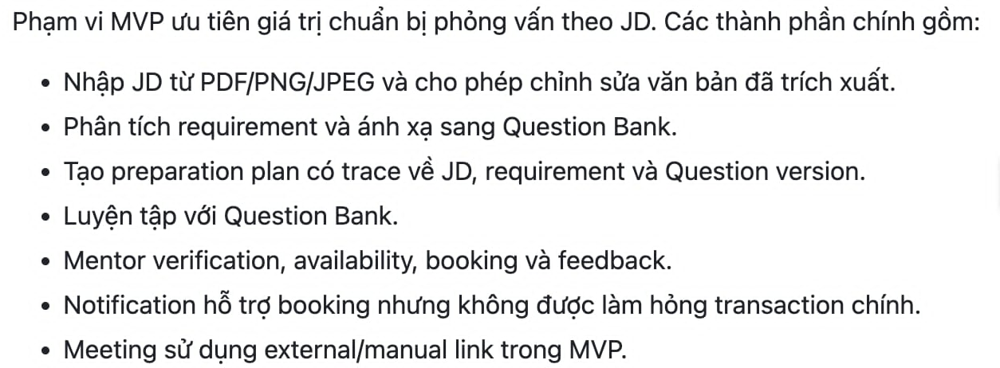
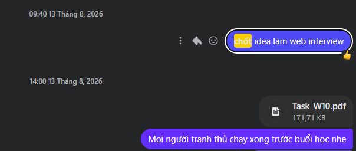
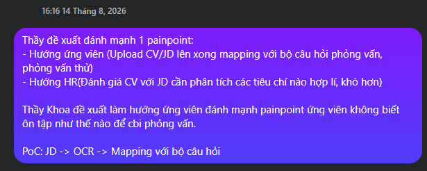
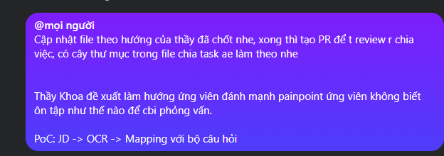
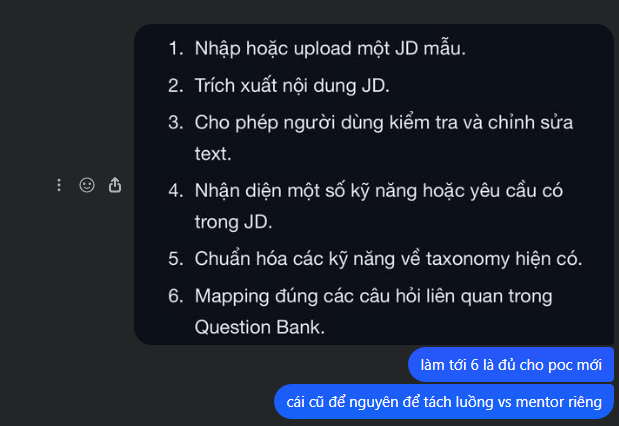
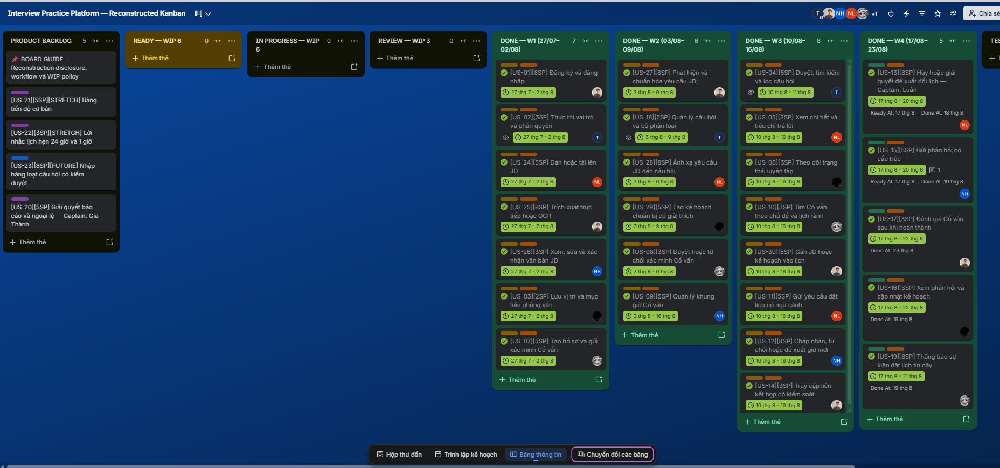

# Câu 11 — Kế hoạch dự án (Project Plan)

## 1. Đề bài

**Câu hỏi chính:** Trình bày quá trình hình thành và phương pháp đánh giá tài liệu Kế hoạch dự án (Project Plan) của nhóm. Sinh viên nộp kèm bản in tài liệu Kế hoạch dự án của nhóm.

**Các câu hỏi thường gặp:**

- Tài liệu Kế hoạch dự án cần trả lời những câu hỏi nào?
- Nhóm dùng đầu vào nào và thực hiện những bước nào để tạo tài liệu?
- Nhóm đã đánh giá tài liệu bằng cách nào?
- Tại sao cần tạo Kế hoạch dự án?
- Nhóm đã sử dụng và cập nhật tài liệu ra sao?
- Dự án dùng mô hình cho phép thay đổi kết quả cuối cùng có cần Kế hoạch dự án không?
- Kế hoạch dự án khác gì với Định nghĩa quy trình phát triển phần mềm?

> **Trạng thái bằng chứng:** Nhóm đã chốt `Project_Proposal.md` làm đầu vào chính cho planning baseline của InterviewQuestionBank; Charter, Product Backlog, Resource Plan, Cost–Time–Resources, Estimation Comparison, Stakeholder Analysis và các ADR bổ sung phần quản trị chi tiết. Các nội dung này đã được hợp nhất thành `docs/Oral_Exam/Q11_project-plan/Project_Plan_Report.md`. Ngày 23/08, Tuấn Anh review bản 1.0 bằng cách đối chiếu bản hợp nhất với các tài liệu nguồn và những dữ kiện nhóm đã xác nhận. Trello quản lý các công việc để hoàn thành User Story trong Product Backlog; nhóm không đưa hoạt động PoC lên Trello. Ngày 16/08, Tuấn Anh tái dựng board “Reconstructed Kanban” từ Product Backlog. Project Plan đã được review nội bộ nhưng chưa được Sponsor phê duyệt chính thức. Hai giảng viên đánh giá ý tưởng mới phù hợp để nhóm tiếp tục; phản hồi này chưa đồng nghĩa với phê duyệt toàn bộ baseline.

## 2. Dàn ý viết A4 trong 10 phút

1. **Mục đích:** Kế hoạch dự án cho biết nhóm làm gì, ai làm, làm khi nào, dùng bao nhiêu nguồn lực và kiểm soát thay đổi, rủi ro, chất lượng ra sao.
2. **Bối cảnh:** nhóm làm Splitly từ 29/06; sau giữa kỳ ngày 24/07, giảng viên đánh giá ý tưởng yếu nên nhóm quay lại tìm ý tưởng. Ngày 09/08, nhóm chọn sơ bộ InterviewQuestionBank và làm lại Initiation, Planning; ngày 13/08, nhóm xác nhận chính thức hướng đi.
3. **Đầu vào:** Proposal đã chốt, Charter, Vision and Scope, Product Backlog, estimate, Resource Plan, kiến trúc, feasibility, lịch học phần và kinh nghiệm triển khai Splitly.
4. **Cách tạo:** xác định lại vấn đề và phạm vi → xin ý kiến hai giảng viên → phân rã công việc → ước lượng từ kinh nghiệm Splitly → lập lịch và phân công → đặt mốc/gate → tái dựng Kanban từ các User Story và dữ liệu có thể kiểm chứng.
5. **Ba lớp thời gian:** học phần kéo dài 8 tuần (29/06–23/08); nhóm thực hiện InterviewQuestionBank trong 2 tuần (10/08–23/08); báo cáo planning tái dựng execution thành 4 tuần từ 27/07 dựa trên ước lượng, không phải actual history.
6. **Baseline định lượng:** 6 thành viên, 768 giờ danh nghĩa, reserve 15%, khoảng 653 giờ cho scope, Kanban theo tuần và cash ceiling 1.125.000 VNĐ; actual cash cost là 0 VNĐ vì nhóm chỉ dùng free tier.
7. **Đánh giá:** ngày 23/08, Tuấn Anh đối chiếu bản hợp nhất với các file nguồn, phát hiện chênh lệch về scope, timeline, estimate, vai trò Trello, cost và trạng thái phê duyệt; sau đó cập nhật Project Plan 1.0.
8. **Kết luận:** nhóm đã có Project Plan hợp nhất và được hai giảng viên đồng ý về hướng ý tưởng. Tuấn Anh đã review nội bộ; Sponsor chưa phê duyệt chính thức.

## 3. Tài liệu là gì và tại sao cần tạo?

### WHAT — Project Plan là gì?

Project Plan là tài liệu tích hợp cách nhóm thực hiện, theo dõi, kiểm soát và kết thúc dự án. Tài liệu phải trả lời ít nhất các câu hỏi sau:

- **What:** phạm vi, deliverable và công việc nào phải hoàn thành?
- **Why:** mục tiêu kinh doanh và tiêu chí thành công là gì?
- **Who:** ai chịu trách nhiệm, ai phê duyệt và ai cần được thông báo?
- **When:** hoạt động, milestone và release diễn ra khi nào?
- **How much:** cần bao nhiêu effort, nguồn lực và chi phí?
- **How:** nhóm dùng quy trình, công cụ và tiêu chí chất lượng nào?
- **How to control:** nhóm theo dõi tiến độ, rủi ro, thay đổi và chất lượng ra sao?

### WHY — Vì sao dự án cần Project Plan?

Kế hoạch biến phạm vi thành công việc có người phụ trách và thời hạn. Nhóm dùng nó để phát hiện chênh lệch giữa dự kiến với thực tế, trao đổi cùng một baseline và quyết định cắt phạm vi, bổ sung nguồn lực hoặc đổi lịch khi cần. Không có kế hoạch, nhóm khó phân biệt một sự cố riêng lẻ với xu hướng trễ của toàn dự án.

### WHEN — Tạo và cập nhật khi nào?

Nhóm tạo bản đầu sau khi đã làm rõ mục tiêu, phạm vi và các deliverable chính. Với dự án thích ứng, nhóm không “đóng băng” toàn bộ kế hoạch; nhóm giữ mục tiêu, ràng buộc và mốc kiểm soát ở cấp cao, rồi cập nhật backlog, estimate và release forecast theo tuần hoặc sau một thay đổi lớn.

## 4. Quá trình khởi tạo thực tế

### 4.1 Bối cảnh và thời điểm

### 4.1.1 Diễn biến thực tế

- **29/06/2026:** nhóm bắt đầu kế hoạch học phần 8 tuần với dự án Splitly.
- **24/07/2026:** sau phần trình bày giữa kỳ, tiến độ học phần đã đi qua phần thực hiện và chuyển sang nội dung quản lý rủi ro. Giảng viên đánh giá ý tưởng Splitly yếu, chưa đủ khả thi để tiếp tục phát triển thành sản phẩm.
- **24/07–09/08/2026:** nhóm quay lại brainstorm nhưng bị chậm vì chưa chốt được hướng đi.
- **09/08/2026:** sau một buổi họp, nhóm chọn sơ bộ ý tưởng InterviewQuestionBank và bắt đầu làm lại Project Initiation cùng Project Planning.
- **10/08/2026:** nhóm bắt đầu execution theo hướng mới, dù phạm vi vẫn tiếp tục được làm rõ trong những ngày sau.
- **12/08/2026:** nhóm trao đổi trực tiếp với giảng viên lý thuyết. Thầy đánh giá ý tưởng InterviewQuestionBank ổn để tiếp tục.
- **13/08/2026:** nhóm xác nhận chính thức ý tưởng “web interview” trên kênh trao đổi chung và yêu cầu các thành viên hoàn thành phần việc trước buổi học.
- **14/08/2026:** nhóm trao đổi trực tiếp với giảng viên thực hành. Thầy nhận xét sản phẩm có thể phục vụ cả ứng viên và Mentor, nhưng khuyên nhóm tập trung vào pain point của ứng viên vì thời gian còn ít. Nhóm chốt PoC JD → OCR → ánh xạ Question Bank và điều chỉnh MVP theo hướng candidate-first.
- **10/08–23/08/2026:** nhóm thực hiện dự án mới trong hai tuần còn lại; phần Mentor đã có vẫn được giữ thành luồng riêng rồi kết hợp với PoC ứng viên trong MVP hiện tại.

### 4.1.2 Hai loại lịch phải phân biệt

| Loại lịch                                   | Khoảng thời gian                 | Ý nghĩa                                                                                                                   |
| ------------------------------------------- | -------------------------------- | ------------------------------------------------------------------------------------------------------------------------- |
| Lịch học phần thực tế                       | 29/06–23/08/2026                 | Toàn bộ 8 tuần, gồm thời gian làm Splitly, chuyển hướng và thực hiện InterviewQuestionBank                                |
| Execution thực tế của InterviewQuestionBank | 10/08–23/08/2026                 | Hai tuần nhóm thật sự triển khai ý tưởng mới                                                                              |
| Execution tái dựng trong kế hoạch           | Bốn tuần, giả định từ 27/07/2026 | Ước lượng hồi cứu dựa trên kinh nghiệm làm Splitly và hướng dẫn của giảng viên dành cho nhóm chưa theo dõi tiến độ từ đầu |

Việc tái dựng lịch giúp nhóm hoàn thiện bài tập Project Planning, nhưng không được trình bày bốn tuần đó như dữ liệu thực tế. Repository ghi nhận tài liệu InterviewQuestionBank từ ngày 13/08 và planning baseline trong Charter từ ngày 14/08.

### 4.2 Đầu vào đã có

| Đầu vào                                | Cách dùng trong kế hoạch                                                                     |
| -------------------------------------- | -------------------------------------------------------------------------------------------- |
| Project Proposal, Vision and Scope     | Xác định vấn đề, mục tiêu, phạm vi trong/ngoài MVP                                           |
| Lịch sử Splitly và phản hồi giữa kỳ    | Giải thích nguyên nhân quay lại Initiation/Planning và cung cấp kinh nghiệm để tái ước lượng |
| Product Backlog và acceptance criteria | Liệt kê 27 story R1 Bắt buộc, 134 SP, dependency và Definition of Ready                      |
| Project Charter                        | Xác định Sponsor, vai trò, milestone, ràng buộc và Go/No-Go gate                             |
| Resource Plan                          | Xác định capacity, ownership, reserve và công cụ baseline                                    |
| Estimation Comparison                  | So sánh top-down 650 giờ với bottom-up 606 giờ trên scope 20 Must story cũ                   |
| Cost–Time–Resources                    | Xác định lịch, cash ceiling 1.125.000 VND và labor value tham chiếu                          |
| Feasibility Study                      | Kiểm tra khả thi theo thị trường, kỹ thuật, nguồn lực, vận hành và lịch                      |
| Architecture và ADR                    | Đặt ràng buộc cho stack, booking consistency, notification và AI hỗ trợ                      |
| Slide của giảng viên                   | Cung cấp cấu trúc activity, dependency, resource, duration, schedule và Project Plan         |

### 4.3 Người tham gia và trách nhiệm

- **Tuấn Anh — Project Manager / Team Leader / Timekeeper:** điều hành nhóm, quản lý deadline và Kanban, chốt quyết định, escalation, review/merge và delivery readiness.
- **Gia Thành — Project Planning & Estimation Analyst / Full-stack Developer:** lập Charter, Resource Plan, Cost–Time–Resources và hai estimate; tham gia implementation Full-stack.
- **Hưng — Product Owner / Business Analyst:** sở hữu tầm nhìn, phạm vi, backlog và acceptance.
- **Luân — Architecture / Technical Lead:** sở hữu kiến trúc, ADR và quyết định kỹ thuật.
- **Hùng — UI/UX Designer / Front-end Developer:** cung cấp prototype, bằng chứng usability và giao diện.
- **Trí — PoC / Integration & E2E Developer:** cung cấp PoC, tích hợp và bằng chứng kiểm thử đầu-cuối.
- **Sponsor:** phê duyệt Charter, baseline và thay đổi lớn.

### 4.4 Các bước có thể kiểm chứng từ tài liệu

1. Sau khi Splitly không được đánh giá đủ khả thi, nhóm quay lại xác định vấn đề và brainstorm hướng mới.
2. Ngày 09/08, nhóm chốt vòng lặp giá trị JD → preparation plan → self-practice/mentor → feedback.
3. Nhóm hỏi ý kiến giảng viên lý thuyết ngày 12/08 và giảng viên thực hành ngày 14/08, rồi tiếp tục điều chỉnh Proposal, Charter, phạm vi, backlog và các tài liệu planning cho InterviewQuestionBank.
4. Nhóm chốt phạm vi MVP và loại AI interviewer, video tích hợp, payment, mobile native, ATS và ML recommendation.
5. Nhóm giữ cửa sổ học phần 8 tuần, đồng thời tái dựng execution 4 tuần từ ngày 27/07 dựa trên kinh nghiệm Splitly. Đây là estimate hồi cứu, không phải actual.
6. Nhóm xác định capacity: 6 người × 16 giờ/tuần × 8 tuần = 768 giờ; giữ reserve 15%, còn khoảng 653 giờ cho scope.
7. Nhóm lập hai estimate độc lập trên 20 Must story cũ: 606 giờ bottom-up + PERT và 650 giờ top-down.
8. Backlog sau đó tăng thành 27 story R1 Bắt buộc, 134 SP. Tài liệu ghi rõ hai estimate cũ phải được cập nhật trước khi cam kết release.
9. Nhóm dùng Trello để tổ chức công việc theo các User Story trong backlog; planning baseline nằm trong Proposal và các tài liệu quản trị liên quan. Hoạt động PoC không được quản lý trên Trello.

### 4.5 Công cụ và đầu ra đầu tiên

- Tài liệu được quản lý bằng Markdown trong Git/GitHub.
- Nhóm đã chốt `docs/Project_Proposal/Project_Proposal.md` làm bản Proposal sử dụng chính thức; bản này được cập nhật ngày 21/08/2026.
- Ngày 16/08, Tuấn Anh tái dựng Trello từ `Product_Backlog_and_Acceptance_Criteria.md`. Board biểu diễn Product Backlog, Ready, In Progress, Review và các cột Done theo tuần; có disclosure và WIP policy.
- Lịch sử Git có commit `a060693` ngày 14/08/2026: `docs(charter): complete project initiation baseline`.
- Pull request `#3`, commit `dfdaf1c` ngày 16/08/2026, cập nhật baseline JD-first cho pilot 8 tuần.
- Repo có GitHub Actions tại `.github/workflows/ci.yml` để chạy lint, typecheck, kiểm tra OpenAPI drift, migration, seed, build và secret scan.

> **Giới hạn bằng chứng:** Phản hồi giữa kỳ ngày 24/07, buổi họp ngày 09/08 và hai lần hỏi ý kiến giảng viên đều diễn ra trực tiếp nên nhóm không có ảnh hoặc biên bản. Bản học sử dụng lời xác nhận của Tuấn Anh cho các sự kiện này và không trình bày chúng như bằng chứng tài liệu. Năm ảnh trao đổi nội bộ cùng một ảnh Reconstructed Kanban được gắn tại mục 5.4 để chứng minh các quyết định tiếp theo của nhóm.

## 5. Quá trình đánh giá thực tế

### 5.1 Tiêu chí có thể dùng và phần đã thể hiện trong repo

| Tiêu chí       | Bằng chứng hiện có                                                                                        | Kết luận tạm thời                                                             |
| -------------- | --------------------------------------------------------------------------------------------------------- | ----------------------------------------------------------------------------- |
| Đầy đủ         | Charter, scope, backlog, resource, estimate, cost và architecture đã được hợp nhất trong Project Plan 1.0 | Đã có các thành phần chính trong một báo cáo                                  |
| Nhất quán      | Nhiều commit ngày 15–17/08 dùng từ “align”, “reconcile”, “update”                                         | Nhóm đã phải đồng bộ tài liệu khi phạm vi đổi                                 |
| Khả thi        | Capacity ~653 giờ được so với estimate 606/650 giờ                                                        | Biên rất hẹp; chưa đủ để cam kết backlog 134 SP                               |
| Truy vết       | Backlog liên kết story, business rule, acceptance và quyết định                                           | Có nền tảng truy vết ở cấp yêu cầu                                            |
| Đo được        | Có KPI, milestone và Go/No-Go gate                                                                        | Chưa có actual effort, throughput lịch sử hoặc burndown trong repo            |
| Được phê duyệt | Hai giảng viên đã phản hồi ý tưởng ổn để nhóm tiếp tục; Proposal/Charter vẫn ghi chờ Sponsor phê duyệt    | Có chấp thuận về hướng ý tưởng, chưa có phê duyệt chính thức toàn bộ baseline |

### 5.2 Review Project Plan ngày 23/08/2026

Tuấn Anh review bản hợp nhất bằng cách so sánh nó với Proposal, Charter, Vision and Scope, Product Backlog, Resource Plan, Estimation Comparison, Cost–Time–Resources, Feasibility Study, ADR, lịch sử Git và Reconstructed Kanban. Các điểm phát hiện và cách xử lý gồm:

| Phát hiện                                                                            | Cách cập nhật Project Plan 1.0                                                            |
| ------------------------------------------------------------------------------------ | ----------------------------------------------------------------------------------------- |
| Scope, schedule, cost, resource và ownership nằm ở nhiều file riêng                  | Hợp nhất thành một báo cáo Project Plan.                                                  |
| Cửa sổ tám tuần, execution thực tế hai tuần và lịch tái dựng bốn tuần dễ bị trộn lẫn | Tách ba lớp thời gian và gắn nhãn cho từng loại.                                          |
| Estimate 606/650 giờ dùng 20 Must story cũ                                           | Ghi rõ backlog hiện tại có 27 story Bắt buộc/134 SP và cần re-estimate trước khi cam kết. |
| Vai trò của Trello và PoC dễ bị diễn giải sai                                        | Xác nhận Trello chỉ theo dõi task hoàn thành User Story; PoC nằm ngoài board.             |
| Cash ceiling dễ bị nhầm thành actual cost                                            | Giữ baseline 1.125.000 VNĐ và ghi actual cash cost là 0 VNĐ.                              |
| Góp ý của giảng viên dễ bị hiểu là phê duyệt kế hoạch                                | Tách đánh giá hướng ý tưởng khỏi phê duyệt chính thức toàn bộ baseline.                   |

Sau review, Tuấn Anh bổ sung bảng Planned–Actual, lịch sử phiên bản, giới hạn bằng chứng và trạng thái phê duyệt. Project Plan 1.0 là bản hợp nhất chính thức đầu tiên; trước đó nhóm chỉ duy trì các tài liệu planning đơn lẻ.

### 5.3 Đánh giá hướng ý tưởng và giới hạn bằng chứng

Nhóm trao đổi trực tiếp với cả hai giảng viên; không có bản ghi nguyên văn cuộc nói chuyện. Trước buổi trao đổi ngày 12/08, Gia Thành đã nêu ba điểm yếu của Splitly: người dùng có thể ghi trực tiếp ai nợ ai rồi tự bù trừ thay vì tải ứng dụng và nhập bill; nhóm chưa có người dùng thật; sản phẩm miễn phí nhưng chưa giải thích được cách tạo lợi nhuận để tồn tại trên thị trường. Những câu hỏi này giúp nhóm nhận ra ý tưởng Splitly chưa tạo đủ giá trị để phát triển thành sản phẩm. Ngày 12/08, giảng viên lý thuyết đánh giá ý tưởng InterviewQuestionBank ổn để nhóm tiếp tục.

Ngày 14/08, giảng viên thực hành nhận xét InterviewQuestionBank có thể phát triển cho cả ứng viên và Mentor. Tuy nhiên, do thời gian gấp, thầy khuyên nhóm tập trung vào một pain point: ứng viên không biết nên ôn gì để chuẩn bị phỏng vấn. Nhóm chọn PoC JD → OCR → ánh xạ Question Bank, rồi điều chỉnh phạm vi theo hướng candidate-first.

Ảnh chat không ghi lại lời nói trực tiếp của giảng viên; chúng chứng minh nhóm đã tóm tắt góp ý, thống nhất hướng đi và cập nhật phạm vi sau buổi trao đổi. Vì vậy, tài liệu chỉ diễn giải ý chính, không trình bày nội dung trên như trích dẫn nguyên văn.

### 5.4 Bằng chứng về quyết định và thay đổi phạm vi

**Ảnh 1 — Phạm vi MVP sau khi ưu tiên giá trị chuẩn bị phỏng vấn theo JD:**

**Ảnh 2 — Nhóm xác nhận chính thức ý tưởng web interview ngày 13/08/2026:**

**Ảnh 3 — Thành viên tóm tắt đề xuất của giảng viên thực hành ngày 14/08/2026:**

**Ảnh 4 — Nhóm thông báo cập nhật theo hướng đã chốt và chuẩn bị PR để review:**

**Ảnh 5 — PoC ứng viên gồm nhập JD, trích xuất, sửa văn bản, chuẩn hóa kỹ năng và ánh xạ câu hỏi; luồng Mentor cũ được giữ riêng:**

**Ảnh 6 — Reconstructed Kanban tổ chức công việc theo User Story trong bốn tuần:**

Ngày 16/08, Tuấn Anh tái dựng board từ `Product_Backlog_and_Acceptance_Criteria.md`. Backlog cung cấp mã US, thứ tự ưu tiên, phạm vi phát hành, phụ thuộc, Story Point, tiêu chí chấp nhận và Definition of Ready/Done. Board gồm Product Backlog; Ready với WIP 6; In Progress với WIP 6; Review với WIP 3; và bốn cột Done cho các tuần 27/07–02/08, 03/08–09/08, 10/08–16/08 và 17/08–23/08. PoC không xuất hiện trên board vì nhóm chỉ dùng Trello cho công việc triển khai backlog.

Assignee, tuần thực hiện và ngày `Ready/Done` trên board là phần tái dựng của Tuấn Anh; các trường này không có sẵn trong Product Backlog. Vì vậy, tài liệu dùng chúng như kế hoạch/ước lượng hồi cứu, không gọi là actual được ghi nhận tại thời điểm công việc diễn ra.

Đối chiếu các card Done với Product Backlog cho kết quả sau:

| Khoảng giao việc → Done trên board         | Số story R1 Bắt buộc |          SP |
| ------------------------------------------ | -------------------: | ----------: |
| W1 — 27/07–02/08                           |                    7 |          34 |
| W2 — 03/08–09/08; US-09 kéo dài đến 16/08  |                    6 |          34 |
| W3 — 10/08–16/08; US-04 xong ngày 11/08    |                    8 |          34 |
| W4 — giao từ 17/08, Done trong 18/08–23/08 |                    5 |          27 |
| **Tổng**                                   |            **26/27** | **129/134** |

Board ghi nhận khoảng **96,3%** số story và SP Bắt buộc đã Done. US-20 còn lại 5 SP. US-21–22 thuộc R1 Mở rộng và US-23 thuộc Tương lai, nên không tính vào 134 SP Bắt buộc. Các ngày trên card phản ánh thời gian từ lúc giao task đến lúc đánh dấu Done; chúng không phải actual effort theo giờ. Nhóm không có timesheet để quy đổi thành person-hour.

> **Giới hạn bằng chứng:** Năm ảnh đầu là trao đổi nội bộ sau buổi góp ý, không phải ảnh chụp trực tiếp hai giảng viên phê duyệt Project Plan. Ảnh thứ sáu là board tái dựng; nó không chứng minh trạng thái card đã được nhóm cập nhật đúng thời điểm trong quá khứ.

## 6. Quá trình sử dụng thực tế

Từ ngày 10/08 đến 23/08, nhóm dùng planning baseline mới để triển khai prototype, database, R1 workflow, AI hỗ trợ, mentor verification, booking, notification và sửa lỗi. Git/GitHub lưu mã nguồn, tài liệu, PR và CI. Trello được tái dựng từ backlog và dữ liệu liên quan để tổ chức các công việc hoàn thành User Story; PoC được xử lý ngoài board. Như vậy, Proposal và các tài liệu planning trả lời “làm gì, trong giới hạn nào”, còn Reconstructed Kanban trình bày “User Story nào được xếp vào tuần nào, do ai phụ trách và đạt trạng thái gì”.

Các cách sử dụng có căn cứ ở cấp tài liệu:

- Backlog dùng Vision and Scope để xác định story và acceptance criteria.
- Resource Plan dùng vai trò trong Charter để phân ownership.
- Architecture dùng scope và quality gate để tạo ADR.
- Feasibility và Cost–Time–Resources dùng capacity, estimate và milestone để đặt Go/No-Go gate.

Quyết định lớn nhất là dừng tiếp tục đầu tư vào Splitly, quay lại Initiation/Planning và chuyển sang InterviewQuestionBank. Ý tưởng InterviewQuestionBank ban đầu thiên về luồng Mentor: nhận lịch hẹn, phỏng vấn, gửi feedback và dùng AI để phỏng vấn thử. Ý tưởng này đã có Question Bank nhưng chưa có luồng nhập JD, phân tích yêu cầu, chọn bộ câu hỏi và đề xuất Mentor phù hợp cho ứng viên.

Sau góp ý ngày 14/08, nhóm đặt luồng ứng viên làm trọng tâm: nhập hoặc tải JD, trích xuất và sửa văn bản, nhận diện yêu cầu, chuẩn hóa taxonomy, ánh xạ câu hỏi và tạo preparation plan. Nhóm không bỏ phần Mentor đã làm; nhóm giữ luồng Mentor riêng rồi kết hợp với PoC ứng viên trong MVP hiện tại. Đồng thời, nhóm loại AI interviewer, video tích hợp, payment, mobile native và ATS khỏi MVP để bảo vệ phạm vi.

Tuấn Anh tái dựng board ngày 16/08 từ `Product_Backlog_and_Acceptance_Criteria.md`. Story Point, thứ tự, phụ thuộc và phạm vi phát hành truy vết được về backlog; tuần, assignee và ngày `Ready/Done` là dữ liệu tái dựng để hoàn thiện kế hoạch, không phải dữ liệu tracking gốc.

Theo board, 26/27 User Story Bắt buộc đã Done, tương đương 129/134 SP. US-20 còn trong Product Backlog. Actual cash cost là 0 VNĐ. Nhóm dùng ngày giao task và ngày đánh dấu Done trên Trello để tính elapsed time, nhưng không có actual effort theo giờ.

## 7. Quá trình cập nhật thực tế

Lần cập nhật quan trọng nhất xảy ra sau giữa kỳ: feedback về Splitly khiến nhóm thay đổi toàn bộ ý tưởng, quay lại Initiation và lập lại planning baseline. Từ ngày 09/08 đến 13/08, nhóm chọn sơ bộ, xin ý kiến giảng viên lý thuyết và chính thức xác nhận InterviewQuestionBank. Ngày 14/08, góp ý của giảng viên thực hành khiến nhóm chuyển trọng tâm từ luồng Mentor sang pain point của ứng viên, đồng thời giữ phần Mentor đã có để tích hợp sau.

Lịch sử Git cho thấy các tài liệu của dự án mới tiếp tục được chỉnh nhiều lần:

- `cc64673` ngày 15/08: cập nhật capacity và phạm vi JD intake/analysis trong Charter.
- `c2dfc76` ngày 15/08: đồng bộ backlog và artifacts với hướng JD-first.
- `f802427` ngày 14/08: reconcile Product Backlog giữa các branch.
- `dfdaf1c` ngày 16/08: baseline lại kế hoạch MVP JD-first cho pilot 8 tuần.
- `eb45099` và `2dc729b` ngày 17/08: cập nhật quyết định kiến trúc liên quan JD processing.

Các commit trên chứng minh tài liệu và phạm vi của InterviewQuestionBank đã thay đổi. Chúng chưa thể hiện toàn bộ quá trình trao đổi với giảng viên hoặc hoạt động trên Trello.

Chuỗi “Splitly → feedback giữa kỳ → brainstorm → chọn sơ bộ InterviewQuestionBank ngày 09/08 → thầy lý thuyết góp ý ngày 12/08 → nhóm xác nhận chính thức ngày 13/08 → thầy thực hành góp ý và đổi trọng tâm ngày 14/08 → execution đến 23/08” được tái hiện từ lời xác nhận của Tuấn Anh. Ảnh chat chỉ chứng minh các quyết định nội bộ ngày 13–14/08; các buổi trao đổi trực tiếp không có ảnh hoặc biên bản.

Lịch sử Project Plan được ghi riêng với lịch sử các tài liệu nguồn:

| Mốc                          | Thời điểm   | Nội dung                                                                                                          | Người thực hiện              |
| ---------------------------- | ----------- | ----------------------------------------------------------------------------------------------------------------- | ---------------------------- |
| Các tài liệu planning đơn lẻ | 09/08–21/08 | Nhóm lập Proposal, Charter, backlog, resource, estimate, cost, feasibility và ADR; chưa có Project Plan hợp nhất. | Các owner theo từng tài liệu |
| Project Plan 1.0             | 23/08       | Hợp nhất các file nguồn, bổ sung dữ kiện thực tế và review chênh lệch.                                            | Tuấn Anh                     |

## 8. Câu hỏi lý thuyết và câu hỏi phụ

### 8.1 Dự án thích ứng có cần Project Plan không?

- **WHAT:** Có. Kế hoạch thích ứng không cố định toàn bộ yêu cầu từ đầu; nó giữ mục tiêu, constraint, release forecast, cách quản trị và backlog được ưu tiên.
- **HOW:** Nhóm duy trì backlog ưu tiên, giới hạn WIP và dùng throughput, feedback cùng backlog refinement để reforecast.
- **WHY:** Thay đổi yêu cầu không loại bỏ nhu cầu quản lý thời gian, chi phí, rủi ro và kỳ vọng của stakeholder.
- **WHEN:** Cập nhật theo tuần, sau demo/UAT hoặc khi scope, capacity, risk hay dependency thay đổi đáng kể.

### 8.2 Project Plan khác Software Process Definition thế nào?

| Tiêu chí             | Project Plan                                                                   | Software Process Definition                                                     |
| -------------------- | ------------------------------------------------------------------------------ | ------------------------------------------------------------------------------- |
| Câu hỏi chính        | Dự án cụ thể sẽ đạt mục tiêu bằng ai, việc gì, khi nào và bao nhiêu nguồn lực? | Nhóm phát triển phần mềm theo vòng đời, hoạt động, vai trò và work product nào? |
| Phạm vi              | Scope, schedule, cost, resource, risk, quality, communication, change          | Phases/iterations, entry/exit criteria, activity, role, input/output, practice  |
| Tính riêng cho dự án | Rất cao                                                                        | Có thể tái dùng rồi tailor cho từng dự án                                       |
| Cách cập nhật        | Theo actual, forecast, change và status                                        | Khi quy trình không còn phù hợp hoặc retrospective yêu cầu cải tiến             |
| Quan hệ              | Chọn và lập lịch việc áp dụng quy trình trong dự án                            | Cung cấp cách thực hiện phần kỹ thuật của kế hoạch                              |

Project Plan nói **dự án này sẽ được quản lý thế nào**; Process Definition nói **phần mềm sẽ được phát triển theo quy trình nào**. Hai tài liệu liên quan nhưng không thay thế nhau.

## 9. Bản in phải nộp

- [x] Project Plan đã hợp nhất tại `docs/Oral_Exam/Q11_project-plan/Project_Plan_Report.md`.
- [x] Có thông tin review của Tuấn Anh ngày 23/08 và lịch sử phiên bản 1.0; Sponsor vẫn chờ phê duyệt.
- [x] Schedule và release plan có milestone.
- [x] Bảng ownership và trách nhiệm.
- [x] Baseline effort, cost và resource.
- [x] Có bảng Planned–Actual từ backlog, Reconstructed Kanban và actual cash cost.

> Bản Project Plan để in được tách khỏi tài liệu học vấn đáp. Nhóm có elapsed time theo ngày giao task và ngày đánh dấu Done trên board, nhưng không có timesheet actual effort theo giờ. Sponsor chưa phê duyệt chính thức toàn bộ baseline.

## 10. Nguồn tham khảo và bằng chứng

- `docs/Project_Governance & Stakeholder/Project_Charter.md`
- `docs/Project_Proposal/Project_Proposal.md`
- `docs/Project_Governance & Stakeholder/Stakeholder_Analysis.md`
- `docs/Project_Resource_Plan/ResourcePlan.md`
- `docs/Project_Resource_Plan/Estimation_Comparison.md`
- `docs/Project_Resource_Plan/Cost_Time_Resources.md`
- `docs/Project_Vision_and_Scope/Product_Backlog_and_Acceptance_Criteria.md`
- `docs/Project_Feasibility/feasibility.md`
- `docs/refs/06-software-project-planning.md`
- `docs/refs/09-software-project-monitoring-and-control.md`
- Git history từ 13/08/2026 đến 20/08/2026 và `.github/workflows/ci.yml`
