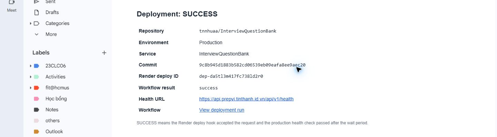

# Q14 — Deployment Result Email

## Verified result

- Repository: `tnnhuaa/InterviewQuestionBank`
- Environment: `Production`
- Service: `InterviewQuestionBank`
- Commit: `9c8b945d1883b582cd06539eb09eafa8ee9aec20`
- Render deploy ID: `dep-da5tl3m417fc738ld2r0`
- Workflow result: **Success**
- Production health check: **Passed**
- GitHub Actions run: `32694676002`
- Date: 24 August 2026

The CD workflow started after the `CI` workflow passed on `main`. Render accepted the deployment request, and the production health endpoint returned a successful response. The final workflow step sent this result by email.

## Evidence

The image is cropped to hide personal email addresses. It keeps the deployment result, commit, deploy ID, health URL, and workflow link.
