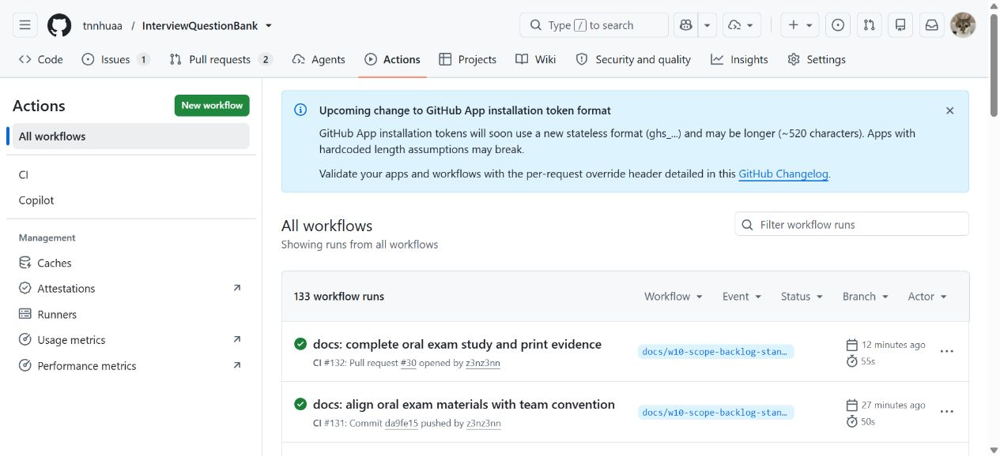
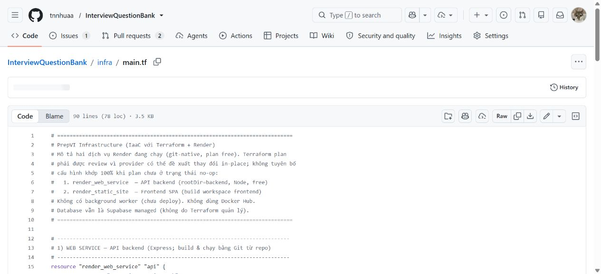
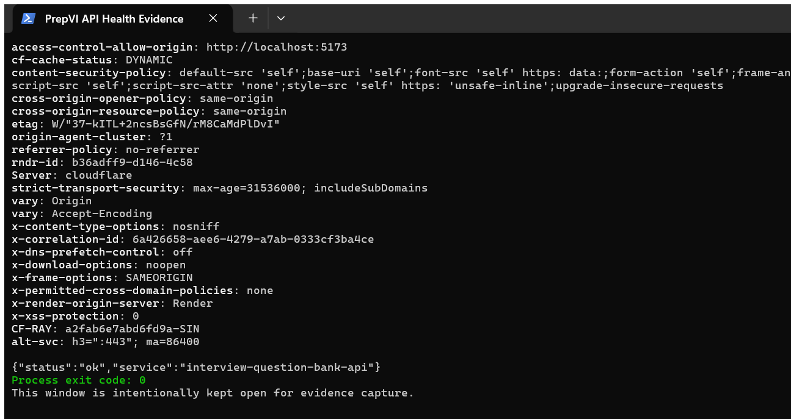

# DevOps Implementation Report

## Document control

| Field | Value |
| --- | --- |
| Project | PrepVI — Interview Practice Platform |
| Version | 1.0 |
| Reporting date | 23 August 2026 |
| Status | Current-state report based on repository and hosted-environment evidence |
| Platforms | GitHub Actions, Render, Supabase PostgreSQL and Terraform |

## 1. Executive summary

PrepVI uses Git and GitHub for version control and review, GitHub Actions for automated quality and secret-scanning checks, Render Git integration for frontend/API deployment, Terraform for versioned Render service configuration, and Supabase PostgreSQL outside the current Terraform state.

The current setup provides a repeatable source-to-deployment path for the frontend and API, but it is not a complete production-ready Continuous Delivery system. The background worker is not deployed, Terraform is not executed by GitHub Actions, automated post-deployment readiness tests are absent, and the current CI workflow does not run `npm test`.

## 2. Objectives

The DevOps approach is intended to:

- apply the same automated checks to every change;
- keep infrastructure configuration versioned and reviewable;
- connect a deployed service to a repository revision;
- detect contract, migration, build and secret-handling problems early; and
- document manual recovery where automation is incomplete.

## 3. Implemented delivery flow

1. A change is developed on a Git branch.
2. The change is committed, pushed and reviewed through a Pull Request.
3. GitHub Actions runs the `quality` and `secret-scan` jobs.
4. An accepted change reaches `main`.
5. Render builds and deploys the API and static frontend through Git integration.
6. Runtime health and provider logs support operational checks.
7. Terraform is reviewed manually before any apply operation.

## 4. Continuous Integration

The current `quality` job performs:

- locked dependency installation with `npm ci`;
- ESLint validation;
- TypeScript type checking;
- OpenAPI generated-type drift checking;
- PostgreSQL migration replay;
- reference-seed verification; and
- frontend/backend build validation.

The separate `secret-scan` job uses Gitleaks with full Git history. Workflow permissions are read-only for repository contents and Pull Request metadata.

The workflow does not currently run the Vitest suites. Local automated-test evidence and CI evidence must therefore be reported separately.

## 5. Deployment and Infrastructure as Code

Render deploys two Git-connected services:

| Service | Current role |
| --- | --- |
| Render web service | Express API |
| Render static site | React/Vite frontend |
| Supabase PostgreSQL | Shared relational database outside Terraform state |
| Background worker | Source code exists but no hosted worker is deployed |

Terraform imports and describes the existing Render API and frontend. A Terraform plan must be reviewed for in-place changes, paid-plan changes or destructive actions before apply. Terraform state, access tokens, database URLs and session secrets must not be committed.

## 6. Runtime and operational controls

The public frontend was reachable at the time of the evidence capture. A reachable page or health response proves only point-in-time availability; it does not prove database readiness, background-worker execution, all user journeys or an uptime commitment.

Current manual or incomplete controls include:

- background extraction, notification, reminder and retention work;
- provider-specific alerting and deployment-result notification;
- versioned release artifacts;
- protected staging/production approval gates;
- automated post-deployment smoke/readiness validation; and
- a retained backup, restore and rollback drill.

## 7. Security and configuration controls

- Secrets remain outside source control and are redacted from evidence.
- Gitleaks scans repository history.
- Terraform credential variables are sensitive.
- `terraform.tfvars` and Terraform state are excluded from commits.
- Deployment evidence must not expose credentials, private JD content, meeting links or session values.

## 8. Evidence

**Figure 1.** The deployed PrepVI frontend captured from the live site.

**Figure 2.** The real GitHub Actions window for the repository. Individual runs must be opened when step-level proof is required.

**Figure 3.** The versioned Terraform configuration displayed in the real GitHub file view.

**Figure 4.** A real Windows Terminal window showing the public API health payload, safe correlation identifier, observed CORS header and process exit code 0. The response is point-in-time process evidence, not database-readiness or worker evidence.

## 9. Limitations and release actions

The project must not claim complete hosted OCR, outbox, reminder or retention behavior until the background worker is deployed or replaced by an approved mechanism. It must not claim CI test execution until `npm test` is added to the workflow. Before a pilot release, the team should record provider ownership, deployment approval, readiness checks, backup/restore evidence and an operational notification path.

## 10. Source artifacts

- [GitHub Actions workflow](../../../.github/workflows/ci.yml)
- [Terraform configuration](../../../infra/main.tf)
- [Terraform variables](../../../infra/variables.tf)
- [IaC operations guide](../../../iaac_tutorial.md)
- [Manual Validation and Operations](../../Implementation/Manual_Validation_and_Operations.md)
