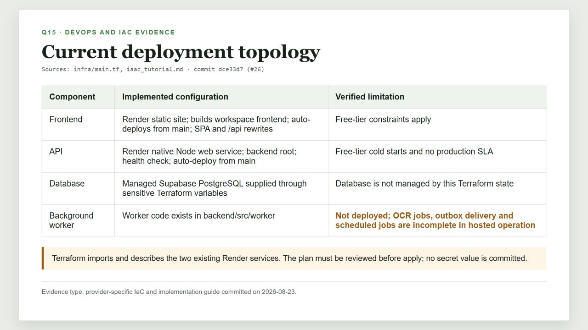
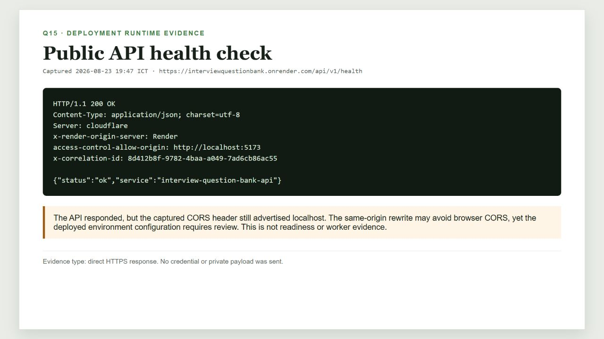

# Q15 Print Report - DevOps

## 1. Document control

| Field | Value |
|---|---|
| Project | Interview Practice Platform (PrepVI) |
| Examination topic | Q15 - DevOps |
| Examination owner | Hưng |
| IaC implementation evidence | Tuấn Anh, commit `dce33d7`, PR #26 |
| Source-code snapshot | `fd8a30b` |
| Runtime evidence date | 23 August 2026 |
| Documentation basis | Working-tree report prepared from repository snapshot `fd8a30b`; Git history records the later documentation commit |

## 2. Purpose

This report describes the DevOps practices that are demonstrably present in the repository and hosted environment. It separates Continuous Integration, Git-based deployment, Infrastructure as Code, runtime evidence, and remaining manual operations. It does not present a target diagram as completed production capability.

## 3. Definitions

| Term | Meaning in this project |
|---|---|
| DevOps | Collaboration, process and tooling that move a change from source control to an observable running environment |
| Continuous Integration (CI) | Automated checks on pushes and Pull Requests |
| Continuous Delivery | A repeatable path that keeps a release candidate deployable, normally with controlled production approval |
| Continuous Deployment | Automatic production deployment of every change that passes the gates |
| Infrastructure as Code (IaC) | Version-controlled infrastructure configuration instead of untracked manual setup |

## 4. Implemented flow

1. A member works on a branch, commits and pushes to GitHub.
2. GitHub Actions runs the `quality` and `secret-scan` jobs.
3. A reviewed change reaches `main`.
4. Render's Git integration builds and deploys the API and static frontend.
5. Terraform imports and describes the two existing Render services.
6. The public frontend uses an `/api/*` rewrite to the API.
7. Health endpoints and deployment logs support operational checks.

This is Git-triggered deployment plus provider-specific IaC. Terraform is not executed by the current GitHub Actions workflow, and the background worker is not deployed.

## 5. Continuous Integration evidence

The `quality` job uses Ubuntu, Node.js 24 and PostgreSQL 17. It runs:

- dependency installation with `npm ci`;
- ESLint;
- TypeScript type checking;
- OpenAPI generated-type drift detection;
- migration replay;
- idempotent reference seed and seed verification; and
- frontend/backend build.

The `secret-scan` job checks the full Git history with Gitleaks and receives a read-only GitHub token with Pull Request read permission.

**Figure Q15-04.** GitHub Actions run `32390206781` shows successful `quality` and `secret-scan` jobs after the Gitleaks permission fix. It does not prove that automated tests ran, because the current workflow has no `npm test` step.

## 6. Infrastructure as Code and deployment topology

Terraform under `infra/` uses the official Render provider and describes:

- `render_web_service.api`: a native Node service rooted at `backend`, with auto-deploy from `main`, a build command, start command and health check;
- `render_static_site.frontend`: a Vite build publishing `frontend/dist`, with the custom domain and SPA/API rewrite routes;
- sensitive variables for Render credentials, database URL, session secret and Gemini key; and
- outputs for service URLs and IDs.

**Figure Q15-02.** Current provider-specific deployment configuration and its verified limitation: the background worker is not deployed.

The PostgreSQL database is supplied by Supabase and is not managed by this Terraform state. Terraform state and real secret values are excluded from Git. A plan must be reviewed before apply, especially when it proposes a paid plan or destructive/in-place changes.

## 7. Runtime evidence

**Figure Q15-01.** The public PrepVI frontend rendered successfully at `https://prepvi.tinthanh.id.vn/` on 23 August 2026.

**Figure Q15-03.** The public API health endpoint returned HTTP `200`. The captured response also advertised `access-control-allow-origin: http://localhost:5173`; therefore deployed environment configuration requires review even though the same-origin rewrite may avoid browser CORS for the public frontend.

Health evidence proves that the API process responded at capture time. It does not prove database readiness, worker availability, all user flows, uptime SLA or complete production readiness.

## 8. Current limitations and manual recovery

| Gap | Impact | Required handling |
|---|---|---|
| Background worker is not deployed | OCR jobs, outbox/email, reminders, review publication and cleanup are incomplete in hosted operation | Deploy a supported worker or use the documented paste/manual/operations fallbacks |
| CI does not run `npm test` | CI success is not test-suite execution evidence | Add a test step after team approval; retain local test evidence separately meanwhile |
| No immutable release artifact | A deployed build is provider/Git derived rather than versioned as an artifact | Record deployed commit and Render deploy ID/log |
| No protected staging gate or automated smoke test | Deployment validation remains manual | Record URL, commit, operator, health/readiness and smoke result |
| CORS header advertised localhost | Production environment may be misaligned | Verify `FRONTEND_ORIGIN` and same-origin routing without exposing secrets |
| No recorded rollback/restore drill | Recovery capability is not proven | Retain backup, forward-fix, restore and rollback decision evidence |

## 9. Security controls

- GitHub workflow permissions are read-only for contents and Pull Requests.
- Gitleaks scans the full history.
- Terraform variables containing credentials are marked sensitive.
- `terraform.tfvars` and state are not committed.
- Reports must not include API keys, session secrets, database credentials, private JD text or meeting links.

## 10. Change evidence

| Commit/evidence | Date | Meaning |
|---|---|---|
| `7872fba` | 16 Aug 2026 | Foundation skeleton and CI baseline |
| `32390206781` | 20 Aug 2026 | Recorded successful CI/secret-scan run |
| `dce33d7` / PR #26 | 23 Aug 2026 | Terraform IaC for the existing Render API and frontend |
| Runtime capture | 23 Aug 2026 | Public frontend and API health response |

## 11. Source artifacts

- [GitHub Actions workflow](../../../.github/workflows/ci.yml)
- [Terraform main configuration](../../../infra/main.tf)
- [Terraform variables](../../../infra/variables.tf)
- [Terraform outputs](../../../infra/outputs.tf)
- [IaC implementation guide](../../../iaac_tutorial.md)
- [Software Architecture](../../Project_Architecture/software_architecture.md)

## 12. Final print checks

- [ ] Keep the worker and CI-test gaps visible.
- [ ] Do not present a health check as readiness or complete E2E proof.
- [ ] Keep secrets and private data out of figures.
- [ ] Print all four figures with their English captions.
