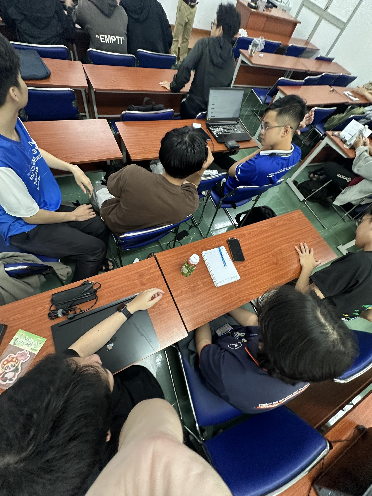
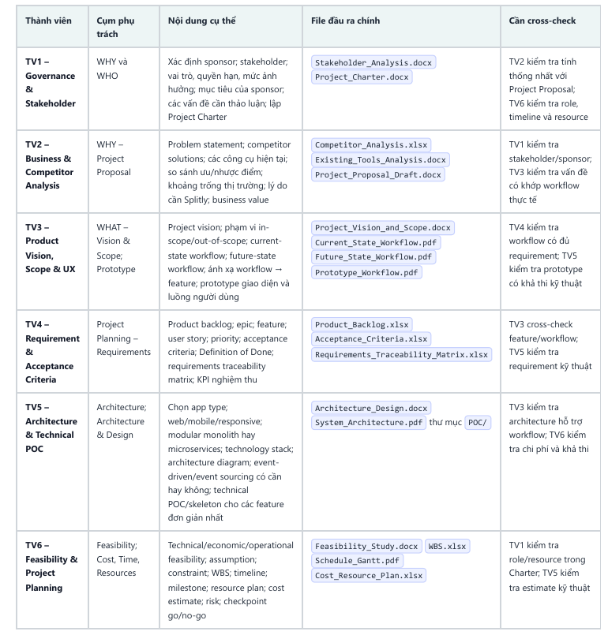
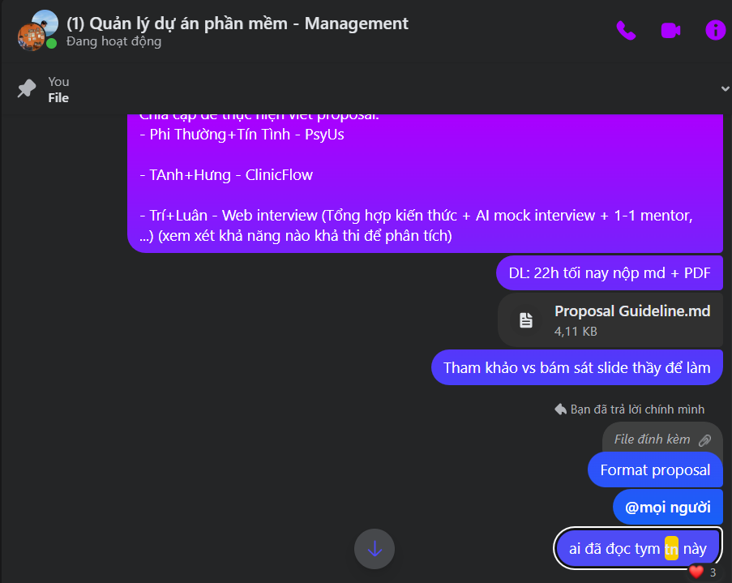

# Team Management Report

## Document control

| Attribute | Content |
| --------- | ------- |
| Document name | Team Management Report — PrepVI (Interview Practice Platform) |
| Version | 1.0 |
| Report date | 23/08/2026 |
| Period covered | 29/06/2026–23/08/2026 |
| Owner and compiler | Tuấn Anh — Project Manager / Team Leader / Timekeeper |
| Reviewer | Tuấn Anh |
| Review date | 23/08/2026 |

> **Data note:** The report uses only facts the team confirmed and content in the repository; it does not fabricate meeting minutes, timesheets, or tracking data that do not actually exist. Reconstructed data is labelled clearly and is not presented as actual.

## 1. Executive summary

The team has six members and operates in a projectized structure with a single decision point. Within the eight-week course window 29/06–23/08/2026, the team went through the full forming-and-developing cycle: working on Splitly first, stuck on the idea after midterm critique, then agreeing on the new direction InterviewQuestionBank on 09/08 and executing during the final two weeks, from 10/08 to 23/08.

Assignment is based on roles and skills from earlier projects; work is assigned by week, the default deadline is Saturday 22:00, members confirm acceptance of tasks over Messenger, and every change goes through a reviewed pull request. The biggest people-management issue was that every decision depended on one person, while uneven task complexity caused some tasks to slip. Both were handled, but the root causes remain.

## 2. Context and objectives

### 2.1 Course context

| Date | Event |
| ---- | ----- |
| 29/06/2026 | The team started the eight-week project window with the Splitly topic. |
| 24/07/2026 | After the midterm session, the lecturers critiqued Splitly's product value; the team had to revisit the problem. |
| 24/07–09/08/2026 | The team brainstormed but had not settled on a new direction. |
| 09/08/2026 | The team preliminary-settled on InterviewQuestionBank and redid Initiation and Planning. |
| 10/08/2026 | The team began actual execution for the new topic. |
| 13/08/2026 | The team formally confirmed the "web interview" direction and prepared to divide the work. |
| 14/08/2026 | The lecturer for the practical session gave feedback prioritising the candidate pain point; the team narrowed to candidate-first by JD. |
| 16/08/2026 | Tuấn Anh reconstructed the Kanban from the Product Backlog. |
| 23/08/2026 | End of the course window; reviewed Project Plan 1.0 and moved into wrap-up. |

### 2.2 Objectives of team management

- Define clear roles and responsibilities for the six members.
- Assign work by week, with a deadline, output, and a cross-checker.
- Integrate work from multiple workstreams through Git/GitHub and pull requests.
- Handle blockers, scope changes, and people issues.
- Ensure delivery stays within the time remaining after the pivot.

## 3. Theoretical basis

### 3.1 Five stages of team development (Tuckman)

| Stage | Characteristics | What the leader should do |
| ----- | --------------- | ------------------------- |
| Forming | Members are cautious; goals and roles are unclear | Clarify goals, roles, tools, and how the team communicates |
| Storming | Differences emerge in priorities, approach, or decision authority | Listen, clarify criteria, and keep discussion on the problem |
| Norming | The team agrees on rules and trusts each other more | Standardise the way of working and assign responsibility clearly |
| Performing | The team proactively coordinates to reach its goals | Empower, remove blockers, and avoid over-interfering |
| Adjourning | Work ends; handover and lessons learned | Acknowledge contributions, transfer knowledge, and extract lessons |

### 3.2 Organisational types

| Type | PM authority | Resources | Characteristics |
| ---- | ------------ | --------- | --------------- |
| Functional | Low | Belong to the department head | Staff by specialism; projects run across departments |
| Projectized | High | Dedicates mainly to the project | Team focused on one project; PM coordinates directly |
| Weak matrix | Low | Functional manager holds primary authority | PM acts more like a coordinator |
| Balanced matrix | Shared | PM and functional manager both manage | Needs clear authority coordination |
| Strong matrix | Fairly high | PM controls most of the resources | Close to projectized, but specialism belongs to departments |

### 3.3 Theory X, Y, and Z

- **Theory X:** people avoid work and need tight control; useful short-term, but tends to reduce creativity.
- **Theory Y:** people direct themselves when they understand the goal and are given responsibility; management focuses on removing obstacles and giving feedback.
- **Theory Z:** invests in shared values, trust, participative decisions, and individual responsibility.

### 3.4 Maslow's hierarchy of needs

From low to high: physiological, safety, belonging/relationships, esteem, and self-actualisation. In a student team, the leader cannot meet every need, but can create a safe environment for raising errors, keep a reasonable work schedule, build a sense of belonging, acknowledge contributions, and hand out opportunities to learn new skills.

## 4. How this was applied to the project

### 4.1 Role structure

The team's organisation is close to **projectized**: six members working on one product, not belonging to functional departments, each with a project role, and Tuấn Anh holds direct operating authority.

| Member | Primary role | Responsibility / output |
| ------ | ------------ | ----------------------- |
| Tuấn Anh | Project Manager / Team Leader / Timekeeper | Assign roles and work, manage deadlines and Kanban, make final decisions, review/merge, confirm Done |
| Gia Thành | Project Planning & Estimation Analyst / Full-stack Developer | Charter, Resource Plan, Cost–Time–Resources, two estimates, and Full-stack implementation |
| Hưng | Product Owner / Business Analyst | Vision & Scope, Product Backlog, acceptance criteria, workflow, and acceptance |
| Luân | Architecture / Technical Lead | Technology stack, ADRs, architecture, and technical support for PoC/implementation |
| Hùng | UI/UX Designer / Front-end Developer | Clickable prototype, workflow, usability evidence, and the front-end interface |
| Trí | PoC / Integration & E2E Developer | Core-flow PoC, seed data, integration, end-to-end testing, and technical-risk evidence |

### 4.2 Team forming and development process

| Stage | Team events | Interpretation limits |
| ----- | ----------- | --------------------- |
| Forming | 29/06: six members started the Splitly project | No team-formation minutes or early role evidence |
| Storming | 24/07–09/08: brainstorming deadlock, no new direction after the lecturer critique | Uncertainty about goals/decisions; not enough evidence to call it personal conflict |
| Norming | 09/08–14/08: settled on InterviewQuestionBank, consulted lecturers, redid Initiation/Planning, moved candidate-first | The team kept existing roles and mapped the new scope onto similar work |
| Performing | 10/08–23/08: developed in parallel, integrated via PR/CI; board recorded 129/134 mandatory SP as Done | Board reconstructed on 16/08; SP/commits not used to rank members |
| Adjourning | 23/08: reviewed Project Plan 1.0, moved into wrap-up and Lessons Learned | Only "starting to close" is mentioned; no evidence the team dissolved |

### 4.3 Team working rules applied

| Rule | Content |
| ---- | ------- |
| Assignment | Tuấn Anh assigns work by week; the weekly table records member, cluster, content, output file, and cross-checker |
| Default deadline | Saturday 22:00 each week; when several members are busy with other schedules, Tuấn Anh extends the deadline for the whole team |
| Communication channel | Messenger; members react with a heart on assignment messages to confirm they received the task |
| Meeting cadence | No fixed meetings; only meet when a decision needs to be locked, to avoid drifting off course |
| Blocker | Raise it in the Messenger group so the whole team can discuss; the team does not set a response time |
| Repository rule | Do not push directly to `main`; changes go through a pull request and need at least one approval |
| Definition of Done | Owner self-checks acceptance criteria before the PR; Tuấn Anh reviews, gives feedback, merges, and confirms Done |
| Automated quality | GitHub Actions: lint, typecheck, OpenAPI drift, migration, seed, build, and Gitleaks |

### 4.4 Assignment process in the weekly table

1. Tuấn Anh builds the assignment table: member, cluster, specific content, output file, and cross-checker.
2. Sends the table over Messenger; members react with a heart to confirm they received it.
3. Members work on a branch, self-check acceptance criteria, then open a pull request.
4. The cross-checker and Tuấn Anh review and flag what is not yet met; CI runs the quality gate.
5. After at least one approval, Tuấn Anh merges and confirms the Done status.

## 5. Real people-management issues

| Actual event | Cause | How the team handled it | Result and limits |
| ------------ | ----- | ----------------------- | ------------------ |
| 24/07–09/08: brainstorming deadlock | Members offered ideas but did not decide; the team lacked a shared screening criterion | Tuấn Anh organised a brainstorm, evaluating ideas against existing products, the ability to combine solutions, users' willingness to switch tools, and risk; he decided the approach himself and consulted the lecturers | Settled on InterviewQuestionBank on 09/08 and executed from 10/08. Broke the deadlock but concentrated decisions in one person |
| Some tasks missed the deadline | Uneven task complexity; members busy with other coursework deadlines | Tuấn Anh extended the deadline for the whole team rather than adjusting individuals | Kept a relatively even level of completeness; no timesheet, so exact lateness could not be measured |
| Trí committed `.env` (with keys) and `node_modules` to the repository | Missing self-check for sensitive and generated files before pushing | Tuấn Anh found it through review/CI; Trí removed the files in `df3d6c1`; Tuấn Anh added `.gitignore` rules in `0556a6e`; the team revoked the old credentials and created new keys | Removed sensitive files and dependencies from version control; reduced the chance of recurrence, but the credentials had already been exposed in Git history |

### 5.1 Assessment from a theoretical viewpoint

- **Tuckman:** the team reached Norming–Performing in the final two weeks by keeping the same roles, a familiar stack, and a clear candidate-first journey. The Storming stage arose from goal uncertainty after the old topic was critiqued, not personal conflict.
- **Organisation:** the structure is close to projectized, with authority to assign roles, lock the idea, and adjust deadlines matching Tuấn Anh's actual role.
- **Theory Y and X:** assigning roles by experience and letting members use a familiar stack fits Theory Y. When the team was stuck, Tuấn Anh directed directly and controlled decisions more tightly, which shows some Theory X traits, but not enough to say he believes members are lazy.
- **Maslow:** the team has no evidence of motivation-building, cross-training, or coaching activities; the technical safety environment (CI, review, a recovery path for mistakes) partly reflects safety and belonging needs.

## 6. Evidence

### 6.1 Group photo at the final class

Figure 1 is a group photo taken at the final class, used as evidence of presence and of when the team was working.

### 6.2 Week 6 assignment table

Figure 2 records six week-6 clusters: Governance/Stakeholder, Business/Competitor, Product Vision/Scope/UX, Requirement/Acceptance, Architecture/Technical PoC, and Feasibility/Project Planning. The table shows how work was assigned and the planned schedule, but does not prove every output was completed by Saturday 22:00.

### 6.3 Task acceptance confirmation over Messenger

Figure 3 shows an assignment message with a heart reaction. This reaction confirms only that the member received the information; it does not prove the work had started or was finished.

### 6.4 Credential incident and remediation

Figure 4 shows `.env` and `node_modules` appearing in the PR #3 diff, with credential values redacted. Figure 5 shows the `secret-scan` job failing because `GITHUB_TOKEN` was missing when scanning a pull request, so this image does not prove Gitleaks detected the credentials in `.env`. The fix is in commits `df3d6c1` (16/08) and `0556a6e` (18/08); the old credentials were revoked.

### 6.5 Evidence of scope change

The images `../Q11_project-plan/img/Q11-02-team-confirms-interview-idea.png` through `Q11-05-candidate-poc-and-mentor-split.png` show the team confirming the InterviewQuestionBank direction on 13/08, a summary of lecturer feedback on 14/08, the candidate-first scope update, and the decision to keep a separate Mentor flow.

## 7. Assessment

### 7.1 Strengths

- Roles, ownership, and DoD are documented, with a cross-checker in place.
- Work is divided by week with a clear output file and a default deadline.
- Messenger enables quick task-acceptance confirmation; blockers are raised in the group chat.
- Git/GitHub and CI provide a change history and an automated quality gate.
- Keeping familiar roles, a familiar stack, and a single decision point helped the team escape the deadlock under time pressure.
- Technical incidents were handled promptly and with a preventive direction.

### 7.2 Weaknesses

- The team has no meeting minutes, retrospective records, or action-item log.
- No response time is defined on Messenger, so escalation depends on members proactively monitoring the group chat.
- No actual per-hour effort, weekly contribution review, or reliable tracking data.
- Decision authority is concentrated in Tuấn Anh; members lack a clear scope of autonomy.
- Deadline extensions were not accompanied by quantitative cause analysis.
- No evidence of motivation-building, coaching, cross-training, or conflict-handling activities.

### 7.3 Improvements for next time

1. Split tasks smaller, estimate roughly, and review complexity early.
2. Give each owner a clear scope of decision authority to reduce dependence on one person.
3. Keep short minutes for important decisions and track action items.
4. Collect actual effort and analyse the cause of lateness instead of just extending deadlines.
5. Add a pre-push checklist: sensitive files, generated files, and secrets.

## 8. Conclusion

The team went through the full development cycle and reached Norming–Performing while working on the new topic. Simple, consistent working rules helped the team assign, coordinate, and integrate work effectively. The biggest limitation is that people-tracking data is almost nonexistent and decision authority concentrates in one person; these are the two main areas to improve in future projects.

## 9. References

- `docs/Project_Governance & Stakeholder/Project_Charter.md`
- `docs/Project_Governance & Stakeholder/Stakeholder_Analysis.md`
- `docs/Project_Resource_Plan/ResourcePlan.md`
- `docs/refs/08-software-team-management.md`
- `docs/refs/12-software-project-management.md`
- `docs/Oral_Exam/Q11_project-plan/img/Q11-02-team-confirms-interview-idea.png`
- `docs/Oral_Exam/Q11_project-plan/img/Q11-03-instructor-feedback-summary.png`
- `docs/Oral_Exam/Q11_project-plan/img/Q11-04-team-updates-scope-and-plan.png`
- `docs/Oral_Exam/Q11_project-plan/img/Q11-05-candidate-poc-and-mentor-split.png`
- Git history and pull request merges from 13/08/2026 to 20/08/2026
- `.github/workflows/ci.yml`
