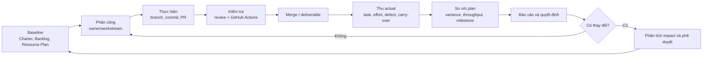

# Báo cáo — Phân công, theo dõi, kiểm soát và báo cáo dự án

## Thông tin kiểm soát tài liệu

| Thuộc tính                 | Nội dung                                                                     |
| -------------------------- | ---------------------------------------------------------------------------- |
| Tên tài liệu               | Report on Assignment, Monitoring, Control and Project Reporting — PrepVI    |
| Phiên bản                  | 1.0                                                                          |
| Ngày lập báo cáo           | 23/08/2026                                                                   |
| Giai đoạn áp dụng          | 27/07/2026–23/08/2026 (lịch tái dựng) và 10/08–23/08/2026 (execution thực tế) |
| Chủ sở hữu và người tổng hợp | Tuấn Anh — Project Manager / Team Leader / Timekeeper                      |
| Người review               | Tuấn Anh                                                                     |
| Ngày review                | 23/08/2026                                                                   |

> **Lưu ý về dữ liệu:** Nhóm quản lý công việc bằng Kanban theo tuần, không vận hành sprint. Trello được tái dựng ngày 16/08/2026 từ Product Backlog; số liệu trên board là dữ liệu tái dựng, không phải tracking thời gian thực từ 27/07. Nhóm không có timesheet, snapshot board gốc theo ngày, burndown hằng ngày hoặc status report được lập đúng thời điểm trước giữa kỳ.

## 1. Tóm tắt điều hành

Nhóm theo dõi công việc bằng Kanban theo tuần với ba lớp công cụ: Product Backlog và Project Charter làm baseline; Trello phân rã và theo dõi task hoàn thành User Story; Git/GitHub cùng GitHub Actions theo dõi thay đổi mã nguồn và chất lượng. Báo cáo trạng thái tổng hợp từ board, commit/PR, CI và actual cash, rồi đối chiếu với baseline trong Project Plan 1.0.

Kết quả đến 23/08/2026: board ghi nhận 26/27 User Story R1 Bắt buộc và 129/134 SP ở trạng thái Done (khoảng 96,3%); actual cash cost là 0 VNĐ do dùng free tier; nhóm không có actual effort theo giờ nên chỉ theo dõi được mức hoàn thành theo SP và mốc thời gian. Dự án vượt qua hai thay đổi phạm vi lớn (pivot từ Splitly, thu hẹp candidate-first) bằng cách làm lại Initiation/Planning và giữ luồng Mentor đã có.

## 2. Bối cảnh và mục tiêu

### 2.1 Bối cảnh

Nhóm bắt đầu học phần với Splitly, sau phản biện giữa kỳ ngày 24/07 phải quay lại ideation, chốt InterviewQuestionBank ngày 09/08 và thực hiện trong hai tuần cuối. Vì đề tài mới không được theo dõi từ đầu cửa sổ học phần, nhóm tái dựng Kanban bốn tuần 27/07–23/08 và tách biệt dữ liệu tái dựng khỏi dữ liệu thực tế.

### 2.2 Mục tiêu của công tác theo dõi và kiểm soát

- Biết ai làm gì, đang ở trạng thái nào và đã hoàn thành những gì.
- So tiến độ thực tế với baseline qua Planned–Actual.
- Phát hiện và xử lý blocker, lỗi và thay đổi phạm vi sớm.
- Theo dõi chi phí và dự báo khả năng hoàn thành đúng scope–time–cost.
- Báo cáo trạng thái và nêu quyết định cần Product Owner, Sponsor hỗ trợ.

## 3. Sơ đồ quy trình theo dõi và kiểm soát của nhóm

Sơ đồ mô tả quy trình nhóm đã dùng: baseline từ tài liệu, phân công theo workstream, thực hiện qua branch/commit/PR, kiểm tra bằng review và GitHub Actions, rồi thu actual và so với kế hoạch trước khi báo cáo. Trong sơ đồ, mục “Thu actual” mới thu được mức hoàn thành theo User Story/SP và actual cash; phần effort theo giờ chưa có dữ liệu.

## 4. Phân công và theo dõi

### 4.1 Baseline và ownership

- **Nguồn:** Project Charter, Stakeholder Analysis, Resource Plan và Product Backlog.
- **Kết quả:** ownership được phân cho mười đầu ra, gồm PM/estimation, governance, UI/UX, product/backlog, PoC/E2E và architecture.
- **Phân công theo tuần:** Tuấn Anh lập bảng giao việc gồm thành viên, cụm phụ trách, nội dung, file đầu ra và người cross-check; deadline mặc định 22:00 thứ Bảy.
- **Xác nhận nhận việc:** phân công gửi qua Messenger, thành viên thả tim để xác nhận đã nhận. Đây là dấu hiệu tiếp nhận thông tin, không phải trạng thái In Progress, Done hoặc dữ liệu effort thực tế.
- **Bằng chứng:** bảng tuần 6 tại `../Q16_team-management/img/Q16-03-weekly-assignment-w6.png`; ảnh Messenger có phản ứng tim tại `../Q16_team-management/img/Q16-06-messenger-heart-ack.png`.

### 4.2 Trello — theo dõi User Story

- **Thời điểm:** Tuấn Anh tái dựng Kanban ngày 16/08/2026 từ `Product_Backlog_and_Acceptance_Criteria.md`.
- **Cấu trúc:** cột Product Backlog; Ready — WIP 6; In Progress — WIP 6; Review — WIP 3; Done theo W1–W4 (W1 27/07–02/08, W2 03/08–09/08, W3 10/08–16/08, W4 17/08–23/08).
- **Nội dung card:** User Story, SP, assignee, nhãn, ngày và kết quả kiểm tra.
- **Giới hạn công cụ:** Trello chỉ quản lý task hoàn thành User Story; PoC không nằm trên Trello. Khoảng ngày trên card là thời gian từ lúc giao/nhận việc đến lúc đánh dấu Done, không phải số giờ làm.

### 4.3 Git và GitHub — theo dõi thay đổi mã nguồn

- **Quy trình:** thành viên tự kiểm tra acceptance criteria, thực hiện trên branch, commit, tạo PR; Tuấn Anh review và phản hồi; sau ít nhất một approval mới merge vào `main` và xác nhận Done.
- **Bằng chứng:** PR `#1–#13`; commit history 13–20/08/2026; shortlog ghi nhận sáu thành viên. PR `#13` liên kết US-16, US-03, US-29, US-06, được tạo 19/08 và merge 20/08.
- **Giới hạn:** số commit không phải phần trăm hoàn thành, effort hay năng suất.

### 4.4 Chất lượng tự động — GitHub Actions

- **Pipeline:** checkout → `npm ci` → lint → typecheck → OpenAPI drift → migration replay → seed verification → build; job riêng chạy Gitleaks.
- **Bằng chứng:** run `#51` (run ID `32390206781`) trên `main` ngày 20/08/2026 kết thúc thành công tại <https://github.com/tnnhuaa/InterviewQuestionBank/actions/runs/32390206781>.
- **Giới hạn:** workflow không chạy automated test suite; theo Manual Validation, automated tests nằm ngoài R1 hiện tại.

## 5. Kiểm soát thay đổi

### 5.1 Quy trình

Phân tích change → đánh giá tác động scope/effort/schedule/cost/risk → đúng thẩm quyền phê duyệt → cập nhật backlog/baseline → thực hiện và xác minh → cập nhật kế hoạch và báo cáo.

### 5.2 Thay đổi thực tế

| Thay đổi | Thời điểm | Nội dung | Tác động | Bằng chứng |
| --- | --- | --- | --- | --- |
| Splitly → InterviewQuestionBank | 09/08/2026 | Đổi chủ đề sau phản biện giữa kỳ; làm lại Initiation và Planning | Nhóm mất ~1 tuần brainstorm; execution thực tế chỉ còn 10/08–23/08 | `../Q11_project-plan/img/Q11-02-team-confirms-interview-idea.png` |
| Mentor-first/candidate-first | 14/08/2026 | Giảng viên thực hành góp ý ưu tiên pain point ứng viên; chốt candidate-first theo JD | Thêm JD intake, OCR, correction, requirement analysis, Question Bank mapping, preparation plan; giữ luồng Mentor riêng; loại AI interviewer, video tích hợp, payment, mobile native, ATS | `../Q11_project-plan/img/Q11-01-mvp-scope-candidate-first.png`, `Q11-03`, `Q11-04`, `Q11-05` |
| `.env` có credential vào repo | 14/08/2026 | Trí commit `.env` và `node_modules`; làm lộ secret và repo phình nặng | Rủi ro bảo mật, diff lớn, CI chậm | Ảnh PR #3, `f91a498`, `df3d6c1`, `0556a6e` |

**Kiểm soát credential:** commit `df3d6c1` (16/08) loại bỏ `.env` và `node_modules`; commit `0556a6e` (18/08) bổ sung environment files vào `.gitignore`; nhóm revoke credential cũ và tạo key mới vì xóa file ở commit sau không xóa secret khỏi lịch sử Git.

### 5.3 Hạn chế của quy trình kiểm soát

- Không có change request chính thức theo mẫu; phê duyệt là đồng thuận qua trao đổi trực tiếp và chat.
- Không có estimate riêng trước/sau thay đổi để tính effort variance.
- Ảnh job `secret-scan` thất bại (`../Q16_team-management/img/Q16-05-secret-scan-failed.png`) chứng minh workflow có job này chạy thất bại, nhưng annotation cho thấy lỗi thiếu `GITHUB_TOKEN`, không chứng minh Gitleaks phát hiện credential.

## 6. Đánh giá Planned–Actual tại 23/08/2026

| Chỉ tiêu                        | Baseline/kế hoạch | Dữ liệu ghi nhận | Kết luận |
| ------------------------------- | -----------------: | ---------------: | -------- |
| Phạm vi R1 Bắt buộc             | 27 User Story / 134 SP | 26 User Story / 129 SP Done | Còn US-20 (5 SP); khoảng 96,3% |
| Cửa sổ học phần                 | 29/06–23/08, 8 tuần | Kết thúc 23/08 | Giữ nguyên mốc |
| Execution InterviewQuestionBank | Lịch tái dựng 27/07–23/08 | Thực tế 10/08–23/08 | Hai tuần thực tế; bốn tuần reconstruction |
| Effort                          | Khoảng 653 giờ; 606/650 giờ estimate cũ | Không có timesheet | Không tính được variance hoặc EAC theo giờ |
| Cash                            | Trần 1.125.000 VNĐ | 0 VNĐ | Không phát sinh chi phí vì dùng free tier |

### 6.1 Completion theo tuần (từ board tái dựng)

| Mốc | User Story Done | SP Done | SP còn lại |
| --- | ---------------: | ------: | ---------: |
| Bắt đầu baseline | 0 | 0 | 134 |
| Cuối W1 — 02/08 | 7 | 34 | 100 |
| Cuối W2 — 09/08 | 6 | 34 | 66 |
| Cuối W3 — 16/08 | 8 | 34 | 32 |
| Cuối W4 — 23/08 | 5 | 27 | 5 |

### 6.2 Project Burndown

Đường actual dùng chuỗi 134 → 100 → 66 → 32 → 5 SP còn lại, theo bốn cột Done của Trello. US-09 kéo dài đến 16/08 và US-04 được đánh dấu xong ngày 11/08, nhưng bảng giữ mốc tuần để nhất quán với cấu trúc board.

**Giới hạn dữ liệu:** burndown này được dựng từ board tái dựng ngày 16/08, không phải burndown nhóm cập nhật hằng ngày; chưa chứng minh mỗi card được cập nhật đúng thời điểm thực tế.

## 7. Báo cáo trạng thái tuần trước buổi giữa kỳ

### 7.1 Trạng thái Splitly (13/07/2026–19/07/2026)

Nhóm không lập status report tại thời điểm 13/07–19/07. Tài liệu hồi cứu `Splitly_Pre_Midterm_Status_Report_Retrospective.md` tái dựng trạng thái từ bộ tài liệu Splitly mà nhóm xác nhận đã dùng trước giữa kỳ. Kết luận: **At Risk** — baseline tài liệu đã hình thành nhưng business value, adoption và sustainability chưa được kiểm chứng; baseline 10 tuần của Splitly không khớp cửa sổ học phần 8 tuần. Ba rủi ro đầu tiên chỉ xuất hiện sau phản biện trực tiếp tại buổi giữa kỳ, nên đây là đánh giá hồi cứu, không phải issue log được nhóm ghi trước ngày 24/07.

### 7.2 Tóm tắt báo cáo hồi cứu

| Nhóm đầu ra | Trạng thái có thể chứng minh | Nguồn |
| --- | --- | --- |
| Project initiation | Charter 1.0 proposed baseline, pending approval; sponsor Naver, còn nhiều TBD | [S1] |
| Business proposal | Proposal 2.0 draft: vấn đề, công cụ hiện có, đối thủ, market gap, giá trị | [S2] |
| Product baseline | Vision, MVP scope, backlog 21 User Story, acceptance criteria | [S3], [S4] |
| Workflow và prototype | Current/future workflow, prototype nhập hóa đơn thủ công và Gemini-assisted | [S5], [S6] |
| Technical planning | Modular monolith, React/Node/MongoDB, adapter Gemini/VietQR/email | [S7] |
| Resource, cost, feasibility | Kế hoạch 6 thành viên, capacity, chi phí, Conditional Go | [S8]–[S10] |

**Giới hạn:** không có status report gốc, snapshot board theo ngày, timesheet, actual cost/effort hoặc phần trăm hoàn thành phần mềm đáng tin cậy; số lượng tài liệu không thay được phần trăm hoàn thành sản phẩm.

### 7.3 Sau buổi giữa kỳ

Nhóm dừng cam kết mở rộng Splitly, quay lại ideation có sàng lọc (problem, alternatives, adoption, risk, sustainability), chọn InterviewQuestionBank, làm lại Initiation và Planning rồi tiếp tục execution trong thời gian còn lại.

## 8. Đánh giá công tác theo dõi và kiểm soát

### 8.1 Điểm đã làm được

- Vai trò và phạm vi được ghi thành baseline có version.
- Git history truy được tác giả, thời điểm và nội dung thay đổi; PR/merge hỗ trợ tích hợp công việc của nhiều workstream.
- CI tự động kiểm tra lint, type, contract, migration, seed, build và secret.
- Trello có WIP limit và ghi nhận 26/27 User Story Bắt buộc Done.
- Project Plan 1.0 phân biệt baseline, actual và dữ liệu tái dựng; actual cash 0 VNĐ.
- Thay đổi phạm vi và sự cố đều có chuỗi commit và ảnh minh chứng.

### 8.2 Khoảng trống

- Trello là nguồn trạng thái nhưng được tái dựng, chưa phải tracking gốc theo thời gian thực.
- Không có actual effort theo person-hour, nên không tính được EAC hay effort variance.
- Không có snapshot Kanban hằng ngày, throughput history hoặc cycle-time history đáng tin cậy.
- Status report chỉ được lập hồi cứu; không có báo cáo đúng thời điểm hoặc change log theo mẫu.
- Chưa có log approval đầy đủ cho mọi PR khiến khó kiểm chứng mức tuân thủ yêu cầu ít nhất một approval.

### 8.3 Cải tiến đề xuất

1. Chọn một board duy nhất; mỗi task có purpose, output, assignee, due date, estimate, actual và trạng thái.
2. Liên kết task với PR/commit và acceptance criteria.
3. Chỉ tính story point khi story đạt Definition of Done và được Product Owner chấp nhận.
4. Chụp snapshot Kanban cuối mỗi ngày hoặc tuần để dựng burndown từ dữ liệu thật.
5. Tạo status report ngắn từ board, burndown, issue/change/risk log; không đếm commit như năng suất.

## 9. Kết luận

Nhóm theo dõi được tiến độ theo User Story/SP và chi phí thực tế, phát hiện sớm lỗi tích hợp, sự cố credential và hai thay đổi phạm vi lớn, rồi xử lý bằng chuỗi commit và cập nhật baseline có thể truy vết. Hạn chế lớn nhất là dữ liệu actual: board được tái dựng, không có timesheet, burndown theo ngày hoặc status report đúng thời điểm. Khi dùng các số liệu này, cần phân biệt rõ dữ liệu tái dựng và dữ liệu thực tế, không suy diễn thành phần trăm hoàn thành theo giờ hoặc cam kết phát hành.

## 10. Tài liệu tham chiếu

- `docs/Project_Governance & Stakeholder/Project_Charter.md`
- `docs/Project_Resource_Plan/ResourcePlan.md`
- `docs/Project_Resource_Plan/Cost_Time_Resources.md`
- `docs/Project_Vision_and_Scope/Product_Backlog_and_Acceptance_Criteria.md`
- `docs/Oral_Exam/Q11_project-plan/Project_Plan_Report.md`
- `docs/Oral_Exam/Q11_project-plan/img/Q11-06-reconstructed-kanban-user-stories.png`
- `docs/Oral_Exam/Q17_monitoring-and-control/Splitly_Pre_Midterm_Status_Report_Retrospective.md`
- `docs/Oral_Exam/Q16_team-management/img/Q16-03-weekly-assignment-w6.png`
- `docs/Oral_Exam/Q16_team-management/img/Q16-06-messenger-heart-ack.png`
- `docs/Oral_Exam/Q16_team-management/img/Q16-05-secret-scan-failed.png`
- `docs/refs/09-software-project-monitoring-and-control.md`
- `docs/refs/09-1-agile-project-monitoring-and-control.md`
- `.github/workflows/ci.yml` và Git history 13–20/08/2026
