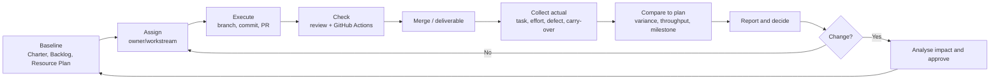

# Report on Assignment, Monitoring, Control and Project Reporting

## Document control

| Attribute | Content |
| --------- | ------- |
| Document name | Report on Assignment, Monitoring, Control and Project Reporting — PrepVI |
| Version | 1.0 |
| Report date | 23/08/2026 |
| Period covered | 27/07/2026–23/08/2026 (reconstructed schedule) and 10/08–23/08/2026 (actual execution) |
| Owner and compiler | Tuấn Anh — Project Manager / Team Leader / Timekeeper |
| Reviewer | Tuấn Anh |
| Review date | 23/08/2026 |

> **Data note:** The team manages work with a weekly Kanban board, not sprints. Trello was reconstructed on 16/08/2026 from the Product Backlog; the board figures are reconstructed data, not real-time tracking from 27/07. The team has no timesheet, original dated board snapshot, daily burndown, or status report produced at the right time before the midterm.

## 1. Executive summary

The team tracks work with a weekly Kanban and three tool layers: the Product Backlog and Project Charter as baseline; Trello to break down and track tasks that complete User Stories; Git/GitHub with GitHub Actions to track source changes and quality. The status report aggregates from the board, commits/PRs, CI, and actual cash, then checks against the baselines in Project Plan 1.0.

Results as of 23/08/2026: the board records 26/27 R1 mandatory User Stories and 129/134 SP as Done (about 96.3%); actual cash cost is 0 VND because free tiers are used; the team has no per-hour actual effort, so only completion by SP and time milestones can be tracked. The project survived two major scope changes (the pivot from Splitly, and narrowing to candidate-first) by redoing Initiation/Planning and keeping the existing Mentor flow.

## 2. Context and objectives

### 2.1 Context

The team started the course with Splitly, had to return to ideation after the 24/07 midterm critique, settled on InterviewQuestionBank on 09/08, and executed in the final two weeks. Because the new topic was not tracked from the start of the course window, the team reconstructed the Kanban for the four weeks 27/07–23/08 and separates reconstructed data from actual data.

### 2.2 Objectives of monitoring and control

- Know who is doing what, what state it is in, and what has been completed.
- Compare actual progress against baseline via Planned–Actual.
- Detect and handle blockers, defects, and scope changes early.
- Track cost and forecast the ability to deliver within scope–time–cost.
- Report status and surface decisions that need Product Owner or Sponsor support.

## 3. The team's monitoring and control process diagram

The diagram describes the process the team used: baseline from documents, assignment by workstream, execution through branch/commit/PR, checking via review and GitHub Actions, then collecting actuals and comparing with the plan before reporting. In the diagram, the "Collect actual" step only gathers completion by User Story/SP and actual cash; per-hour effort data does not exist.

## 4. Assignment and monitoring

### 4.1 Baseline and ownership

- **Sources:** Project Charter, Stakeholder Analysis, Resource Plan, and Product Backlog.
- **Result:** ownership is assigned across ten outputs, including PM/estimation, governance, UI/UX, product/backlog, PoC/E2E, and architecture.
- **Weekly assignment:** Tuấn Anh builds an assignment table with member, cluster, content, output file, and cross-checker; the default deadline is Saturday 22:00.
- **Task-acceptance confirmation:** assignments are sent over Messenger and members react with a heart to confirm receipt. This is a signal of receiving the information, not an In Progress or Done state, nor actual effort data.
- **Evidence:** week 6 table at `../Q16_team-management/img/Q16-03-weekly-assignment-w6.png`; Messenger screenshot with a heart reaction at `../Q16_team-management/img/Q16-06-messenger-heart-ack.png`.

### 4.2 Trello — tracking User Stories

- **Timing:** Tuấn Anh reconstructed the Kanban on 16/08/2026 from `Product_Backlog_and_Acceptance_Criteria.md`.
- **Structure:** columns Product Backlog; Ready — WIP 6; In Progress — WIP 6; Review — WIP 3; Done by W1–W4 (W1 27/07–02/08, W2 03/08–09/08, W3 10/08–16/08, W4 17/08–23/08).
- **Card content:** User Story, SP, assignee, label, date, and test result.
- **Tool limit:** Trello only manages tasks that complete a User Story; the PoC is not on Trello. The date range on a card is the time from assignment/receipt to marking Done, not the number of hours worked.

### 4.3 Git and GitHub — tracking source changes

- **Process:** members self-check acceptance criteria, work on a branch, commit, and open a PR; Tuấn Anh reviews and responds; after at least one approval it is merged into `main` and confirmed Done.
- **Evidence:** PRs `#1–#13`; commit history 13–20/08/2026; the shortlog records six members. PR `#13` links US-16, US-03, US-29, US-06, opened 19/08 and merged 20/08.
- **Limit:** the number of commits is not a percentage complete, effort, or productivity.

### 4.4 Automated quality — GitHub Actions

- **Pipeline:** checkout → `npm ci` → lint → typecheck → OpenAPI drift → migration replay → seed verification → build; a separate job runs Gitleaks.
- **Evidence:** run `#51` (run ID `32390206781`) on `main` on 20/08/2026 finished successfully at <https://github.com/tnnhuaa/InterviewQuestionBank/actions/runs/32390206781>.
- **Limit:** the workflow does not run an automated test suite; per the Manual Validation, automated tests are outside the current R1.

## 5. Change control

### 5.1 Process

Analyse the change → assess the impact on scope/effort/schedule/cost/risk → approve at the correct authority → update backlog/baseline → implement and verify → update the plan and report.

### 5.2 Actual changes

| Change | Date | Content | Impact | Evidence |
| --- | --- | --- | --- | --- |
| Splitly → InterviewQuestionBank | 09/08/2026 | Changed topic after midterm critique; redid Initiation and Planning | The team lost ~1 week brainstorming; actual execution only 10/08–23/08 | `../Q11_project-plan/img/Q11-02-team-confirms-interview-idea.png` |
| Mentor-first / candidate-first | 14/08/2026 | The practical lecturer gave feedback prioritising the candidate pain point; settled on candidate-first by JD | Added JD intake, OCR, correction, requirement analysis, Question Bank mapping, preparation plan; kept a separate Mentor flow; excluded AI interviewer, integrated video, payment, native mobile, and ATS | `../Q11_project-plan/img/Q11-01-mvp-scope-candidate-first.png`, `Q11-03`, `Q11-04`, `Q11-05` |
| `.env` with credentials into the repo | 14/08/2026 | Trí committed `.env` and `node_modules`; exposed a secret and bloated the repo | Security risk, large diff, slow CI | PR #3 screenshot, `f91a498`, `df3d6c1`, `0556a6e` |

**Credential control:** commit `df3d6c1` (16/08) removed `.env` and `node_modules`; commit `0556a6e` (18/08) added environment files to `.gitignore`; the team revoked the old credentials and created new keys, because deleting the file in a later commit does not remove the secret from Git history.

### 5.3 Limits of the control process

- No formal change request template; approval is consensus through direct discussion and chat.
- No separate before/after estimate to compute effort variance.
- The failing `secret-scan` job screenshot (`../Q16_team-management/img/Q16-05-secret-scan-failed.png`) proves the workflow ran this job and it failed, but the annotation shows the error was a missing `GITHUB_TOKEN`, so it does not prove Gitleaks detected the credentials.

## 6. Planned–Actual assessment at 23/08/2026

| Metric | Baseline/plan | Recorded data | Conclusion |
| --- | ---: | ---: | --- |
| Mandatory R1 scope | 27 User Stories / 134 SP | 26 User Stories / 129 SP Done | US-20 (5 SP) remains; about 96.3% |
| Course window | 29/06–23/08, 8 weeks | Ends 23/08 | Milestone kept |
| InterviewQuestionBank execution | Reconstructed schedule 27/07–23/08 | Actual 10/08–23/08 | Two actual weeks; four weeks reconstruction |
| Effort | About 653 hours; old estimate 606/650 hours | No timesheet | Cannot compute variance or EAC by hour |
| Cash | Ceiling 1,125,000 VND | 0 VND | No cost incurred because free tiers are used |

### 6.1 Weekly completion (from the reconstructed board)

| Milestone | User Stories Done | SP Done | SP remaining |
| --- | ---: | ---: | ---: |
| Baseline start | 0 | 0 | 134 |
| End W1 — 02/08 | 7 | 34 | 100 |
| End W2 — 09/08 | 6 | 34 | 66 |
| End W3 — 16/08 | 8 | 34 | 32 |
| End W4 — 23/08 | 5 | 27 | 5 |

### 6.2 Project Burndown

The actual line uses the series 134 → 100 → 66 → 32 → 5 SP remaining, following the four Trello Done columns. US-09 ran until 16/08 and US-04 was marked done on 11/08, but the table keeps weekly milestones for consistency with the board structure.

**Data limit:** this burndown was built from a board reconstructed on 16/08, not a burndown the team updated daily; it does not prove each card was updated at the actual time.

## 7. Status report for the week before the midterm

### 7.1 Splitly status (13/07/2026–19/07/2026)

The team did not produce a status report at the time of 13/07–19/07. The retrospective document `Splitly_Pre_Midterm_Status_Report_Retrospective.md` reconstructs the status from the Splitly document set the team confirmed was used before the midterm. Conclusion: **At Risk** — the document baseline had formed, but business value, adoption, and sustainability were not validated; Splitly's 10-week baseline did not match the 8-week course window. The first three risks only appeared after direct critique at the midterm, so this is a retrospective assessment, not an issue log the team recorded before 24/07.

### 7.2 Summary of the retrospective report

| Output group | Provable status | Source |
| --- | --- | --- |
| Project initiation | Charter 1.0 proposed baseline, pending approval; sponsor Naver, several TBD | [S1] |
| Business proposal | Proposal 2.0 draft: problem, existing tools, competitors, market gap, value | [S2] |
| Product baseline | Vision, MVP scope, 21 User Story backlog, acceptance criteria | [S3], [S4] |
| Workflow and prototype | Current/future workflow, prototype for manual and Gemini-assisted bill entry | [S5], [S6] |
| Technical planning | Modular monolith, React/Node/MongoDB, Gemini/VietQR/email adapters | [S7] |
| Resource, cost, feasibility | Six-person plan, capacity, cost, Conditional Go | [S8]–[S10] |

**Limit:** no original status report, daily board snapshot, timesheet, actual cost/effort, or reliable software completion percentage; the number of documents is not a substitute for product completion percentage.

### 7.3 After the midterm

The team stopped committing to scaling Splitly, returned to a screened ideation (problem, alternatives, adoption, risk, sustainability), chose InterviewQuestionBank, redid Initiation and Planning, and continued execution in the remaining time.

## 8. Assessment of monitoring and control

### 8.1 What was achieved

- Roles and scope are recorded as a versioned baseline.
- Git history traces author, time, and content of changes; PR/merge supports integrating work across workstreams.
- CI automatically checks lint, type, contract, migration, seed, build, and secrets.
- Trello has WIP limits and records 26/27 mandatory User Stories as Done.
- Project Plan 1.0 distinguishes baseline, actual, and reconstructed data; actual cash is 0 VND.
- Scope changes and incidents each have a commit chain and evidence screenshots.

### 8.2 Gaps

- Trello is the status source but was reconstructed, not original real-time tracking.
- No actual person-hour effort, so EAC or effort variance cannot be computed.
- No reliable daily Kanban snapshot, throughput history, or cycle-time history.
- Status report was produced only retrospectively; no timely report or template change log.
- No complete approval log for every PR, making it hard to verify compliance with the at-least-one-approval requirement.

### 8.3 Suggested improvements

1. Use a single board; each task has purpose, output, assignee, due date, estimate, actual, and status.
2. Link tasks to PRs/commits and acceptance criteria.
3. Count story points only when the story meets its Definition of Done and is accepted by the Product Owner.
4. Take a Kanban snapshot at the end of each day or week to build the burndown from real data.
5. Produce a short status report from the board, burndown, and issue/change/risk log; do not count commits as productivity.

## 9. Conclusion

The team tracked progress by User Story/SP and actual cost, detected integration defects, a credential incident, and two large scope changes early, then handled them with a traceable commit chain and baseline updates. The biggest limitation is actual data: the board was reconstructed, and there is no timesheet, daily burndown, or on-time status report. When using these figures, reconstructed and actual data must be kept clearly separate, and they must not be inferred as an hourly completion percentage or a release commitment.

## 10. References

- `docs/Project_Governance & Stakeholder/Project_Charter.md`
- `docs/Project_Resource_Plan/ResourcePlan.md`
- `docs/Project_Resource_Plan/Cost_Time_Resources.md`
- `docs/Project_Vision_and_Scope/Product_Backlog_and_Acceptance_Criteria.md`
- `docs/Oral_Exam/Q11_project-plan/Project_Plan_Report.md`
- `docs/Oral_Exam/Q11_project-plan/img/Q11-06-reconstructed-kanban-user-stories.png`
- `docs/Oral_Exam/Q17_monitoring-and-control/Splitly_Pre_Midterm_Status_Report_Retrospective.md`
- `docs/Oral_Exam/Q16_team-management/img/Q16-03-weekly-assignment-w6.png`
- `docs/Oral_Exam/Q16_team-management/img/Q16-06-messenger-heart-ack.png`
- `docs/Oral_Exam/Q16_team-management/img/Q16-05-secret-scan-failed.png`
- `docs/refs/09-software-project-monitoring-and-control.md`
- `docs/refs/09-1-agile-project-monitoring-and-control.md`
- `.github/workflows/ci.yml` and Git history 13–20/08/2026
