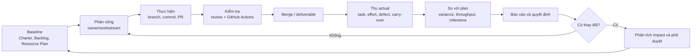
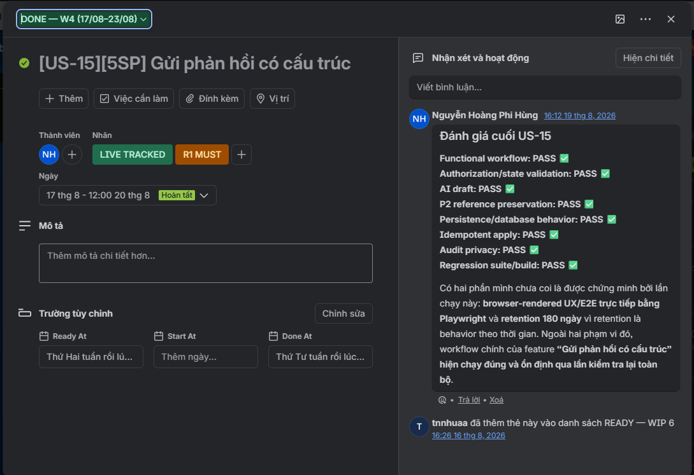
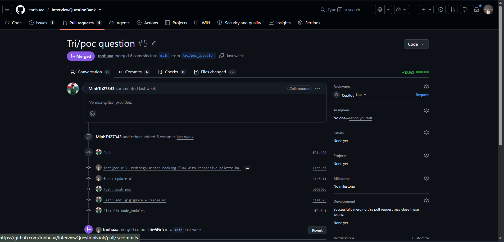
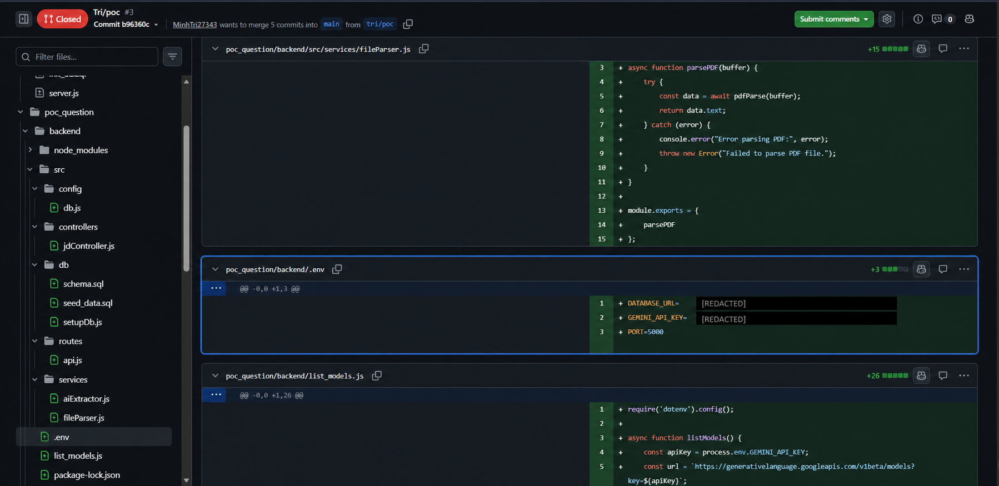
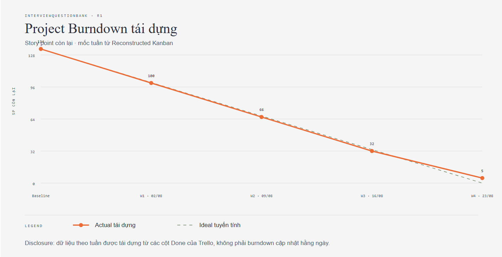

# Câu 17 — Phân công, theo dõi, kiểm soát và báo cáo dự án

## 1. Đề bài

**Câu hỏi chính:** Trình bày quá trình phân công, theo dõi, đánh giá, kiểm soát công việc và báo cáo tình trạng dự án của nhóm.

**Bản in phải nộp theo đề:**

- Giao diện hệ thống phân công/theo dõi công việc có dữ liệu thật.
- Giao diện hệ thống quản lý thời gian của từng công việc có dữ liệu thật.
- Bản cập nhật Project Plan theo dữ liệu thực tế.
- Project Burndown Chart.
- Báo cáo tình trạng toàn dự án ở tuần trước tuần thi giữa kỳ.

**Các câu hỏi thường gặp:** xử lý scope creep và effort creep; kiểm soát thay đổi; Sprint Backlog, Sprint Board, Sprint Task, Sprint/Project Burndown; xử lý sprint không có increment; xử lý velocity bất thường; Kanban Board, workflow, WIP; cập nhật lịch và dự báo thời gian/chi phí còn lại trong Waterfall.

> **Phân biệt phương pháp:** nhóm thực tế quản lý công việc bằng Kanban theo tuần, không vận hành sprint. Các thuật ngữ Sprint và velocity ở mục câu hỏi phụ chỉ dùng để trả lời lý thuyết Scrum theo yêu cầu của giảng viên.

> **Trạng thái bằng chứng:** Nhóm có Product Backlog, Trello tái dựng ngày 16/08/2026, lịch sử commit/PR, CI và Project Plan 1.0 đã cập nhật theo dữ liệu đến ngày 23/08/2026. Board ghi nhận 26/27 User Story Bắt buộc, tương đương 129/134 SP, ở trạng thái Done; actual cash cost là 0 VNĐ. Nhóm đã lập status report hồi cứu cho Splitly nhưng không có report được tạo đúng thời điểm trước giữa kỳ, timesheet theo person-hour hoặc snapshot board gốc theo từng ngày. Vì vậy, số liệu Trello phải được gọi đúng là dữ liệu tái dựng, không phải tracking thời gian thực từ 27/07.

## 2. Dàn ý viết A4 trong 10 phút

1. **Mục tiêu:** biết ai làm gì, tiến độ thật so với kế hoạch, blocker/risk nào cần xử lý và dự án còn hoàn thành đúng scope–time–cost hay không.
2. **Phân công:** Charter/Resource Plan giao ownership theo vai trò; Product Backlog xác định User Story; Trello phân rã và theo dõi task hoàn thành User Story.
3. **Theo dõi:** dùng trạng thái Trello, khoảng giao việc → Done, commit/PR và GitHub Actions. PoC được quản lý riêng, không đặt trên Trello.
4. **Đánh giá:** so baseline 27 User Story/134 SP với 26 User Story/129 SP đã Done; phân biệt elapsed time trên board với actual effort theo giờ.
5. **Kiểm soát:** phân tích change → tác động scope/effort/schedule/cost → đúng thẩm quyền phê duyệt → cập nhật backlog/plan → thực hiện và xác minh.
6. **Báo cáo:** phần trăm hoàn thành, dự báo ngày xong, effort/cost, issue, change, risk, milestone và việc tuần tới.
7. **Sự kiện thật:** nhóm pivot từ Splitly sang InterviewQuestionBank, sau đó thu hẹp từ Mentor-first/AI mock interview sang candidate-first theo JD; Tuấn Anh tái dựng Kanban ngày 16/08 và review Project Plan 1.0 ngày 23/08.

## 3. Tổng quan WHAT–WHY–WHEN

### WHAT — Theo dõi và kiểm soát là gì?

- **Theo dõi** thu thập dữ liệu thực tế: task đã xong, ngày bắt đầu/kết thúc, effort, defect, blocker, thay đổi và deliverable được chấp nhận.
- **Đánh giá** biến dữ liệu thành thông tin bằng cách so với baseline, mục tiêu delivery hoặc service-level expectation.
- **Kiểm soát** chọn hành động khắc phục/phòng ngừa và quản lý change request.
- **Báo cáo** truyền đạt trạng thái, dự báo và quyết định cần stakeholder hỗ trợ.

### WHY — Vì sao phải thực hiện?

Kế hoạch chỉ là dự báo. Nếu không thu actual và báo sớm, nhóm có thể vẫn “bận” nhưng không biết dự án đang trễ, vượt effort hay làm sai phạm vi. Theo dõi và kiểm soát giúp phát hiện chênh lệch khi còn thời gian xử lý.

### WHEN — Thực hiện khi nào?

- Cập nhật task khi trạng thái hoặc effort thay đổi.
- Nêu blocker trong ngày làm việc theo communication plan.
- Kiểm tra tiến độ ở stand-up/nhịp phối hợp ngắn.
- Review và reforecast theo nhịp đã chọn hoặc khi một change/risk vượt ngưỡng.
- Báo cáo theo milestone và trước quyết định Go/No-Go.

## 4. Sơ đồ quy trình của nhóm

Repo xác nhận luồng từ baseline đến commit/PR/CI/merge. Trello bổ sung trạng thái User Story, mốc giao việc → Done và SP còn lại; Project Plan 1.0 dùng các dữ liệu này để đối chiếu Planned–Actual. Nhóm chưa có actual effort theo giờ và status report được lập đúng thời điểm trước giữa kỳ.

> **Minh chứng hình:** Sơ đồ quy trình có thể xuất thành `img/Q17-01-monitoring-control-flow.png`. Phần nội dung đã xác định đúng công cụ; ảnh PNG đang chờ cấu hình profile của công cụ vẽ sơ đồ.

## 5. Các hoạt động nhóm đã thực hiện

### Hoạt động 1 — Lập baseline và phân ownership

- **Người kích hoạt:** Tuấn Anh với vai trò Project Manager / Team Leader / Timekeeper; Product Owner phối hợp khi thay đổi ảnh hưởng phạm vi hoặc ưu tiên.
- **Đầu vào:** Vision and Scope, Charter, backlog, capacity và architecture.
- **Các bước có bằng chứng:** xác định role → giao ownership deliverable/workstream → ghi trách nhiệm và phần kiểm tra chéo.
- **Công cụ:** Markdown, Git/GitHub và Trello.
- **Đầu ra:** ownership cho PM/estimation, governance, UI/UX, product/backlog, PoC/E2E và architecture.
- **Bằng chứng:** Project Charter, Stakeholder Analysis, Resource Plan.
- **Phân công theo tuần:** Tuấn Anh lập bảng giao việc gồm thành viên, cụm phụ trách, nội dung, file đầu ra và người cross-check. Deadline mặc định là 22:00 thứ Bảy của tuần. Bảng tuần 6 là một snapshot thực tế của cách phân công này.
- **Xác nhận nhận việc:** phân công được gửi qua Messenger; thành viên thả tim vào tin nhắn để xác nhận đã nhận. Đây là dấu hiệu tiếp nhận thông tin, không phải trạng thái In Progress, Done hoặc dữ liệu actual effort.
- **Phân công chi tiết:** Tuấn Anh tái dựng Trello ngày 16/08/2026 từ `Product_Backlog_and_Acceptance_Criteria.md`. Board dùng các cột Product Backlog, Ready — WIP 6, In Progress — WIP 6, Review — WIP 3 và Done theo W1–W4. Card thể hiện User Story, SP, người nhận và khoảng giao việc → Done.
- **Phạm vi công cụ:** Trello chỉ quản lý task để hoàn thành User Story trong backlog; PoC không nằm trên Trello.
- **Bằng chứng:** `../Q11_project-plan/img/Q11-06-reconstructed-kanban-user-stories.png`.
- **Bằng chứng phân công tuần:** `../Q16_team-management/img/Q16-03-weekly-assignment-w6.png`.
- **Bằng chứng giao tiếp:** ảnh Messenger Q11-02 đến Q11-05 cho thấy kênh trao đổi có dữ liệu thật; `../Q16_team-management/img/Q16-06-messenger-heart-ack.png` ghi nhận phản ứng tim trên tin phân công.
- **Giới hạn:** board được tái dựng, nên không chứng minh card đã được cập nhật theo thời gian thực trong các tuần trước ngày 16/08.

**Hình Q17-04 — Chi tiết một card Trello có assignee, nhãn, mốc thời gian và kết quả kiểm tra.**

### Hoạt động 2 — Thực hiện và theo dõi thay đổi trong repository

- **Người kích hoạt:** thành viên nhận workstream.
- **Đầu vào:** task/requirement và source code hoặc tài liệu hiện có.
- **Các bước có bằng chứng:** thành viên tự kiểm tra acceptance criteria → sửa trên branch → commit → tạo PR → Tuấn Anh review và feedback → ít nhất một người approve → Tuấn Anh merge vào `main` và xác nhận Done.
- **Công cụ:** Git và GitHub.
- **Đầu ra:** lịch sử thay đổi có author, ngày, commit message và file diff.
- **Bằng chứng:** nhiều PR được đánh số trong khoảng `#1–#13`; commit history 13–20/08/2026; shortlog ghi nhận sáu thành viên.
- **Giới hạn:** số commit không phải phần trăm hoàn thành, effort hay năng suất.

Ví dụ, PR `#13 — Fix/save-location-JD-Dashboard-FeedBack` liên kết các User Story US-16, US-03, US-29 và US-06. PR được tạo ngày 19/08, gồm 3 commit, thay đổi 11 file và được Tuấn Anh merge ngày 20/08. PR này chứng minh traceability từ công việc đến thay đổi mã nguồn; PR không có review comment nên không được dùng để khẳng định đã có formal code review.

**Hình Q17-05 — Pull request đã được merge vào `main`.**

### Hoạt động 3 — Kiểm tra chất lượng tự động

- **Hệ thống kích hoạt:** push hoặc pull request.
- **Đầu vào:** mã nguồn, dependency lockfile, OpenAPI contract, migration và seed.
- **Các bước:** checkout → `npm ci` → lint → typecheck → OpenAPI drift → migration replay → seed verification → build; job riêng chạy Gitleaks.
- **Công cụ:** GitHub Actions tại `.github/workflows/ci.yml`.
- **Đầu ra:** trạng thái pass/fail của quality gate.
- **Điều kiện thành công:** tất cả step hoàn thành trong giới hạn pipeline.
- **Giới hạn:** workflow hiện không chạy automated test suite; tài liệu Manual Validation ghi automated-test implementation nằm ngoài R1 hiện tại.
- **Bằng chứng thực thi:** GitHub Actions run `#51`, run ID `32390206781`, chạy trên `main` ngày 20/08/2026 và kết thúc thành công. URL: <https://github.com/tnnhuaa/InterviewQuestionBank/actions/runs/32390206781>.
- **Sự cố được phát hiện trong quá trình review/CI:** Tuấn Anh thấy `.env` do Trí đưa lên repository có key. Cùng lần đưa mã đó, `node_modules` cũng bị commit, làm repository nặng và tạo diff rất lớn. Hai tác động phải tách riêng: credential trong `.env` tạo rủi ro bảo mật; `.gitignore` và việc loại dependency xử lý `node_modules`.
- **Hành động kiểm soát:** commit `df3d6c1` ngày 16/08 loại `.env` và `node_modules`; commit `0556a6e` ngày 18/08 bổ sung environment files của PoC/backend vào `.gitignore`. Nhóm đã revoke credential cũ và tạo key mới vì xóa file ở commit sau không xóa secret khỏi lịch sử Git.

**Hình Q17-02 — PR #3 cho thấy `.env` và `node_modules` trước khi khắc phục; credential đã được che.**

**Hình Q17-03 — Job `secret-scan` thất bại trong GitHub Actions.**

Ảnh xác nhận workflow có job `secret-scan` và job kết thúc thất bại. Annotation hiển thị lỗi thiếu `GITHUB_TOKEN` để scan pull request; do đó, ảnh không chứng minh Gitleaks đã phát hiện credential trong `.env`. Chuỗi commit `f91a498` → `df3d6c1` → `0556a6e` và ảnh PR #3 là bằng chứng trực tiếp cho sự cố và cách khắc phục. Ảnh Q17-06 ghi nhận CI và `secret-scan` thành công sau khi sửa cấu hình.

**Hình Q17-06 — CI và `secret-scan` thành công sau khi sửa cấu hình.**

### Hoạt động 4 — Xử lý vấn đề tích hợp và thay đổi

- **Đầu vào:** lỗi, conflict hoặc phạm vi/tài liệu không còn nhất quán.
- **Sự kiện có bằng chứng:**
  - Nhiều commit `align`, `reconcile`, `update` đồng bộ Charter, backlog và architecture theo hướng JD-first.
  - Commit `f91a498` ngày 14/08 đưa `.env` và `node_modules` vào repository; commit `df3d6c1` ngày 16/08 của Trí loại bỏ chúng; commit `0556a6e` ngày 18/08 của Tuấn Anh củng cố `.gitignore` cho environment files.
  - Commit `7b51d07` ngày 19/08 sửa lỗi practice-progress 500 và duplicate-content 409.
  - Các merge commit ngày 18–20/08 hợp nhất nhánh tính năng và `main`.
- **Đầu ra:** tài liệu/mã nguồn được cập nhật và lỗi cụ thể được sửa.
- **Change thực tế:** sau khi ý tưởng Splitly bị đánh giá chưa đủ mạnh, nhóm brainstorm đến 09/08 rồi chuyển sang InterviewQuestionBank. Ngày 14/08, giảng viên thực hành góp ý nên tập trung vào pain point của ứng viên trong thời gian còn lại. Nhóm chốt candidate-first: nhập JD, OCR/extraction, người dùng sửa văn bản, phân tích requirement, chuẩn hóa kỹ năng, ánh xạ Question Bank và lập preparation plan. Luồng Mentor đã có được giữ riêng để tích hợp, còn AI interviewer, video tích hợp, payment, mobile native và ATS không thuộc MVP.
- **Tác động:** nhóm làm lại Initiation và Planning, tiếp tục execution thực tế từ 10/08 đến 23/08. Lịch bốn tuần 27/07–23/08 là giả định tái dựng từ kinh nghiệm Splitly, không phải actual execution của InterviewQuestionBank.
- **Phê duyệt và xác minh:** hai giảng viên đánh giá hướng ý tưởng qua trao đổi trực tiếp; nhóm xác nhận ý tưởng trên chat ngày 13/08 và cập nhật phạm vi sau góp ý ngày 14/08. Đây là đồng thuận về hướng sản phẩm, không phải change request hoặc phê duyệt chính thức toàn bộ baseline.
- **Bằng chứng:** năm ảnh thay đổi phạm vi tại `../Q11_project-plan/img/Q11-01...Q11-05...` và Project Plan 1.0.
- **Giới hạn:** nhóm không có estimate riêng trước/sau change để tính effort variance của thay đổi này.

### Hoạt động 5 — Thu actual, reforecast và báo cáo

Resource Plan yêu cầu theo dõi actual effort nếu có, blocker, WIP, cycle time và throughput theo tuần; Cost–Time–Resources yêu cầu theo dõi cash, actual effort, forecast-to-complete và variance. Nhóm hiện theo dõi được completion theo User Story/SP và actual cash, nhưng không có timesheet để tính person-hour.

#### Planned–Actual đến ngày 23/08/2026

| Chỉ tiêu                        |                                Baseline/kế hoạch |              Dữ liệu ghi nhận | Kết luận                                            |
| ------------------------------- | -----------------------------------------------: | ----------------------------: | --------------------------------------------------- |
| Phạm vi R1 Bắt buộc             |                           27 User Story / 134 SP |   26 User Story / 129 SP Done | Còn US-20, 5 SP; hoàn thành khoảng 96,3%            |
| Cửa sổ học phần                 |                              29/06–23/08, 8 tuần |           Kết thúc ngày 23/08 | Giữ nguyên mốc kết thúc học phần                    |
| Execution InterviewQuestionBank |                        Lịch tái dựng 27/07–23/08 | Thực hiện thực tế 10/08–23/08 | Hai tuần thực hiện thật; bốn tuần là reconstruction |
| Effort                          | Khoảng 653 giờ capacity; 606/650 giờ estimate cũ |            Không có timesheet | Không tính effort variance hoặc EAC theo giờ        |
| Cash                            |                               Trần 1.125.000 VNĐ |                         0 VNĐ | Không phát sinh chi phí do dùng free tier           |

#### Completion và Project Burndown tái dựng từ Trello

| Mốc              | User Story Done trong kỳ | SP Done trong kỳ | SP còn lại |
| ---------------- | -----------------------: | ---------------: | ---------: |
| Bắt đầu baseline |                        0 |                0 |        134 |
| Cuối W1 — 02/08  |                        7 |               34 |        100 |
| Cuối W2 — 09/08  |                        6 |               34 |         66 |
| Cuối W3 — 16/08  |                        8 |               34 |         32 |
| Cuối W4 — 23/08  |                        5 |               27 |          5 |

Đường actual của Project Burndown dùng chuỗi **134 → 100 → 66 → 32 → 5 SP còn lại**. Đây là burndown tái dựng theo bốn cột Done của Trello, không phải burndown được nhóm cập nhật hằng ngày. US-09 kéo dài đến 16/08 và US-04 được đánh dấu xong ngày 11/08, nhưng bảng giữ mốc tuần để nhất quán với cấu trúc board.

**Hình Q17-07 — Project Burndown tái dựng theo tuần.**

Project Plan đã được hợp nhất và cập nhật trong `../Q11_project-plan/Project_Plan_Report.md`. Tuấn Anh review phiên bản 1.0 ngày 23/08 bằng cách đối chiếu Proposal, Charter, backlog, Resource Plan, các tài liệu planning đơn lẻ, Git và Reconstructed Kanban.

Nhóm không lập status report trong tuần 13/07–19/07. Tài liệu `Splitly_Pre_Midterm_Status_Report_Retrospective.md` tái dựng trạng thái từ bộ docs Splitly trước giữa kỳ và công khai giới hạn dữ liệu. Báo cáo đánh giá trạng thái **At Risk**: baseline tài liệu đã hình thành, nhưng business value, adoption và sustainability chưa được kiểm chứng; baseline mười tuần trong tài liệu Splitly cũng không khớp cửa sổ học phần tám tuần. Sau phản biện trực tiếp tại buổi giữa kỳ, nhóm quay lại ideation, chốt InterviewQuestionBank rồi làm lại Initiation và Planning.

## 6. Liên kết giữa các hoạt động

Backlog và baseline cung cấp công việc dự kiến. Task assignment biến công việc thành trách nhiệm cá nhân. Commit/PR và CI tạo bằng chứng kỹ thuật về thay đổi và chất lượng. Trello cho biết trạng thái completion và elapsed time của card; timesheet mới cho biết actual effort. Nhóm so completion/cash với baseline trong Project Plan 1.0; nếu variance vượt tolerance, change request phải cập nhật backlog, estimate và Project Plan.

Git chỉ bao phủ một phần chuỗi này. Không được lấy số commit thay cho story point hoàn thành hoặc thời gian làm việc.

## 7. Đánh giá và cải tiến

### Điểm đã làm được

- Vai trò và phạm vi được ghi thành baseline có version.
- Git history truy được tác giả, thời điểm và nội dung thay đổi.
- PR/merge hỗ trợ tích hợp workstream của nhiều thành viên.
- CI tự động kiểm tra lint, type, contract, migration, seed, build và secret.
- Trello có WIP limit và ghi nhận 26/27 User Story Bắt buộc ở trạng thái Done.
- Project Plan 1.0 phân biệt baseline, actual và dữ liệu tái dựng; actual cash là 0 VNĐ.

### Khoảng trống quản lý

- Trello là nguồn trạng thái task/User Story nhưng được tái dựng, chưa phải tracking gốc theo thời gian thực.
- Chưa có actual effort theo person-hour.
- DoD thực tế đã được xác nhận: owner tự kiểm tra acceptance criteria; Tuấn Anh review, feedback, merge và xác nhận Done. Nhóm chưa có log approval đầy đủ cho mọi PR để kiểm chứng mức tuân thủ.
- Chỉ có Project Burndown tái dựng theo tuần; chưa có snapshot Kanban hằng ngày, throughput history hoặc cycle-time history đáng tin cậy.
- Status report Splitly chỉ được lập hồi cứu; nhóm chưa có report được tạo đúng thời điểm hoặc change log theo mẫu giảng viên.
- Chưa có bằng chứng review/reforecast theo tuần được lưu đúng thời điểm.

### Cải tiến đề xuất

1. Chọn một board duy nhất; mỗi task có purpose, output, assignee, due date, estimate, actual và trạng thái.
2. Liên kết task với PR/commit và acceptance criteria.
3. Chỉ tính story point khi story đạt Definition of Done và được PO chấp nhận.
4. Chụp snapshot Kanban cuối mỗi ngày hoặc tuần để dựng burndown từ dữ liệu thật.
5. Tạo status report ngắn từ board, burndown, issue/change/risk log; không đếm commit như productivity.

Quy ước hiện có: Trello quản lý task hoàn thành User Story; Ready và In Progress có WIP 6, Review có WIP 3; card Done được gom theo W1 27/07–02/08, W2 03/08–09/08, W3 10/08–16/08 và W4 17/08–23/08. Khoảng ngày trên card được đọc là thời gian từ lúc giao/nhận việc đến lúc đánh dấu Done, không phải số giờ làm. Owner tự kiểm tra acceptance criteria trước khi tạo PR; Tuấn Anh review, feedback, merge và xác nhận Done.

## 8. Câu hỏi lý thuyết và câu hỏi phụ

### 8.1 Scope creep và effort creep

**Scope creep** là phạm vi tăng không qua kiểm soát. Cách xử lý: ghi change request, làm rõ lợi ích, phân tích ảnh hưởng đến requirement/WBS/effort/cost/schedule, xin đúng người phê duyệt rồi cập nhật baseline. Nếu không đủ capacity, đổi scope hoặc deadline; không âm thầm nhận thêm việc.

**Effort creep** xảy ra khi công việc tốn nhiều effort hơn dự kiến dù scope có thể không đổi. Nguyên nhân thường là underestimate, over-engineering, requirement ngầm, ranh giới mơ hồ hoặc thiếu kỹ năng. Nhóm cần thu actual, làm rõ solution trước khi code, chia task nhỏ, dùng reserve đúng mục đích, hỗ trợ kỹ năng và reforecast sớm.

### 8.2 Làm sao tránh thay đổi bất ngờ?

1. Duy trì một nguồn backlog/change log dùng chung.
2. Báo blocker và request ngay khi phát hiện.
3. Phân tích impact trước khi cam kết.
4. Review risk/change định kỳ; cập nhật forecast và stakeholder.
5. Ghi quyết định, owner, deadline và tiêu chí xác minh.

### 8.3 Các artifact của Scrum

- **Sprint Backlog:** Sprint Goal, các Product Backlog Item được chọn và kế hoạch thực hiện của Development Team.
- **Sprint Board:** cách trực quan hóa công việc trong sprint theo workflow, ví dụ To do → In progress → Review → Done.
- **Sprint Task:** đơn vị kỹ thuật nhỏ để hoàn thành một story; có đầu ra, assignee và estimate/actual nếu nhóm theo dõi thời gian.
- **Sprint Burndown:** công việc còn lại trong một sprint theo thời gian.
- **Project/Release Burndown:** tổng công việc còn lại của release/dự án qua nhiều sprint; phải phản ánh story thêm/bớt.

### 8.4 Sprint kết thúc nhưng không có increment

Không kéo dài deadline sprint để che vấn đề. Nhóm kiểm tra vì sao story không đạt Done, trả phần chưa hoàn thành về backlog, re-estimate nếu cần, bảo vệ chất lượng và chọn phạm vi thực tế hơn cho sprint sau. Retrospective phải tạo action item cụ thể. Chỉ tính velocity cho phần thực sự Done và được chấp nhận.

### 8.5 Kết quả sprint chênh lệch bất thường

Kiểm tra thay đổi capacity, story size, blocker, dependency, defect/rework và cách áp dụng Definition of Done. Không dùng một sprint đơn lẻ để cam kết velocity; dùng khoảng velocity sau nhiều sprint và reforecast. Không so velocity giữa các nhóm.

### 8.6 Kanban Board, workflow và WIP

- **Kanban Board:** trực quan hóa các work item theo trạng thái.
- **Development Workflow:** chuỗi trạng thái mà công việc đi qua, kèm điều kiện vào/ra.
- **WIP limit:** giới hạn số item đang làm ở một trạng thái để giảm đa nhiệm, lộ bottleneck và thúc đẩy hoàn thành trước khi bắt đầu thêm.

### 8.7 Theo dõi kiểu Waterfall và EVM

Trong Waterfall, nhóm cập nhật phần trăm hoàn thành, ngày bắt đầu/kết thúc, actual effort/cost và phần việc còn lại trên schedule. Có thể dùng Earned Value:

- `SV = EV − PV`: âm là trễ so với kế hoạch.
- `SPI = EV / PV`: nhỏ hơn 1 là hiệu suất lịch thấp.
- `CV = EV − AC`: âm là vượt chi phí.
- `CPI = EV / AC`: nhỏ hơn 1 là dùng chi phí kém hiệu quả.
- `EAC = BAC / CPI`: dự báo tổng chi phí nếu xu hướng tiếp tục.

Chỉ dùng EVM khi nhóm có baseline và actual đáng tin cậy. Dự án không có actual effort và giá trị lao động thực chi; actual cash bằng 0 làm CPI/EAC theo tiền không có ý nghĩa quản trị trong trường hợp này. Vì vậy, nhóm dùng SP Done/remaining SP và mốc thời gian, không bịa chỉ số EVM.

### 8.8 Nội dung status report

Một báo cáo ngắn cần có: tên dự án, kỳ báo cáo, start/finish, effort/cost baseline, phần trăm hoàn thành, remaining effort, schedule/cost variance, issue và cách xử lý, change và tác động, risk quan trọng, milestone tiếp theo và hoạt động tuần tới. Với Scrum, phần trăm có thể tính bằng SP Done/total SP trong scope hiện hành, không tính phần dở dang.

## 9. Bản in phải nộp

- [x] Task board có assignee, trạng thái, SP và khoảng giao việc → Done; có disclosure đây là board tái dựng ngày 16/08.
- [x] Giao diện thời gian trên card Trello; chỉ chứng minh elapsed time, không phải actual effort theo giờ.
- [x] Project Plan 1.0 đã cập nhật completion, actual cash và giới hạn dữ liệu actual.
- [x] Bảng dữ liệu Project Burndown tái dựng theo tuần.
- [x] Ảnh Project Burndown tái dựng để in; chưa có snapshot Kanban hoặc burndown theo ngày.
- [x] Status report hồi cứu cho tuần trước giữa kỳ; không có report được lập đúng thời điểm.
- [x] Ảnh một PR đã merge, một CI thất bại và một CI thành công.
- [x] Change Splitly → InterviewQuestionBank → candidate-first có phạm vi, tác động và bằng chứng chat; không có formal Change Request.

> **Khoảng trống phải công khai:** nhóm không có timesheet, snapshot Trello gốc theo ngày, burndown hằng ngày hoặc status report được lập đúng thời điểm trước giữa kỳ. Bản báo cáo in Q17 chỉ được lập sau khi bản học hoàn tất.

## 10. Nguồn tham khảo và bằng chứng

- `docs/Project_Governance & Stakeholder/Project_Charter.md`
- `docs/Project_Governance & Stakeholder/Stakeholder_Analysis.md`
- `docs/Project_Resource_Plan/ResourcePlan.md`
- `docs/Project_Resource_Plan/Cost_Time_Resources.md`
- `docs/Project_Vision_and_Scope/Product_Backlog_and_Acceptance_Criteria.md`
- `docs/Oral_Exam/Q11_project-plan/Project_Plan_Report.md`
- `docs/Oral_Exam/Q11_project-plan/img/Q11-06-reconstructed-kanban-user-stories.png`
- `docs/Oral_Exam/Q17_monitoring-and-control/Splitly_Pre_Midterm_Status_Report_Retrospective.md`
- `F:/Obsidian/Uni/QLDUPM/Spiltly/docs/` — bộ tài liệu Splitly dùng để tái dựng trạng thái trước giữa kỳ
- `docs/refs/09-software-project-monitoring-and-control.md`
- `docs/refs/09-1-agile-project-monitoring-and-control.md`
- `docs/refs/08-software-team-management.md`
- `.github/workflows/ci.yml` và Git history 13–20/08/2026
