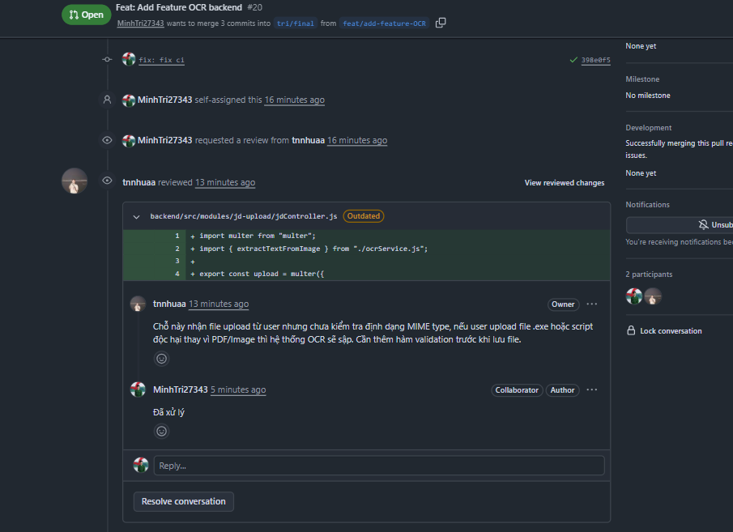
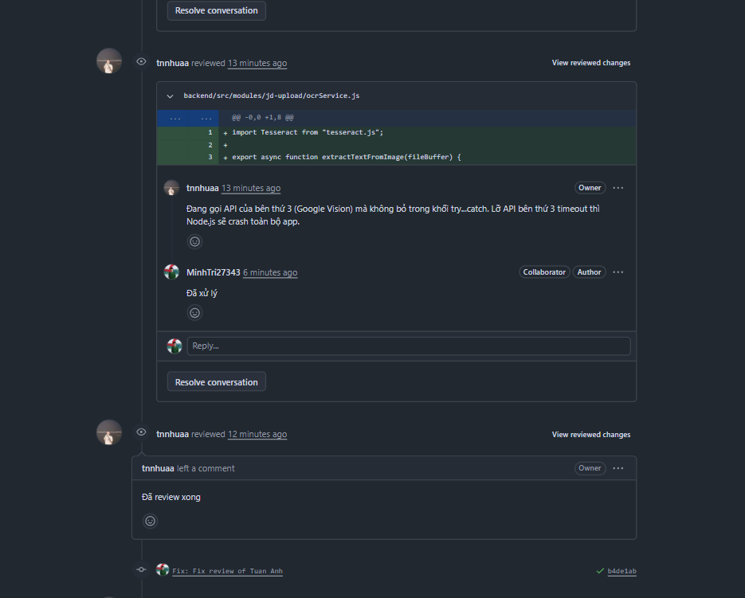
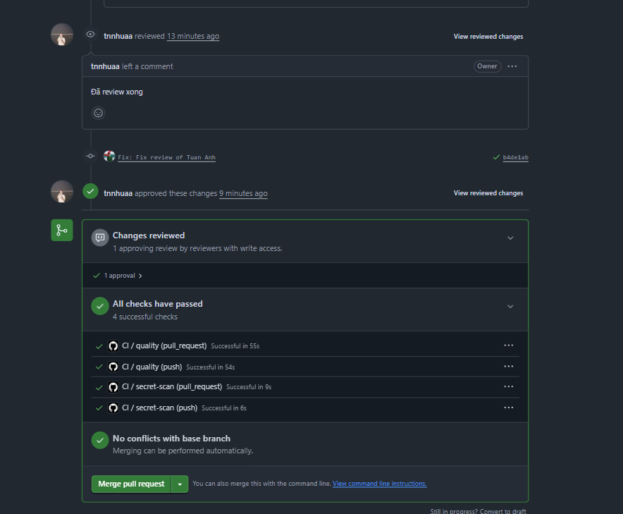

# BIÊN BẢN THANH TRA MÃ NGUỒN 
**Dự án:** Hệ thống Luyện thi Phỏng vấn
**Hình thức:** Bình luận đánh giá trực tiếp trên Github Pull Request

**Pull Request #25:** Thêm chức năng Upload và OCR Job Description (JD)
**Người Code (Assignee):** Minh Trí
**Người Review (Reviewer):** Tuấn Anh

## Chi tiết các lỗi phát hiện trong quá trình Review:

**1. Lỗi bảo mật / Xử lý file (File: `jdController.js - Dòng 42`)**
- *Tuấn Anh (Reviewer):* Chỗ này nhận file upload từ user nhưng chưa kiểm tra định dạng MIME type, nếu user upload file `.exe` hoặc script độc hại thay vì PDF/Image thì hệ thống OCR sẽ sập. Cần thêm hàm validation trước khi lưu file.
- *Minh Trí (Assignee):* Đã ghi nhận. Sẽ thêm middleware `multer` filter file theo `.pdf, .png, .jpg`.

**2. Lỗi hiệu năng (File: `ocrService.js - Dòng 80`)**
- *Tuấn Anh (Reviewer):* Đang gọi API của bên thứ 3 (Google Vision) mà không bỏ trong khối `try...catch`. Lỡ API bên thứ 3 timeout thì Node.js sẽ crash toàn bộ app.
- *Minh Trú (Assignee):* Đúng rồi, quên mất. Đã bổ sung `try...catch` và xử lý trả về mã lỗi 500 cho FE. (Đã commit sửa lỗi `fix: add error handling for OCR API`).

**=> Kết luận:** Pull Request bị **Request Changes** lần 1. Sau khi Tuấn Anh fix xong 2 lỗi trên, Reviewer mới nhấn **Approve** và cho Merge code vào nhánh chính.

