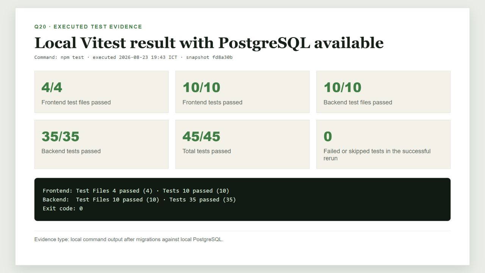
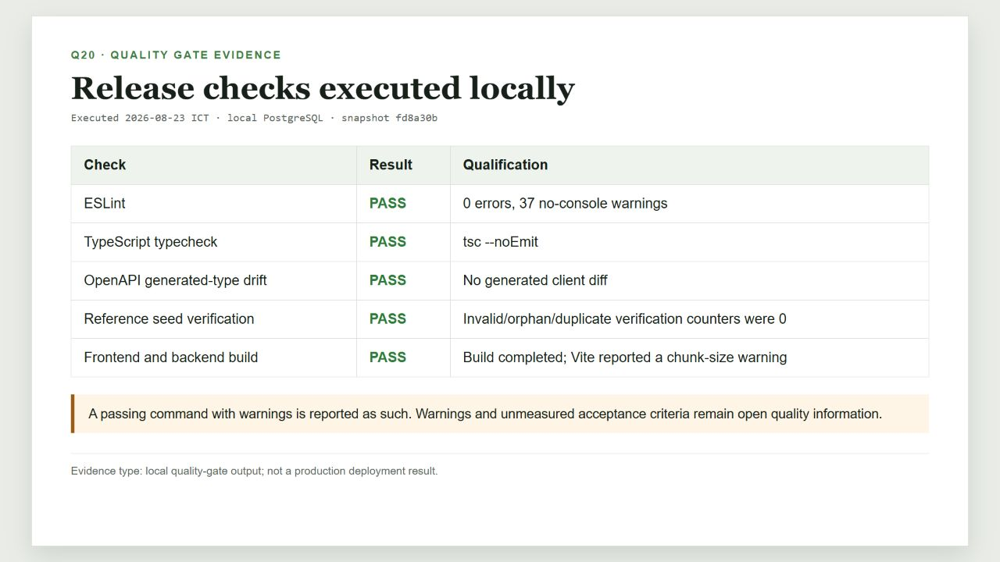
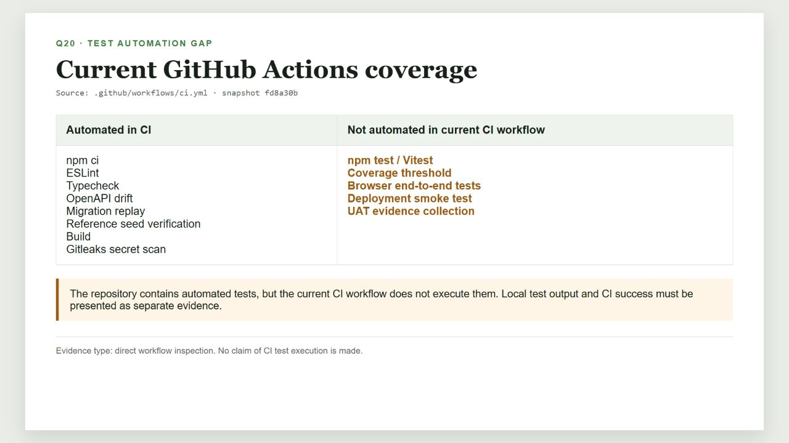
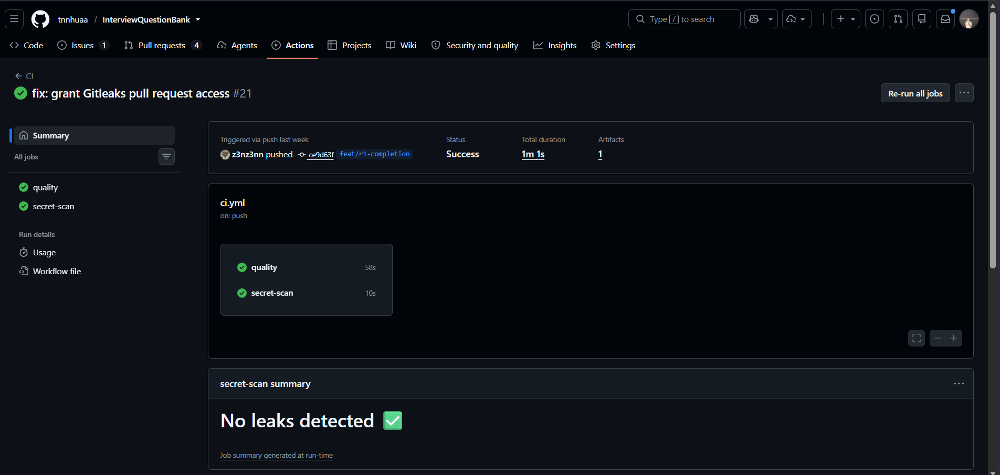

# Câu 20 - Kế hoạch kiểm thử

## 1. Mục tiêu câu hỏi

Kế hoạch kiểm thử mô tả sẽ kiểm thử cái gì, bằng phương pháp nào, ở môi trường nào, ai chịu trách nhiệm, điều kiện bắt đầu/kết thúc, cách xử lý lỗi và minh chứng cần lưu. Kế hoạch khác với kết quả kiểm thử: kế hoạch là dự định có kiểm soát; lần chạy kiểm thử là bằng chứng tại một commit và môi trường cụ thể.

## 2. Câu trả lời theo WHAT - HOW - WHY - WHEN - EVIDENCE

### WHAT - Phạm vi kiểm thử

- Xác thực, phiên đăng nhập và phân quyền.
- Question Bank, practice progress và moderation.
- JD upload/paste, trích xuất trực tiếp/OCR, sửa văn bản, phân tích, đối sánh và Preparation Plan.
- Mentor onboarding, verification, expertise và availability.
- Đặt lịch, xung đột khung giờ, đổi/hủy lịch, liên kết họp và phục hồi.
- Phản hồi, đánh giá Mentor, thông báo, vận hành và audit.
- Migration, seed, hợp đồng OpenAPI, build và bảo vệ thông tin bí mật.
- Gemini ở chế độ bật, tắt, lỗi nhà cung cấp và cơ chế dự phòng theo quy tắc.

### HOW - Các lớp kiểm thử

| Lớp | Mục tiêu | Minh chứng hiện có |
|---|---|---|
| Kiểm thử đơn vị (unit test) | Kiểm tra hàm/chính sách độc lập | Bộ đối sánh, kiểm tra booking, chống xử lý trùng, thử lại, môi trường và chính sách booking/đổi lịch phía giao diện |
| Kiểm thử tích hợp (integration test) | Kiểm tra mô-đun/API/cơ sở dữ liệu | Mentor, kiểm thử hồi quy câu hỏi với PostgreSQL, trạng thái và xử lý lỗi |
| Hợp đồng/cổng chất lượng | Kiểm tra tính nhất quán hệ thống | Độ lệch OpenAPI, chạy lặp migration, xác minh seed, lint, kiểm tra kiểu và build |
| Kiểm thử thủ công đầu-cuối | Kiểm tra luồng người dùng và phục hồi | Các bước đi qua ba vai trò trong Manual Validation guide |
| UAT | Product Owner và người dùng đại diện xác nhận AC | Có kế hoạch/điều kiện; repository chưa có bộ minh chứng UAT đầy đủ cho mọi câu chuyện |

### WHY - Vì sao cần nhiều lớp?

- Kiểm thử đơn vị phát hiện lỗi logic nhanh nhưng không chứng minh cơ sở dữ liệu/API hoạt động cùng nhau.
- Kiểm thử tích hợp phát hiện lỗi hợp đồng, giao dịch và dữ liệu.
- Kiểm thử đầu-cuối xác nhận hành trình và thông báo lỗi từ góc nhìn người dùng.
- UAT xác nhận giá trị nghiệp vụ và tiêu chí chấp nhận.
- Cổng chất lượng ngăn lỗi kiểu dữ liệu, migration, seed, build và thông tin bí mật đi tiếp.

### WHEN - Khi nào chạy?

- Kiểm thử đơn vị/tích hợp: trước khi tạo Pull Request và khi sửa lỗi liên quan.
- CI quality gates: mỗi push và Pull Request.
- Migration/seed replay: trong CI và trước release candidate.
- Đi qua luồng thủ công: sau khi API, tiến trình nền, frontend và dữ liệu demo sẵn sàng.
- UAT: trên release candidate đã vượt quality gates và không còn lỗi Critical/High.
- Regression: sau bug fix, thay đổi contract/schema hoặc trước phát hành.

### EVIDENCE - Minh chứng cần lưu

- commit SHA, ngày giờ, môi trường và người chạy;
- lệnh và kết quả đạt/không đạt;
- ảnh chụp đã loại thông tin bí mật/dữ liệu riêng;
- correlation ID an toàn;
- trạng thái database, audit, job và outbox liên quan;
- defect, severity, owner, cách tái hiện và quyết định cuối;
- Product Owner/UAT decision khi áp dụng.

## 3. Môi trường và dữ liệu

| Môi trường | Mục đích | Dữ liệu |
|---|---|---|
| Local | Kiểm thử đơn vị, tích hợp và thủ công | PostgreSQL + Mailpit; seed reference/demo |
| CI | Quality gates tái lập | PostgreSQL 17 service; reference seed |
| Demo trực tuyến | Kiểm tra nhanh giao diện/API | Cấu hình Supabase/Render; tiến trình nền hiện chưa triển khai |

Không dùng demo/load seed trên production. Không đưa mật khẩu, token, JD gốc, liên kết họp hoặc minh chứng xác minh Mentor vào ảnh chụp/nhật ký kiểm thử.

## 4. Ma trận kiểm thử ưu tiên

| Nhóm | Luồng chính | Negative/boundary quan trọng |
|---|---|---|
| Identity | đăng ký, verify, login/logout/reset | sai quyền trả 404, session cũ, rate limit, password bị xóa khỏi form |
| JD | dán/tải tệp -> trích xuất -> xác nhận -> phân tích -> đối sánh -> kế hoạch | tệp rỗng/hỏng/mã hóa/quá giới hạn, OCR rỗng, nhà cung cấp lỗi, thử lại không tạo JD trùng |
| Mentor | onboarding -> approval -> availability | chưa approved, slot quá khứ/chồng lấn, expertise không khớp |
| Booking | chọn context/mentor/slot -> confirm/reschedule/cancel | context sai chủ, version conflict, double submit, hai request cùng slot chỉ một winner |
| Buổi luyện tập | liên kết họp -> báo lỗi -> thay link/đổi lịch | ngoài thời gian, người ngoài, link thiếu/hỏng, phục hồi quá 15 phút |
| Phản hồi/đánh giá | hoàn thành -> phản hồi -> áp dụng hành động -> đánh giá | phản hồi/hành động trùng, tranh chấp, đánh giá chưa đủ điều kiện công khai |
| Operations | failed job/case -> impact -> action -> audit | action không thuộc allowlist, version lỗi, thiếu reason, idempotency |
| Gemini | phân tích/giải thích/bản nháp | tắt tính năng, hết thời gian, giới hạn tần suất, JSON/tham chiếu sai, cơ chế dự phòng và xác nhận của con người |

## 5. Điều kiện vào và điều kiện thoát

### Điều kiện vào

- commit cần kiểm thử đã được xác định;
- thư viện phụ thuộc, PostgreSQL và migration sẵn sàng;
- môi trường không dùng thông tin bí mật thật trong báo cáo;
- dữ liệu reference/demo phù hợp;
- acceptance criteria và expected result đủ rõ.

### Điều kiện thoát đề xuất

- kiểm thử đơn vị/tích hợp liên quan đạt;
- lint/kiểm tra kiểu/OpenAPI/migration/seed/build đạt với cảnh báo được ghi nhận;
- walkthrough bắt buộc đạt;
- không còn lỗi Critical/High;
- AC có minh chứng và Product Owner chấp nhận khi thuộc UAT;
- vấn đề môi trường/nhà cung cấp có hướng phục hồi rõ ràng.

Các điều kiện thoát là release gate đề xuất; chỉ được gọi là đạt khi có bằng chứng tương ứng.

## 6. Kết quả chạy thực tế ngày 23/08/2026

Lần chạy đầu tiên không có PostgreSQL local:

- frontend đạt 10/10;
- backend có 32 test đạt, 3 test database bị bỏ qua rồi suite lỗi khi cleanup;
- nguyên nhân là `ECONNREFUSED` tại cổng 5432.

Sau khi khởi động PostgreSQL, dùng `DATABASE_URL` cục bộ, chạy migration và kiểm thử lại:

- frontend: 4/4 test file, 10/10 test đạt;
- backend: 10/10 test file, 35/35 test đạt;
- tổng cộng: 45/45 test đạt, exit code 0.

Kết quả quality gates cùng môi trường:

- lint: đạt với 0 lỗi và 37 cảnh báo `no-console`;
- typecheck: đạt;
- OpenAPI generated-type drift: đạt;
- reference seed verification: đạt, các bộ đếm invalid/orphan/duplicate liên quan bằng 0;
- frontend/backend build: đạt; Vite cảnh báo chunk lớn hơn 500 kB.

## 7. Khoảng trống kiểm thử hiện tại

- `.github/workflows/ci.yml` chưa chạy `npm test`.
- Chưa cấu hình ngưỡng độ bao phủ mã nguồn.
- Chưa có browser E2E automation trong repository.
- Chưa có bộ minh chứng UAT đầy đủ cho toàn bộ 27 câu chuyện Must.
- Tiến trình nền chưa triển khai nên không thể coi OCR/hộp thư chờ/nhắc lịch/dọn dữ liệu là đã được kiểm tra nhanh đầy đủ trên môi trường trực tuyến.
- Lint và build còn cảnh báo; không được trình bày là đạt hoàn toàn không cảnh báo.

## 8. Minh chứng hình ảnh

**Hình Q20-01 - Kết quả Vitest 45/45 sau khi PostgreSQL sẵn sàng.**

**Hình Q20-02 - Kết quả các cổng chất lượng chạy cục bộ.**

**Hình Q20-03 - Khoảng trống giữa test có trong repository và test chạy trong CI.**

**Hình Q20-04 - CI quality và quét thông tin bí mật thành công.**

Ảnh Q20-04 chỉ chứng minh hai job CI hiển thị thành công; không chứng minh Vitest chạy trong CI.

## 9. Tài liệu in kèm

- [Q20 Print Report - English](Q20_Test_Plan_Report_EN.md).
- [Manual Validation and Operations](../../Implementation/Manual_Validation_and_Operations.md).
- [GitHub Actions CI](../../../.github/workflows/ci.yml).

## 10. Checklist tự học

- [ ] Phân biệt Kế hoạch kiểm thử, trường hợp kiểm thử, lần chạy kiểm thử và minh chứng UAT.
- [ ] Nêu được các lớp kiểm thử đơn vị, tích hợp, hợp đồng/cổng chất lượng, đầu-cuối thủ công và UAT.
- [ ] Nhớ kết quả 10 frontend + 35 backend = 45 test đạt.
- [ ] Nêu đúng lint có 37 cảnh báo và build có chunk warning.
- [ ] Nêu rõ CI chưa chạy `npm test`, chưa có đo độ bao phủ và kiểm thử đầu-cuối tự động.
- [ ] Giải thích lần chạy đầu thất bại do môi trường và cách khắc phục.
