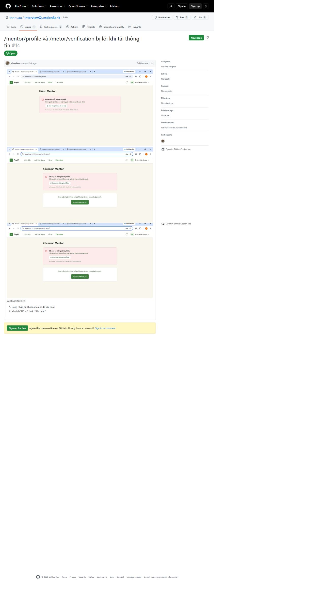

# Software Test Plan

## Document control

| Field | Value |
| --- | --- |
| Project | PrepVI — Interview Practice Platform |
| Version | 1.0 |
| Reporting date | 23 August 2026 |
| Status | Current test plan; execution evidence is reported separately in Sections 7 and 8 |
| Test environments | Local Node.js workspaces, local PostgreSQL and hosted frontend/API checks |

## 1. Purpose

This Test Plan defines the scope, test levels, environments, entry and exit criteria, evidence requirements and defect handling used to evaluate PrepVI. It distinguishes the plan from an individual test run and distinguishes automated technical checks from User Acceptance Testing.

## 2. Test objectives

The plan aims to verify that:

- required user journeys behave according to Acceptance Criteria;
- private data and role/object authorization are enforced;
- booking, idempotency and version-conflict rules preserve consistency;
- extraction, AI assistance and provider failures have safe fallback or recovery;
- database migrations, reference seeds and API types remain consistent; and
- defects and release limitations are visible rather than hidden by generic success claims.

## 3. Plan formation and evaluation

The plan was derived from the R1 Must backlog and Acceptance Criteria, Business Rules, quality requirements, architecture and API/database contracts, risk-critical flows, provider dependencies and release constraints. The team selected test levels, environments, data, entry/exit criteria, defect severity and evidence requirements according to business/security risk.

The plan is evaluated through:

- requirement/risk-to-scenario coverage rather than raw test count;
- traceability from commit and environment to expected/actual result, defect and acceptance decision;
- repeatability of setup, migration, seed and command instructions;
- priority for authorization, privacy, concurrency, provider failure and recovery;
- independent technical and business review; and
- exit criteria that block release for missing required evidence or unresolved Critical/High defects.

The retained 45-test run demonstrates that a subset of automated suites executed successfully in one local environment. It does not demonstrate code coverage, full Acceptance-Criteria coverage or User Acceptance Testing.

## 4. Scope

The test scope covers:

- registration, login, session changes and authorization;
- Question Bank, moderation, bookmarks and practice progress;
- JD upload/paste, extraction/OCR, correction, analysis, matching and preparation plans;
- Mentor verification, expertise, availability and discovery;
- booking creation, concurrency, rescheduling, cancellation and context privacy;
- controlled meeting-link access and recovery;
- feedback, review, notifications, operations and audit;
- Gemini success, disabled, timeout, invalid-output and deterministic fallback paths; and
- OpenAPI, migrations, seeds, lint, type checking, build and secret handling.

## 5. Test levels and techniques

| Level | Purpose | Current evidence |
| --- | --- | --- |
| Unit | Isolate policies and utilities | Matcher, booking validation, retry, idempotency and frontend policy suites |
| Integration | Verify API/module/database behavior | Mentor integration and real-PostgreSQL question regression suites |
| Contract and quality gates | Detect delivery drift | OpenAPI drift, migration replay, seed verification, lint, typecheck and build |
| Manual end-to-end | Verify persona journeys and recovery | Student, Mentor and Administrator walkthrough specification |
| User Acceptance Testing | Validate business value and Acceptance Criteria | Planned; complete story-indexed evidence is not retained |

Positive, negative, boundary, permission, concurrency, provider-failure and recovery scenarios are required for risk-critical flows.

Authorization expectations are scenario-specific: an unauthenticated request normally returns `401`; an authenticated user without an allowed role may receive `403` when resource existence is not sensitive; access to another user's private object returns `404` when the policy must conceal that object. The Test Plan does not define every authorization failure as `404`.

## 6. Test environments

| Environment | Intended use | Required controls |
| --- | --- | --- |
| Local development | Unit, integration and manual debugging | Local PostgreSQL, Mailpit, private local storage and demo/reference seeds |
| CI | Reproducible quality checks | Locked dependencies, isolated PostgreSQL and no production credentials |
| Hosted environment | Smoke and operational verification | Correct migrations, provider configuration, worker availability and safe demo data |

Tests must not reset or seed a shared/production database with non-production data.

## 7. Entry and exit criteria

### Entry criteria

- required migrations and reference data are available;
- environment configuration is complete without exposed secrets;
- the test scope and expected behavior are identified;
- dependent providers are available or a failure scenario is intentionally selected; and
- the test account has the intended role and object ownership.

### Exit criteria

- required scenarios have retained pass/fail evidence;
- no unresolved Critical or High defect remains for the release scope;
- migration, seed, contract and build checks pass;
- authorization and concurrency evidence is reviewed; and
- the applicable acceptance decision is recorded.

Automated test success alone does not satisfy UAT exit criteria.

## 8. Test execution report

This section is a Test Execution summary for one retained run, not part of the planning baseline. The local `npm test` execution used a local PostgreSQL container and completed with process exit code 0:

| Workspace | Test files | Tests | Result |
| --- | ---: | ---: | --- |
| Frontend | 4 | 10 | Passed |
| Backend | 10 | 35 | Passed |
| Total | 14 | 45 | Passed |

These figures describe the retained local run shown below. They are not a code-coverage percentage and do not prove every Acceptance Criterion.

**Figure 1.** A real Windows Terminal window showing the backend summary and process exit code 0.

**Figure 2.** A real Windows Terminal window showing 10 frontend tests and 35 backend tests passing in the same `npm test` execution.

## 9. Continuous Integration evidence

**Figure 3.** The real GitHub Actions window for the repository.

**Figure 4.** The current CI workflow displayed in the real GitHub file view.

The workflow runs lint, typecheck, OpenAPI drift, migration replay, reference-seed verification, build and secret scanning. It does not run `npm test`; local test execution and CI evidence are therefore reported separately.

## 10. Manual validation

Manual validation follows three persona journeys:

- Student: profile → JD → corrected text → analysis/mapping → plan → practice → Mentor → booking → session → feedback/review;
- Mentor: onboarding → verification → availability → booking/reschedule → meeting link → completion → feedback; and
- Administrator: taxonomy/question moderation → Mentor verification → provider failure → dispute/no-show → audit.

Each run records the environment, timestamp, commit, expected and actual result, screenshot, safe correlation ID and relevant database/audit/outbox state. Credentials, private JD content and meeting links are excluded.

## 11. Defect management

| Severity | Meaning | Release action |
| --- | --- | --- |
| Critical | Security/data loss or core unavailability without safe recovery | Block release immediately |
| High | Required flow or authorization/consistency control fails | Block release |
| Medium | Important behavior fails with a safe workaround | Record and obtain a release decision |
| Low | Minor usability or documentation issue | Record and schedule |

Every defect record includes reproduction steps, expected/actual behavior, environment, safe evidence, severity, resolution and verification result.

## 12. Required submission-artifact register

| Required printed artifact | Retained evidence | Submission decision |
| --- | --- | --- |
| Software Test Plan | This report | Available |
| Coding Standards configuration interface | Figure 5 opens the current frontend ESLint configuration in a real GitHub window | Available |
| Defect-management interface with real project data | Figure 6 shows real GitHub Issue #14, screenshots and reproduction steps | Available; issue remains open |
| Unit-test source execution result | Figures 1-2 | Available |
| Code-inspection record | Figure 7 and the record below trace PR #24 to an `APPROVED` review and merged commit | Available with no detailed finding/comment body |
| Test execution report | Section 8 plus Figures 1-4 | Available, with stated limitations |
| Customer feedback record | No signed/traceable participant, date, findings, decision and follow-up record is retained | Real customer/UAT record required |

The GitHub workflow screenshot is evidence of CI configuration/history, not a Coding Standards configuration screenshot. Template text, synthetic windows and records that cannot be traced to a real project event are not acceptable substitutes.

**Figure 5.** The real GitHub file window for `frontend/eslint.config.js`, including recommended JavaScript/TypeScript/React controls and project rules.

**Figure 6.** Real GitHub Issue #14 with failure screenshots and reproduction steps for Mentor profile/verification loading. The captured issue is open and has no retained assignee, label or linked resolution.

**Figure 7.** The real PR #24 timeline showing approval, four checks passed and merge commit `00f092b`.

## 13. Coding Standards and inspection controls

The versioned ESLint configurations are the authoritative Coding Standards controls for source validation. The CI `quality` job invokes lint, but the existing workflow image does not show the ESLint rules themselves. The submission therefore needs a real GitHub or editor window displaying the current configuration, with the repository/path visible and no secret data.

A valid code-inspection record must identify a real Pull Request/commit, reviewer, inspected files, findings, severity/decision, author response, correcting commit and verification result. If the Pull Request contains no review comment or approval trail, the report must say that the required inspection evidence was not retained instead of reconstructing a conversation.

### Retained inspection record: Pull Request #24

| Field | Verified value |
| --- | --- |
| Pull Request | `#24 - fix: stabilize critical E2E flows for auth, JD analysis, booking, and meeting links` |
| Author | `z3nz3nn` |
| Reviewer | `tnnhuaa` |
| Review decision | `APPROVED` on 23 August 2026 at 06:52:40 UTC |
| Review comment body | Empty; no line-level finding is claimed |
| Automated status visible at merge | Four checks passed |
| Merge result | commit `00f092b` on `main` |
| Scope recorded by the PR | auth/session, JD extraction/analysis, booking/Mentor discovery and controlled meeting links |

This record demonstrates review and approval, but it cannot demonstrate which individual lines were inspected or which finding was corrected because no review finding/comment was retained. The PR body contains manual-verification and quality-gate claims; the separate terminal/CI figures in this report are used as execution evidence.

### Retained defect record: GitHub Issue #14

| Field | Verified value |
| --- | --- |
| Defect | Mentor profile and verification pages fail while loading information |
| Tracker | GitHub Issue #14 |
| Reproduction | sign in with a verified Mentor account, then open the profile or verification tab |
| Evidence | three real application screenshots attached to the issue |
| Captured state | Open; no assignee, label, linked Pull Request or retained retest decision |

The issue is valid evidence that the tracker contains real project data. It is not evidence that the defect has been fixed.

## 14. Customer feedback and acceptance controls

A valid customer-feedback record must identify the participant role, date/environment/build, scenarios or Acceptance Criteria observed, verbatim or faithfully summarized findings, defects/change requests, acceptance decision, owner/due date and retest outcome. Credentials and private data are excluded. The current repository does not retain such a traceable record, so this report does not claim customer acceptance.

## 15. Current limitations

- The current CI workflow does not run the Vitest suites.
- No code-coverage threshold is configured.
- Browser end-to-end automation is not present in the repository.
- Complete story-by-story UAT evidence is not retained.
- Hosted worker-dependent OCR, outbox, reminder and retention behavior is not fully demonstrated.
- Lint and frontend-build warnings remain and must not be reported as a warning-free result.
- A traceable customer-feedback/UAT record remains missing.
- The retained code review is an approval record without detailed finding comments.

## 16. Source artifacts

- [Manual Validation and Operations](../../Implementation/Manual_Validation_and_Operations.md)
- [GitHub Actions workflow](../../../.github/workflows/ci.yml)
- [Backend test suites](../../../backend/tests/)
- [Frontend test suites](../../../frontend/tests/)
- [Product Backlog and Acceptance Criteria](../../Project_Vision_and_Scope/Product_Backlog_and_Acceptance_Criteria.md)
- [Frontend ESLint configuration](../../../frontend/eslint.config.js)
- [Backend ESLint configuration](../../../backend/eslint.config.js)
