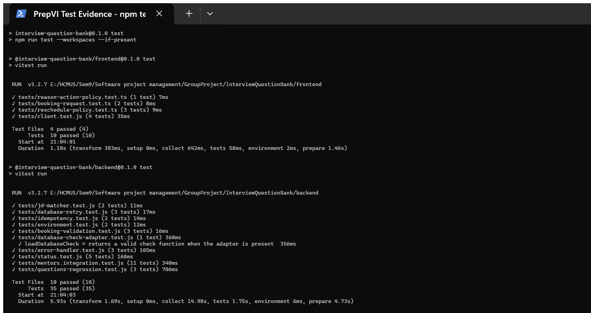
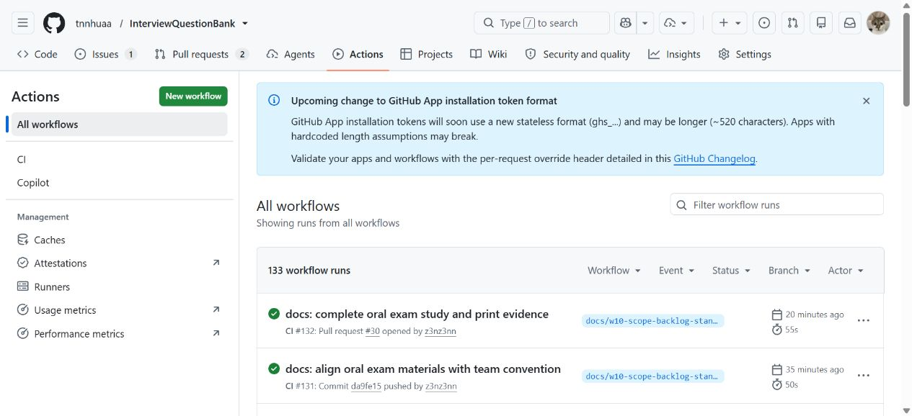

# Software Test Plan

## Document control

| Field | Value |
| --- | --- |
| Project | PrepVI — Interview Practice Platform |
| Version | 1.0 |
| Reporting date | 23 August 2026 |
| Status | Current test plan with retained local execution and CI evidence |
| Test environments | Local Node.js workspaces, local PostgreSQL and hosted frontend/API checks |

## 1. Purpose

This Test Plan defines the scope, test levels, environments, entry and exit criteria, evidence requirements and defect handling used to evaluate PrepVI. It distinguishes the plan from an individual test run and distinguishes automated technical checks from User Acceptance Testing.

## 2. Test objectives

The plan aims to verify that:

- required user journeys behave according to Acceptance Criteria;
- private data and role/object authorization are enforced;
- booking, idempotency and version-conflict rules preserve consistency;
- extraction, AI assistance and provider failures have safe fallback or recovery;
- database migrations, reference seeds and API types remain consistent; and
- defects and release limitations are visible rather than hidden by generic success claims.

## 3. Scope

The test scope covers:

- registration, login, session changes and authorization;
- Question Bank, moderation, bookmarks and practice progress;
- JD upload/paste, extraction/OCR, correction, analysis, matching and preparation plans;
- Mentor verification, expertise, availability and discovery;
- booking creation, concurrency, rescheduling, cancellation and context privacy;
- controlled meeting-link access and recovery;
- feedback, review, notifications, operations and audit;
- Gemini success, disabled, timeout, invalid-output and deterministic fallback paths; and
- OpenAPI, migrations, seeds, lint, type checking, build and secret handling.

## 4. Test levels and techniques

| Level | Purpose | Current evidence |
| --- | --- | --- |
| Unit | Isolate policies and utilities | Matcher, booking validation, retry, idempotency and frontend policy suites |
| Integration | Verify API/module/database behavior | Mentor integration and real-PostgreSQL question regression suites |
| Contract and quality gates | Detect delivery drift | OpenAPI drift, migration replay, seed verification, lint, typecheck and build |
| Manual end-to-end | Verify persona journeys and recovery | Student, Mentor and Administrator walkthrough specification |
| User Acceptance Testing | Validate business value and Acceptance Criteria | Planned; complete story-indexed evidence is not retained |

Positive, negative, boundary, permission, concurrency, provider-failure and recovery scenarios are required for risk-critical flows.

## 5. Test environments

| Environment | Intended use | Required controls |
| --- | --- | --- |
| Local development | Unit, integration and manual debugging | Local PostgreSQL, Mailpit, private local storage and demo/reference seeds |
| CI | Reproducible quality checks | Locked dependencies, isolated PostgreSQL and no production credentials |
| Hosted environment | Smoke and operational verification | Correct migrations, provider configuration, worker availability and safe demo data |

Tests must not reset or seed a shared/production database with non-production data.

## 6. Entry and exit criteria

### Entry criteria

- required migrations and reference data are available;
- environment configuration is complete without exposed secrets;
- the test scope and expected behavior are identified;
- dependent providers are available or a failure scenario is intentionally selected; and
- the test account has the intended role and object ownership.

### Exit criteria

- required scenarios have retained pass/fail evidence;
- no unresolved Critical or High defect remains for the release scope;
- migration, seed, contract and build checks pass;
- authorization and concurrency evidence is reviewed; and
- the applicable acceptance decision is recorded.

Automated test success alone does not satisfy UAT exit criteria.

## 7. Automated test execution

The local `npm test` execution used a local PostgreSQL container and completed with process exit code 0:

| Workspace | Test files | Tests | Result |
| --- | ---: | ---: | --- |
| Frontend | 4 | 10 | Passed |
| Backend | 10 | 35 | Passed |
| Total | 14 | 45 | Passed |

These figures describe the retained local run shown below. They are not a code-coverage percentage and do not prove every Acceptance Criterion.

**Figure 1.** A real Windows Terminal window showing the backend summary and process exit code 0.

**Figure 2.** A real Windows Terminal window showing 10 frontend tests and 35 backend tests passing in the same `npm test` execution.

## 8. Continuous Integration evidence

**Figure 3.** The real GitHub Actions window for the repository.

**Figure 4.** The current CI workflow displayed in the real GitHub file view.

The workflow runs lint, typecheck, OpenAPI drift, migration replay, reference-seed verification, build and secret scanning. It does not run `npm test`; local test execution and CI evidence are therefore reported separately.

## 9. Manual validation

Manual validation follows three persona journeys:

- Student: profile → JD → corrected text → analysis/mapping → plan → practice → Mentor → booking → session → feedback/review;
- Mentor: onboarding → verification → availability → booking/reschedule → meeting link → completion → feedback; and
- Administrator: taxonomy/question moderation → Mentor verification → provider failure → dispute/no-show → audit.

Each run records the environment, timestamp, commit, expected and actual result, screenshot, safe correlation ID and relevant database/audit/outbox state. Credentials, private JD content and meeting links are excluded.

## 10. Defect management

| Severity | Meaning | Release action |
| --- | --- | --- |
| Critical | Security/data loss or core unavailability without safe recovery | Block release immediately |
| High | Required flow or authorization/consistency control fails | Block release |
| Medium | Important behavior fails with a safe workaround | Record and obtain a release decision |
| Low | Minor usability or documentation issue | Record and schedule |

Every defect record includes reproduction steps, expected/actual behavior, environment, safe evidence, severity, resolution and verification result.

## 11. Current limitations

- The current CI workflow does not run the Vitest suites.
- No code-coverage threshold is configured.
- Browser end-to-end automation is not present in the repository.
- Complete story-by-story UAT evidence is not retained.
- Hosted worker-dependent OCR, outbox, reminder and retention behavior is not fully demonstrated.
- Lint and frontend-build warnings remain and must not be reported as a warning-free result.

## 12. Source artifacts

- [Manual Validation and Operations](../../Implementation/Manual_Validation_and_Operations.md)
- [GitHub Actions workflow](../../../.github/workflows/ci.yml)
- [Backend test suites](../../../backend/tests/)
- [Frontend test suites](../../../frontend/tests/)
- [Product Backlog and Acceptance Criteria](../../Project_Vision_and_Scope/Product_Backlog_and_Acceptance_Criteria.md)
