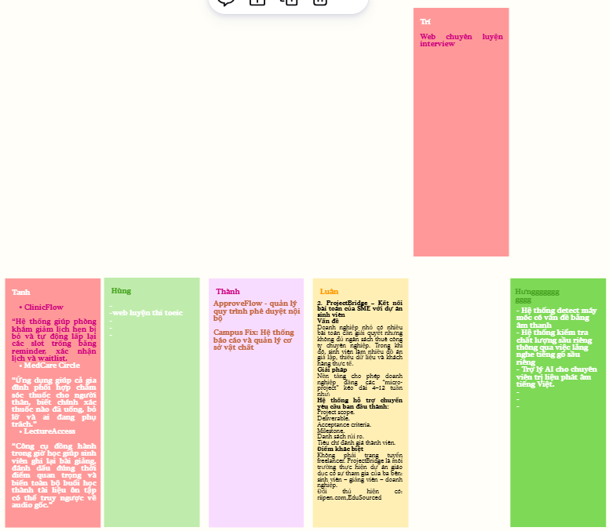

# Câu 21 — Báo cáo bài học kinh nghiệm (Lessons Learned Register)

## 1. Đề bài

**Câu hỏi chính:** Trình bày quá trình hình thành và phương pháp đánh giá tài liệu Báo cáo bài học kinh nghiệm của nhóm. Sinh viên nộp kèm bản in tài liệu Báo cáo bài học kinh nghiệm của nhóm.

**Các câu hỏi thường gặp:**

- Quản lý dự án là gì và tại sao dự án phần mềm cần quản lý?
- Các hoạt động quản lý dự án và sản phẩm tương ứng là gì?
- Nhóm phần mềm có cần một người chuyên làm quản lý không?
- Quản lý theo kế hoạch chặt chẽ giống và khác quản lý thích ứng thế nào?
- Quản lý dự án liên quan gì đến kỹ nghệ phần mềm?
- Vì sao tổ chức lớn cần Project Management Office (PMO)?

**Trạng thái:** Version 1.0 — nhóm đã review nội bộ và thống nhất ngày 23/08/2026. Nhóm không lập biên bản tổng kết riêng; việc chốt nội dung được thực hiện qua Messenger khi hoàn thành từng phần. Tuấn Anh là người tổng hợp và quyết định cuối cùng.

## 2. Dàn ý viết A4 trong 10 phút

1. **WHAT:** Lessons Learned Register ghi sự kiện, nguyên nhân, tác động và hành động áp dụng cho lần sau.
2. **WHY:** tránh lặp lỗi, giữ cách làm hiệu quả và chuyển kinh nghiệm cá nhân thành tri thức chung.
3. **Khởi tạo:** Tuấn Anh tổng hợp dữ liệu dự án, Git/PR/CI, Kanban và phản hồi trực tiếp của hai giảng viên.
4. **Hai bài học đã chốt:** đánh giá tính khả thi ngay trong Initiation; không đưa secret và dependency sinh tự động vào repository.
5. **Đánh giá:** kiểm tra sự kiện, nguyên nhân, tác động, action, owner, thời hạn, cách đo và sự đồng thuận.
6. **Sử dụng:** bài học về tính khả thi đã giúp nhóm chọn InterviewQuestionBank; bài học secret đã được áp dụng bằng revoke key, `.gitignore` và secret scan.
7. **Cập nhật:** nhóm chốt từng phần qua Messenger; Tuấn Anh phát hành version 1.0 sau khi các thành viên đồng ý.

## 3. Tài liệu là gì và tại sao cần tạo?

### WHAT

Lessons Learned Register là nơi lưu tri thức thu được từ trải nghiệm dự án. Một mục hoàn chỉnh phải chỉ ra điều gì đã xảy ra, vì sao xảy ra, tác động, điều cần giữ hoặc thay đổi, người chịu trách nhiệm và cách kiểm tra hiệu quả.

### WHY

- Tránh lặp lại lỗi đã biết.
- Giữ lại cách làm có hiệu quả cho dự án sau.
- Chuyển kinh nghiệm cá nhân thành tri thức chung của nhóm.
- Cung cấp đầu vào cho planning, risk, quality và working agreement.
- Chứng minh nhóm đánh giá cả cách làm, không chỉ sản phẩm cuối.

### WHEN

Ghi nhận ngay khi có sự kiện đáng chú ý; rà soát tại milestone hoặc khi kết thúc dự án. Nhóm này không làm theo sprint mà quản lý bằng Kanban, nên lần sau sẽ theo dõi hiệu quả cải tiến bằng **cycle time** của card.

## 4. Quá trình khởi tạo thực tế

### 4.1 Bối cảnh và đầu vào

Tuấn Anh bắt đầu tổng hợp register ngày 20/08/2026 và chốt version 1.0 ngày 23/08/2026. Nguồn được dùng gồm:

- Project Charter, Proposal, Project Plan, backlog và Kanban tái dựng;
- phản hồi trực tiếp của thầy Biên và thầy Khoa về Splitly và InterviewQuestionBank;
- ảnh brainstorm, trao đổi Messenger và quyết định chuyển phạm vi;
- Git history, pull request, CI và sự cố `.env`/`node_modules`;
- commit `7b51d07` và regression test cho lỗi practice-progress 500, duplicate-content 409.

ADR chỉ được dùng làm nguồn cho các thiết kế đã được chấp nhận. Nhóm không ghi rằng ADR đã làm thay đổi quyết định sau đó vì thực tế không có trường hợp này.

### 4.2 Người tham gia và trách nhiệm

- **Owner tài liệu và người chốt cuối:** Tuấn Anh — Project Manager / Team Leader / Timekeeper.
- **Người review:** Tuấn Anh và các thành viên liên quan đến từng bài học.
- **Cách chốt:** trao đổi qua Messenger khi hoàn thành từng phần; các thành viên đã đồng ý toàn bộ nội dung version 1.0.
- **Không có:** biên bản retrospective riêng hoặc lesson riêng bắt buộc cho từng thành viên.

### 4.3 Các bước hình thành

1. Thu thập sự kiện có thể kiểm tra từ tài liệu, Kanban, Git, PR, CI và phản hồi giảng viên.
2. Đối chiếu sự kiện với người liên quan; không biến nhận định chưa xác nhận thành dữ kiện.
3. Phân tích chuỗi sự kiện, nguyên nhân và tác động.
4. Gom các ý trùng thành hai bài học chung có thể tái sử dụng.
5. Giao owner, action, thời hạn và cách đo.
6. Chốt từng phần trên Messenger; Tuấn Anh phát hành version 1.0 sau khi nhóm đồng ý.

## 5. Lessons Learned Register — version 1.0

| ID | Sự kiện và nguyên nhân | Tác động | Bài học và hành động | Owner, thời hạn, cách đo | Trạng thái |
| --- | --- | --- | --- | --- | --- |
| **LL-01** | Splitly được đề xuất nhưng phân tích tính khả thi và giá trị sử dụng chưa đủ sâu. Sau phản hồi giữa kỳ, đến tuần 7 nhóm vẫn chưa chốt được đề tài mới; các thành viên có quan điểm khác nhau và chưa chủ động đưa ra phương án giải quyết. Tuấn Anh tổ chức brainstorm, dùng tiêu chí khách quan và hỏi trực tiếp thầy Biên, thầy Khoa để chốt InterviewQuestionBank. | Nhóm phải quay lại Initiation và Planning, làm lại Charter/Proposal/Plan; thời gian thực hiện thực tế cho dự án mới chỉ còn 10/08–23/08. Đổi lại, nhóm hiểu rõ hơn cách đánh giá tính khả thi và chọn được PoC tập trung vào ứng viên. | **Bài học:** phải đánh giá sâu tính khả thi ngay trong Initiation trước khi baseline kế hoạch. Cần so sánh giải pháp hiện có, kiểm tra người dùng có sẵn sàng đổi công cụ, phân tích giá trị, rủi ro và giới hạn thời gian; khi cần phải xin phản hồi sớm từ stakeholder. **Action:** thêm Feasibility Gate và bảng tiêu chí lựa chọn ý tưởng trước khi duyệt Charter/Proposal. | **Tuấn Anh.** Áp dụng trước khi kết thúc Initiation của dự án sau. Đo bằng một decision matrix được nhóm review, có xác nhận stakeholder và không phải quay lại Initiation vì giá trị cốt lõi chưa được kiểm chứng. | **Accepted; đã áp dụng khi chọn InterviewQuestionBank.** |
| **LL-02** | Trong PR của Trí, `.env` chứa credential và thư mục `node_modules` bị đưa lên repository. Nguyên nhân là thiếu bước tự kiểm tra trước khi push và ignore rule chưa đủ. Tuấn Anh phát hiện khi review cùng quy trình CI/secret scan. | Secret bị lộ và repository nặng; nhóm phải loại file, revoke credential cũ và tạo key mới. | **Bài học:** không commit secret hoặc dependency sinh tự động. **Action đã làm:** loại `.env` và `node_modules`, revoke key, tạo key mới, bổ sung `.gitignore`, sửa cấu hình Gitleaks và chạy lại secret scan. | **Trí.** Hoàn tất trong giai đoạn 16–20/08/2026. Đo bằng việc không tái diễn và CI sau sửa báo `secret-scan` thành công, không phát hiện leak. | **Closed; không tái diễn.** |

### 5.1 Kết quả của quyết định pivot

PoC mới tập trung vào ứng viên: dùng nội dung công việc và Question Bank để giúp người học cải thiện cách trả lời phỏng vấn, đồng thời nhận biết những phần cần tập trung để được đánh giá cao. Đây là mục tiêu sản phẩm đã được nhóm chốt; tài liệu hiện không tuyên bố có số liệu đo mức cải thiện của người học.

*Hình Q21-01 — Minh chứng brainstorm và đánh giá các ý tưởng dựa trên góp ý của giảng viên cùng kinh nghiệm nhóm đã tích lũy.*

## 6. Phương pháp đánh giá thực tế

### 6.1 Tiêu chí

Một lesson được giữ lại khi đáp ứng đủ:

1. Có sự kiện cụ thể và nguồn kiểm tra được hoặc người liên quan xác nhận.
2. Phân biệt sự kiện, nguyên nhân, tác động và nhận định.
3. Có thể chuyển thành hành động hoặc quy tắc tái sử dụng.
4. Có owner, thời hạn và cách đo hiệu quả.
5. Tập trung vào hệ thống và hành vi có thể thay đổi, không quy lỗi cá nhân.
6. Được các thành viên liên quan review; Tuấn Anh chốt cuối.

### 6.2 Kết quả tự đánh giá

| Tiêu chí | Kết quả |
| --- | --- |
| Sự kiện và nguồn | Đạt — có tài liệu, ảnh brainstorm, Messenger, Git/PR và CI. |
| Root cause và tác động | Đạt — đã được Tuấn Anh và người liên quan xác nhận. |
| Action, owner, thời hạn | Đạt cho cả LL-01 và LL-02. |
| Bằng chứng áp dụng | Đạt — pivot đã hoàn tất; secret được xử lý và không tái diễn. |
| Đồng thuận | Đạt — các thành viên đã đồng ý; Tuấn Anh chốt cuối. |
| Giới hạn bằng chứng | Không có biên bản họp; việc đồng thuận được xác nhận qua cách làm thực tế trên Messenger. Chưa có số liệu người dùng chứng minh hiệu quả PoC. |

### 6.3 Kiểm tra bổ sung từ repository

- **Practice-progress 500:** câu SQL cập nhật `preparation_plan_items` dùng `version = version + 1` trong truy vấn có nhiều bảng nên tên cột bị mơ hồ. Commit `7b51d07` sửa thành `version = pi.version + 1` và thêm regression test cho luồng cập nhật tiến độ.
- **Duplicate-content 409:** lỗi unique constraint PostgreSQL `23505` chưa được ánh xạ thành lỗi nghiệp vụ ổn định. Commit trên thêm `mapDuplicateContentError`, trả `409 / DUPLICATE_QUESTION_CONTENT` cho cả create và update, kèm hai regression test.
- **CI:** workflow hiện kiểm tra lint, typecheck, OpenAPI drift, migration replay, reference seed, build và Gitleaks. Ảnh CI sau sửa cho thấy `quality` và `secret-scan` thành công. Tuy nhiên workflow hiện tại chưa gọi bộ regression test mới; vì vậy chỉ dùng commit/test source làm bằng chứng đã bổ sung test, không ghi rằng GitHub Actions đã chạy các test này.

Hai lỗi 500/409 là dữ kiện hỗ trợ việc đánh giá quy trình tích hợp; nhóm không tách chúng thành lesson riêng vì đã thống nhất Register chỉ gồm hai bài học ở mục 5.

## 7. Quá trình sử dụng và cập nhật

### 7.1 Đã sử dụng

- LL-01 được áp dụng ngay trong dự án: nhóm quay lại Initiation, brainstorm có tiêu chí, xin ý kiến hai giảng viên và chốt InterviewQuestionBank theo hướng ứng viên.
- LL-02 được chuyển thành hành động kỹ thuật: revoke key, tạo key mới, hoàn thiện ignore rule và secret scan. Sự cố không tái diễn.

### 7.2 Lịch sử phiên bản

| Phiên bản | Ngày | Nội dung | Người cập nhật/review |
| --- | --- | --- | --- |
| 0.1 | 20/08/2026 | Tổng hợp bản nháp từ tài liệu, Git, PR và CI. | Tuấn Anh |
| 1.0 | 23/08/2026 | Gom còn hai lesson đã xác nhận; bổ sung owner, action, tiêu chí đo, kết quả tự đánh giá và minh chứng brainstorm. | Tuấn Anh và người liên quan; Tuấn Anh chốt cuối |

Lần sau, nhóm cập nhật lesson khi một sự kiện đáng chú ý được xử lý xong và theo dõi tác động bằng cycle time trên Kanban.

## 8. Câu hỏi lý thuyết và câu hỏi phụ

### 8.1 Quản lý dự án là gì và vì sao phần mềm cần quản lý?

- **WHAT:** áp dụng kiến thức, kỹ năng, công cụ và kỹ thuật để đáp ứng yêu cầu dự án.
- **HOW:** khởi tạo → lập kế hoạch → thực hiện → theo dõi/kiểm soát → kết thúc và rút kinh nghiệm.
- **WHY:** cân bằng phạm vi, thời gian, chi phí, chất lượng, rủi ro và kỳ vọng stakeholder. Phần mềm cần quản lý vì yêu cầu, công nghệ và năng suất con người có tính bất định cao.
- **WHEN:** xuyên suốt vòng đời dự án; mức chi tiết tùy quy mô và độ bất định.

### 8.2 Hoạt động quản lý và sản phẩm tương ứng

| Hoạt động | Sản phẩm điển hình |
| --- | --- |
| Initiation | Proposal, Vision and Scope, Charter, Stakeholder Register, Feasibility |
| Planning | Backlog/SRS, WBS, estimate, schedule, Resource Plan, budget, Project Plan, SOW |
| Tổ chức và giao tiếp | RACI/ownership, working agreement, communication record |
| Risk, quality, configuration | Risk Register, Quality/Test Plan, ADR, change/configuration record |
| Execution và control | Deliverable, Kanban board, CI/test result, burndown, status report, forecast |
| Closure | Acceptance/bàn giao, release evidence, Lessons Learned Register |

### 8.3 Có cần PM chuyên trách không?

Không phải nhóm nhỏ nào cũng cần PM toàn thời gian, nhưng phải có người chịu trách nhiệm giữ bức tranh tổng thể. Dự án này giao Tuấn Anh làm Project Manager / Team Leader / Timekeeper; Gia Thành là Project Planning & Estimation Analyst / Full-stack Developer. Nhờ vậy quyền chốt và trách nhiệm phân tích kế hoạch không bị nhập nhằng.

### 8.4 Quản lý dự đoán và thích ứng

Cả hai đều cần mục tiêu, trách nhiệm, kiểm soát chất lượng/rủi ro và thông tin trạng thái. Cách dự đoán lập baseline chi tiết sớm, kiểm soát thay đổi chính thức và đo bằng milestone/schedule. Cách thích ứng chi tiết hóa gần thời điểm làm, điều chỉnh backlog và đo bằng increment, throughput, cycle time hoặc burn chart. Nhóm dùng Kanban nên không cần sprint; thay đổi vẫn phải được chốt và theo dõi tác động.

### 8.5 Quan hệ với kỹ nghệ phần mềm và PMO

Kỹ nghệ phần mềm tạo sản phẩm qua requirement, design, construction, integration và verification; quản lý dự án tổ chức nguồn lực, lịch, chi phí, giao tiếp, risk và change để hoạt động kỹ thuật đạt mục tiêu. PMO giúp tổ chức lớn chuẩn hóa phương pháp, template, công cụ, đào tạo, báo cáo, phân bổ nguồn lực và lưu lessons learned giữa nhiều dự án; PMO chỉ có ích khi thủ tục tạo giá trị thực.

## 9. Bản in phải nộp

- [x] `Lessons_Learned_Register_Report.md` — bản báo cáo độc lập, không trình bày theo dạng hỏi–đáp.
- [x] Register có version, trạng thái, hai lesson, action, owner, thời hạn và cách đo.
- [x] Minh chứng review/brainstorm cuối.
- [x] Ví dụ lesson đã được áp dụng: xử lý `.env`/`node_modules` và secret scan.

## 10. Nguồn tham khảo và bằng chứng

- `docs/Oral_Exam/Q11_project-plan/Project_Plan_Report.md`
- `docs/Oral_Exam/Q16_team-management/Team_Management_Report.md`
- `docs/Oral_Exam/Q16_team-management/img/Q16-02-pr3-env-node-modules-redacted.png`
- `docs/Oral_Exam/Q16_team-management/img/Q16-05-secret-scan-failed.png`
- `docs/Oral_Exam/Q17_monitoring-and-control/Monitoring_Control_Report.md`
- `docs/Oral_Exam/Q17_monitoring-and-control/img/Q17-06-ci-success-no-leaks.png`
- `docs/Project_Proposal/Project_Proposal.md`
- `docs/Project_Vision_and_Scope/Product_Backlog_and_Acceptance_Criteria.md`
- `.github/workflows/ci.yml`
- commit `7b51d07` và `backend/tests/questions-regression.test.js`
- `docs/refs/09-software-project-monitoring-and-control.md`, slide 070
- `docs/refs/11-1-agile-quality-management.md`, slide 018–024
- `docs/refs/12-software-project-management.md`
