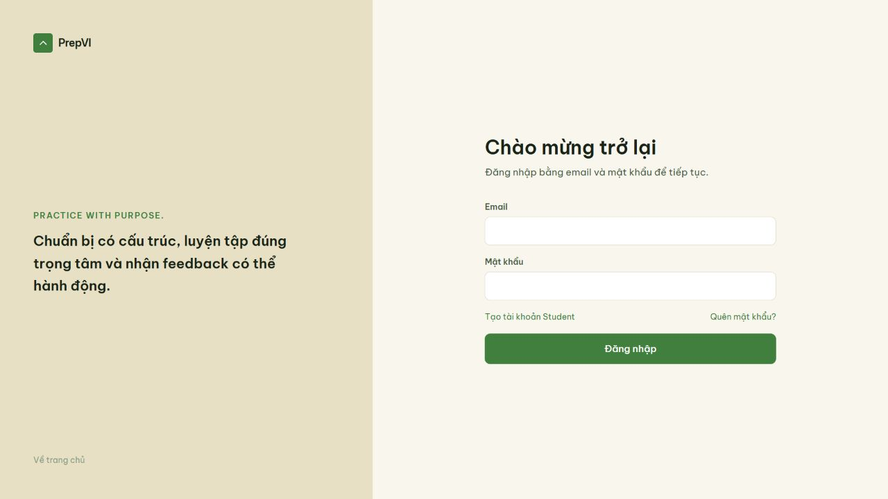
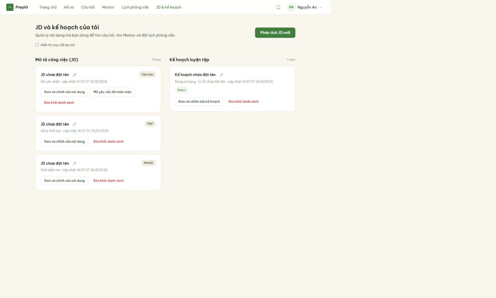
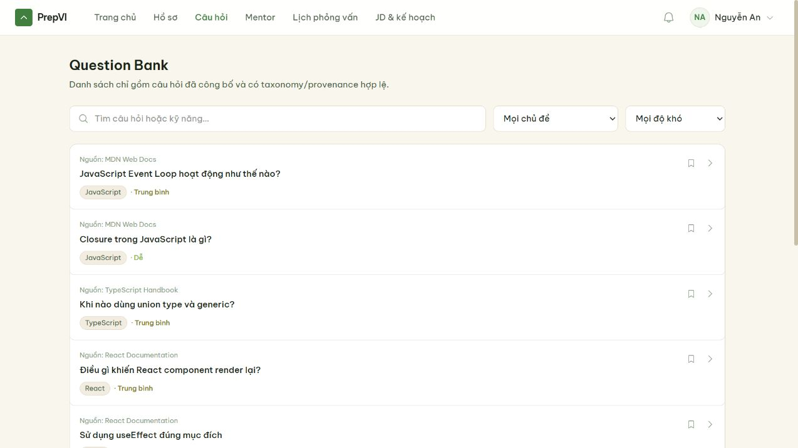
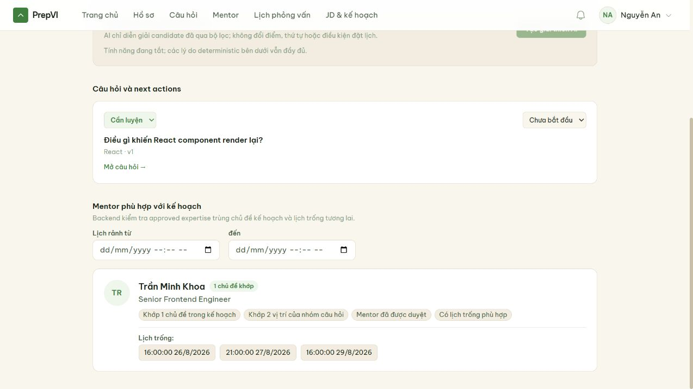
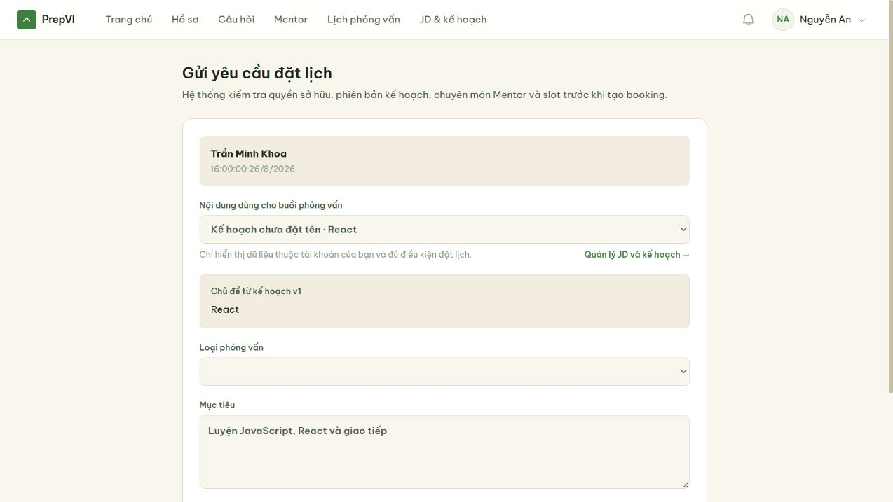

# Software Requirements and Product Backlog Report

## Document control

| Field | Value |
| --- | --- |
| Project | PrepVI — Interview Practice Platform |
| Version | 1.0 |
| Reporting date | 23 August 2026 |
| Status | Current project report based on versioned repository evidence |
| Primary artifacts | Product Backlog and Acceptance Criteria; Vision and Scope; Future-State Workflow |

## 1. Executive summary

This report describes how PrepVI converts product scope into ordered and testable software requirements. The project uses User Stories, Acceptance Criteria, Business Rules, Non-functional Requirements, release classification, dependencies and traceability to control what is built and how completion is evaluated.

The current backlog contains 27 R1 Must stories with 134 Story Points, two R1 Extended stories with 8 Story Points, and one Future/Maybe story with 8 Story Points. These figures describe the release baseline. The presence of implementation code does not by itself prove Product Owner acceptance or User Acceptance Testing completion.

## 2. Purpose and scope

The requirements baseline is used to:

- define the behavior expected by Students, Mentors and Administrators;
- align product, interface, architecture, implementation and testing work;
- distinguish required, extended and future capabilities;
- provide observable conditions for accepting a story; and
- control the impact of requirement changes.

The report covers the JD-to-preparation-plan flow, Question Bank and practice, Mentor discovery, booking, controlled meeting-link access, feedback, review, notifications and administration.

## 3. Requirement model

| Element | Project use |
| --- | --- |
| Functional requirement | Defines a service or behavior supplied by the system |
| Non-functional requirement | Defines a measurable quality attribute or constraint |
| Business rule | Defines a domain policy shared by one or more stories |
| User Story | Describes an actor, need and expected value |
| Acceptance Criteria | Defines observable pass/fail conditions for a story |
| Definition of Ready | Defines when a story is sufficiently understood to enter delivery |
| Definition of Done | Defines the common completion standard across stories |
| Traceability record | Connects objectives, workflows, stories, rules, tests and evidence |

Acceptance Criteria are verification contracts. They are not statements that a feature has already passed testing or been formally accepted.

## 4. Inputs and development method

The requirements were derived from the Project Charter, Vision and Scope, current and future workflows, prototype, stakeholder needs, architecture constraints and product decisions. The Product Backlog supplies ordered work to the project's Kanban flow; a sufficiently refined item is pulled from Backlog to Ready under the Work in Progress limit. Its use does not imply that the team operates Scrum.

The team applied the following process:

1. normalize actors and product terminology;
2. group needs into product capabilities;
3. write actor–need–value User Stories;
4. identify dependencies and release boundaries;
5. define Business Rules and measurable quality requirements;
6. write testable Acceptance Criteria;
7. have the implementation team estimate stories relatively with Story Points;
8. order the backlog by value, risk and dependency; and
9. link stories to workflows, tests and supporting evidence.

## 5. Release baseline

| Classification | Stories | Story Points | Interpretation |
| --- | ---: | ---: | --- |
| R1 Must | US-01–US-20 and US-24–US-30 | 134 | Required release scope |
| R1 Extended | US-21–US-22 | 8 | Included only when Must work and capacity remain safe |
| Future/Maybe | US-23 | 8 | Not part of the current R1 commitment |

Implementation of US-21, US-22 or US-23 does not automatically change this classification. A release-scope decision must update the backlog and its impact on capacity, dependencies, contracts and validation.

### 5.1 Complete use-case catalogue

The catalogue below makes every use-case identifier understandable without requiring the reader to infer meaning from a numeric range. The statements are concise representations of the current Product Backlog. Detailed Acceptance Criteria, dependencies, Business Rules and traceability remain controlled in the source backlog.

| Use case | Capability | Actor and intended outcome | Classification | SP |
| --- | --- | --- | --- | ---: |
| US-01 | Identity | A user registers and signs in so personal data remains protected. | R1 Must | 8 |
| US-02 | Authorization | An Administrator enforces Student, Mentor and Administrator roles so functions and data are properly restricted. | R1 Must | 3 |
| US-03 | Student context | A Student saves the target role and interview goal so practice and booking use the same context. | R1 Must | 2 |
| US-04 | Question Bank | A Student browses, searches and filters governed questions. | R1 Must | 5 |
| US-05 | Question detail | A Student views question detail and answer criteria to understand what a good answer requires. | R1 Must | 2 |
| US-06 | Practice | A Student bookmarks questions and tracks practice status to continue the preparation plan. | R1 Must | 3 |
| US-07 | Mentor profile | A Mentor creates a profile and submits verification information to offer a trusted service. | R1 Must | 5 |
| US-08 | Mentor governance | An Administrator approves or rejects Mentor verification with a recorded reason. | R1 Must | 3 |
| US-09 | Availability | An approved Mentor manages valid future availability slots. | R1 Must | 5 |
| US-10 | Mentor discovery | A Student finds approved Mentors by preparation-plan topic and availability. | R1 Must | 3 |
| US-11 | Booking request | A Student submits a booking request with a goal and owned JD/preparation-plan context. | R1 Must | 5 |
| US-12 | Booking handling | The owning Mentor accepts, rejects or proposes a new time through valid booking transitions. | R1 Must | 8 |
| US-13 | Booking exceptions | A booking participant cancels or resolves a reschedule proposal under explicit policy. | R1 Must | 8 |
| US-14 | Interview session | A booking participant receives controlled access to the external meeting link after confirmation. | R1 Must | 3 |
| US-15 | Mentor feedback | The owning Mentor submits structured feedback after a completed interview session. | R1 Must | 5 |
| US-16 | Feedback consumption | The booking Student views feedback and next actions to update the preparation plan. | R1 Must | 3 |
| US-17 | Mentor review | The booking Student reviews the Mentor after completion. | R1 Must | 3 |
| US-18 | Content governance | An Administrator manages and moderates questions and taxonomy before publication. | R1 Must | 5 |
| US-19 | Notifications | A user receives reliable booking-event notifications even when a provider temporarily fails. | R1 Must | 8 |
| US-20 | Operations | An authorized Administrator resolves reports and booking exceptions through governed actions. | R1 Must | 5 |
| US-21 | Progress | A Student views a basic progress dashboard to identify what to practise next. | R1 Extended | 5 |
| US-22 | Reminders | A booking participant receives scheduled reminders to reduce missed sessions. | R1 Extended | 3 |
| US-23 | Data intake | An Administrator imports questions in bulk without bypassing governance or moderation. | Future/Maybe | 8 |
| US-24 | JD intake | A Student pastes text or uploads a JD file to prepare for the exact target role. | R1 Must | 5 |
| US-25 | JD extraction | A Student receives directly extracted or OCR-derived text for review. | R1 Must | 8 |
| US-26 | JD correction | A Student reviews, edits and confirms extracted text before analysis. | R1 Must | 3 |
| US-27 | JD analysis | A Student detects and normalizes the role, seniority, skills, technologies and requirements in a JD. | R1 Must | 8 |
| US-28 | Question mapping | A Student maps JD requirements to governed questions to identify relevant preparation content. | R1 Must | 8 |
| US-29 | Preparation plan | A Student reviews recommendation reasons and orders selected questions into an actionable plan. | R1 Must | 5 |
| US-30 | Context handoff | A Student attaches the correct JD or preparation plan to a booking so the Mentor receives the required practice context. | R1 Must | 5 |

Detailed source: [Product Backlog and Acceptance Criteria](../../../Project_Vision_and_Scope/Product_Backlog_and_Acceptance_Criteria.md).

## 6. Acceptance and traceability controls

A story is considered ready only when its actor, value, Acceptance Criteria, dependencies, estimate, rules and evidence needs are sufficiently clear. A story is considered done only when the applicable code, review, database, contract, security, documentation and validation requirements are satisfied.

Traceability follows this chain:

`Product objective → Future-State Workflow → User Story → Acceptance Criteria and Business Rules → API/UI/database implementation → test or manual evidence → acceptance decision`

Private-object authorization, booking consistency and recovery behavior are treated as cross-cutting controls rather than isolated interface details.

## 7. Evaluation and review method

The requirements baseline is evaluated against six controls:

| Control | Review question | Required evidence |
| --- | --- | --- |
| Correctness and necessity | Does the item support a stated objective or stakeholder workflow? | objective/workflow trace |
| Completeness | Are success, invalid input, authorization, conflict and recovery conditions covered? | Acceptance Criteria review |
| Consistency | Are actors, states, rules and time limits consistent across artifacts? | cross-artifact review |
| Feasibility | Can the team deliver it within architectural, provider, capacity and security constraints? | technical review, estimate or proof of concept |
| Verifiability | Is the outcome observable and pass/fail? | test/manual scenario and expected result |
| Traceability | Can the requirement be followed to implementation and evidence? | traceability chain |

Git review and document history prove that an artifact changed and was reviewable. They do not prove formal Product Owner acceptance. The repository does not retain a signed baseline approval or complete story-indexed UAT package.

## 8. Use during delivery

The Product Backlog supplies ordered work to the Kanban flow. Refined items are pulled into Ready only when their value, Acceptance Criteria, dependencies and evidence needs are sufficiently clear. During implementation, stories and rules guide API, database, interface and recovery decisions; during validation, Acceptance Criteria define the observable basis for acceptance.

When code, provider constraints or defects reveal a requirement change, the team must update the affected story, rules, release classification, traceability and validation impact. Implementation presence does not silently move an Extended or Future item into the Must baseline.

## 9. Change control

A proposed requirement change is recorded, classified and assessed before the release baseline is changed. The impact review covers business value, Story Points, dependency order, architecture, API/schema changes, security/privacy, test evidence and release timing. Extended and future work is not silently moved into R1 Must.

## 10. Evidence

**Figure 1.** The versioned Product Backlog displayed in the real GitHub file view at the release-boundary section.

**Figure 2.** The real GitHub history window for the Product Backlog artifact.

The following application evidence was captured from the system at baseline `d19f346` after applying the current migrations and reference/demo seed. It demonstrates that the referenced interfaces and seeded workflows were available at capture time. It is not a substitute for story-indexed UAT evidence or formal Product Owner acceptance.

**Figure 3.** The real sign-in interface provides the common authenticated entry point required by the identity stories.

**Figure 4.** The real Student context-management interface exposes owned JD and preparation-plan records, processing states and lifecycle actions.

**Figure 5.** The real Question Bank interface shows published questions together with topic, difficulty and provenance information.

**Figure 6.** The real preparation-plan interface connects a versioned question set to an approved Mentor with matching expertise and future availability.

**Figure 7.** The real booking interface carries the selected plan, topic version, Mentor, slot and Student goal into the booking request.

## 11. Limitations

- The repository does not contain a signed requirements-baseline approval.
- Implementation presence is not equivalent to complete UAT or formal story acceptance.
- Proposed quality targets must not be reported as achieved without a defined dataset and retained measurement.
- The current release classification remains authoritative until a recorded scope decision changes it.

## 12. Submission package and source artifacts

The two required printed documents are this report and the [PrepVI User Guide](User_Guide.md). The versioned Product Backlog remains the detailed requirements source and may be printed as a supporting appendix.

- [Product Backlog and Acceptance Criteria](../../../Project_Vision_and_Scope/Product_Backlog_and_Acceptance_Criteria.md)
- [Project Vision and Scope](../../../Project_Vision_and_Scope/Project_Vision_and_Scope.md)
- [Future-State Workflow](../../../Project_Vision_and_Scope/Future_State_Workflow.md)
- [Project Charter](../../../Project_Governance%20%26%20Stakeholder/Project_Charter.md)
