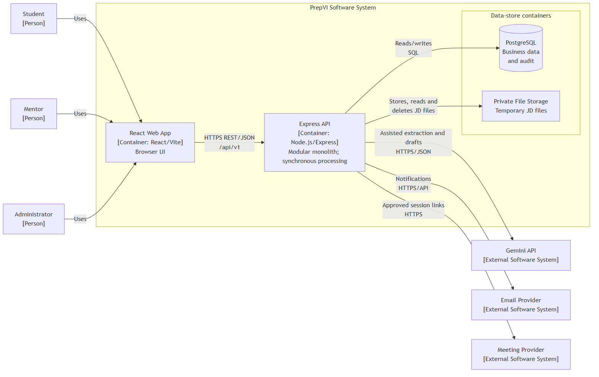

# Architecture Diagrams

This document contains the two C4 diagrams used to present the PrepVI software architecture. Their editable Mermaid sources remain in the English Software Architecture document.

## 1. System Context

Source: [Software Architecture — System context](Software_Architecture_EN.md)

## 2. Container

Source: [Software Architecture — Container view](Software_Architecture_EN.md)

