# PrepVI — Prototype Workflow Specification v2

## 1. Purpose and Prototype Scope

The prototype validates whether PrepVI can help a Student who does not know what to study move from a real Job Description (JD) to an explainable, personalized interview preparation path.


## 2. Prototype Narrative

### Current-state story

A Student is preparing for an internship or job application but does not know which topics from the Job Description deserve the most attention. The Student searches for interview questions from different sources, takes fragmented notes, and has difficulty deciding what to practice first.

### Future-state story

The Student uploads or pastes a real Job Description. PrepVI extracts the text, lets the Student review and correct it, maps the relevant requirements to the existing interview taxonomy, and produces an explainable question set. The Student can then open a recommended question and begin practicing immediately.

If additional help is needed, the Student can continue into the secondary mentoring flow to find a Mentor, schedule a session, receive structured feedback, and return to the Question Bank with recommended next actions.

---

# 3. Core Prototype

## 3.1 Core Hypothesis

> A Student who does not know what to study can use a Job Description to obtain an understandable and useful interview preparation path.

The Core Prototype must validate three things:

1. The Student understands what information PrepVI extracted from the JD.
2. The Student understands and can correct how JD requirements are mapped to interview topics.
3. The Student understands why the resulting questions are recommended and can start practicing from them.

## 3.2 Core Flow

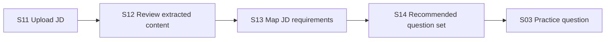
```mermaid
flowchart LR
    S11["S11 Upload JD"] --> S12["S12 Review extracted content"]
    S12 --> S13["S13 Map JD requirements"]
    S13 --> S14["S14 Recommended question set"]
    S14 --> S03["S03 Practice question"]
```

Alternative correction loop:

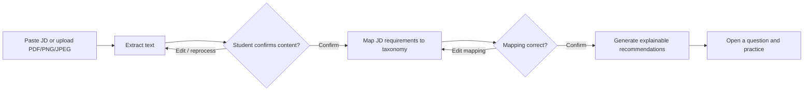
```mermaid
flowchart LR
    I["Paste JD or upload PDF/PNG/JPEG"] --> O["Extract text"]
    O --> V{"Student confirms content?"}
    V -- "Edit / reprocess" --> O
    V -- "Confirm" --> M["Map JD requirements to taxonomy"]
    M --> C{"Mapping correct?"}
    C -- "Edit mapping" --> M
    C -- "Confirm" --> R["Generate explainable recommendations"]
    R --> P["Open a question and practice"]
```

---

## 3.3 S11 — Upload Job Description

**Prototype frame:** 
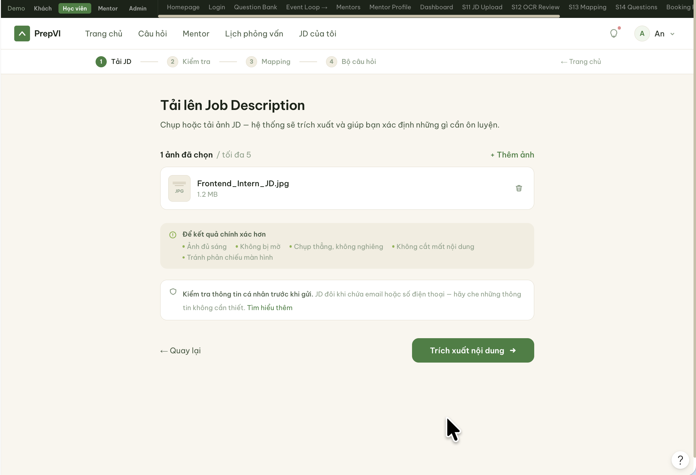

**Purpose:** Reduce the starting barrier for a Student who does not know what to study.

### Prototype behavior

- Allow the Student to paste JD text or upload one supported document/image.
- Supported PoC input may include PDF, PNG, and JPEG.
- Show a preview before submission where applicable.
- Explain supported size/page constraints.
- Show clear validation when the file is unsupported or unreadable.
- Include a privacy notice encouraging the Student to remove unnecessary personal information.
- Provide a clear CTA such as **Extract content**.
- Prevent accidental duplicate submission in the interaction design.

### Validation question

> Can the Student understand how to provide a JD without assistance?

---

## 3.4 S12 — Review Extracted Content

**Prototype frame:** 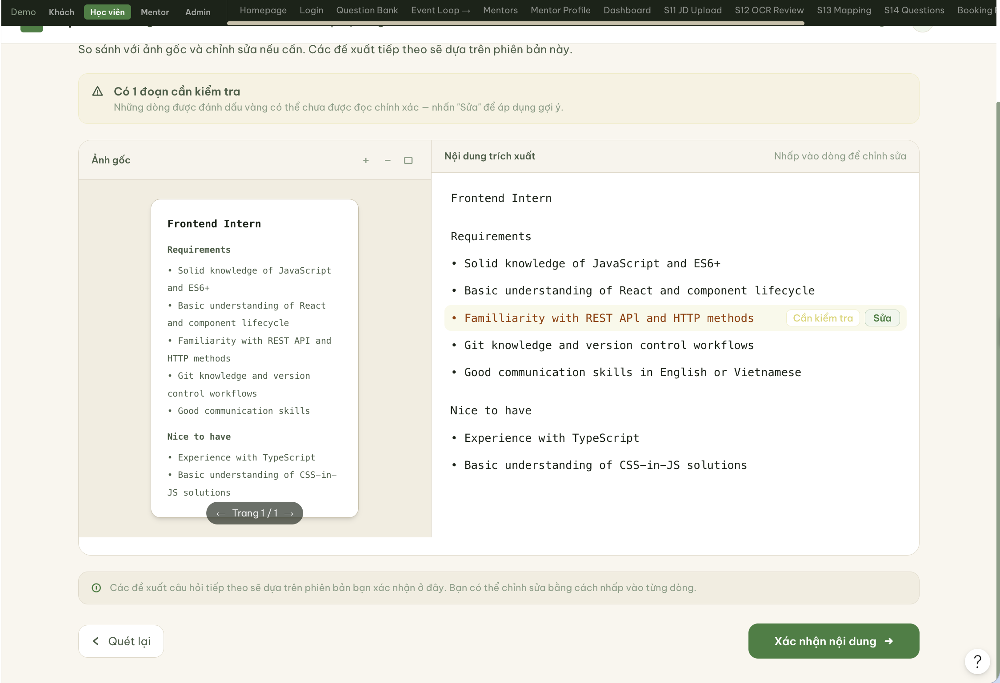

**Purpose:** Give the Student control over the input before recommendations are generated.

### Prototype behavior

- Show the source JD next to the extracted text where practical.
- Make extracted text editable.
- Mark uncertain or unreadable segments rather than silently inventing content.
- Allow the Student to correct the content.
- Provide **Reprocess** and **Confirm content** actions.
- Do not allow mapping to continue when the extracted content is empty or clearly insufficient.

### Validation question

> Can the Student detect and correct important extraction mistakes before the system uses the JD?

---

## 3.5 S13 — JD Requirement Mapping

**Prototype frame:** 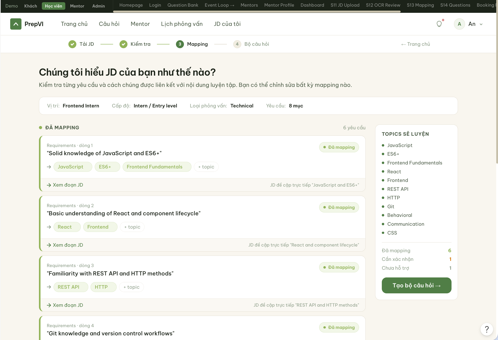

**Purpose:** Explain how PrepVI interprets the JD before recommending questions.

### Prototype behavior

- Extract meaningful requirements such as position, seniority, skills, topics, and interview context.
- Map each relevant JD requirement to the existing question taxonomy.
- Show the source JD fragment that led to each mapping.
- Distinguish between:
  - mapped,
  - needs confirmation,
  - unsupported / no taxonomy match.
- Allow the Student to edit, remove, or reject incorrect mappings.
- Avoid adding skills that are not supported by the JD.
- Enable **Create question set** only when at least one useful mapping exists.

### Validation question

> Does the Student understand how PrepVI interpreted the JD, and can the Student correct a wrong interpretation?

---

## 3.6 S14 — Recommended Question Set

**Prototype frames:**

- 
- 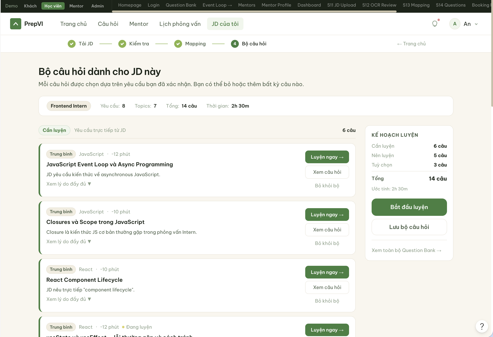

**Purpose:** Turn JD requirements into a concrete and explainable preparation starting point.

### Prototype behavior

- Group recommended questions by priority, for example:
  - Must practice,
  - Should practice,
  - Optional.
- Show topic, difficulty, and estimated effort where useful.
- Every recommendation should include a clear reason tied to a mapped JD requirement.
- Allow the Student to remove irrelevant questions.
- Allow the Student to add questions from the Supporting Question Bank.
- Provide **Practice now** or **Start practicing**.
- Preserve the connection between the question and the JD reason when entering practice.
- Show an empty state if no useful recommendations are available.

### Validation question

> Can the Student explain why a question was recommended and decide what to practice next?

---

## 3.7 S03 — Practice Question

**Purpose:** Complete the Core Prototype by proving that the recommendation leads to an actionable practice step.

### Prototype behavior

- Show question content and relevant context.
- Show answer criteria, hints, or guidance where appropriate.
- Preserve provenance or recommendation reason when useful.
- Allow a simple practice state such as:
  - Not started,
  - Practicing,
  - Confident.
- Avoid presenting one rigid "correct answer" for behavioral questions.
- Allow the Student to continue to the mentor flow when human feedback is needed.

### Validation question

> Can the Student move from recommendation to actual practice without losing context?

---

# 4. Supporting Prototype

## S02 — Question Bank

**Prototype frame:** 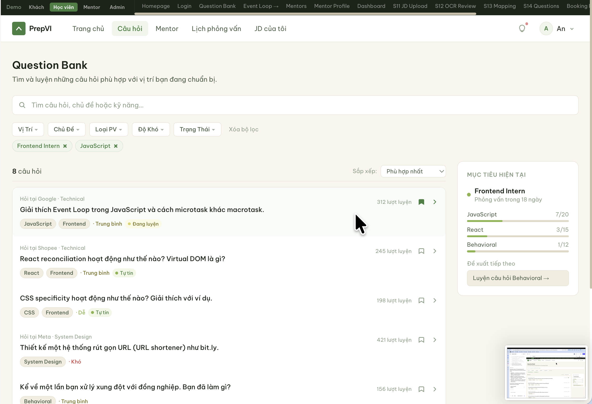

The Question Bank supports the Core Prototype but is not the main hypothesis being validated.

### Purpose

- Let the Student inspect, expand, or replace JD-based recommendations.
- Provide a fallback when the taxonomy mapping does not produce enough useful results.

### Prototype behavior

- Search by keyword.
- Filter by Position, Topic, Interview Type, and Difficulty.
- When opened from S14, preserve the filters derived from JD mappings.
- Let the Student remove individual JD-derived filters.
- Provide a meaningful zero-result state.
- Avoid duplicate rendering of a question that has multiple tags.
- Support clear pagination or load-more behavior.

### Supporting validation question

> Can the Student recover when recommendations are incomplete and still find relevant questions manually?

---

# 5. Secondary Flow

The Secondary Flow validates the mentoring and feedback experience. It is useful to the overall product, but it is separate from the main **JD → personalized preparation** hypothesis.

## 5.1 Student Secondary Flow

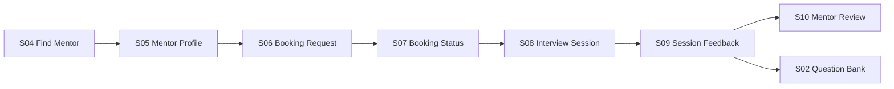
```mermaid
flowchart LR
    S04["S04 Find Mentor"] --> S05["S05 Mentor Profile"]
    S05 --> S06["S06 Booking Request"]
    S06 --> S07["S07 Booking Status"]
    S07 --> S08["S08 Interview Session"]
    S08 --> S09["S09 Session Feedback"]
    S09 --> S10["S10 Mentor Review"]
    S09 --> S02["S02 Question Bank"]
```

### S04 — Find Mentor

**Prototype frame:** 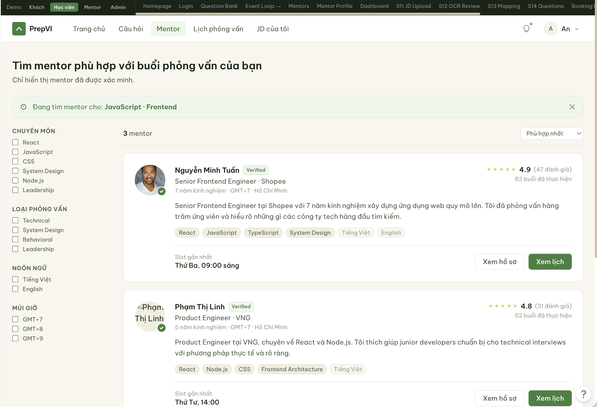

- Filter by expertise, interview type, language, availability, and other useful attributes.
- Show only Mentors eligible to receive bookings.
- Show enough information for the Student to compare candidates.
- Distinguish between "no Mentor" and "no available slot" states.

### S05 — Mentor Profile

- Show public bio, expertise, verification status, service scope, ratings, and availability.
- Show timezone clearly.
- Explain that the actual meeting may use an external provider.

### S06 — Booking Request

**Prototype frame:** 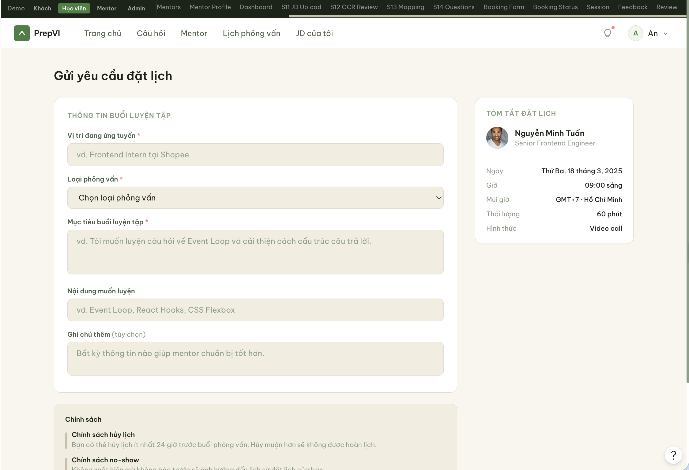

- Show fixed Mentor and slot summary.
- Require interview goal / target role / practice focus.
- Allow recommended questions or topics to be attached.
- Show relevant cancellation/no-show policy before submission.

### S07 — Booking Status

**Prototype frame:** 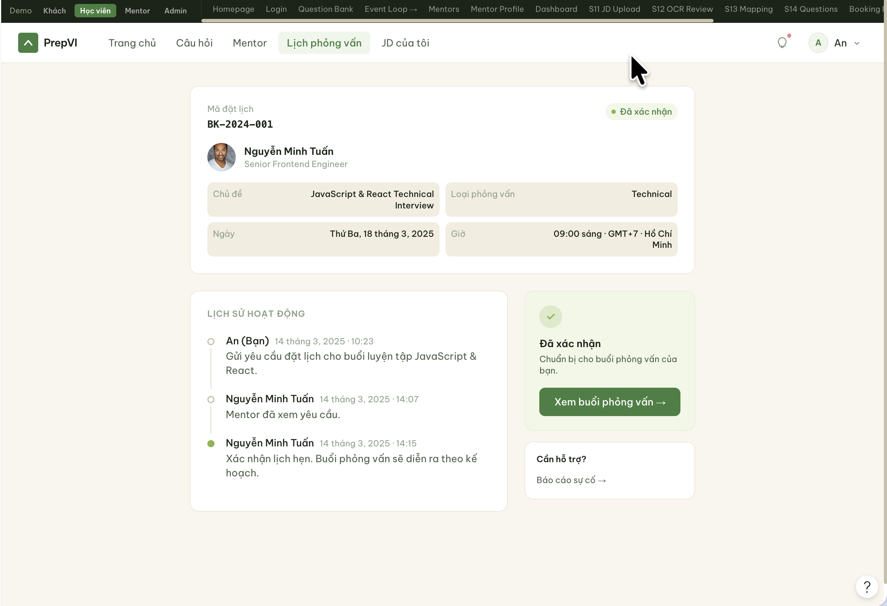

- Show Pending, Confirmed, Reschedule proposed, Rejected, and Cancelled states.
- Make the next valid action clear.

### S08 — Interview Session

**Prototype frame:** 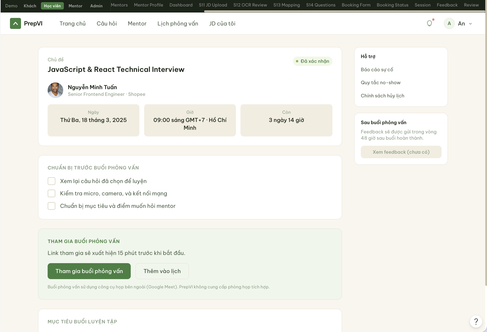

- Show goal, topic, Mentor, local time, and external meeting information when appropriate.
- Keep actions consistent with booking state.

### S09 — Session Feedback

**Prototype frame:** 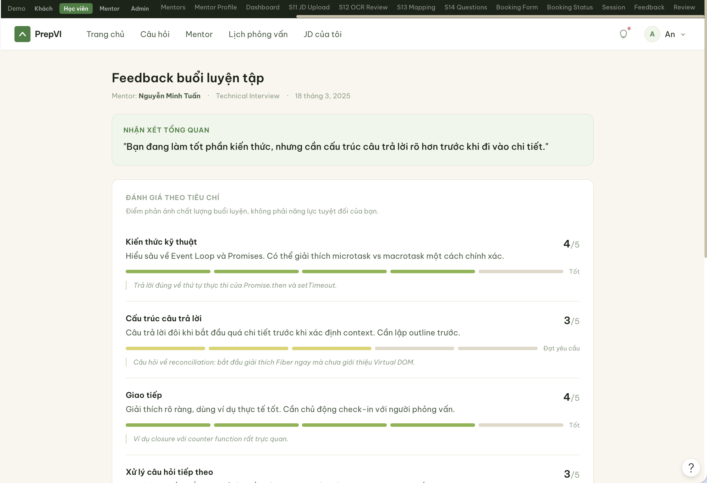

- Show structured rubric feedback.
- Include strengths, weaknesses, evidence, and next actions.
- Link next actions back to relevant topics or questions.
- Keep feedback private to appropriate actors.

### S10 — Mentor Review

**Prototype frame:** 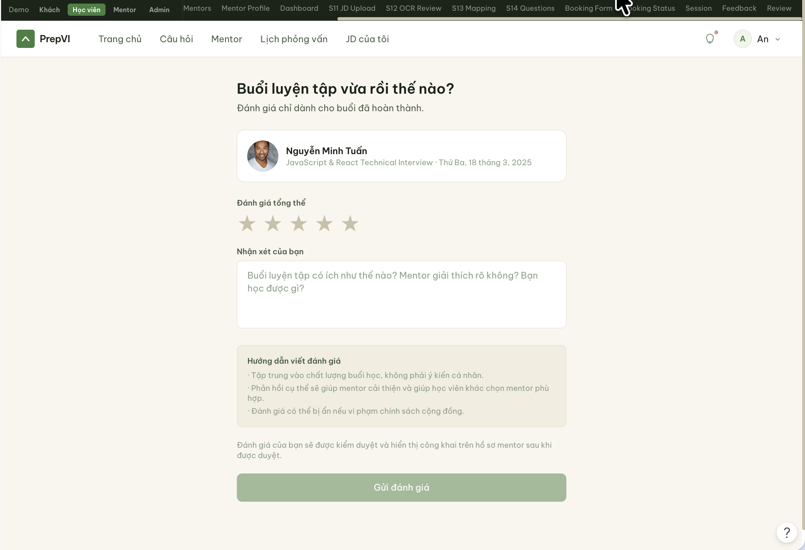

- Allow rating and comment after an eligible completed booking.
- Explain review visibility/moderation where relevant.

---

## 5.2 Mentor Secondary Flow

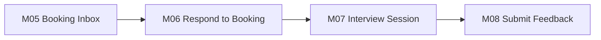
```mermaid
flowchart LR
    M05["M05 Booking Inbox"] --> M06["M06 Respond to Booking"]
    M06 --> M07["M07 Interview Session"]
    M07 --> M08["M08 Submit Feedback"]
```

### M05 — Booking Inbox

**Prototype frame:** 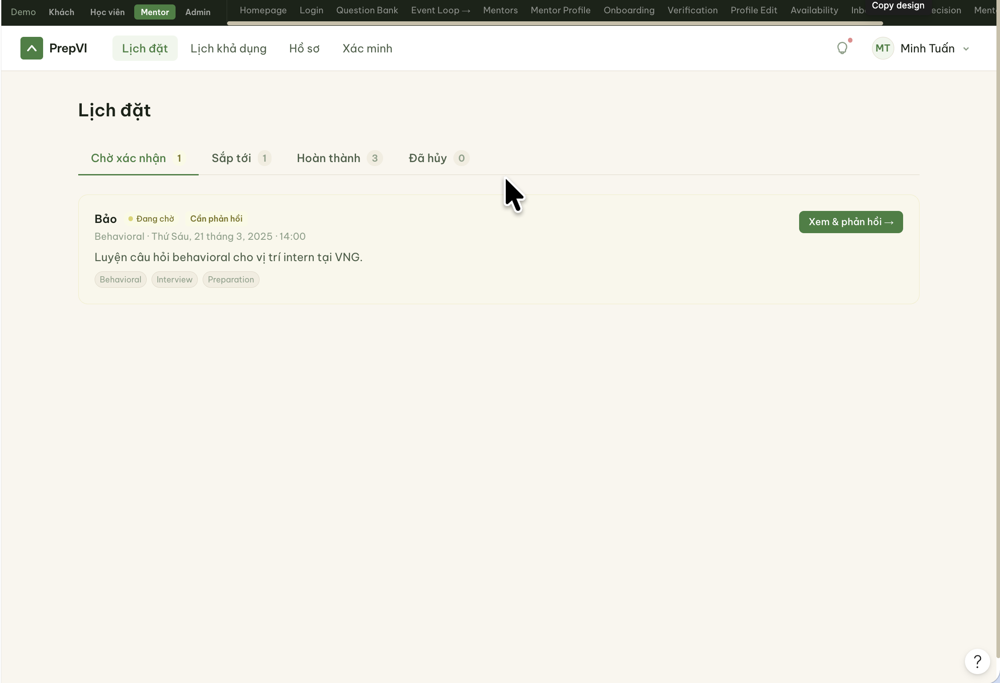

- Show Pending, Upcoming, Completed, and Cancelled bookings.
- Show enough Student context for the Mentor to make a decision.

### M06 — Respond to Booking

- Allow Accept, Reject with reason, or Propose new slot.
- Explain the effect of each action before confirmation.

### M07 — Interview Session

- Show Student goal, selected topics/questions, and meeting information.
- Allow session completion/no-show state where appropriate.

### M08 — Submit Feedback

- Provide rubric-based feedback fields.
- Require strengths, improvement areas, and next actions.
- Allow the Mentor to reference taxonomy topics or questions.
- Support draft/save/submit interaction if needed by the workflow.

---

# 6. Extended / Operational Prototype

The Extended / Operational scope is useful for validating administrative and lifecycle interactions, but it is not required to prove the Core Prototype hypothesis.

## 6.1 Mentor Operational Flow

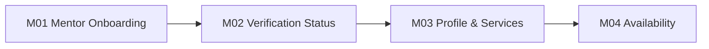
```mermaid
flowchart LR
    M01["M01 Mentor Onboarding"] --> M02["M02 Verification Status"]
    M02 --> M03["M03 Profile & Services"]
    M03 --> M04["M04 Availability"]
```

### M01 — Mentor Onboarding

- Expertise, experience, language, interview types, and service scope.
- Evidence submission interaction with privacy notice.
- Draft and validation states.

### M02 — Verification Status

**Prototype frame:** 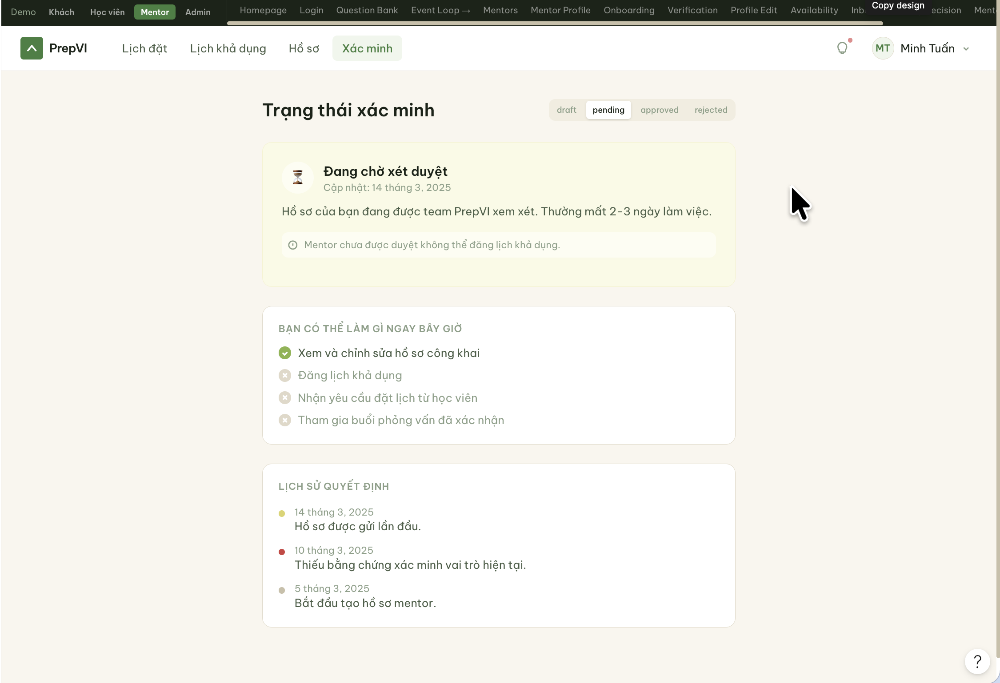

- Draft, Pending, Approved, and Rejected states.
- Explain why a Mentor cannot publish availability until eligible.
- Allow resubmission when appropriate.

### M03 — Profile & Services

**Prototype frame:** 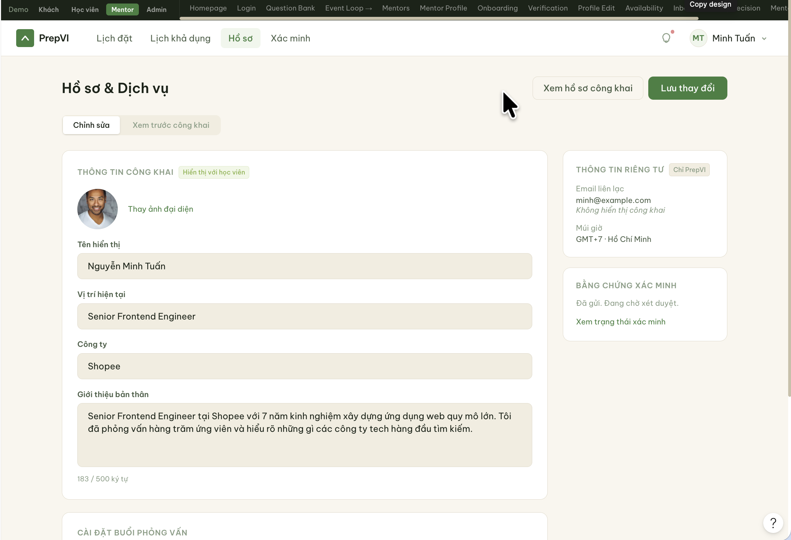

- Separate public profile data from private verification data.
- Show service format, duration, expectations, and relevant policy information.

### M04 — Availability

**Prototype frame:** 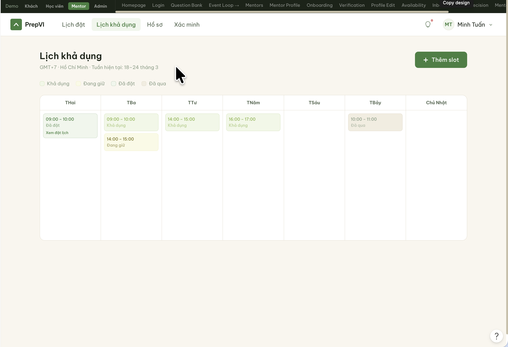

- Create, edit, and remove future availability.
- Show timezone clearly.
- Prevent obviously invalid or overlapping time ranges at the interaction level.

---

## 6.2 Admin Operational Flow

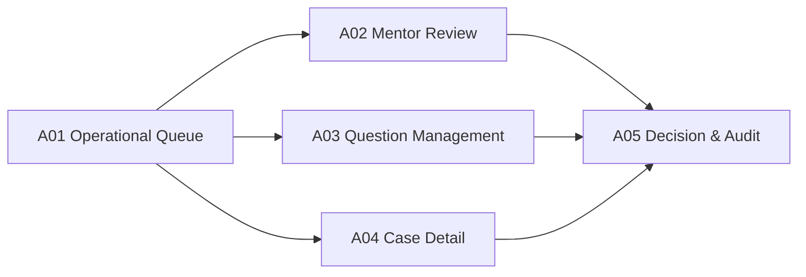
```mermaid
flowchart LR
    A01["A01 Operational Queue"] --> A02["A02 Mentor Review"]
    A01 --> A03["A03 Question Management"]
    A01 --> A04["A04 Case Detail"]
    A02 --> A05["A05 Decision & Audit"]
    A03 --> A05
    A04 --> A05
```

### A01 — Operational Queue

**Prototype frame:** 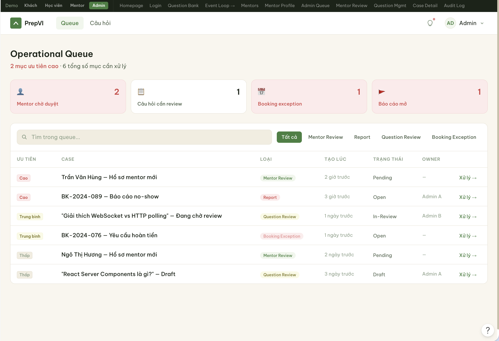

- Prioritize actionable operational work such as pending Mentor reviews, reported questions, booking exceptions, and reports.

### A02 — Mentor Review

**Prototype frame:** 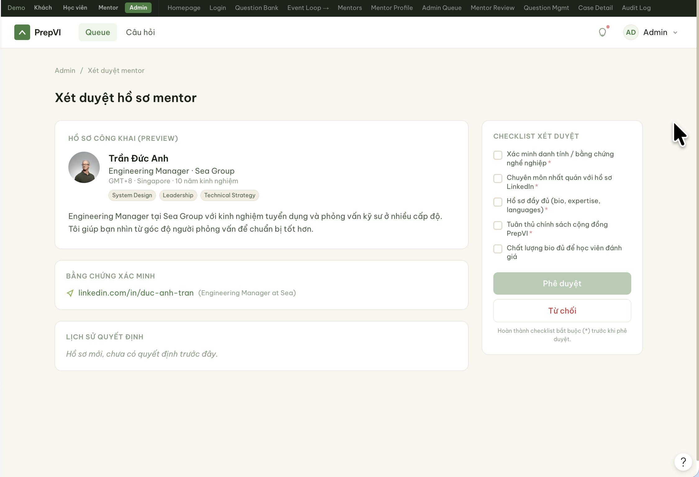

- Show profile preview, verification evidence, checklist, and prior decision context where relevant.
- Require an explicit decision reason.

### A03 — Question Management

- Support question lifecycle interactions such as Draft, In review, Published, and Archived.
- Show taxonomy and source/provenance information.

### A04 — Case Detail

- Show enough timeline and policy context to understand the case.
- Keep internal notes separate from user-visible information.

### A05 — Decision & Audit

- Confirm the effect of an operational decision before applying it.
- Show an immutable-looking audit summary in the prototype, while avoiding any claim that production audit guarantees already exist.

---

# 7. States to Prototype

Prototype states should be prioritized by how strongly they affect user understanding of the validated flow.

## 7.1 Core states — Must Prototype

| State | Relevant screens | Why |
|---|---|---|
| Loading / processing | S11–S14 | User must understand that work is in progress |
| Empty input | S11–S12 | Prevents an invalid start |
| Validation error | S11–S13 | Requirement clarification |
| OCR / extraction uncertainty | S12 | Lets the Student correct input |
| Unsupported content | S11–S12 | Provides recovery path |
| No taxonomy match | S13 | Prevents false interpretation |
| Incorrect mapping | S13 | Directly validates user control |
| No recommended question | S14 | Provides recovery without losing prior work |
| Zero-result Question Bank | S02 | Supports manual fallback |

## 7.2 Secondary states — Prototype when relevant

- No Mentor matching filters.
- No available slot.
- Booking Pending / Confirmed / Rejected / Cancelled.
- Reschedule proposed.
- Feedback not yet available.

## 7.3 Operational states — Document but do not overclaim

- Permission denied.
- Concurrent slot conflict.
- Provider failure.
- Offline/timeout retry.
- Audit/history behavior.

These may appear in the prototype as interaction states, but they must not be treated as proof that production security, concurrency, reliability, or audit behavior has been implemented correctly.

---

# 8. Prototype Test Plan

## 8.1 Core Prototype Test Tasks

| Task | Persona | Success criterion |
|---|---|---|
| Upload or paste a JD | Student | Completes without assistance |
| Review extracted text | Student | Detects and corrects an important extraction mistake |
| Review JD mappings | Student | Understands mapped / uncertain / unsupported items |
| Correct a wrong mapping | Student | Changes or removes it successfully |
| Review recommended questions | Student | Can explain why at least one question was recommended |
| Start practicing | Student | Opens a recommended question without losing JD context |
| Recover from no useful recommendation | Student | Reaches S13 or S02 and finds another path |

## 8.2 Supporting / Secondary Tasks

| Task | Persona | Success criterion |
|---|---|---|
| Find a Front-end / JavaScript question | Student | Finds a relevant result with no assistance |
| Find a Mentor | Student | Selects suitable expertise and timezone |
| Submit a booking | Student | Completes and understands Pending state |
| Respond to a booking | Mentor | Chooses a valid action and understands its effect |
| Submit structured feedback | Mentor | Provides strengths, improvement areas, and next actions |
| Review a Mentor application | Admin | Makes a decision with reason |

## 8.3 Evidence to Collect

Collect:

- task completion,
- time on task,
- errors,
- confusion points,
- confidence,
- qualitative comments,
- mapping corrections,
- recommendation usefulness.

Recommended prototype acceptance targets may include:

- Student core task completion ≥ 80%,
- most critical extraction mistakes can be corrected before mapping,
- Students can explain the reason behind a recommended question,
- average perceived usefulness of the generated preparation set ≥ 4/5.

These targets are prototype acceptance goals, not population-level statistical proof.

---

# 9. Prototype vs Proof of Concept

The terms **Prototype** and **Proof of Concept (PoC)** should be kept distinct.

## Prototype

Validates how users understand and interact with the proposed solution.

Example:

```text
Upload JD → Review → Mapping → Recommendations → Practice
```

Typical evidence:

- usability observation,
- user feedback,
- task completion,
- confusion points,
- requirement clarification.

## Technical PoC

Validates whether a technical idea is feasible enough to continue exploring.

Example:

```text
Document → Text extraction/OCR → Requirement parsing → Taxonomy mapping → Question retrieval
```

A technical PoC may exist without a polished UI.

The UI workflow in this document should primarily be treated as the **Prototype**, while OCR, taxonomy mapping, and recommendation experiments may be evaluated separately as technical PoCs.

---

# 10. Handoff and Traceability

| Prototype level | Screens | Primary purpose |
|---|---|---|
| Core | S11, S12, S13, S14, S03 | Validate JD → personalized preparation |
| Supporting | S02 | Manual question discovery / fallback |
| Secondary — Student | S04–S10 | Mentor discovery, booking, feedback |
| Secondary — Mentor | M05–M08 | Booking response and feedback lifecycle |
| Extended — Mentor | M01–M04 | Mentor onboarding and availability |
| Extended — Admin | A01–A05 | Moderation and operational workflows |

Existing story traceability can remain linked to the same screen IDs:

| Screen group | Stories |
|---|---|
| S01–S03 | US-03–06 |
| S11–S14 | US-24–US-29; BR-12–BR-17; AC-24–AC-29 |
| S04–S08 | US-10–14,19 |
| S09–S10 | US-16–17 |
| M01–M04 | US-07–09 |
| M05–M08 | US-12–15 |
| A01–A05 | US-08,18,20 |

All design frames and image files should continue using the same screen ID convention:

```text
<SCREEN-ID>-<screen-name>.png
```

The key review question for the v2 prototype is:

> **Can a Student move from an unfamiliar Job Description to an understandable, explainable, and actionable interview preparation path?**

Everything outside that question is supporting, secondary, or operational scope.
