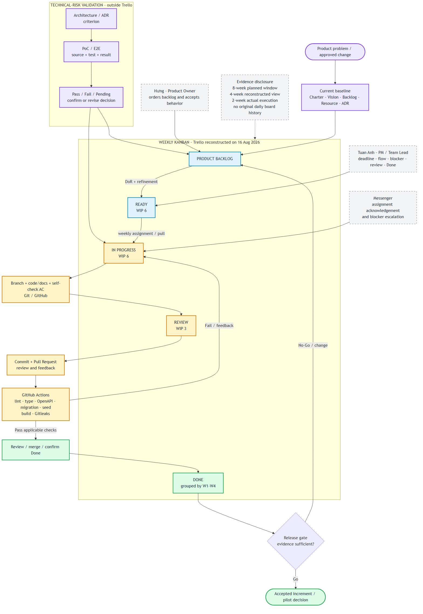

# PrepVI Software Process Definition

## Document control

| Field | Value |
| --- | --- |
| Project | PrepVI — Interview Practice Platform |
| Process baseline | Weekly Kanban with incremental integration |
| Planned window | 29 June–23 August 2026 |
| Actual InterviewQuestionBank execution | 10–23 August 2026 |
| Process owner | Tuấn Anh — Project Manager / Team Leader / Timekeeper |
| Product acceptance | Hưng — Product Owner / Business Analyst |
| Status | Defined from current project sources and checked against observed/reconstructed evidence |

## 1. WHAT, WHY, and WHEN

### 1.1 WHAT — What this process defines

This document defines how the PrepVI team turns an ordered Product Backlog item into a reviewed, integrated, and accepted increment. It describes the actors, workflow states, work-in-progress limits, inputs, activities, tools, outputs, entry/exit policies, evidence, and feedback paths used by the project.

The process covers:

- backlog refinement and Ready control;
- weekly assignment, Kanban coordination, and blocker escalation;
- analysis, design, implementation, documentation, and testing;
- Git branch, commit, Pull Request, review, CI, merge, and Done confirmation;
- technical-risk validation through PoC work outside Trello;
- change, feedback, release, and process evaluation.

### 1.2 WHY — Why Kanban fits this project

The six-person team handled product, planning, UI/UX, architecture, PoC, front-end, back-end, and integration work in parallel. The product direction also changed late from Splitly to InterviewQuestionBank and then from a Mentor-first concept to a candidate-first JD flow. Weekly Kanban supports visible work, flexible priority, explicit WIP, and frequent integration without claiming fixed Scrum sprints that the team did not operate.

DoR, DoD, architecture review, Pull Request review, CI, security/privacy checks, and release gates remain necessary. Kanban controls flow; it does not remove product, technical, or quality governance.

### 1.3 WHEN — When the process applies

The process starts when the Product Owner creates or changes a backlog item. It applies whenever work is refined, assigned, pulled, implemented, reviewed, integrated, accepted, blocked, or returned for change. Replenishment and flow review occur weekly or when new work or a change must be confirmed.

Three time layers must not be mixed:

1. **Eight-week planning window:** 29 June–23 August 2026.
2. **Four-week reconstructed execution view:** 27 July–23 August 2026.
3. **Actual InterviewQuestionBank execution:** 10–23 August 2026.

The four-week board view is reconstructed evidence, not proof of real-time tracking throughout those four weeks.

## 2. Source and evidence model

The process was formed from the following inputs:

| Input | Process information supplied |
| --- | --- |
| Project Charter | Roles, authority, planned window, decision rules |
| Stakeholder Analysis | Communication and review cadence, escalation paths |
| Vision & Scope | Product boundary and release objective |
| Product Backlog and AC | Priority, stories, DoR, DoD, WIP-aware readiness, change control |
| Resource Plan | Weekly Kanban rhythm, capacity, tools, tracking expectations |
| Prototype and Architecture/ADRs | Design and technical constraints |
| Weekly assignments and Messenger | Work assignment, acknowledgement, blocker communication |
| Reconstructed Trello | Workflow states, WIP 6/6/3, assignees, weekly Done grouping |
| Git, Pull Requests, and CI | Implementation, integration, automated-check evidence |
| Q11, Q16, Q17, and Lessons Learned | Actual events, review results, and evidence limitations |

Evidence is classified as:

- **Defined:** a rule or expected practice stated in an approved/current project document.
- **Observed:** a repository, PR, CI, message, or artifact directly demonstrates that an event occurred.
- **Reconstructed:** the team recreated a view later from available information; it must not be presented as contemporaneous tracking.
- **Missing/Pending:** no sufficient evidence exists.

## 3. Selected process model and tailoring

PrepVI uses **weekly Kanban**, not Scrum. The explicit board flow is:

`Product Backlog → Ready (WIP 6) → In Progress (WIP 6) → Review (WIP 3) → Done`

The reconstructed Trello groups Done into W1–W4 for reporting. These columns do not create four Scrum sprints.

Project-specific policies are:

- the Product Owner orders the Product Backlog and accepts business behavior;
- an item enters Ready only after applicable DoR conditions are met;
- Tuấn Anh assigns weekly work and manages deadlines, flow, blockers, and escalation;
- WIP limits are Ready 6, In Progress 6, and Review 3;
- implementation uses a branch, focused commits, Pull Request, review/feedback, CI, and merge;
- Tuấn Anh confirms Done after the applicable delivery checks;
- PoC validates technical risks outside Trello and does not automatically change scope or an ADR;
- feedback or an approved change returns to the Product Backlog for reordering and impact review;
- no Critical/High defect may remain before release acceptance.

The WIP values are visible on a reconstructed board. The repository does not prove that the limits were continuously enforced before the reconstruction date.

## 4. Process overview

The diagram combines three connected paths:

1. **Product flow:** ordered backlog through Ready, In Progress, Review, and Done.
2. **Integration flow:** branch/commit → Pull Request/review → GitHub Actions → merge/Done.
3. **Risk-validation flow:** Architecture/ADR → PoC/evidence → confirm, revise, or keep Pending.

Messenger supports assignment acknowledgement, clarification, and blocker escalation. Feedback and accepted changes return to the Product Backlog.

## 5. Roles and responsibilities

| Role/member | Process responsibility | Decision authority |
| --- | --- | --- |
| Sponsors | Review the Charter, baseline, and major change/release decisions | Approve major baseline and Go/No-Go decisions |
| Hưng — Product Owner / Business Analyst | Own vision, backlog ordering, acceptance criteria, refinement, and story acceptance | Prioritize scope and accept/reject product behavior |
| Tuấn Anh — Project Manager / Team Leader / Timekeeper | Assign work, manage deadline and Kanban, coordinate blockers/escalation, review/merge, and confirm Done | Make operational decisions without overriding PO product authority |
| Gia Thành — Planning & Estimation Analyst / Full-stack Developer | Maintain planning, capacity, cost, estimates, and implement assigned full-stack work | Provide planning evidence and implementation output |
| Luân — Architecture / Technical Lead | Own architecture, ADRs, technical constraints, and technical review | Accept/revise technical baselines and request PoC evidence |
| Hùng — UI/UX Designer / Front-end Developer | Maintain workflow/prototype and implement front-end work | Confirm UI handoff and usability findings |
| Trí — PoC / Integration & E2E Developer | Build PoCs, integration/E2E checks, and technical-risk evidence | Report evidence; does not independently change product scope |
| Development contributors | Analyze, implement, test, document, review, and integrate assigned work | Own implementation approach within approved baselines |

## 6. Activity definitions

### 6.1 Activity A — Establish or update the baseline

| Element | Definition |
| --- | --- |
| Trigger | New product direction or an approved material change |
| Inputs | Problem evidence, stakeholder feedback, scope, constraints, capacity, prior artifacts |
| Actors | Sponsors, Product Owner, Project Manager, Planning Analyst, UI/UX, Architecture, PoC/Development |
| Steps | Confirm direction → update Charter/Proposal/Vision → update backlog and estimates → review architecture/resource/release impact |
| Tools | Messenger/direct discussion, Markdown, Git/GitHub, Figma |
| Outputs | Current product baseline, roles, ordered backlog, architecture direction, plan constraints |
| Gate | Owner and approval authority are explicit; unresolved assumptions are marked Pending |
| Evidence | Current Charter, Proposal, Vision & Scope, Backlog, Resource Plan, ADRs, Git history |

Observed event: the team stopped Splitly, selected InterviewQuestionBank, then narrowed the value flow to candidate-first JD preparation. The planning documents were rebuilt after this change.

### 6.2 Activity B — Refine and move an item to Ready

| Element | Definition |
| --- | --- |
| Trigger | Weekly refinement or a need to add/change work |
| Inputs | Ordered backlog item, acceptance criteria, dependencies, design/architecture inputs, estimate and test needs |
| Actors | Product Owner with Development, Architecture, UX, and QA/PoC representatives |
| Steps | Clarify actor/value → refine AC → identify dependencies/NFRs → confirm estimate → split large work → prepare test data → check WIP-aware feasibility |
| Tools | Product Backlog Markdown, Trello/backlog tool, architecture/prototype artifacts |
| Outputs | Ready item with priority, owner candidate, AC, dependencies, estimate, and evidence needs |
| Success condition | All applicable DoR conditions pass and Ready WIP remains within 6 |
| Failure path | Item remains in Product Backlog/refinement |

### 6.3 Activity C — Assign and pull work

| Element | Definition |
| --- | --- |
| Trigger | Weekly assignment or available capacity |
| Inputs | Ready items, priority, role/skill ownership, deadlines, current WIP and blockers |
| Actors | Tuấn Anh, Product Owner, assigned member |
| Steps | Select work by priority/capacity → assign owner and cross-checker → communicate in Messenger → member acknowledges → move through the Kanban state |
| Tools | Weekly assignment table, Messenger, Trello |
| Outputs | Assigned work with expected output, owner, cross-check, and deadline |
| Success condition | The assignment is understood and WIP limits are not exceeded |
| Evidence limitation | A Messenger reaction proves receipt, not start, completion, or actual effort |

The team used a default weekly deadline of 22:00 Saturday, with deadline changes coordinated by Tuấn Anh when needed.

### 6.4 Activity D — Implement and integrate

| Element | Definition |
| --- | --- |
| Trigger | A member starts assigned Ready work |
| Inputs | Story/task, AC, design/ADR, source or document baseline, test expectations |
| Actors | Assigned member, cross-checker/reviewer, Tuấn Anh, GitHub Actions |
| Steps | Analyze → edit code/docs on branch → self-check AC → commit → open PR → review/feedback → run CI → correct failures → approve/merge |
| Tools | IDE/editor, Git, GitHub, Pull Request, GitHub Actions |
| Outputs | Versioned source/documentation, reviewable diff, CI result, merged increment |
| Success condition | Applicable review and CI checks pass; merge is completed; no blocking defect remains |
| Failure path | Return to implementation or backlog/change control depending on the cause |

The CI currently checks lint, TypeScript, OpenAPI drift, PostgreSQL migration/seed, build, and Gitleaks. It does not currently run the repository's `npm run test` command or deploy, so CI success alone does not prove full DoD or release readiness.

### 6.5 Activity E — Confirm Done and feed back

| Element | Definition |
| --- | --- |
| Trigger | Review and integration checks are complete |
| Inputs | Merged increment, AC/NFR evidence, test/build result, updated contracts/docs, defect status |
| Actors | Owner, reviewer, Tuấn Anh, Product Owner where product acceptance applies |
| Steps | Verify applicable DoD → confirm business behavior → record Done → collect feedback/defects → update backlog and forecast when needed |
| Tools | Trello, GitHub, test evidence, Messenger/backlog |
| Outputs | Done item or a returned item with reason and next action |
| Success condition | Applicable DoD passes and acceptance authority confirms the result |
| Evidence limitation | The team describes owner self-check and Tuấn Anh review/merge/Done confirmation, but complete approval logs are not available for every PR |

### 6.6 Activity F — Validate technical risk through PoC

| Element | Definition |
| --- | --- |
| Trigger | A risky architecture assumption or validation scenario needs evidence |
| Inputs | ADR/architecture assumption, criteria, test data, technical constraints |
| Actors | Architecture/Technical Lead, PoC/E2E owner, affected developers |
| Steps | Define criteria → implement/run PoC → collect source/test/result → judge Pass/Fail/Pending → update ADR/architecture if authorized |
| Tools | Separate PoC source, Git, tests, result documents |
| Outputs | Technical evidence and an ADR/architecture status decision |
| Success condition | Evidence is reproducible and mapped to an explicit criterion |
| Boundary | PoC is outside Trello and does not automatically add product scope |

### 6.7 Activity G — Review release readiness

| Element | Definition |
| --- | --- |
| Trigger | Required scope is Done or a Go/No-Go decision is needed |
| Inputs | Integrated build, accepted stories, defects, test/UAT evidence, deployment guidance, forecast and risks |
| Actors | Product Owner, Project Manager, Technical Lead, Development/QA, Sponsors/pilot users as applicable |
| Steps | Review critical flow → review defects/security/privacy → check deployment/migration guidance → decide Go/No-Go or return work |
| Tools | Release checklist, GitHub/CI, test and UAT artifacts, risk/change log |
| Outputs | Release decision, known limitations, corrective work or pilot increment |
| Evidence status | Defined as a gate; the repository does not contain complete UAT and final release-decision evidence |

## 7. Explicit policies

### 7.1 Definition of Ready

An item enters Ready only when the applicable conditions are met:

1. actor, value, priority, dependencies, and testable AC are clear;
2. required process, prototype, API, data, and architecture inputs exist;
3. the item follows approved product/technical decisions or has an approved change;
4. the implementation team confirms its estimate;
5. an eight-point item is split or accepted as an exception;
6. evidence-sensitive work has test data and expected results;
7. Product Owner, implementer, and QA responsibility agree it can be verified within the WIP policy.

### 7.2 Definition of Done

An item is Done only when applicable AC/NFR evidence passes, the Product Owner accepts product behavior, another member reviews the change, relevant tests/build checks pass, migrations/contracts/docs are updated, secrets and unnecessary private data are absent, the target-like build is smoke-checked when applicable, and no Critical/High defect blocks delivery.

### 7.3 WIP and blocker policy

| State | Limit |
| --- | ---: |
| Ready | 6 |
| In Progress | 6 |
| Review | 3 |

Blockers are raised in Messenger when found. The current documents do not define a fixed response-time service-level expectation. The WIP limits come from the reconstructed Trello and should not be described as continuously measured historical compliance.

### 7.4 Change policy

The Product Owner owns backlog priority and acceptance. A material change updates its story, AC, dependencies, estimates, traceability, affected prototype/architecture contracts, release impact, and forecast. Changes exceeding scope, schedule, cost, resource, security/privacy, or release thresholds require the appropriate PO/Sponsor/technical decision.

## 8. Work products and traceability

| Work product | Used by the process | Control/evidence |
| --- | --- | --- |
| Charter and Stakeholder Analysis | Roles, authority, communication, escalation | Current version and approval status |
| Vision & Scope and Backlog | Priority, AC, DoR/DoD, release scope | Product Owner ownership and change history |
| Weekly assignment and Messenger | Assignment, acknowledgement, blocker coordination | Screenshots/messages; acknowledgement is not completion |
| Trello Kanban | Work states, WIP, assignee, weekly Done grouping | Reconstructed on 16 August; not original daily tracking |
| Prototype and Architecture/ADRs | Design and technical boundaries | Owner/reviewer and decision status |
| PoC source/test/result | Technical-risk validation | Criteria-to-evidence mapping; outside Trello |
| Source/docs, commit, and PR | Versioned implementation and review flow | Git history and diff |
| GitHub Actions result | Automated integration checks | Workflow status/log; tests and deployment remain separate gaps |
| Increment/release evidence | Acceptance and Go/No-Go | Incomplete UAT/release evidence remains Pending |

Traceability follows:

`Product objective → story → AC/NFR → design/ADR → assignment → source/docs/PR → CI/test evidence → Done/feedback`

## 9. Tools and project configuration

| Need | Tool used | Evidence/control |
| --- | --- | --- |
| Product backlog and flow | Markdown backlog and reconstructed Trello | Story, priority, AC, states, WIP and Done grouping |
| Assignment/coordination | Weekly assignment table and Messenger | Owner, output, cross-check, deadline, acknowledgement, blocker discussion |
| Version control/integration | Git and GitHub | Branch, commit, PR, merge and history |
| Automated integration | GitHub Actions | Lint, type, contract, migration, seed, build and secret scan |
| Design | Figma/prototype artifacts | Workflow and interface handoff |
| Technical decisions | Markdown architecture and ADRs | Decision rationale, status and validation criteria |
| Evidence | Tests, CI logs, screenshots and reports | Expected-versus-observed comparison with limitations disclosed |

## 10. Evaluation and improvement

### 10.1 Evaluation method

The process is evaluated with **Criteria → Evidence → Judgement**:

1. Define a criterion for roles, states, WIP, DoR/DoD, input/output, review, CI, change or release.
2. Collect evidence from current documents, Trello, Messenger, Git, PR, CI, tests and reports.
3. Judge Pass, Fail or Pending.
4. Correct the process document or project artifact when evidence differs from the description.

### 10.2 Evidence-supported findings

- Current Charter, Resource Plan, Backlog, Stakeholder Analysis, Q11, Q16, Q17 and Q21 consistently identify weekly Kanban rather than Scrum.
- The reconstructed board defines Product Backlog, Ready 6, In Progress 6, Review 3, and Done by week.
- Git/PR/CI evidence supports incremental integration across workstreams.
- Roles and authority are now aligned: Tuấn Anh manages delivery/Kanban; Hưng owns backlog/acceptance; Gia Thành owns planning/estimation and contributes development.
- The team rebuilt planning documents after two major product-direction changes.

### 10.3 Evidence gaps

- no original daily Trello snapshots before reconstruction;
- no trustworthy historical throughput or cycle-time series;
- no person-hour timesheet;
- no complete weekly reforecast or process-review record created at the time;
- no formal retrospective minutes;
- incomplete PR approval evidence across all changes;
- CI does not run the full test command and does not deploy;
- no complete UAT and final release-decision evidence.

The reconstructed board records 26 of 27 Must stories and 129 of 134 SP as Done. This is a reconstructed board state, not 96.3% of actual effort and not proof that the board was updated in real time.

### 10.4 Improvement actions

1. Keep one live board and retain weekly snapshots or exports.
2. Record state-change timestamps to calculate throughput, cycle time, WIP age and blocked time.
3. Link every card to its story, PR, AC and acceptance evidence.
4. Retain flow/replenishment decisions and reforecast results at the time they occur.
5. Add the relevant automated test command to CI and retain UAT/release evidence.
6. Record concise process-improvement actions without inventing a retrospective that did not occur.

## 11. Strengths and limitations

### Strengths

- Visible states and WIP make parallel work and review queues easier to coordinate.
- Weekly replenishment supports late product changes without pretending that fixed sprint commitments existed.
- DoR, DoD, ADR, PR and CI connect flow control with engineering quality.
- Versioned artifacts and Git history support traceability and reconstruction.

### Limitations

- Reconstructed flow data cannot establish historical Kanban performance.
- Without live state timestamps, throughput and cycle-time forecasts remain proposals rather than verified metrics.
- Broad WIP limits may not expose bottlenecks if the team does not actively review and enforce them.
- PoC outside Trello reduces visibility unless its criteria, owner, status and result are linked elsewhere.
- Informal Messenger decisions are difficult to audit without a concise decision/action log.

## 12. References and evidence sources

### Current project sources

- [Project Charter](../../../Project_Governance%20%26%20Stakeholder/Project_Charter.md)
- [Stakeholder Analysis](../../../Project_Governance%20%26%20Stakeholder/Stakeholder_Analysis.md)
- [Vision and Scope](../../../Project_Vision_and_Scope/Project_Vision_and_Scope.md)
- [Product Backlog and Acceptance Criteria](../../../Project_Vision_and_Scope/Product_Backlog_and_Acceptance_Criteria.md)
- [Resource Plan](../../../Project_Resource_Plan/ResourcePlan.md)
- [Software Architecture](../../../Project_Architecture/software_architecture.md)
- [Q11 — Project Plan](../../study/Q11_project-plan/Q11_project-plan.md)
- [Q13 — Continuous Integration](../../study/Q13_continuous-integration/Q13_continuous-integration.md)
- [Q16 — Team Management](../../study/Q16_team-management/Q16_team-management.md)
- [Q17 — Monitoring and Control](../../study/Q17_monitoring-and-control/Q17_monitoring-and-control.md)
- [Q21 — Lessons Learned](../../study/Q21_lessons-learned/Q21_lessons-learned.md)

### Method references

- [Software Development Life Cycle Model](../../../refs/04-software-development-life-cycle-model.md)
- [Scrum Development Process — includes Kanban as an Agile alternative](../../../refs/04-02-scrum-development-process.md)
- [Oral-exam process template](../../study/template/03-template-mo-hinh-quy-trinh.md)

## 13. Print checklist

- [ ] The Kanban process diagram is visible and readable.
- [ ] Each activity shows actor, input, steps, tool, output, gate and evidence.
- [ ] WIP values are Ready 6, In Progress 6 and Review 3.
- [ ] PoC is shown outside Trello.
- [ ] Eight-week planned, four-week reconstructed and two-week actual timelines are distinct.
- [ ] Reconstructed evidence is not presented as real-time tracking.
- [ ] Missing throughput/cycle-time, timesheet, retrospective and UAT evidence is disclosed.
