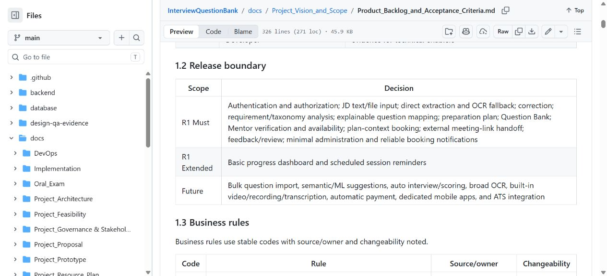
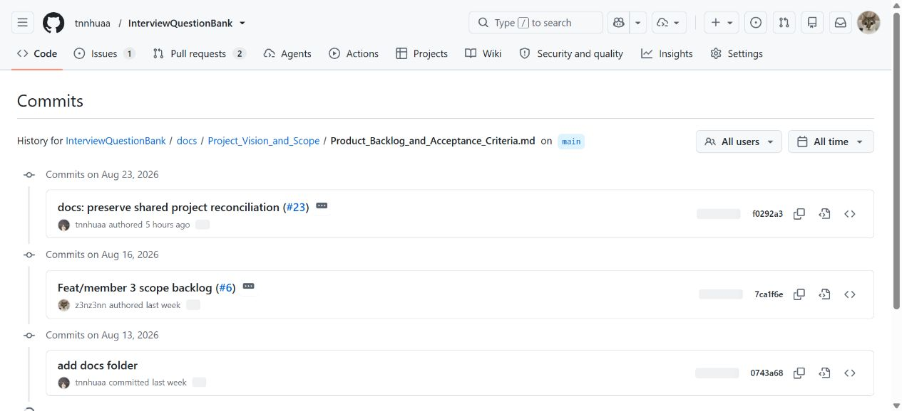

# Câu 04 - Yêu cầu phần mềm, Product Backlog và tiêu chí chấp nhận

## 1. Đề chính thức và các ý bắt buộc

> Trình bày quá trình hình thành và phương pháp đánh giá tài liệu Yêu cầu phần mềm (Software Requirements, hay Product Backlog) của nhóm.

**Bản in đề yêu cầu:** tài liệu Yêu cầu phần mềm và tài liệu Hướng dẫn sử dụng hệ thống của nhóm.

Khi trả lời phải bao phủ: nội dung chính của tài liệu; đầu vào; các bước hình thành; phương pháp đánh giá; lý do cần tài liệu; cách tài liệu được dùng và cập nhật trong dự án. Các phần còn lại của bản học giải thích thêm User Story, Acceptance Criteria (AC), Business Rule (BR), Non-functional Requirement (NFR), truy vết và kiểm soát thay đổi.

> Product Backlog là danh sách yêu cầu và công việc sản phẩm được sắp thứ tự. Nhóm dùng Product Backlog làm đầu vào cho luồng Kanban; hạng mục đủ điều kiện được kéo từ Backlog sang Ready theo giới hạn công việc đang thực hiện (Work in Progress - WIP). Thuật ngữ này không có nghĩa nhóm vận hành theo Scrum.

## 2. Câu trả lời ngắn theo WHAT - HOW - WHY - WHEN - EVIDENCE

### WHAT - Tài liệu là gì?

- **Yêu cầu phần mềm:** nhu cầu hoặc điều kiện mà sản phẩm phải đáp ứng.
- **Câu chuyện người dùng (User Story):** mô tả ngắn người dùng nào cần gì và nhận được giá trị gì.
- **Tiêu chí chấp nhận (Acceptance Criteria - AC):** điều kiện quan sát được để Product Owner chấp nhận hoặc từ chối một câu chuyện người dùng.
- **Product Backlog:** danh sách công việc sản phẩm được sắp thứ tự, có độ ưu tiên, quan hệ phụ thuộc, ước lượng và trạng thái.
- **Quy tắc nghiệp vụ (Business Rule - BR):** chính sách miền áp dụng cho một hoặc nhiều câu chuyện người dùng.
- **Yêu cầu phi chức năng (Non-functional Requirement - NFR):** thuộc tính chất lượng hoặc ràng buộc có thể đo được, như bảo mật, hiệu năng và độ tin cậy.

### HOW - Nhóm tạo tài liệu như thế nào?

1. Lấy đầu vào từ Project Charter, Vision and Scope, luồng hiện tại/tương lai, prototype, phỏng vấn và ràng buộc kiến trúc.
2. Chuẩn hóa thuật ngữ và vai trò người dùng.
3. Nhóm yêu cầu theo năng lực sản phẩm như JD, Question Bank, Mentor, Booking, Session, Feedback và Operations.
4. Viết câu chuyện người dùng theo cấu trúc vai trò - nhu cầu - giá trị.
5. Xác định quan hệ phụ thuộc và ranh giới bản phát hành.
6. Viết tiêu chí chấp nhận theo Given/When/Then hoặc điều kiện - hành động - kết quả.
7. Liên kết câu chuyện với quy tắc nghiệp vụ, NFR, luồng, bộ kiểm thử và mục tiêu sản phẩm.
8. Nhóm phát triển cùng ước lượng tương đối bằng Story Point; Product Owner sắp thứ tự theo giá trị, rủi ro và quan hệ phụ thuộc.

### WHY - Vì sao nhóm cần tài liệu này?

- Thống nhất điều sản phẩm phải làm và điều chưa thuộc phạm vi.
- Tạo đầu vào chung cho phát triển, thiết kế giao diện, kiến trúc và kiểm thử.
- Cho phép Product Owner chấp nhận dựa trên kết quả quan sát được thay vì cảm tính.
- Kiểm soát tác động khi phạm vi thay đổi.

### WHEN - Tài liệu được tạo và cập nhật khi nào?

- `0743a68` ngày 13/08/2026: thư mục tài liệu ban đầu được tạo.
- `7ca1f6e` ngày 16/08/2026, PR #6: cập nhật phạm vi và Product Backlog của nhóm.
- `f0292a3` ngày 23/08/2026, PR #23: hòa giải tài liệu dùng chung và chuẩn hóa bản tiếng Anh.
- `fd8a30b` là mốc mã nguồn được dùng cho lần đối chiếu hiện trạng này.

Git chứng minh tài liệu đã thay đổi. Repository không lưu chữ ký hoặc biên bản chứng minh Product Owner, khách hàng hay Sponsor đã chấp nhận chính thức.

### EVIDENCE - Minh chứng nào được dùng?

- Lịch sử Git của Product Backlog.
- Product Backlog, Future-State Workflow và Vision and Scope hiện hành.
- Các mô-đun, tệp chuyển đổi cơ sở dữ liệu, tuyến API và màn hình trong mã nguồn tại `fd8a30b`.
- Kết quả kiểm thử/UAT chỉ được coi là minh chứng chấp nhận khi được lưu riêng và liên kết với AC tương ứng.

## 3. Quá trình hình thành, đánh giá, sử dụng và cập nhật

### Đầu vào và các bước hình thành

1. Project Charter và Vision and Scope xác định vấn đề, mục tiêu, stakeholder, actor và ranh giới sản phẩm.
2. Current-State/Future-State Workflow và prototype làm rõ hành trình nghiệp vụ, điểm đau và giao diện dự kiến.
3. Nhóm chuyển nhu cầu thành User Story theo vai trò - nhu cầu - giá trị, sau đó nhóm theo năng lực sản phẩm.
4. Nhóm bổ sung AC, BR, NFR, phụ thuộc, Story Point, phân loại phát hành và dữ liệu/minh chứng cần kiểm tra.
5. Product Owner sắp thứ tự theo giá trị, rủi ro và phụ thuộc; nhóm phát triển đánh giá tính khả thi và ước lượng.
6. Backlog được quản lý bằng Git; thay đổi cần xem xét tác động tới kiến trúc, API, cơ sở dữ liệu, giao diện, kiểm thử và đường cơ sở phát hành.

### Phương pháp đánh giá tài liệu

| Tiêu chí | Cách đánh giá | Ví dụ bằng chứng |
|---|---|---|
| Đúng và cần thiết | đối chiếu mục tiêu, quy trình nghiệp vụ và nhu cầu stakeholder | story nối được tới mục tiêu/quy trình |
| Đầy đủ | kiểm tra luồng thành công, lỗi, quyền, dữ liệu và phục hồi | AC có trường hợp thành công, lỗi và biên |
| Nhất quán | kiểm tra thuật ngữ, trạng thái, mốc thời gian và rule dùng chung | một tên vai trò/trạng thái trong backlog, API và UI |
| Khả thi | nhóm phát triển/kiến trúc đánh giá phụ thuộc, PoC, chi phí và rủi ro | ước lượng, phụ thuộc, quyết định kiến trúc |
| Có thể kiểm thử | AC phải có điều kiện và kết quả quan sát được | liên kết AC với kiểm thử/minh chứng thủ công |
| Có thể truy vết | nối mục tiêu -> quy trình -> story -> quy tắc -> triển khai -> minh chứng | chuỗi truy vết ở mục 8 |

Việc xem xét tài liệu và lịch sử Git chỉ chứng minh đã xem xét/thay đổi. Chấp nhận chính thức cần quyết định Product Owner/UAT; repository hiện không có chữ ký đường cơ sở đầy đủ, vì vậy không được tuyên bố toàn bộ backlog đã được nghiệm thu.

### Tài liệu được dùng và cập nhật thế nào?

- Product Backlog cung cấp hạng mục cho luồng Kanban; chỉ item đủ rõ mới được kéo sang Ready theo giới hạn WIP.
- AC là cơ sở thiết kế kiểm thử/quy trình đi thử thủ công và quyết định chấp nhận; BR/NFR tạo ràng buộc dùng chung cho nhiều story.
- Khi code cho US-21/22/23 xuất hiện nhưng release classification chưa đổi, backlog vẫn là nguồn chính thức về phạm vi.
- Khi phát hiện lỗi E2E, thay đổi provider hoặc bổ sung AI hỗ trợ, nhóm phải cập nhật story/AC/rule/ADR và tác động kiểm thử; không chỉ sửa mã.
- Sau mỗi lần làm rõ, xem xét hoặc quyết định thay đổi, Git lưu tác giả, thời điểm và phần khác biệt; đường cơ sở chỉ đổi sau quyết định có thẩm quyền.

## 4. Phạm vi Product Backlog hiện hành

| Phân loại phát hành | Câu chuyện | Story Point | Ý nghĩa |
|---|---|---:|---|
| R1 Must | US-01-US-20 và US-24-US-30 | 134 | 27 câu chuyện bắt buộc trong phạm vi cơ sở |
| R1 Extended | US-21-US-22 | 8 | Chỉ chọn khi phần Must và nguồn dự phòng vẫn an toàn |
| Future/Maybe | US-23 | 8 | Không thuộc cam kết R1 hiện tại |

Câu chuyện 8 SP thể hiện độ lớn hoặc bất định cao và cần được nhóm phát triển cân nhắc tách trước khi đưa vào trạng thái Ready.

## 5. Ví dụ cụ thể: US-30

**Câu chuyện:** Là Học viên (Student), tôi muốn gắn JD hoặc Preparation Plan của mình vào lịch hẹn để Người hướng dẫn (Mentor) nhận đúng ngữ cảnh luyện tập.

**Các tiêu chí chính:**

- Yêu cầu đặt lịch tham chiếu đúng một JD hoặc một kế hoạch thuộc Học viên.
- JD/kế hoạch phải là phiên bản đang hoạt động.
- Các chủ đề được chọn phải là tập con hợp lệ của ngữ cảnh.
- Mentor phải ở trạng thái `APPROVED` và chuyên môn phải giao với chủ đề đã chọn.
- Khung giờ phải còn khả dụng trong cùng giao dịch cơ sở dữ liệu.
- Bản chụp ngữ cảnh chỉ chứa dữ liệu tối thiểu cần cho buổi luyện tập.
- Gửi lại cùng `Idempotency-Key` không được tạo lịch hẹn trùng.
- Truy cập sai chủ sở hữu không được làm lộ tài nguyên; tranh chấp khung giờ trả HTTP `409` cùng hướng chọn giờ khác.

Ví dụ này cho thấy một câu chuyện người dùng phải bao quát hành vi chức năng, bảo mật, quyền riêng tư, tính nhất quán và cách phục hồi khi xảy ra lỗi.

## 6. Cách viết tiêu chí chấp nhận tốt

Tiêu chí tốt phải:

- có kết quả quan sát được và xác định được đạt/không đạt;
- nêu vai trò, điều kiện trước, hành động và kết quả mong đợi;
- bao phủ luồng thành công, dữ liệu sai, thiếu quyền, xung đột và cách phục hồi;
- không khóa chi tiết triển khai nếu kết quả nghiệp vụ không yêu cầu;
- có giới hạn hoặc số đo cụ thể cho hiệu năng và chất lượng;
- tránh các từ mơ hồ như “nhanh”, “dễ dùng” hoặc “an toàn” khi chưa có chuẩn đo.

**Chưa tốt:** “Hệ thống tải JD lên nhanh và an toàn.”

**Tốt hơn:** “Hệ thống chấp nhận một tệp PDF/PNG/JPEG tối đa 10 MB; kiểm tra chữ ký tệp và MIME; PDF tối đa năm trang; tệp rỗng, hỏng, mã hóa hoặc không hỗ trợ bị từ chối trước phân tích với mã lỗi và hướng tải lại/dán văn bản.”

Tiêu chí chấp nhận là hợp đồng kiểm chứng, không phải tuyên bố tính năng đã hoàn thành. Muốn gọi một câu chuyện là Done vẫn cần minh chứng kiểm thử, đánh giá và quyết định chấp nhận phù hợp.

## 7. Quy tắc nghiệp vụ và NFR tiêu biểu

- **BR-02:** một khung giờ chỉ có tối đa một lịch hẹn chiếm chỗ.
- **BR-07:** chỉ câu hỏi `PUBLISHED` có phân loại và nguồn hợp lệ mới được công khai hoặc dùng cho đối sánh.
- **BR-08:** chuyển trạng thái phải được ghi audit; áp dụng các mốc 12 giờ, 24 giờ và 15 phút.
- **BR-12/13:** giới hạn tệp và OCR.
- **BR-16:** đối sánh theo trọng số 40/30/15/15, mức tối thiểu 60 và thứ tự kết quả ổn định.
- **BR-18/19:** ngữ cảnh đặt lịch tối thiểu, đúng chủ sở hữu, bảo vệ quyền riêng tư và thời hạn lưu dữ liệu.
- **NFR-01:** từ chối mặc định nếu chưa có quyền rõ ràng.
- **NFR-03:** khi nhiều yêu cầu cạnh tranh, chỉ một yêu cầu được thắng khung giờ.
- **NFR-10:** recall và precision@10 được đề xuất tối thiểu 80%; khả năng giải thích và tính lặp lại 100% trên bộ dữ liệu đã thống nhất.

Các mục tiêu NFR chỉ được báo cáo là đạt khi có kết quả đo và bộ dữ liệu/rubric được lưu.

## 8. Khả năng truy vết và kiểm soát thay đổi

Ví dụ chuỗi truy vết:

`RQ-11 -> US-24/25/26 -> BR-12/13/14/19 -> AC-24/25/26 -> TC-JD -> NFR-09/11 -> OBJ-02`

Chuỗi này trả lời yêu cầu đến từ đâu, câu chuyện nào triển khai, quy tắc nào ràng buộc và bộ kiểm thử nào kiểm chứng.

Khi thay đổi phạm vi, nhóm phải cập nhật đồng thời câu chuyện/AC, thứ tự/phụ thuộc, ước lượng, ma trận truy vết, prototype/kiến trúc bị ảnh hưởng và tác động phát hành.

## 9. Đối chiếu với mã nguồn tại baseline `fd8a30b`

| Hạng mục | Hiện trạng mã nguồn | Cách trình bày đúng |
|---|---|---|
| US-01-US-20, US-24-US-30 | Có các mô-đun và màn hình chính cho định danh, câu hỏi, JD, Mentor, đặt lịch và vận hành | Có triển khai không đồng nghĩa toàn bộ 27 câu chuyện đã qua UAT hoặc được Product Owner chấp nhận |
| US-21 | Có Dashboard dùng dữ liệu thật | Vẫn được phân loại R1 Extended trong Product Backlog |
| US-22 | Có cấu trúc dữ liệu và xử lý lịch nhắc trong tiến trình nền | Mặc định tắt bằng `BOOKING_REMINDERS_ENABLED=false`; vẫn thuộc R1 Extended |
| US-23 | Có tệp chuyển đổi cơ sở dữ liệu, API và giao diện nhập CSV | Mã nguồn tồn tại nhưng Product Backlog vẫn xếp Future/Maybe |
| Gemini theo ADR-005 | Có phân tích yêu cầu, giải thích gợi ý và bản nháp cho Mentor | Chỉ là lớp hỗ trợ có cờ tính năng, nguồn kết quả, cơ chế dự phòng và bước xác nhận; không thay bộ đối sánh theo quy tắc |
| Kiểm thử tự động | Có Vitest cho một số chính sách, API và hàm phía giao diện | Chỉ là minh chứng kỹ thuật một phần; CI hiện chưa chạy `npm test` |

Nếu muốn chuyển US-21, US-22 hoặc US-23 vào phạm vi cơ sở, Product Owner phải ra quyết định và cập nhật Product Backlog, tác động bản phát hành cùng minh chứng chấp nhận.

## 10. Câu hỏi phụ thường gặp

### Ai ước lượng Story Point?

Các thành viên tham gia triển khai cùng ước lượng. Product Owner giải thích giá trị và yêu cầu, sau đó sắp thứ tự Product Backlog; Product Owner không tự áp đặt điểm.

### Độ ưu tiên và quan hệ phụ thuộc khác nhau thế nào?

Độ ưu tiên phản ánh giá trị/rủi ro và do Product Owner quyết định. Quan hệ phụ thuộc cho biết điều kiện kỹ thuật hoặc nghiệp vụ phải có trước. Một câu chuyện ưu tiên cao vẫn có thể bị chặn bởi phụ thuộc.

### AC và Definition of Done khác nhau thế nào?

AC mô tả điều kiện chấp nhận riêng của một câu chuyện. Definition of Done là chuẩn chung gồm đánh giá, kiểm thử/minh chứng, chuyển đổi cơ sở dữ liệu, tài liệu, bảo mật và khả năng phát hành.

## 11. Minh chứng hình ảnh

**Hình Q04-01 - Product Backlog được mở trực tiếp trên GitHub tại phần ranh giới bản phát hành.**

**Hình Q04-02 - Cửa sổ lịch sử thay đổi Product Backlog trên GitHub.**

## 12. Tài liệu in kèm

- [Software Requirements Report](../../print/Q04_software-requirements/Software_Requirements_Report.md).
- [PrepVI User Guide](../../print/Q04_software-requirements/User_Guide.md).
- [Product Backlog and Acceptance Criteria](../../../Project_Vision_and_Scope/Product_Backlog_and_Acceptance_Criteria.md).
- [Future-State Workflow](../../../Project_Vision_and_Scope/Future_State_Workflow.md).

Hai tệp đầu là bản in tiếng Anh. Product Backlog là yêu cầu gốc có phiên bản; User Guide mô tả thao tác hiện có và ghi rõ giới hạn môi trường, không thay thế bằng ảnh prototype.

## 13. Dàn ý trả lời trong 10 phút trên giấy A4

1. Định nghĩa Software Requirements/Product Backlog và các thành phần User Story, AC, BR, NFR.
2. Nêu đầu vào: Charter, Vision/Scope, quy trình nghiệp vụ, prototype, nhu cầu stakeholder và ràng buộc kiến trúc.
3. Trình bày sáu bước hình thành từ nhu cầu tới backlog được sắp thứ tự.
4. Nêu sáu tiêu chí đánh giá: đúng, đầy đủ, nhất quán, khả thi, kiểm thử được và truy vết được.
5. Giải thích vì sao cần backlog: thống nhất phạm vi, làm đầu vào cho thiết kế/phát triển/kiểm thử và kiểm soát thay đổi.
6. Nêu cách sử dụng/cập nhật trong Kanban và phân biệt code đã có với story đã được nghiệm thu.
7. Dùng US-30 và chuỗi truy vết làm ví dụ.
8. Chỉ minh chứng GitHub backlog/history và hai bản in bắt buộc.

## 14. Checklist tự học

- [ ] Giải thích được yêu cầu, câu chuyện người dùng, AC, BR và NFR.
- [ ] Nêu đúng 27 Must/134 SP, 2 Extended/8 SP và 1 Future/8 SP.
- [ ] Trình bày được US-30 và một chuỗi truy vết.
- [ ] Phân biệt mã nguồn đã có với câu chuyện đã được nghiệm thu.
- [ ] Nêu đúng lịch sử `0743a68 -> 7ca1f6e -> f0292a3`.
- [ ] Không tuyên bố mục tiêu hoặc UAT chưa có minh chứng là đã đạt.
- [ ] Trình bày được phương pháp đánh giá và cách tài liệu được dùng/cập nhật.
- [ ] Mang đúng hai bản in: Requirements Report và User Guide.
