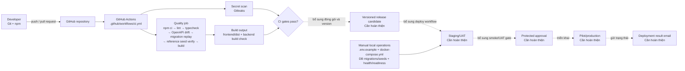

# Câu 14 — Chuyển giao liên tục (Continuous Delivery)

## 1. Đề bài và kết luận trung thực

Đề yêu cầu vẽ và giải thích mô hình Chuyển giao liên tục (Continuous Delivery – CD) thực tế, ghi công cụ ở từng thành phần, giải thích lý do áp dụng, và nộp kèm deployment scripts, database configuration scripts, third-party service configuration, deployment-result email, và hướng dẫn triển khai cho kỹ sư vận hành.

**Mức áp dụng của nhóm:** nhóm đã tự động hóa phần kiểm tra trước chuyển giao bằng GitHub Actions và chuẩn hóa các bước build, migration, seed, configuration và health check. Phần triển khai lên staging/pilot hiện vẫn là bước cần hoàn thiện vì chưa có deployment workflow, deployment script, run log hoặc deployment-result email.

Vì vậy, khi trình bày cần tách rõ hai phần: **luồng đã tự động hóa** và **luồng triển khai đang được chuẩn hóa**. Đây là mô hình chuyển tiếp từ CI sang Continuous Delivery hoàn chỉnh.

## 2. Dàn ý viết A4 trong 10 phút

1. Định nghĩa CD: mọi thay đổi đạt quality gates tạo ra release candidate có thể triển khai; đưa production vẫn là quyết định thủ công. Phân biệt Continuous Deployment: tự động đưa thay đổi đạt chuẩn lên production.
2. Vẽ hai vùng: luồng **đã có** và khoảng trống **chưa có**.
3. Đã có: Developer → GitHub → GitHub Actions CI → npm ci/lint/typecheck/OpenAPI drift/migration replay/reference seed verify/build + Gitleaks.
4. Có sẵn cho vận hành thủ công: `.env.example`, `docker-compose.yml`, database migrations/seeds, health/readiness endpoints, `Manual_Validation_and_Operations.md`.
5. Chưa có: immutable artifact/package, deploy workflow, staging deployment, protected approval, smoke test trên deployed URL, rollback/forward-fix execution, deployment notification/email.
6. Đánh giá: CI config và build script có thật; no deployment evidence. Không nộp email CI thay cho email deploy.
7. WHY: CD giúp release nhỏ, lặp lại, giảm thao tác tay/rủi ro cấu hình, tạo audit trail và rollback nhanh — nhưng đây là lợi ích chưa được hiện thực hóa đầy đủ ở dự án.

## 3. WHAT–WHY–WHEN và phân biệt thuật ngữ

- **Continuous Integration (CI):** mỗi push/PR được tích hợp và kiểm tra tự động. Output thường là source đã kiểm tra và build thành công.
- **Continuous Delivery (CD):** sau CI, pipeline tạo một release candidate nhất quán, triển khai đến môi trường kiểm thử/staging, kiểm tra sau deploy và giữ production ở trạng thái “deployable”; production có approval thủ công.
- **Continuous Deployment:** mọi thay đổi đạt gates tự động lên production, không có bước approval thủ công bắt buộc.

CD hữu ích khi nhóm cần phát hành thường xuyên, nhiều môi trường phải nhất quán, migration/configuration có rủi ro, và cần biết chính xác commit nào đang chạy. Nó phải được kích hoạt sau thay đổi source/config đã qua CI, theo flow được kiểm soát.

## 4. Sơ đồ hiện trạng của nhóm

Chú giải: đường liền là phần nhóm đã chuẩn hóa; đường chấm là phần cần bổ sung để đạt Continuous Delivery hoàn chỉnh.

Mô hình mục tiêu ghi trong Architecture là Vercel/static frontend + same-origin `/api` rewrite, Render API/worker và Neon PostgreSQL. Đây là **deployment profile được đề xuất**, không phải bằng chứng các tài nguyên đó đã được cấu hình hoặc deploy.

## 5. Hoạt động và bằng chứng thực tế

### Hoạt động 1 — Nhận thay đổi và chạy CI

- **Trigger:** push vào bất kỳ branch hoặc pull request.
- **Input:** source code, `package-lock.json`, OpenAPI schema, migration và reference seed.
- **Process/tool:** GitHub Actions trên Ubuntu, `actions/checkout@v4`, `actions/setup-node@v4`, Node 24, npm và PostgreSQL 17 service.
- **Output:** các bước install/lint/typecheck/OpenAPI drift/migration replay/seed verify/build pass hoặc fail.
- **Evidence:** [`.github/workflows/ci.yml`](../../../../.github/workflows/ci.yml).
- **Giới hạn:** workflow không upload artifact, tạo release hay deploy.

### Hoạt động 2 — Quét secret

- **Trigger/input:** cùng Git history của push/PR.
- **Process/tool:** `gitleaks/gitleaks-action@v2`, `fetch-depth: 0`.
- **Output:** secret-scan pass/fail.
- **Evidence:** [`.github/workflows/ci.yml`](../../../../.github/workflows/ci.yml).
- **Ý nghĩa cho CD:** ngăn release candidate chứa secret đã commit; không thay thế cấu hình secret của môi trường deploy.

### Hoạt động 3 — Chuẩn bị database và dịch vụ local thủ công

- **Trigger:** developer/operator chạy thủ công.
- **Input:** `.env.example`, Docker Compose, SQL migrations và seed scripts.
- **Process/tool:** `npm run db:start`, `npm run db:migrate`, `npm run db:seed:reference`, `npm run db:seed:verify`; PostgreSQL 17 và Mailpit.
- **Output:** database/schema/reference data local và SMTP sandbox phục vụ kiểm tra.
- **Evidence:** [`docker-compose.yml`](../../../../docker-compose.yml), [`.env.example`](../../../../.env.example), [`backend/scripts/db.js`](../../../../backend/scripts/db.js), [`database/migrations`](../../../../database/migrations), [Manual Validation and Operations](../../../Implementation/Manual_Validation_and_Operations.md).
- **Giới hạn:** đây không phải deployment tự động đến staging/production; demo/load seed bị cấm ở production.

### Hoạt động 4 — Dựng và xác minh ứng dụng thủ công

- **Trigger:** developer/operator chuẩn bị release candidate local.
- **Process/tool:** `npm ci`, `npm run lint`, `npm run typecheck`, `npm test`, `npm run build`; sau đó chạy API, worker, frontend và kiểm tra `/api/v1/health`, `/api/v1/readiness`, Mailpit cùng các persona walkthrough.
- **Output:** build và bằng chứng kiểm chứng thủ công nếu người vận hành thật sự lưu screenshots/log/reference IDs.
- **Evidence hướng dẫn:** [Manual Validation and Operations](../../../Implementation/Manual_Validation_and_Operations.md).
- **Giới hạn:** nhóm chưa lưu một bộ deployment evidence hoàn chỉnh gồm môi trường, run ID, reviewer decision và kết quả smoke test.

## 6. Các cấu hình bên thứ ba hiện có

| Dịch vụ/khả năng   | Cấu hình hiện có                                           | Trạng thái bằng chứng                                                        |
| ------------------ | ---------------------------------------------------------- | ---------------------------------------------------------------------------- |
| PostgreSQL         | `DATABASE_URL`, `DATABASE_SSL`, pool; local Compose        | Local/CI có cấu hình; Neon chỉ được đề xuất                                  |
| SMTP/email         | `SMTP_HOST`, port, TLS, credentials, sender; local Mailpit | Local sandbox có cấu hình; production provider chưa được chốt                |
| Private storage    | local/S3-compatible variables                              | Adapter/config surface có; production bucket chưa được chứng minh            |
| Gemini             | provider/model/key/timeout/budget/feature flags            | Code/config có; secret và deployed provider connection không được chứng minh |
| External meeting   | HTTPS meeting link do Mentor nhập                          | Không có deployment credential; provider không là source of truth            |
| Vercel/Render/Neon | Nêu trong Architecture/ADR-001                             | Proposed only; không có manifest/project/link/deploy log                     |

Không in giá trị `.env` thật. Chỉ in `.env.example` đã bỏ secret.

## 7. Đánh giá hiện trạng và khoảng trống để đạt CD

| Điều kiện CD                               | Hiện trạng                                                         | Kết luận                  |
| ------------------------------------------ | ------------------------------------------------------------------ | ------------------------- |
| Automated quality gates                    | Có CI workflow                                                     | Đạt một phần              |
| Reproducible dependency install/build      | Có lockfile, `npm ci`, `npm run build`                             | Có                        |
| Reproducible DB change                     | Có ordered migrations và replay trong CI                           | Có nền tảng               |
| Versioned immutable artifact               | Không upload/package artifact                                      | Thiếu                     |
| Environment-specific deployment automation | Không có workflow/script/manifests                                 | Thiếu                     |
| Staging deployment and URL                 | Không có evidence                                                  | Thiếu                     |
| Post-deploy smoke/health check             | Health endpoints có, pipeline không gọi deployed URL               | Thiếu automation/evidence |
| Approval and production promotion          | Không có protected environment/job                                 | Thiếu                     |
| Rollback/forward-fix execution             | Hướng dẫn yêu cầu backup/dry-run/forward-fix, chưa có run evidence | Thiếu bằng chứng          |
| Deployment notification/email              | Không có                                                           | Thiếu                     |

Muốn tuyên bố CD đã hoàn thành, nhóm liên quan phải chốt provider/environment/secret ownership và tạo bằng chứng thật cho ít nhất một lần chạy. Theo `Task_Final.md`, không tự thêm workflow hoặc ảnh/email giả chỉ để đủ hồ sơ.

## 8. Lợi ích CD đối với dự án này

- Giữ cùng commit, migration và cấu hình qua staging đến pilot.
- Phát hiện lỗi build/schema/config trước khi người dùng gặp.
- Giảm thao tác tay khi deploy frontend, API và worker riêng.
- Bảo vệ dữ liệu bằng migration gate, backup và forward-fix.
- Giữ secret ngoài repository và tạo audit trail cho approval/deployment.
- Rút ngắn thời gian đưa sửa lỗi nhỏ tới staging/pilot.

Đây là **lý do cần áp dụng**, không phải kết quả đã đo của nhóm.

## 9. Bản in cần nộp và trạng thái

- [ ] Sơ đồ hiện trạng trong mục 4, giữ nguyên nhãn `NOT IMPLEMENTED/NOT EVIDENCED`.
- [ ] CI workflow để chứng minh đầu vào hiện có: [`.github/workflows/ci.yml`](../../../../.github/workflows/ci.yml).
- [ ] Cấu hình database: [`backend/scripts/db.js`](../../../../backend/scripts/db.js) và [`database/migrations`](../../../../database/migrations).
- [ ] Cấu hình dịch vụ đã khử secret: [`.env.example`](../../../../.env.example) và [`docker-compose.yml`](../../../../docker-compose.yml).
- [ ] Hướng dẫn vận hành/kiểm chứng hiện hữu: [Manual Validation and Operations](../../../Implementation/Manual_Validation_and_Operations.md), hoàn toàn bằng tiếng Anh.
- [ ] **Deployment scripts:** chưa có; không thay CI workflow cho hạng mục này.
- [ ] **Email/giao diện kết quả deployment tự động:** chưa có; không dùng email kết quả CI để gọi là deploy result.
- [ ] **Deployment guide cho môi trường thật:** tài liệu hiện hữu chỉ đủ cho local validation và mô tả release gates; provider-specific staging/pilot procedure chưa được chốt.

Do ba mục cuối còn thiếu, Câu 14 **chưa đạt Definition of Done đầy đủ của thầy** dù phần trả lời và gap analysis đã hoàn thiện theo hiện trạng.

## 10. Những việc phải chốt với nhóm trước khi bổ sung

1. Frontend/API/worker/database thực sự deploy ở đâu; có đúng Vercel/Render/Neon hay không?
2. Ai sở hữu account, environment, domain, secrets và quyền approve production?
3. Trigger deploy là merge `main`, tag hay workflow thủ công?
4. Migration dùng backup/forward-fix thế nào và ai cho phép chạy?
5. Smoke/UAT gates và rollback condition cụ thể là gì?
6. Kênh notification deployment là GitHub UI, email hay công cụ khác?

Sau khi nhóm chốt và chạy thật, cập nhật sơ đồ, guide, run ID, deployed commit, ảnh UI/email đã che secret và kết quả smoke test.

## 11. Nguồn kiểm chứng

- [GitHub Actions CI](../../../../.github/workflows/ci.yml)
- [Root package scripts](../../../../package.json)
- [Docker Compose](../../../../docker-compose.yml)
- [Environment example](../../../../.env.example)
- [Database runner](../../../../backend/scripts/db.js)
- [Manual Validation and Operations](../../../Implementation/Manual_Validation_and_Operations.md)
- [Software Architecture](../../../Project_Architecture/software_architecture.md), phần deployment view/profile.
- [ADR-001 Technology Stack](../../../Project_Architecture/ADR/ADR-001-Technology-Stack.md), phần proposed deployment profile.
