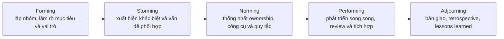
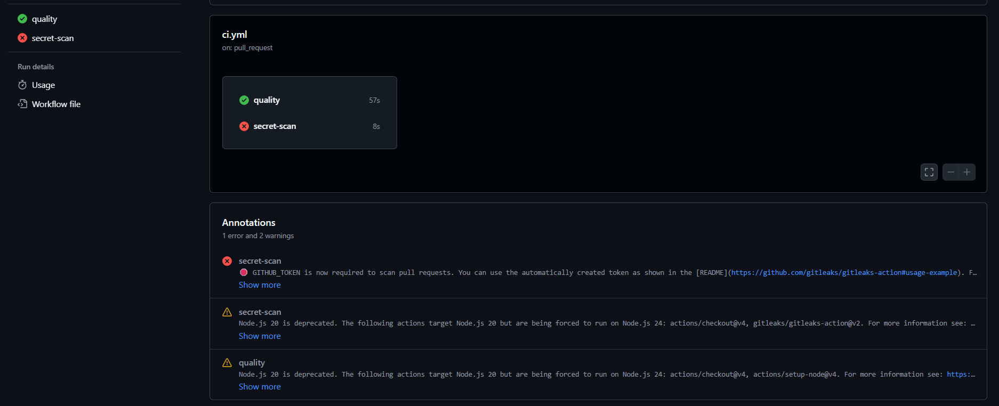

# Câu 16 — Quản lý và phát triển nhóm

## 1. Đề bài

**Câu hỏi chính:** Trình bày quá trình hình thành và phát triển nhóm mà nhóm đã trải qua. Liệt kê các vấn đề quản lý con người nhóm thực sự gặp, cách giải quyết và kết quả, kể cả khi giải pháp chưa thành công.

**Bản in phải nộp theo đề:** ảnh chụp chung của nhóm; quy định, quy chế và lịch làm việc; một biên bản họp; giao diện hệ thống liên lạc có dữ liệu thật.

**Các câu hỏi thường gặp:**

- Các giai đoạn phát triển nhóm là gì?
- Phân biệt tổ chức chức năng, theo dự án, ma trận yếu, cân bằng và mạnh.
- Các mô hình quản lý X, Y, Z là gì?
- Nhóm xử lý mâu thuẫn theo nguyên tắc nào?
- Có những cách nào để tăng năng suất nhóm?
- Tháp nhu cầu Maslow có ý nghĩa gì trong quản lý nhóm?

> **Trạng thái bằng chứng:** Repo chứng minh được cơ cấu sáu thành viên, phân vai, lịch sử đóng góp, PR/merge và một số vấn đề tích hợp kỹ thuật. Năm ảnh trao đổi nội bộ ở Q11 chứng minh nhóm dùng Messenger, đã thống nhất hướng InterviewQuestionBank và cập nhật phạm vi candidate-first. Nhóm đã cung cấp ảnh nhóm tại buổi học cuối, bảng phân công tuần 6, xác nhận deadline mặc định là 22:00 thứ Bảy hằng tuần và quy ước thả tim tin nhắn phân công để báo đã nhận việc. Nhóm không có biên bản họp. Những phần về quản lý con người phải do nhóm xác nhận, không được suy ra từ commit.

## 2. Dàn ý viết A4 trong 10 phút

1. **Nhóm:** 6 thành viên; Tuấn Anh là Project Manager / Team Leader / Timekeeper; Gia Thành phụ trách planning–estimation và Full-stack; Hưng là Product Owner / Business Analyst; Luân là Architecture / Technical Lead; Hùng phụ trách UI/UX và Front-end; Trí phụ trách PoC, Integration và E2E.
2. **Forming:** từ 29/06, sáu thành viên bắt đầu làm Splitly; các tài liệu Charter/Resource Plan hiện chỉ chứng minh cơ cấu của InterviewQuestionBank sau khi pivot.
3. **Storming:** sau giữa kỳ 24/07 và các phản biện của thầy Biên về tính khả thi của Splitly, nhóm brainstorm nhưng chưa chốt được hướng mới đến 09/08. Đây là khó khăn phối hợp và ra quyết định, chưa phải bằng chứng về xung đột cá nhân.
4. **Norming–Performing:** nhóm chọn InterviewQuestionBank, làm lại Initiation/Planning, thu hẹp candidate-first và thực hiện song song trong 10/08–23/08 qua backlog, Trello, branch/PR và CI.
5. **Kết quả delivery:** Reconstructed Kanban ghi nhận 26/27 User Story Bắt buộc, 129/134 SP Done; số liệu này không đo năng suất từng người.
6. **Vấn đề con người:** nhóm phụ thuộc nhiều vào quyết định của Tuấn Anh; khi độ phức tạp thực tế cao hơn dự kiến, một số phần việc trễ hạn và phải nới deadline.
7. **Liên hệ lý thuyết:** Tuckman, cơ cấu tổ chức, X–Y–Z, xử lý xung đột, năng suất và Maslow.
8. **Bằng chứng:** Charter, Resource Plan, backlog/Trello, Git/PR/CI, chat, bảng phân công và ảnh nhóm tại buổi học cuối; nhóm không có biên bản họp.

## 3. Tổng quan WHAT–WHY–WHEN

### WHAT — Quản lý và phát triển nhóm là gì?

Quản lý nhóm là việc tổ chức con người, vai trò, giao tiếp, quyết định, động lực và hỗ trợ để cả nhóm đạt mục tiêu chung. Phát triển nhóm là quá trình các thành viên dần hiểu nhau, thống nhất cách làm, xử lý khác biệt và phối hợp hiệu quả hơn.

### WHY — Vì sao dự án cần quản lý nhóm?

Phần mềm phụ thuộc nhiều vào trao đổi và tri thức của con người. Một nhóm có kỹ thuật tốt vẫn có thể thất bại nếu trách nhiệm mơ hồ, thông tin bị giữ riêng, quyết định không được ghi lại hoặc mâu thuẫn kéo dài. Quản lý nhóm giúp giảm phụ thuộc vào một cá nhân, phát hiện blocker sớm và giữ chất lượng phối hợp giữa các workstream.

### WHEN — Thực hiện khi nào?

Hoạt động này bắt đầu từ khi lập nhóm và kéo dài đến khi kết thúc dự án. Mức can thiệp thay đổi theo giai đoạn: làm rõ mục tiêu ở Forming, xử lý va chạm ở Storming, chuẩn hóa cách làm ở Norming, trao quyền ở Performing và tổng kết ở Adjourning.

## 4. Sơ đồ hình thành và phát triển nhóm

Đối chiếu các sự kiện đã xác nhận, quá trình của nhóm có thể trình bày như sau:

| Giai đoạn  | Sự kiện của nhóm                                                                                                                   | Giới hạn diễn giải                                                                |
| ---------- | ---------------------------------------------------------------------------------------------------------------------------------- | --------------------------------------------------------------------------------- |
| Forming    | 29/06: sáu thành viên bắt đầu dự án Splitly                                                                                        | Chưa có biên bản buổi lập nhóm hoặc bằng chứng vai trò ban đầu                    |
| Storming   | 24/07–09/08: sau khi thầy Biên phản biện tính khả thi của Splitly, nhóm loay hoay brainstorm và chậm chốt hướng mới                | Đây là bất ổn về mục tiêu/quyết định; chưa đủ bằng chứng gọi là mâu thuẫn cá nhân |
| Norming    | 09/08–14/08: Tuấn Anh chốt InterviewQuestionBank, tham khảo giảng viên, làm lại Initiation/Planning và chuyển sang candidate-first | Nhóm giữ nguyên vai trò, phân scope mới theo phần việc tương tự ở Splitly         |
| Performing | 10/08–23/08: phát triển song song, tích hợp qua PR/CI; board ghi nhận 129/134 SP Bắt buộc Done                                     | Board tái dựng ngày 16/08; không dùng SP/commit để xếp hạng thành viên            |
| Adjourning | 23/08: Tuấn Anh review Project Plan 1.0, nhóm bước vào Project Close và Lessons Learned                                            | Chỉ nên nói “bắt đầu close”; chưa có bằng chứng nhóm đã giải thể hoàn toàn        |

> **Minh chứng hình:** có thể xuất sơ đồ thành `img/Q16-01-tuckman-cua-nhom.png` sau khi nhóm xác nhận cách ra quyết định ở giai đoạn Storming–Norming.

## 5. Các hoạt động nhóm đã thực hiện

**Hình Q16-04 — Ảnh nhóm tại buổi học cuối.**

### Hoạt động 1 — Hình thành nhóm và phân vai

- **Đầu vào:** yêu cầu học phần; sau khi pivot là đề tài Interview Practice Platform và năng lực/ownership của thành viên.
- **Cách thực hiện có bằng chứng:** Project Charter và Resource Plan của InterviewQuestionBank ghi tên sáu thành viên, vai trò chính, trách nhiệm và phần kiểm tra chéo.
- **Công cụ:** Markdown, Git và GitHub.
- **Đầu ra:** cơ cấu vai trò và ownership cho proposal, requirement, prototype, architecture, PoC, estimation và governance.
- **Bằng chứng:** `Project_Charter.md`, `Stakeholder_Analysis.md`, `ResourcePlan.md`.

Tuấn Anh là người phân vai. Nhóm dựa vào vai trò và kinh nghiệm của từng thành viên trong các dự án ở những học kỳ trước để giao phần việc tương ứng. Cách phân công này giúp thành viên tiếp tục dùng stack quen thuộc, giảm thời gian học lại công nghệ và rút ngắn thời gian bắt đầu thực hiện.

Sau khi pivot, nhóm không đổi vai. Tuấn Anh ánh xạ scope của InterviewQuestionBank với các phần việc tương tự trong Splitly rồi phân công lại theo cơ cấu cũ. Nhóm thay đổi bài toán sản phẩm nhưng hạn chế thay đổi kỹ thuật, nhờ đó tận dụng kinh nghiệm và phần nền đã có.

Bảng ownership dưới đây được trích từ Project Charter:

| Thành viên | Vai trò chính                            | Trách nhiệm / đầu ra                                                                       |
| ---------- | ---------------------------------------- | ------------------------------------------------------------------------------------------ |
| Tuấn Anh   | Project Manager / Team Leader / Timekeeper | Phân vai, giao việc, quản lý deadline và Kanban, chốt quyết định, review/merge và xác nhận Done |
| Gia Thành  | Project Planning & Estimation Analyst / Full-stack Developer | Charter, Resource Plan, Cost-Time-Resources, hai estimate độc lập và implementation Full-stack |
| Hưng       | Product Owner / Business Analyst | Vision & Scope, Product Backlog, acceptance criteria, Future-State Workflow và acceptance |
| Luân       | Architecture / Technical Lead | Technology stack, ADR, architecture và hỗ trợ kỹ thuật cho PoC/implementation |
| Hùng       | UI/UX Designer / Front-end Developer | Clickable prototype, workflow, bằng chứng usability và giao diện front-end |
| Trí        | PoC / Integration & E2E Developer | PoC core flow, dữ liệu seed, tích hợp, test đầu-cuối và bằng chứng rủi ro kỹ thuật |

### Hoạt động 2 — Chia workstream và phối hợp qua repository

- **Người tham gia:** cả sáu thành viên.
- **Đầu vào:** role/ownership, backlog và kiến trúc.
- **Nhịp phân công:** Tuấn Anh giao việc theo từng tuần. Mỗi bảng tuần ghi thành viên, cụm phụ trách, nội dung cụ thể, file đầu ra chính và người cross-check.
- **Quy tắc deadline:** hạn mặc định của công việc trong tuần là **22:00 thứ Bảy**. Do các thành viên thường có lịch nộp bài ở những môn khác gần nhau, khi cần điều chỉnh, Tuấn Anh thường nới hạn cho cả nhóm để mọi người giữ được mức hoàn thiện tương đối đồng đều.
- **Kênh liên lạc và xác nhận:** nhóm dùng Messenger để gửi phân công và phối hợp. Thành viên thả tim vào tin nhắn phân công để xác nhận đã nhận việc. Phản ứng này chỉ xác nhận thành viên đã tiếp nhận thông tin; nó không chứng minh công việc đã bắt đầu hoặc hoàn thành.
- **Nhịp họp:** nhóm không có lịch họp cố định. Nhóm chỉ họp khi xuất hiện nội dung cần quyết định để tránh các workstream đi lệch hướng.
- **Phản hồi và blocker:** nhóm không quy định thời gian phản hồi. Thành viên đưa blocker lên nhóm Messenger để cả nhóm trao đổi và chốt hướng xử lý.
- **Quy tắc repository:** thành viên không push trực tiếp lên `main`; mọi thay đổi phải đi qua pull request và cần ít nhất một người approve.
- **Definition of Done:** file chia task ghi DoD của đầu ra. Thành viên tự kiểm tra acceptance criteria trước khi tạo PR; Tuấn Anh review, phản hồi và merge. Sau khi hoàn tất chuỗi này, Tuấn Anh xác nhận công việc ở trạng thái Done.
- **Cách thực hiện có bằng chứng:** thành viên hoàn thành file đầu ra, người được chỉ định cross-check kiểm tra chéo, sau đó tạo commit và pull request theo workstream. Lịch sử có PR cho prototype, architecture, initiation, backlog, database, frontend và R1 workflow.
- **Công cụ:** Git, GitHub, branch, commit và pull request.
- **Đầu ra:** tài liệu và mã nguồn được hợp nhất vào repository dùng chung.
- **Bằng chứng:** bảng tuần 6 phân sáu cụm Governance/Stakeholder, Business/Competitor, Product Vision/Scope/UX, Requirement/Acceptance, Architecture/Technical PoC và Feasibility/Project Planning. Git shortlog ghi nhận đóng góp của sáu thành viên; lịch sử có nhiều PR được đánh số trong khoảng `#1–#13` ở các workstream khác nhau.
- **Giới hạn:** bảng tuần là bằng chứng phân công và lịch dự kiến, không tự chứng minh từng đầu ra đã hoàn thành đúng 22:00 thứ Bảy.

**Hình Q16-03 — Bảng phân công và cross-check tuần 6.**

**Hình Q16-06 — Tin nhắn phân công có phản ứng tim xác nhận đã nhận việc.**

Tuấn Anh có các dấu vết trực tiếp về tích hợp và governance kỹ thuật: merge các branch, cập nhật README, bổ sung error detail, sửa lỗi practice progress/duplicate content và scaffold cây tài liệu vấn đáp. Các commit này chứng minh phần việc trong repo, không tự chứng minh hoạt động quản lý con người ngoài repo.

### Hoạt động 3 — Đồng bộ mục tiêu và thay đổi phạm vi

- **Đầu vào:** phản biện về Splitly, góp ý trực tiếp của hai giảng viên và giới hạn thời gian còn lại.
- **Cách thực hiện theo lời kể của nhóm:** Tuấn Anh tổ chức brainstorm và giữ quyền chốt phương án. Anh dùng các câu hỏi đánh giá ý tưởng đã học: sản phẩm hiện có giải quyết vấn đề ra sao; có thể kết hợp giải pháp nào; người dùng có sẵn sàng đổi từ công cụ hiện tại sang sản phẩm mới không; và những rủi ro nào có khả năng xảy ra. Sau khi chọn InterviewQuestionBank, Tuấn Anh tham khảo ý kiến giảng viên để kiểm tra lại tính khả thi và thoát khỏi giai đoạn bị stuck.
- **Cách thực hiện có bằng chứng trong repo/chat:** nhóm xác nhận ý tưởng InterviewQuestionBank trên chat ngày 13/08; sau góp ý ngày 14/08, nhóm cập nhật phạm vi candidate-first và chuẩn bị PR để chia việc/review. Repo có nhiều commit `align`, `reconcile`, `update` để đồng bộ Charter, backlog, architecture và artifacts.
- **Đầu ra:** phạm vi JD intake/analysis, preparation plan và flow booking được phản ánh nhất quán hơn trong tài liệu.
- **Bằng chứng:** `../Q11_project-plan/img/Q11-02-team-confirms-interview-idea.png` đến `Q11-05-candidate-poc-and-mentor-split.png`.
- **Cơ chế quyết định:** đây không phải biểu quyết hay đồng thuận hoàn toàn. Tuấn Anh tổng hợp ý kiến, tự chọn phương án và tham khảo giảng viên trước khi chốt. Nhóm loại hướng tiếp tục Splitly và thu hẹp hướng Mentor-first/AI interviewer để ưu tiên candidate-first theo JD.
- **Giới hạn:** cơ chế tập trung giúp nhóm ra quyết định nhanh trong thời gian gấp, nhưng tạo phụ thuộc vào một người và có thể dẫn đến lựa chọn chưa tối ưu.

### Hoạt động 4 — Review, tích hợp và xử lý lỗi

- **Đầu vào:** branch/PR của từng workstream.
- **Người review và merge:** Tuấn Anh.
- **Cách thực hiện có bằng chứng:** Tuấn Anh kiểm tra thay đổi, dùng kết quả CI làm quality gate rồi mới merge hoặc yêu cầu xử lý lỗi.
- **Công cụ:** GitHub Actions; pipeline chạy lint, typecheck, OpenAPI drift, migration, seed verification, build và Gitleaks.
- **Trường hợp thực tế:** Trí đưa file `.env` có key và thư mục `node_modules` vào repository. Tuấn Anh phát hiện hai file không phù hợp khi review PR/CI: `.env` làm lộ credential, còn `node_modules` làm repository phình lớn.
- **Cách khắc phục:** commit `df3d6c1` ngày 16/08 của Trí loại bỏ `.env` và các thư mục `node_modules` đã được commit. Commit `0556a6e` ngày 18/08 của Tuấn Anh bổ sung các environment file của PoC và backend vào `.gitignore` để giảm khả năng tái diễn.
- **Kết quả:** repository loại bỏ dependency sinh tự động và file cấu hình nhạy cảm khỏi phiên bản theo dõi. Nhóm đã revoke credential cũ và tạo key mới vì xóa file ở commit sau không tự xóa secret khỏi lịch sử Git.
- **Đầu ra khác:** các increment được hợp nhất; commit `7b51d07` sửa lỗi practice-progress 500 và duplicate-content 409.
- **Bằng chứng bổ sung:** PR `#13` được tạo ngày 19/08 và Tuấn Anh merge ngày 20/08; GitHub Actions run `#51` trên `main` ngày 20/08 kết thúc thành công.
- **Giới hạn:** PR `#13` không có review comment; repo chưa có checklist review chuẩn hóa. Ảnh PR `#3` dưới đây chứng minh `.env` và `node_modules` đã xuất hiện trong diff. Ảnh CI kế tiếp chứng minh job `secret-scan` thất bại, nhưng annotation cho biết nguyên nhân là thiếu `GITHUB_TOKEN`; vì vậy, ảnh này không chứng minh Gitleaks đã phát hiện credential trong `.env`.

**Hình Q16-02 — PR #3 trước khi khắc phục; giá trị credential đã được che.**

**Hình Q16-05 — Job `secret-scan` thất bại trong GitHub Actions.**

## 6. Các vấn đề quản lý con người thực tế

Không nên biến lỗi kỹ thuật hoặc merge commit thành “mâu thuẫn con người”. Nhóm không ghi nhận xung đột cá nhân cụ thể; vấn đề chính nằm ở khả năng tự quyết, sự tập trung quyền quyết định và chênh lệch độ phức tạp giữa các phần việc.

| Sự kiện thật                                                      | Nguyên nhân                                                                                               | Cách nhóm xử lý                                                                                                                                                                                     | Kết quả và giới hạn                                                                                                                                                             | Bằng chứng                                                                                   |
| ----------------------------------------------------------------- | --------------------------------------------------------------------------------------------------------- | --------------------------------------------------------------------------------------------------------------------------------------------------------------------------------------------------- | ------------------------------------------------------------------------------------------------------------------------------------------------------------------------------- | -------------------------------------------------------------------------------------------- |
| 24/07–09/08: nhóm loay hoay brainstorm và không chốt được ý tưởng | Các thành viên đưa ra ý kiến nhưng không thể tự quyết; nhóm thiếu tiêu chí chung để sàng lọc phương án    | Tuấn Anh tổ chức brainstorm, đánh giá ý tưởng theo sản phẩm hiện có, khả năng kết hợp giải pháp, mức sẵn sàng chuyển đổi của người dùng và rủi ro; sau đó tự chốt phương án và tham khảo giảng viên | Nhóm chọn InterviewQuestionBank ngày 09/08 và tiếp tục execution từ 10/08. Cách làm phá được bế tắc nhưng tập trung quyết định vào Tuấn Anh; một số lựa chọn có thể chưa tối ưu | Timeline nhóm xác nhận; chat Q11-02 đến Q11-05                                               |
| Một số phần việc không kịp deadline dù nhóm đã chia tương đối đều | Độ phức tạp thực tế của task không đồng đều; các thành viên còn có lịch nộp bài ở những môn khác gần nhau | Tuấn Anh thường nới deadline cho cả nhóm để các thành viên có thêm thời gian hoàn thiện đầu ra, thay vì chỉ điều chỉnh cho một cá nhân                                                              | Nhóm giữ được mức hoàn thiện tương đối đồng đều. Nhóm chưa có timesheet nên không đo được mức trễ hoặc effort variance chính xác                                                | Khoảng giao việc → Done trên Trello tái dựng; lời kể của Tuấn Anh                            |
| Trí commit `.env` và `node_modules` vào repository                | Thiếu bước tự kiểm tra file nhạy cảm và file sinh tự động trước khi push                                  | Tuấn Anh phát hiện qua review/CI; Trí loại bỏ file đã commit; Tuấn Anh bổ sung rule `.gitignore`; nhóm revoke credential cũ và tạo key mới                                                          | Loại bỏ file nhạy cảm và dependency khỏi phiên bản theo dõi, giảm kích thước thay đổi, vô hiệu hóa credential đã lộ và giảm nguy cơ lặp lại. Job secret-scan từng lỗi cấu hình  | Commit `f91a498`, `df3d6c1`, `0556a6e`; `.github/workflows/ci.yml`; ảnh PR #3 và secret-scan |

Hai biện pháp đều giải quyết được nhu cầu trước mắt nhưng chưa loại bỏ nguyên nhân gốc. Nhóm vẫn phụ thuộc nhiều vào Tuấn Anh, còn việc nới deadline chỉ xử lý sai lệch sau khi task đã phát sinh khó khăn. Lần sau, nhóm nên chia nhỏ task, review độ phức tạp sớm và trao quyền quyết định trong phạm vi rõ ràng cho từng owner.

## 7. Đánh giá và cải tiến cách làm nhóm

### Phần đã có

- Vai trò và ownership được ghi thành tài liệu.
- Công việc được giao theo tuần, có file đầu ra chính, người cross-check và deadline mặc định 22:00 thứ Bảy.
- Messenger là kênh liên lạc của nhóm; thành viên thả tim tin nhắn phân công để xác nhận đã nhận việc.
- Nhóm chỉ họp khi có quyết định cần chốt; blocker được đưa lên nhóm Messenger.
- Thành viên không push trực tiếp lên `main`; thay đổi phải qua PR và ít nhất một approval.
- DoD được ghi trong file chia task; thành viên tự kiểm tra acceptance criteria, Tuấn Anh review, feedback, merge và xác nhận Done.
- Git/GitHub tạo lịch sử thay đổi và cho phép tích hợp công việc của nhiều người.
- CI tự động kiểm tra một phần chất lượng trước/sau merge.
- ADR và backlog giúp quyết định kỹ thuật, sản phẩm có nơi tham chiếu chung.
- Giữ vai trò và stack quen thuộc sau pivot giúp nhóm tiết kiệm thời gian chuyển đổi.
- Một đầu mối quyết định giúp nhóm thoát khỏi bế tắc trong thời gian gấp.

### Phần còn thiếu

- Nhóm không đặt thời hạn phản hồi trên Messenger; quy tắc này làm cơ chế escalation phụ thuộc vào việc thành viên chủ động theo dõi nhóm chat.
- Nhóm không lập biên bản họp, retrospective record hoặc action-item log.
- Có WIP limit và khoảng giao việc → Done trên Trello tái dựng; chưa có actual effort theo giờ hoặc contribution review theo tuần đáng tin cậy.
- Chưa có bằng chứng về hoạt động tạo động lực, coaching, cross-training hoặc xử lý xung đột.
- Quyền quyết định tập trung vào Tuấn Anh; các thành viên chưa có phạm vi tự quyết rõ.
- Việc nới deadline chưa đi kèm dữ liệu actual effort hoặc phân tích nguyên nhân định lượng.

Các quy tắc đã xác nhận được hợp nhất trong `Team_Management_Report.md`. Báo cáo không thêm thời hạn phản hồi, lịch họp cố định hoặc biên bản họp vì nhóm không áp dụng hoặc không có các dữ liệu này.

## 8. Câu hỏi lý thuyết và câu hỏi phụ

### 8.1 Năm giai đoạn phát triển nhóm

| Giai đoạn  | Dấu hiệu                                                       | Việc người lãnh đạo nên làm                                            |
| ---------- | -------------------------------------------------------------- | ---------------------------------------------------------------------- |
| Forming    | Thành viên còn dè dặt, chưa rõ mục tiêu/vai trò                | Làm rõ mục tiêu, vai trò, công cụ và cách giao tiếp                    |
| Storming   | Xuất hiện khác biệt về ưu tiên, cách làm hoặc quyền quyết định | Lắng nghe, làm rõ tiêu chí, xử lý xung đột và giữ thảo luận vào vấn đề |
| Norming    | Nhóm thống nhất quy tắc và tin nhau hơn                        | Chuẩn hóa cách làm, tăng chia sẻ và giao trách nhiệm rõ                |
| Performing | Nhóm chủ động phối hợp để đạt mục tiêu                         | Trao quyền, gỡ blocker và tránh can thiệp quá mức                      |
| Adjourning | Công việc kết thúc, thành viên bàn giao/rời nhóm               | Ghi nhận đóng góp, bàn giao tri thức và rút kinh nghiệm                |

### 8.2 Các loại hình tổ chức

| Loại             | Quyền của PM | Nguồn lực                             | Đặc điểm                                               |
| ---------------- | ------------ | ------------------------------------- | ------------------------------------------------------ |
| Chức năng        | Thấp         | Thuộc trưởng bộ phận                  | Nhân sự nhóm theo chuyên môn; dự án đi qua nhiều phòng |
| Theo dự án       | Cao          | Dành chủ yếu cho dự án                | Nhóm tập trung vào một dự án và PM điều phối trực tiếp |
| Ma trận yếu      | Thấp         | Functional Manager giữ quyền chính    | PM giống điều phối viên                                |
| Ma trận cân bằng | Chia sẻ      | PM và Functional Manager cùng quản lý | Cần phối hợp thẩm quyền rõ                             |
| Ma trận mạnh     | Khá cao      | PM kiểm soát phần lớn nguồn lực       | Gần projectized nhưng chuyên môn vẫn thuộc phòng ban   |

Dự án môn học này có đặc điểm gần **projectized** vì sáu thành viên cùng làm một sản phẩm, không thuộc các phòng ban chức năng khác nhau và có vai trò dự án riêng. Tuấn Anh giữ vai trò Project Manager / Team Leader / Timekeeper và có quyền phân vai, chốt ý tưởng, điều chỉnh deadline cùng các quyết định điều hành. Gia Thành phụ trách lập kế hoạch–ước lượng và tham gia phát triển Full-stack, nhưng không giữ quyền điều hành nhóm. Cơ cấu chức danh hiện đã phản ánh đúng thẩm quyền thực tế.

### 8.3 Theory X, Y và Z

- **Theory X:** giả định con người ngại làm và cần kiểm soát chặt. Cách này có thể hữu ích ngắn hạn với công việc khẩn cấp hoặc vi phạm rõ, nhưng dễ làm giảm sáng tạo và trách nhiệm lâu dài.
- **Theory Y:** giả định con người có thể tự định hướng khi hiểu mục tiêu, có điều kiện phù hợp và được trao trách nhiệm. Người quản lý tập trung gỡ cản trở, hướng dẫn và phản hồi.
- **Theory Z:** đầu tư vào giá trị chung, niềm tin, quyết định có sự tham gia và trách nhiệm cá nhân trong bối cảnh tập thể.

Việc giao vai trò theo kinh nghiệm cũ và để thành viên tiếp tục dùng stack quen thuộc phù hợp với Theory Y: người quản lý tin rằng thành viên có thể tự thực hiện phần chuyên môn đã quen. Khi nhóm bị stuck, Tuấn Anh chuyển sang cách điều hành trực tiếp và kiểm soát quyết định chặt hơn. Cách làm này có nét gần Theory X về mức độ kiểm soát, nhưng chưa đủ để kết luận Tuấn Anh cho rằng thành viên lười hoặc không muốn làm việc. Nhóm cũng chưa đạt đặc trưng của Theory Z vì quyết định có sự tham gia còn hạn chế.

### 8.4 Nguyên tắc xử lý mâu thuẫn

1. Tách con người khỏi vấn đề; không công kích cá nhân.
2. Nghe từng phía và xác định nhu cầu, dữ kiện, constraint chung.
3. Chọn tiêu chí khách quan như requirement, acceptance, PoC, effort hoặc risk.
4. Ưu tiên hợp tác để tìm phương án đôi bên chấp nhận; dùng thỏa hiệp khi thời gian hạn chế.
5. Nếu chưa chốt được, escalation đến đúng thẩm quyền: Product Owner cho ưu tiên sản phẩm, Technical Lead cho kiến trúc, Tuấn Anh với vai trò PM/Team Leader cho nguồn lực và delivery.
6. Ghi quyết định, người thực hiện và thời hạn; kiểm tra lại kết quả.

### 8.5 Cách tăng năng suất nhóm

- Giao task với đủ mục tiêu, đầu ra, deadline và hỗ trợ cần thiết.
- Giới hạn WIP, chia task lớn và gỡ blocker sớm.
- Dùng CI, test và công cụ tự động cho việc lặp lại.
- Review/pair ở phần có rủi ro cao; cross-training để tránh key person.
- Giữ thời gian tập trung, hạn chế họp không có agenda hoặc quyết định.
- So estimate với actual để cải thiện dự báo; không dùng overtime kéo dài.
- Phản hồi cụ thể, công nhận tiến bộ và giao công việc có thử thách phù hợp.

### 8.6 Tháp nhu cầu Maslow

Từ thấp đến cao, Maslow gồm nhu cầu sinh lý, an toàn, quan hệ/thuộc về, được tôn trọng và tự thể hiện. Trong nhóm sinh viên, người lãnh đạo không trực tiếp đáp ứng mọi nhu cầu, nhưng có thể tạo môi trường an toàn khi nêu lỗi, giữ lịch làm việc hợp lý, xây cảm giác thuộc về, ghi nhận đóng góp và giao cơ hội học kỹ năng mới. Mô hình này giúp đặt câu hỏi về động lực; không nên dùng nó để gán nhãn cứng cho từng thành viên.

## 9. Bản in phải nộp

- [x] Ảnh nhóm tại buổi học cuối.
- [x] Bảng phân công tuần 6 và quy tắc deadline 22:00 thứ Bảy.
- [x] Messenger là kênh liên lạc; thành viên thả tim tin nhắn phân công để xác nhận đã nhận việc.
- [x] Các quy tắc Working Agreement đã được xác nhận và hợp nhất trong `Team_Management_Report.md`.
- [x] Tình trạng biên bản họp đã được công khai: nhóm không lập biên bản và không tái dựng tài liệu này.
- [x] Ảnh Messenger có dữ liệu thật về việc chốt ý tưởng và cập nhật phạm vi; dùng trực tiếp ảnh Q11-02 đến Q11-05 khi in vì nhóm xác nhận tài liệu chỉ nộp cho giảng viên và không cần che thông tin thành viên.
- [x] Ảnh Messenger thể hiện phản ứng tim trên tin nhắn phân công.
- [x] Bảng vai trò/ownership được trích từ Project Charter.
- [x] Ảnh PR `#3` cho thấy `.env` và `node_modules`, đã che credential; Git history có chuỗi commit khắc phục.
- [x] Ảnh giao diện job `secret-scan` thất bại; annotation thể hiện lỗi thiếu `GITHUB_TOKEN`, không phải cảnh báo phát hiện secret.

> **Khoảng trống đã công khai:** nhóm không có biên bản họp, timesheet hoặc retrospective record. `Team_Management_Report.md` là bản báo cáo in đã hoàn tất; tài liệu này không thay thế hoặc tái dựng các bằng chứng không tồn tại.

## 10. Nguồn tham khảo và bằng chứng

- `docs/Project_Governance & Stakeholder/Project_Charter.md`
- `docs/Project_Governance & Stakeholder/Stakeholder_Analysis.md`
- `docs/Project_Resource_Plan/ResourcePlan.md`
- `docs/refs/08-software-team-management.md`
- `docs/refs/12-software-project-management.md`
- `docs/Oral_Exam/Q11_project-plan/img/Q11-02-team-confirms-interview-idea.png`
- `docs/Oral_Exam/Q11_project-plan/img/Q11-03-instructor-feedback-summary.png`
- `docs/Oral_Exam/Q11_project-plan/img/Q11-04-team-updates-scope-and-plan.png`
- `docs/Oral_Exam/Q11_project-plan/img/Q11-05-candidate-poc-and-mentor-split.png`
- Git shortlog, commit history và pull request merge từ 13/08/2026 đến 20/08/2026
- `.github/workflows/ci.yml`
