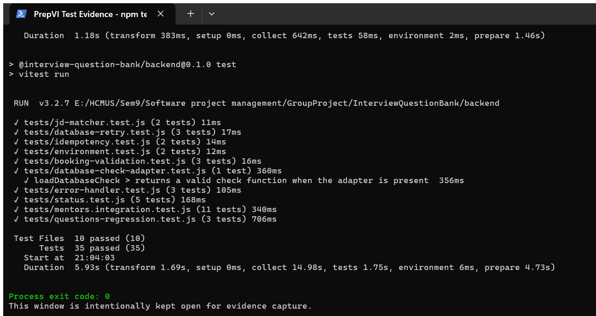
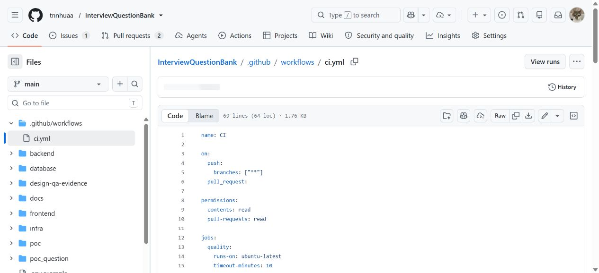
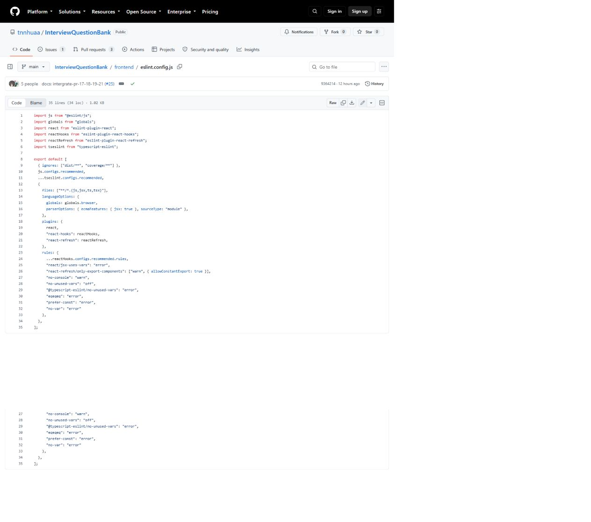
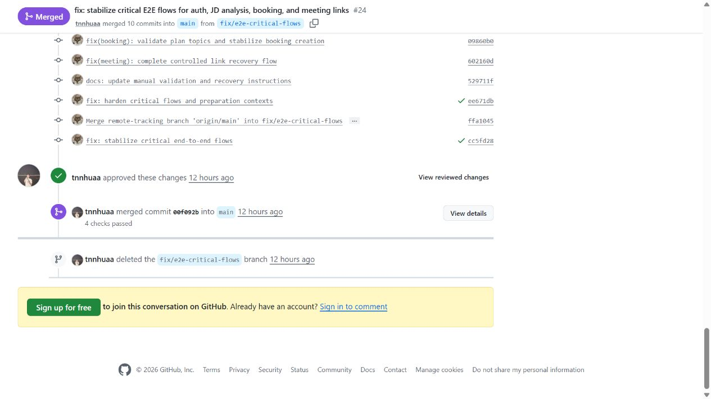

# Câu 20 - Kế hoạch kiểm thử

## 1. Đề chính thức và các sản phẩm bắt buộc

> Trình bày quá trình hình thành và phương pháp đánh giá tài liệu Kế hoạch kiểm thử (Test Plan) của nhóm.

**Bản in đề yêu cầu:** Test Plan; giao diện cấu hình Coding Standards; giao diện hệ thống quản lý lỗi với dữ liệu thực tế; kết quả Unit Tests; biên bản thanh tra mã nguồn; báo cáo kết quả kiểm thử; và biên bản phản hồi khách hàng.

Kế hoạch kiểm thử mô tả sẽ kiểm thử cái gì, bằng phương pháp nào, ở môi trường nào, ai chịu trách nhiệm, điều kiện bắt đầu/kết thúc, cách xử lý lỗi và minh chứng cần lưu. Kế hoạch khác với kết quả kiểm thử: kế hoạch là dự định có kiểm soát; lần chạy kiểm thử là bằng chứng tại một commit và môi trường cụ thể.

### Trạng thái bộ bản in hiện tại

| Sản phẩm đề yêu cầu | Trạng thái có thể kiểm chứng |
|---|---|
| Test Plan | Có: `Test_Plan.md` |
| Giao diện cấu hình Coding Standards | Có: Q20-05 mở `frontend/eslint.config.js` trên GitHub thật |
| Giao diện hệ thống quản lý lỗi có dữ liệu thực tế | Có: Q20-06 là Issue #14 với ảnh lỗi và bước tái hiện thật |
| Kết quả Unit Tests | Có: Q20-01 và Q20-02, cửa sổ Windows Terminal thật |
| Biên bản thanh tra mã nguồn | Có giới hạn: Q20-07/PR #24 chứng minh người xem xét đã phê duyệt; review không lưu phát hiện/bình luận chi tiết |
| Báo cáo kết quả kiểm thử | Có trong Sections 7-8 của `Test_Plan.md`, kèm terminal/CI evidence |
| Biên bản phản hồi khách hàng | Chưa có biên bản thật có người tham gia, thời điểm và quyết định truy vết được |

Không được biến nội dung mẫu, ảnh tạo bằng HTML hoặc biên bản không nối được tới sự kiện thật thành bằng chứng nộp bài.

## 2. Câu trả lời theo WHAT - HOW - WHY - WHEN - EVIDENCE

### WHAT - Phạm vi kiểm thử

- Xác thực, phiên đăng nhập và phân quyền.
- Question Bank, practice progress và moderation.
- JD upload/paste, trích xuất trực tiếp/OCR, sửa văn bản, phân tích, đối sánh và Preparation Plan.
- Mentor onboarding, verification, expertise và availability.
- Đặt lịch, xung đột khung giờ, đổi/hủy lịch, liên kết họp và phục hồi.
- Phản hồi, đánh giá Mentor, thông báo, vận hành và audit.
- Migration, seed, hợp đồng OpenAPI, build và bảo vệ thông tin bí mật.
- Gemini ở chế độ bật, tắt, lỗi nhà cung cấp và cơ chế dự phòng theo quy tắc.

### HOW - Các lớp kiểm thử

| Lớp | Mục tiêu | Minh chứng hiện có |
|---|---|---|
| Kiểm thử đơn vị (unit test) | Kiểm tra hàm/chính sách độc lập | Bộ đối sánh, kiểm tra booking, chống xử lý trùng, thử lại, môi trường và chính sách booking/đổi lịch phía giao diện |
| Kiểm thử tích hợp (integration test) | Kiểm tra mô-đun/API/cơ sở dữ liệu | Mentor, kiểm thử hồi quy câu hỏi với PostgreSQL, trạng thái và xử lý lỗi |
| Hợp đồng/cổng chất lượng | Kiểm tra tính nhất quán hệ thống | Độ lệch OpenAPI, chạy lặp migration, xác minh seed, lint, kiểm tra kiểu và build |
| Kiểm thử thủ công đầu-cuối | Kiểm tra luồng người dùng và phục hồi | Các bước đi qua ba vai trò trong Manual Validation guide |
| UAT | Product Owner và người dùng đại diện xác nhận AC | Có kế hoạch/điều kiện; repository chưa có bộ minh chứng UAT đầy đủ cho mọi câu chuyện |

### WHY - Vì sao cần nhiều lớp?

- Kiểm thử đơn vị phát hiện lỗi logic nhanh nhưng không chứng minh cơ sở dữ liệu/API hoạt động cùng nhau.
- Kiểm thử tích hợp phát hiện lỗi hợp đồng, giao dịch và dữ liệu.
- Kiểm thử đầu-cuối xác nhận hành trình và thông báo lỗi từ góc nhìn người dùng.
- UAT xác nhận giá trị nghiệp vụ và tiêu chí chấp nhận.
- Cổng chất lượng ngăn lỗi kiểu dữ liệu, migration, seed, build và thông tin bí mật đi tiếp.

### WHEN - Khi nào chạy?

- Kiểm thử đơn vị/tích hợp: quy trình nhóm yêu cầu chạy trước khi tạo Pull Request và khi sửa lỗi liên quan; CI hiện chưa tự động bắt buộc bước này.
- CI quality gates: mỗi push và Pull Request.
- Migration/seed replay: trong CI và trước release candidate.
- Đi qua luồng thủ công: sau khi API, tiến trình nền, frontend và dữ liệu demo sẵn sàng.
- UAT: trên release candidate đã vượt quality gates và không còn lỗi Critical/High.
- Regression: sau bug fix, thay đổi contract/schema hoặc trước phát hành.

### EVIDENCE - Minh chứng cần lưu

- commit SHA, ngày giờ, môi trường và người chạy;
- lệnh và kết quả đạt/không đạt;
- ảnh chụp đã loại thông tin bí mật/dữ liệu riêng;
- correlation ID an toàn;
- trạng thái database, audit, job và outbox liên quan;
- defect, severity, owner, cách tái hiện và quyết định cuối;
- Product Owner/UAT decision khi áp dụng.

## 3. Quá trình hình thành, đánh giá, sử dụng và cập nhật

### Đầu vào và các bước hình thành

1. Lấy phạm vi R1 Must, AC/BR/NFR, kiến trúc, hợp đồng API/cơ sở dữ liệu, sổ đăng ký rủi ro và ràng buộc phát hành làm đầu vào.
2. Xác định đối tượng/phạm vi kiểm thử và phần loại trừ.
3. Chọn cấp độ/kỹ thuật kiểm thử theo rủi ro: đơn vị, tích hợp, hợp đồng, E2E thủ công, bảo mật/xử lý đồng thời/lỗi nhà cung cấp và UAT.
4. Chọn môi trường, dữ liệu, vai trò, trách nhiệm, entry/exit criteria và defect severity.
5. Lập ma trận luồng - thành công/lỗi/biên/quyền/phục hồi - minh chứng.
6. Chạy thử kế hoạch, ghi kết quả/lỗi và sửa kế hoạch khi môi trường hoặc hành vi sản phẩm thay đổi.

### Phương pháp đánh giá Test Plan

- **Độ bao phủ:** ánh xạ phạm vi/AC/rủi ro sang kịch bản, không chỉ đếm trường hợp kiểm thử.
- **Khả năng truy vết:** mỗi kết quả có commit, môi trường, kết quả mong đợi/thực tế, lỗi và quyết định chấp nhận.
- **Repeatability:** command, seed, migration và precondition đủ để người khác chạy lại.
- **Ưu tiên theo rủi ro:** xác thực/quyền riêng tư, cạnh tranh đặt lịch, lỗi nhà cung cấp và phục hồi được ưu tiên.
- **Điều kiện thoát:** không tuyên bố bản phát hành đạt nếu thiếu minh chứng hoặc còn lỗi Nghiêm trọng/Cao.
- **Xem xét độc lập:** người phát triển, người kiểm thử và Product Owner xem xét phần kỹ thuật/nghiệp vụ tương ứng.

Lần chạy 45/45 kiểm thử là bằng chứng thực thi một phần và giúp đánh giá tính chạy được của kế hoạch. Nó không chứng minh độ bao phủ đầy đủ, UAT hoặc tất cả AC đạt.

### Tài liệu được dùng và cập nhật thế nào?

- Dùng trước Pull Request/bản ứng viên phát hành để chọn kiểm thử hồi quy và cổng chất lượng.
- Dùng lỗi thực tế để bổ sung kịch bản lỗi/hồi quy và hướng phục hồi.
- Cập nhật khi backlog/AC, kiến trúc, migration, nhà cung cấp, cờ tính năng, dữ liệu demo hoặc sơ đồ triển khai đổi.
- Sau mỗi lần chạy, tách đường cơ sở Test Plan khỏi Test Execution Report; lưu lỗi/kết quả kiểm tra lại/quyết định UAT tương ứng.
- Khi CI chưa chạy `npm test`, ghi minh chứng kiểm thử cục bộ riêng; không mô tả workflow xanh là unit test đã chạy.

## 4. Môi trường và dữ liệu

| Môi trường | Mục đích | Dữ liệu |
|---|---|---|
| Local | Kiểm thử đơn vị, tích hợp và thủ công | PostgreSQL + Mailpit; seed reference/demo |
| CI | Quality gates tái lập | PostgreSQL 17 service; reference seed |
| Demo trực tuyến | Kiểm tra nhanh giao diện/API | Cấu hình Supabase/Render; tiến trình nền hiện chưa triển khai |

Không dùng demo/load seed trên production. Không đưa mật khẩu, token, JD gốc, liên kết họp hoặc minh chứng xác minh Mentor vào ảnh chụp/nhật ký kiểm thử.

## 5. Ma trận kiểm thử ưu tiên

| Nhóm | Luồng chính | Trường hợp lỗi/biên quan trọng |
|---|---|---|
| Định danh | đăng ký, xác minh email, đăng nhập/đăng xuất/đặt lại mật khẩu | truy cập chưa xác thực trả 401; thiếu quyền trả 403 khi có thể công khai sự tồn tại; tài nguyên riêng của người khác trả 404 theo chính sách chống lộ tài nguyên; phiên đăng nhập cũ, giới hạn tần suất, mật khẩu bị xóa khỏi biểu mẫu |
| JD | dán/tải tệp -> trích xuất -> xác nhận -> phân tích -> đối sánh -> kế hoạch | tệp rỗng/hỏng/mã hóa/quá giới hạn, OCR rỗng, nhà cung cấp lỗi, thử lại không tạo JD trùng |
| Mentor | onboarding -> approval -> availability | chưa approved, slot quá khứ/chồng lấn, expertise không khớp |
| Booking | chọn context/mentor/slot -> confirm/reschedule/cancel | context sai chủ, version conflict, double submit, hai request cùng slot chỉ một winner |
| Buổi luyện tập | liên kết họp -> báo lỗi -> thay link/đổi lịch | ngoài thời gian, người ngoài, link thiếu/hỏng, phục hồi quá 15 phút |
| Phản hồi/đánh giá | hoàn thành -> phản hồi -> áp dụng hành động -> đánh giá | phản hồi/hành động trùng, tranh chấp, đánh giá chưa đủ điều kiện công khai |
| Operations | failed job/case -> impact -> action -> audit | action không thuộc allowlist, version lỗi, thiếu reason, idempotency |
| Gemini | phân tích/giải thích/bản nháp | tắt tính năng, hết thời gian, giới hạn tần suất, JSON/tham chiếu sai, cơ chế dự phòng và xác nhận của con người |

## 6. Điều kiện vào và điều kiện thoát

### Điều kiện vào

- commit cần kiểm thử đã được xác định;
- thư viện phụ thuộc, PostgreSQL và migration sẵn sàng;
- môi trường không dùng thông tin bí mật thật trong báo cáo;
- dữ liệu reference/demo phù hợp;
- acceptance criteria và expected result đủ rõ.

### Điều kiện thoát đề xuất

- kiểm thử đơn vị/tích hợp liên quan đạt;
- lint/kiểm tra kiểu/OpenAPI/migration/seed/build đạt với cảnh báo được ghi nhận;
- walkthrough bắt buộc đạt;
- không còn lỗi Critical/High;
- AC có minh chứng và Product Owner chấp nhận khi thuộc UAT;
- vấn đề môi trường/nhà cung cấp có hướng phục hồi rõ ràng.

Các điều kiện thoát là release gate đề xuất; chỉ được gọi là đạt khi có bằng chứng tương ứng.

## 7. Minh chứng thực thi kế hoạch kiểm thử ngày 23/08/2026

Phần này là báo cáo kết quả của một lần thực thi kế hoạch tại môi trường và commit cụ thể, không phải nội dung định nghĩa Test Plan. Nó được giữ lại để chứng minh kế hoạch đã được áp dụng và để ghi nhận giới hạn của bằng chứng.

Lần chạy đầu tiên không có PostgreSQL local:

- frontend đạt 10/10;
- backend có 32 test đạt, 3 test database bị bỏ qua rồi suite lỗi khi cleanup;
- nguyên nhân là `ECONNREFUSED` tại cổng 5432.

Sau khi khởi động PostgreSQL, dùng `DATABASE_URL` cục bộ, chạy migration và kiểm thử lại:

- frontend: 4/4 test file, 10/10 test đạt;
- backend: 10/10 test file, 35/35 test đạt;
- tổng cộng: 45/45 test đạt, exit code 0.

Kết quả quality gates cùng môi trường:

- lint: đạt với 0 lỗi và 37 cảnh báo `no-console`;
- typecheck: đạt;
- OpenAPI generated-type drift: đạt;
- reference seed verification: đạt, các bộ đếm invalid/orphan/duplicate liên quan bằng 0;
- frontend/backend build: đạt; Vite cảnh báo chunk lớn hơn 500 kB.

## 8. Khoảng trống kiểm thử hiện tại

- `.github/workflows/ci.yml` chưa chạy `npm test`.
- Chưa cấu hình ngưỡng độ bao phủ mã nguồn.
- Chưa có browser E2E automation trong repository.
- Chưa có bộ minh chứng UAT đầy đủ cho toàn bộ 27 câu chuyện Must.
- Tiến trình nền chưa triển khai nên không thể coi OCR/hộp thư chờ/nhắc lịch/dọn dữ liệu là đã được kiểm tra nhanh đầy đủ trên môi trường trực tuyến.
- Lint và build còn cảnh báo; không được trình bày là đạt hoàn toàn không cảnh báo.
- Bộ bản in bắt buộc còn thiếu biên bản phản hồi khách hàng/UAT thật. Thanh tra mã có phê duyệt thật nhưng không có phát hiện/bình luận chi tiết để chứng minh nội dung thanh tra.

## 9. Minh chứng hình ảnh

**Hình Q20-01 - Cửa sổ Windows Terminal thật hiển thị 35 kiểm thử backend đạt và mã thoát 0.**

**Hình Q20-02 - Cửa sổ Windows Terminal thật hiển thị 10 kiểm thử frontend và 35 kiểm thử backend đạt.**

**Hình Q20-03 - Cửa sổ GitHub Actions của repository.**

**Hình Q20-04 - Tệp workflow CI hiện hành được mở trực tiếp trên GitHub.**

Hai ảnh terminal là minh chứng lần chạy `npm test` cục bộ. Hai ảnh GitHub là minh chứng cấu hình và lịch sử CI; chúng không chứng minh Vitest chạy trong CI vì workflow hiện không có test step.

**Hình Q20-05 - Cấu hình ESLint frontend được mở trong cửa sổ GitHub thật.**

Ảnh hiển thị các preset/plugin cùng rule `no-console`, `@typescript-eslint/no-unused-vars`, `eqeqeq`, `prefer-const` và `no-var`. Đây là bằng chứng cấu hình Coding Standards, khác với ảnh workflow CI.

**Hình Q20-06 - GitHub Issue #14 có ảnh lỗi và bước tái hiện thực tế.**

Issue đang mở, mô tả lỗi tải thông tin ở hồ sơ/xác minh Mentor và các bước tái hiện. Nó chứng minh hệ thống quản lý lỗi có dữ liệu thật; chưa có assignee, label, liên kết PR hoặc quyết định đóng nên không được gọi là defect đã xử lý.

**Hình Q20-07 - Pull Request #24 có review phê duyệt, bốn kiểm tra đạt và commit merge.**

GitHub/API xác nhận `tnnhuaa` gửi review `APPROVED` ngày 23/08/2026 và PR được hợp nhất thành `00f092b`. Nội dung review trống; ảnh chỉ chứng minh việc xem xét/phê duyệt, không chứng minh có bình luận theo dòng hay phát hiện chi tiết.

## 10. Tài liệu in kèm

- [Test Plan](../../print/Q20_test-plan/Test_Plan.md).
- [Manual Validation and Operations](../../../Implementation/Manual_Validation_and_Operations.md).
- [GitHub Actions CI](../../../../.github/workflows/ci.yml).

`Test_Plan.md` chứa kế hoạch, báo cáo chạy kiểm thử, sổ lỗi và biên bản thanh tra mã có thể truy vết. Biên bản phản hồi khách hàng/UAT còn thiếu phải được lập từ buổi thật trước khi in; không được lấy tài liệu mẫu hoặc nội dung không truy vết từ câu khác để lấp chỗ trống.

## 11. Dàn ý trả lời trong 10 phút trên giấy A4

1. Định nghĩa Test Plan và phân biệt với test case, test run, Test Report và UAT.
2. Nêu input: backlog/AC/BR/NFR, architecture/contracts, risk và release constraint.
3. Trình bày sáu bước hình thành plan.
4. Nêu các test level và kỹ thuật theo risk.
5. Giải thích environment/data, entry/exit và defect severity.
6. Trình bày cách đánh giá coverage, traceability, repeatability, risk priority và independent review.
7. Nêu cách dùng/cập nhật plan, cùng kết quả thật 45/45 và giới hạn CI/coverage/UAT.
8. Đọc danh mục bảy sản phẩm in, chỉ rõ bốn mục còn thiếu bằng chứng thật.

## 12. Checklist tự học

- [ ] Phân biệt Kế hoạch kiểm thử, trường hợp kiểm thử, lần chạy kiểm thử và minh chứng UAT.
- [ ] Nêu được các lớp kiểm thử đơn vị, tích hợp, hợp đồng/cổng chất lượng, đầu-cuối thủ công và UAT.
- [ ] Nhớ kết quả 10 frontend + 35 backend = 45 test đạt.
- [ ] Nêu đúng lint có 37 cảnh báo và build có chunk warning.
- [ ] Nêu rõ CI chưa chạy `npm test`, chưa có đo độ bao phủ và kiểm thử đầu-cuối tự động.
- [ ] Giải thích lần chạy đầu thất bại do môi trường và cách khắc phục.
- [ ] Nêu được quá trình hình thành, phương pháp đánh giá và cách cập nhật Test Plan.
- [ ] Không dùng Q20-04 như ảnh cấu hình ESLint; dùng Q20-05.
- [ ] Nói đúng giới hạn: Issue #14 còn mở, PR #24 review body trống và customer feedback thật chưa có.
