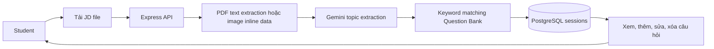

# ADR-004 — JD Processing and Question Matching Strategy

| Thuộc tính | Giá trị |
|---|---|
| Trạng thái | Accepted for current PoC; requires MVP review |
| Ngày quyết định/cập nhật | 16/08/2026 |
| Người chịu trách nhiệm | Luân — Architecture/Technology Stack |
| Evidence | `poc_question` |
| Liên quan | JD upload, topic extraction, Question Bank matching |

## 1. Bối cảnh

PoC kiểm tra nhanh giá trị của luồng: Student tải Job Description (JD) lên, hệ thống rút trích các chủ đề kỹ thuật, tìm câu hỏi liên quan trong Question Bank, sau đó cho phép Student xem và điều chỉnh bộ câu hỏi.

PoC sử dụng React ở frontend, Node.js/Express ở backend và PostgreSQL để lưu Question Bank cùng kết quả của mỗi phiên phân tích. Mục tiêu của quyết định này là ưu tiên tốc độ kiểm chứng luồng end-to-end; chưa phải thiết kế được xác nhận cho MVP/pilot.

## 2. Các phương án đã xem xét

| Phương án | Ưu điểm | Nhược điểm | Kết luận |
|---|---|---|---|
| Rule/dictionary nội bộ | Deterministic, dễ giải thích, không gửi JD ra ngoài | Cần taxonomy và corpus dữ liệu trước; tốn thời gian xây dựng | Hoãn lại cho MVP review |
| **Gemini rút trích topic + keyword matching** | Tạo luồng end-to-end nhanh, xử lý JD tự do và ảnh, không cần taxonomy hoàn chỉnh | Phụ thuộc provider, kết quả không hoàn toàn deterministic và có rủi ro privacy | **Chọn cho PoC hiện tại** |
| Embedding/vector search | Có thể tìm được các cách diễn đạt tương tự | Thêm model, vector index và độ phức tạp vận hành | Ngoài phạm vi PoC |

## 3. Quyết định

### 3.1 Xử lý JD

1. Frontend cho phép tải lên một file JD và gửi đến `POST /api/upload-jd`.
2. Backend nhận file trong bộ nhớ cho request hiện tại.
3. PDF được đọc text trực tiếp bằng `pdf-parse`. PDF không rút trích được text trả lỗi cho người dùng.
4. Ảnh được chuyển thành base64 `inlineData` và gửi cùng prompt đến Gemini.
5. Các file còn lại được PoC đọc như text UTF-8. UI hiển thị cả DOCX, nhưng PoC chưa có DOCX parser riêng.
6. Gemini `gemini-2.5-flash` rút trích `job_title` và danh sách topic gồm `name`, `description`, `keywords`. Khi không có API key, lỗi provider hoặc lỗi parse, backend dùng mock data để demo luồng.
7. PoC lưu `job_title` và `raw_jd` trong `sessions`; đối với ảnh, `raw_jd` chỉ lưu marker `[IMAGE_DATA]` thay vì dữ liệu ảnh.

PoC chưa có OCR nội bộ, job nền, lưu file dài hạn, pasted-text input, hay bước Student xem/sửa/xác nhận text trước khi phân tích.

### 3.2 Matching câu hỏi

Với mỗi topic do Gemini trả về, backend:

1. Lưu topic vào `session_topics`.
2. Tìm tối đa ba câu hỏi trong `question_bank` theo `topic`/`sub_topic` bằng `ILIKE`.
3. Nếu chưa có kết quả, thử lại với tối đa ba keyword do Gemini rút trích, đối chiếu `tags` hoặc `topic`.
4. Sao chép các câu hỏi tìm được vào `session_questions`, giữ `original_bank_id` để truy nguồn.
5. Cho phép Student thêm từ Question Bank, sửa hoặc xóa câu hỏi trong phiên đã tạo.

Matching hiện tại là heuristic keyword lookup. PoC không có taxonomy, alias normalization, trạng thái `PUBLISHED`, scoring, match reason, deterministic tie-break hay `matching_version`.

### 3.3 Luồng người dùng

## 4. Dữ liệu và boundary hiện tại

| Thành phần | Dữ liệu PoC lưu |
|---|---|
| `question_bank` | Topic, sub-topic, câu hỏi, gợi ý trả lời, độ khó, tags |
| `sessions` | Job title, raw JD text hoặc marker của ảnh |
| `session_topics` | Topic, mô tả và thứ tự hiển thị |
| `session_questions` | Bản sao câu hỏi đã match, nguồn và liên kết tới Question Bank |

`poc_question` là một PoC độc lập. Hiện tại chưa có authentication, ownership policy, private file storage, preparation plan, mentor booking context, hay API version `/api/v1`. Các boundary này vẫn là yêu cầu cần thiết trước MVP/pilot và được mô tả ở Software Architecture.

## 5. Hệ quả và đánh đổi

### Tích cực

- Nhanh chóng kiểm chứng được chuỗi giá trị JD → topic → câu hỏi.
- Có thể xử lý PDF text và ảnh mà không cần tự xây OCR trong PoC.
- Question Bank vẫn là nguồn câu hỏi; PoC không dùng AI để tự sinh câu hỏi.
- Màn hình review cho phép người dùng bổ sung, sửa và loại câu hỏi không phù hợp.

### Hạn chế và rủi ro đã chấp nhận trong PoC

- Nội dung JD và ảnh có thể được gửi đến Gemini khi cấu hình API key; không phù hợp với yêu cầu privacy của MVP nếu chưa có consent, review pháp lý và policy rõ ràng.
- Kết quả topic phụ thuộc provider/model; fallback mock data không phản ánh JD thật.
- Keyword matching có thể bỏ sót synonym và trả kết quả không liên quan; không có score hay lý do để người dùng đánh giá.
- File được xử lý trong memory và chưa có giới hạn size, MIME/magic-byte validation, quota, retention hay audit.
- Session và các endpoint sửa/xóa câu hỏi chưa có authorization; chỉ dùng trong môi trường demo tin cậy.

## 6. PoC acceptance

| Test | Pass khi |
|---|---|
| PDF text | PDF có text tạo được `job_title` và topic hoặc trả lỗi rõ ràng khi parser không đọc được |
| Image JD | Ảnh được gửi đến Gemini và nhận về cấu trúc topic hợp lệ khi provider khả dụng |
| Topic extraction | Response có `job_title` và danh sách topic có `name`, `description`, `keywords` |
| Question matching | Mỗi topic tìm tối đa ba câu hỏi theo topic/sub-topic hoặc keyword; không tự sinh câu hỏi mới |
| Manual curation | Người dùng thêm từ bank, sửa và xóa câu hỏi trong session được |
| Provider fallback | Không có API key hoặc provider lỗi thì luồng demo vẫn hoạt động với mock data |

Kết quả trên chỉ xác nhận luồng PoC. Chúng không xác nhận precision, repeatability, privacy, authorization hay độ tin cậy cho MVP.

## 7. Điều kiện review cho MVP/pilot

Cần review hoặc ADR mới trước khi đưa luồng này vào MVP/pilot nếu có một trong các điều kiện sau:

- JD thật có thể chứa PII hoặc thông tin công ty và cần quyết định việc gửi dữ liệu đến provider bên thứ ba.
- Cần kết quả ổn định, có thể giải thích, version hóa và đo được relevance.
- Cần Student sửa/xác nhận text, xử lý PDF scan/OCR, retry job hoặc kiểm soát file lifecycle.
- Cần liên kết JD/question với preparation plan, mentor booking và object-level authorization.
- Cần hỗ trợ file DOCX thật sự, giới hạn upload, validation và logging an toàn.

Hướng thay thế cần được đánh giá khi review MVP gồm: text confirmation, private storage, extraction/OCR adapter, taxonomy/alias, rule-based scorer có version, và authorization. Không coi các capability này là đã được triển khai trong PoC hiện tại.

## 8. Related decisions

- [ADR-001 — Technology Stack](ADR-001-Technology-Stack.md): React, Express và PostgreSQL phù hợp với PoC.
- [ADR-002 — Booking Consistency](ADR-002-Booking-Consistency.md): chưa được tích hợp vào `poc_question`.
- [ADR-003 — Notification Reliability](ADR-003-Notification-Reliability.md): chưa được tích hợp vào `poc_question`.
- [Software Architecture](../software_architecture.md): kiến trúc mục tiêu cho MVP/pilot, cần được cập nhật evidence sau PoC.
