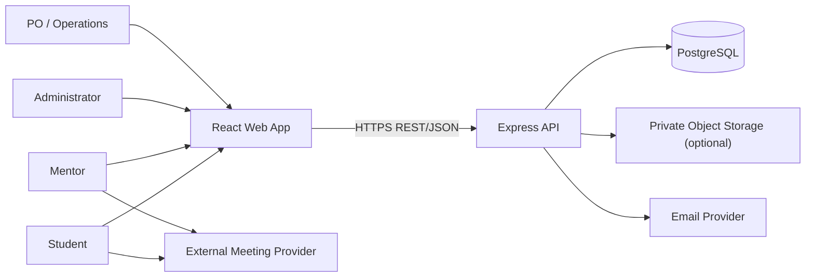
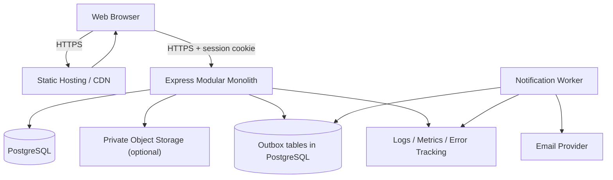
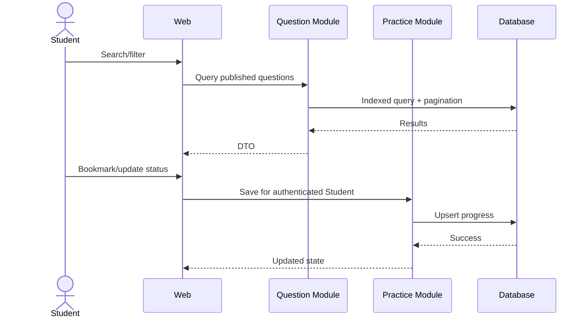

# Interview Practice Platform — Software Architecture and Design

| Thuộc tính | Giá trị |
|---|---|
| Phiên bản | 0.2 |
| Ngày cập nhật | 14/08/2026 |
| Architecture owner | Luân |
| Trạng thái | Baseline cho PoC; cần cập nhật theo POC_Result.md |

## 1. Executive summary

Kiến trúc MVP là **React SPA và Express REST API triển khai độc lập**, trong đó backend là **modular monolith**, PostgreSQL là nguồn chân lý và notification chạy qua transactional outbox/worker. Stack dùng JavaScript xuyên suốt theo năng lực nhóm đã xác nhận: React, Tailwind CSS, Node.js, Express và PostgreSQL.

Cấu trúc này giữ transaction booking trong một database, giảm chi phí vận hành và cho phép frontend/backend làm việc độc lập. Ba quyết định chính được quản lý bằng ADR: technology stack, booking consistency và notification reliability. Baseline chỉ được giữ nguyên nếu năm PoC gate ở mục 15 pass.

## 2. Goals, scope và architecture drivers

### 2.1 MVP goals

- Cung cấp Question Bank có search/filter và progress cơ bản.
- Quản lý mentor verification, availability và booking an toàn.
- Chống double booking dưới concurrent request.
- Bảo vệ meeting link, verification evidence và feedback.
- Gửi notification có retry mà không ảnh hưởng transaction nghiệp vụ.
- Thu event/KPI đủ cho pilot mà không thu thập dữ liệu thừa.

### 2.2 In scope

- Responsive web client.
- API/application service và relational database.
- Identity/RBAC; Student, Mentor, Admin workflow.
- Question, taxonomy, progress, mentor, slot, booking, feedback, review, report.
- Email/in-app notification, external meeting link.
- Audit log, telemetry, CI/CD, backup và environment configuration.

### 2.3 Out of scope

- Microservices, event streaming platform và multi-region deployment.
- AI interviewer/scoring, audio/video processing.
- Built-in WebRTC/video, recording và transcription.
- Payment/escrow/payout.
- Native mobile app và ML recommendation.

### 2.4 Quality priorities

1. Security/privacy và object-level authorization.
2. Data consistency cho slot/booking/state transition.
3. Reliability và recoverability của notification/operations.
4. Usability và accessibility của core workflow.
5. Maintainability/testability.
6. Performance phù hợp pilot; tránh tối ưu sớm.

## 3. Architecture decisions

| ADR | Quyết định | Lý do | Trạng thái |
|---|---|---|---|
| [ADR-001](ADR/ADR-001-Technology-Stack.md) | React/Vite/Tailwind + Node.js/Express + PostgreSQL | Khớp năng lực nhóm, test/deploy tách biệt và chi phí pilot thấp | Accepted for PoC |
| [ADR-002](ADR/ADR-002-Booking-Consistency.md) | PostgreSQL transaction + row lock + partial unique index | Chống double booking ở nguồn chân lý | Accepted, pending PoC |
| [ADR-003](ADR/ADR-003-Notification-Reliability.md) | Transactional outbox + worker | Provider failure không làm mất booking | Accepted, pending PoC |
| Scope decision | External meeting link | Giảm scope/security cost của video | Accepted by MVP scope |
| Security decision | Server-side RBAC + object ownership policy | Không tin role/ownership từ client | Accepted for PoC |

### 3.1 Technology stack baseline

| Layer | Baseline | Quy tắc |
|---|---|---|
| Web | React SPA, Vite, JavaScript, Tailwind CSS | Static build; không truy cập database; dependency pin bằng lockfile |
| Routing/data | React Router, `fetch` wrapper, feature hooks | API URL qua environment; loading/error/permission state rõ |
| API | Node.js 24 LTS, Express 5, REST/JSON `/api/v1` | Modular monolith; schema validation tại boundary |
| Data access | `pg` + versioned SQL migrations | Parameterized SQL; transaction do application service quản lý |
| Data | PostgreSQL | ACID, constraint, row lock, index, audit và backup |
| Job/queue | PostgreSQL outbox + worker module | At-least-once, idempotent, retry/dead-letter state |
| Auth | Server-side session cookie | `Secure`, `HttpOnly`, `SameSite`; exact CORS allowlist và CSRF control |
| Test | Vitest, React Testing Library, Supertest, Playwright | Integration/concurrency dùng PostgreSQL thật |
| CI/CD | Lint, audit, test, migration check, build | Frontend và backend pipeline độc lập |
| Deployment | Static frontend + containerized API/worker + managed PostgreSQL | Provider-neutral configuration; TLS và secret ngoài repository |
| Cache/broker | Không có trong baseline | Chỉ thêm khi measurement/ADR chứng minh cần |

## 4. System context



### Trust boundaries

- Browser/client là untrusted; Express API xác thực mọi input, session, role và ownership.
- Frontend và API là hai origin độc lập; CORS chỉ cho phép origin cấu hình, không dùng wildcard với credential.
- Email/meeting provider nằm ngoài trust boundary; không làm nguồn chân lý cho booking.
- Verification document và meeting link là dữ liệu nhạy cảm, tách khỏi public profile.
- Admin action có quyền cao phải được audit.

## 5. Container và deployment view



Frontend và backend có build/deployment độc lập. Môi trường tối thiểu: local, test/CI, staging/UAT và production/pilot. Secret không nằm trong repository. Migration chạy từ pipeline/job được kiểm soát, chỉ một runner tại một thời điểm và có backup/forward-fix plan.

### 5.1 Deployment profile và chi phí pilot

| Thành phần | Mặc định cho PoC/pilot | Chi phí tham chiếu 14/08/2026 | Giới hạn cần ghi nhận |
|---|---|---:|---|
| React static frontend | Vercel Hobby | 0 USD cho personal/non-commercial | Fair-use/usage cap; pilot thương mại phải xem lại plan |
| Express API | Render Free web service | 0 USD | Cold start, 750 free instance-hours/workspace; không dùng cho production SLA |
| PostgreSQL | Neon Free | 0 USD | 0.5 GB/project, 100 CU-hours/project; scale-to-zero |
| Notification | Fake provider trong PoC; provider adapter ở pilot | TBD | Báo giá/quota phải được chốt trước pilot thật |
| Domain | URL mặc định của provider trong PoC | 0 USD | Custom domain và DNS là cost riêng |

Render Free PostgreSQL không được chọn làm baseline vì database free hết hạn sau 30 ngày. Worker được phép chạy cùng API process trong PoC một-instance; staging/production phải tách process hoặc chứng minh deployment platform bảo đảm singleton/idempotent worker. Mọi giá/quota phải được kiểm tra lại khi phê duyệt Cost–Time–Resource baseline.

## 6. Backend module design

| Module | Trách nhiệm | Không được làm |
|---|---|---|
| Identity | Account, auth, role, session | Tự quyết định booking ownership |
| Student | Profile, goals | Quản lý mentor verification |
| Questions | Taxonomy, question, provenance, moderation | Gửi booking |
| Practice | Bookmark/progress | Công khai dữ liệu Student |
| Mentors | Profile, verification, service scope | Xác nhận slot trực tiếp không qua Booking |
| Availability | Slot và overlap rules | Tạo payment |
| Booking | State machine, lock slot, meeting-link access | Phụ thuộc email success |
| Feedback | Rubric, next action, review eligibility | Cho feedback trước Completed |
| Moderation | Report, content/mentor decisions | Sửa audit log |
| Notification | Event, template, retry, delivery status | Điều khiển business state |
| Analytics | Privacy-aware events/KPI | Lưu nội dung nhạy cảm không cần thiết |
| Audit | Security/business decision trail | Cho phép sửa/xóa thường xuyên |

### Dependency rules

- UI gọi application use case; không truy cập database trực tiếp.
- Module khác tham chiếu entity qua ID và public contract, không sửa bảng thuộc module khác tùy ý.
- Booking kiểm tra Mentor/Slot qua domain service trong cùng transaction khi cần.
- Notification nhận event sau commit từ outbox.
- Analytics không nằm trên critical path.

### Notification event model

Các event: `booking.requested`, `booking.confirmed`, `booking.reschedule_proposed`, `booking.cancelled`, `session.reminder_due`, `feedback.submitted`. Mỗi event có immutable ID, aggregate ID, type, occurred-at, deduplication key và payload tối thiểu. Worker xử lý at-least-once, idempotent, exponential backoff có jitter và dead-letter/manual retry state. Chi tiết nằm tại [ADR-003](ADR/ADR-003-Notification-Reliability.md).

## 7. Core runtime flows

### 7.1 Tìm câu hỏi và lưu progress



### 7.2 Xác nhận booking và chống double booking

```mermaid
sequenceDiagram
    actor M as Mentor
    participant A as Booking API
    participant D as Database
    participant O as Outbox
    M->>A: Accept pending booking
    A->>D: Begin transaction; lock slot then booking
    A->>D: Validate owner, state, slot availability
    A->>D: Set Confirmed + reserve slot
    A->>D: Insert transition + idempotency record
    A->>O: Insert deduplicated notification event
    A->>D: Commit
    A-->>M: Confirmed
    Note over A,D: Partial unique index protects occupied states for the same slot
```

Chi tiết transaction, conflict code, retry và concurrent acceptance test nằm tại [ADR-002](ADR/ADR-002-Booking-Consistency.md). Mọi path gồm Mentor, Student và Admin đều phải gọi cùng state-machine service; không có route update trạng thái trực tiếp.

### 7.3 Hoàn thành và gửi feedback

Mentor/Admin hợp lệ chuyển booking sang Completed theo policy. Feedback service kiểm tra Mentor ownership và Completed state, validate rubric, ghi feedback cùng audit event. Student xem feedback qua ownership policy; analytics chỉ ghi trạng thái hoàn chỉnh, không sao chép nội dung nhận xét.

## 8. Data design

| Entity | Trường/chức năng chính |
|---|---|
| User | id, email, status, roles, auth metadata |
| StudentProfile | user_id, target roles, goals, privacy settings |
| MentorProfile | user_id, expertise, bio, status, public fields |
| MentorVerification | mentor_id, evidence ref, status, decision audit |
| Position/Topic | taxonomy và trạng thái |
| Question | content, type, difficulty, status, provenance, version |
| QuestionTag | many-to-many question ↔ position/topic |
| PracticeProgress | student_id, question_id, bookmark, status |
| AvailabilitySlot | mentor_id, start/end UTC, timezone, status |
| Booking | student, mentor, slot, goal, type, state, meeting ref |
| BookingTransition | booking, from/to, actor, reason, timestamp |
| Feedback | booking_id unique, rubric, strengths, weaknesses, actions |
| Review | booking_id unique, rating, comment, moderation status |
| NotificationJob | event, channel, attempt, status, next_attempt |
| IdempotencyRecord | actor, key, operation, request hash, response ref |
| Report/AuditLog | target, actor, action, reason, timestamp |

### Data consistency

- Lưu instant theo UTC; giữ timezone nguồn để hiển thị/audit.
- Dùng database constraint để bảo đảm unique review/feedback per booking.
- Dùng transaction, ordered row lock và partial unique index để chống booking trùng slot.
- Booking state transition qua một domain service duy nhất.
- Soft-delete chỉ khi có lý do vận hành; privacy deletion phải có policy riêng.
- Migration có version và test rollback/forward phù hợp.

## 9. Dữ liệu nhạy cảm và lifecycle

- Public: display name, expertise, approved service scope, public rating.
- Private: email/contact, meeting link, booking goal, feedback và progress.
- Restricted: verification evidence, moderation note, security audit.
- Không log credential, token, meeting secret hoặc feedback text đầy đủ.
- Retention/deletion period: `[CẦN BỔ SUNG]` sau privacy/legal review.
- Nếu dùng object storage cho verification, bucket private và signed URL ngắn hạn.

## 10. External integration contracts và fallback

| Integration | Contract | Failure handling |
|---|---|---|
| Email | Template + recipient + idempotency key | Retry; in-app status; manual resend |
| Meeting | URL do mentor/admin cung cấp hoặc adapter | Cho sửa trước cutoff; không mất booking |
| Calendar — future/optional | Export/link, không phải source of truth | Manual schedule vẫn hoạt động |
| Analytics | Event schema versioned, no sensitive payload | Drop/retry ngoài critical path |

## 11. API design

Các nhóm route đề xuất:

- `/api/v1/auth`, `/api/v1/me`, `/api/v1/student-profile`.
- `/api/v1/questions`, `/api/v1/topics`, `/api/v1/positions`, `/api/v1/practice-progress`.
- `/api/v1/mentors`, `/api/v1/mentor-verifications`, `/api/v1/availability-slots`.
- `/api/v1/bookings`, `/api/v1/bookings/{id}/transitions`, `/api/v1/bookings/{id}/feedback`, `/api/v1/reviews`.
- `/api/v1/admin/questions`, `/api/v1/admin/mentors`, `/api/v1/admin/reports`, `/api/v1/admin/audit`.

### Contract conventions

- JSON schema/DTO rõ; server-side validation và error code ổn định.
- Cursor/page pagination và deterministic sort.
- Header `Idempotency-Key` bắt buộc cho create booking và critical transition.
- Optimistic version hoặc ETag cho update dễ xung đột.
- Không nhận `userId/role` từ client làm nguồn authorization.
- Contract được version hóa bằng OpenAPI; frontend sinh/kiểm tra client contract trong CI khi khả thi.
- Error envelope tối thiểu gồm `code`, `message`, `correlationId` và field errors; không lộ stack/SQL.

### High-risk routes trước release

Booking accept/reschedule/cancel/complete, meeting-link access, feedback create/read, mentor verification decision và admin moderation phải có integration test cho happy path, unauthorized, invalid state và concurrency.

## 12. Security architecture

### Authentication và session

- Server-side session lưu hash/token reference và expiry; session ID chỉ nằm trong cookie.
- Password hash bằng Argon2id hoặc thuật toán được security review chấp nhận; rate limit login/reset.
- Cookie `Secure`, `HttpOnly`, `SameSite` phù hợp deployment; frontend gửi credential chỉ đến API origin cấu hình.
- CORS dùng allowlist chính xác; cookie-authenticated mutation có CSRF protection.
- Session revoke, email verification và reset token ngắn hạn.

### Authorization

- RBAC cho khả năng cấp vai trò; ownership/relationship check cho object.
- Default deny; policy test cho Student, Mentor, Admin và unrelated user.
- Admin route tách rõ, audit quyết định quyền cao.
- Không dựa vào việc ẩn nút ở UI.

### Application và infrastructure

- Validate length/type/enum; encode output; parameterized query/ORM an toàn.
- TLS, secret manager/environment secret, dependency scan và patching.
- Rate limit với auth, search abuse, booking và review/report.
- Backup có kiểm tra restore; least-privilege DB/service account.
- Security incident runbook cho link/token/data exposure.

## 13. Reliability, performance và observability

### Initial service targets

| Target | Mục tiêu pilot |
|---|---:|
| Common API response | ≤ 3 giây trong điều kiện test |
| Critical workflow test pass | 100% |
| Critical/High open defect trước UAT | 0 |
| Notification | Retry được; không mất business transaction |
| Backup restore | Test trước pilot |

### Observability

- Structured log với correlation ID, actor pseudonymous ID và event type.
- Metrics: request latency/error, job backlog, notification failure, booking transition failure.
- Business events: question search, mentor view, booking requested/confirmed/completed, feedback submitted.
- Alert cho auth anomaly, booking conflict tăng, job backlog và provider failure.

## 14. UX routes và traceability

| Route/screen | Story | Module |
|---|---|---|
| `/questions` và detail | US-04–06 | Questions/Practice |
| `/mentors` và profile | US-10 | Mentors/Availability |
| `/bookings/new` | US-11 | Booking |
| `/bookings/{id}` | US-12–16,19 | Booking/Feedback/Notification |
| `/mentor/profile`, `/mentor/availability` | US-07,09 | Mentors/Availability |
| `/mentor/bookings` | US-12,13,15 | Booking/Feedback |
| `/admin/mentors`, `/admin/questions`, `/admin/reports` | US-08,18,20 | Moderation/Audit |

## 15. Technical POC và delivery plan

### POC-1: Booking consistency — acceptance gate

Chạy ít nhất 20 request concurrent accept cùng slot trên PostgreSQL thật. Pass khi đúng một booking chiếm slot, các response còn lại là conflict/idempotent và chỉ một transition/outbox event logic được tạo. Evidence theo ADR-002.

### POC-2: Authorization

Tạo Student A/B, Mentor A/B và Admin; kiểm tra matrix read/write booking, meeting link, feedback và verification. Pass khi mọi access trái quyền bị chặn ở server.

### POC-3: Booking transition và audit

Kiểm tra happy path và invalid path của `PENDING → CONFIRMED → COMPLETED`, cancel/reschedule, actor ownership và retry. Pass khi chỉ transition hợp lệ được commit, mỗi transition có actor/reason/timestamp và không có route bypass state machine.

### POC-4: Question filtering

Seed zero/one/many question, nhiều tag và trạng thái draft/published. Pass khi filter/pagination deterministic, không duplicate và draft không lộ.

### POC-5: Notification resilience

Giả lập provider timeout, 5xx và duplicate worker. Pass khi booking vẫn commit một lần, worker retry idempotent, job lỗi vĩnh viễn vào `DEAD` và có trạng thái để vận hành xử lý. Evidence theo ADR-003.

### 15.1 Contract phối hợp với Trí

PoC chưa có source/result tại ngày 14/08/2026. Để tránh hai bên hiểu khác nhau, PoC của Trí cần trả lại các artifact sau dưới `poc/mentor-booking-feedback/`:

| Artifact | Nội dung Luân cần để cập nhật architecture |
|---|---|
| `README.md` | Runtime, setup, environment variables, migration/seed/test commands |
| `POC_Result.md` | Bảng Pass/Fail cho đúng 5 PoC, evidence và limitation |
| `database/` | Migration có partial unique index, audit và outbox schema |
| `tests/` | Concurrent test, authorization matrix, transition, filter và retry test |
| API contract | Route/payload/error code thực tế, đặc biệt `409` và `Idempotency-Key` |

Sau khi nhận result, Luân phải: (1) đối chiếu ADR assumption với evidence; (2) cập nhật trạng thái ADR; (3) sửa diagram/data/API nếu PoC khác baseline; (4) ghi deviation và trade-off, không âm thầm sửa lịch sử ADR.

### Recommended delivery order

1. Repository, CI/CD, auth/RBAC, schema và audit foundation.
2. Taxonomy/Question Bank/Practice.
3. Mentor verification/profile/availability.
4. Booking state machine và concurrency POC.
5. Notification/meeting handoff.
6. Feedback/review/moderation.
7. Analytics, E2E, security test, UAT và release.

## 16. Risks, constraints và mitigation

| Risk | Mitigation |
|---|---|
| Double booking | DB constraint, transaction, lock và concurrency test |
| Broken object authorization | Central policy, default deny, matrix integration tests |
| Provider outage | Outbox/retry, fallback và source of truth nội bộ |
| Scope creep | ADR + release boundary + change control |
| PII leakage | Data classification, log redaction, private storage, retention |
| Content/review abuse | Provenance, moderation, report/appeal và audit |
| Stack mismatch với team | Spike và ADR sau skill matrix; tránh công nghệ mới không cần thiết |

