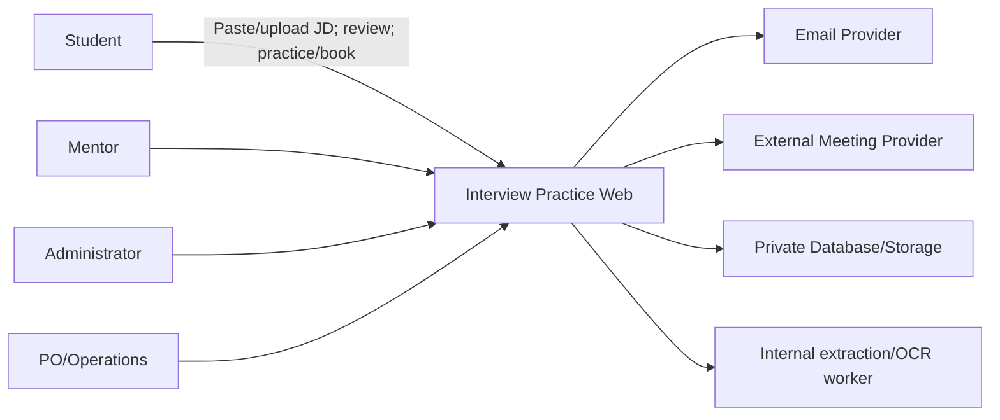
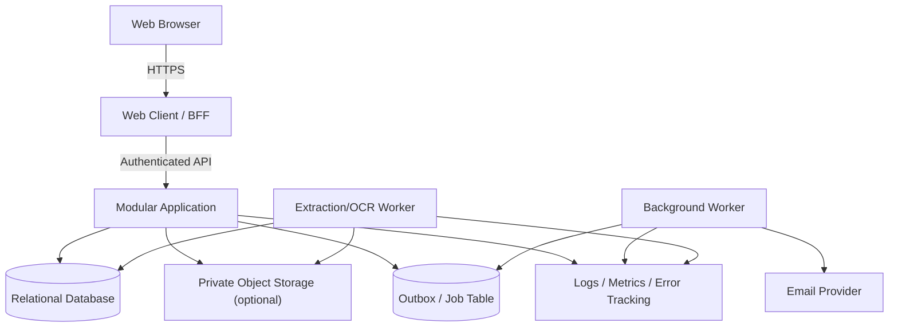
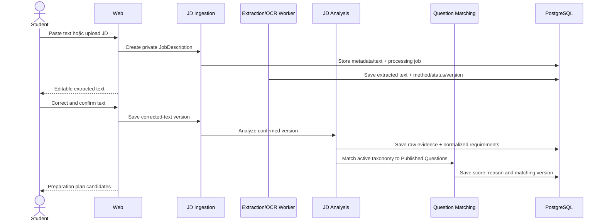
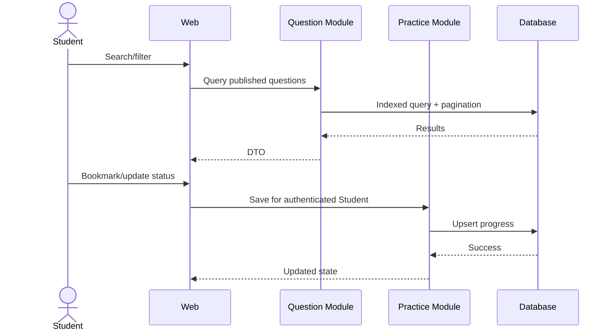

# Interview Practice Platform — Software Architecture and Design

## 1. Executive summary

Kiến trúc MVP dùng **React SPA/Vite/Tailwind**, **Node.js/Express REST API**, **PostgreSQL** và backend **modular monolith**. JD processing và notification có thể chạy bằng worker trong cùng codebase. Luồng chính là JD intake → extraction/correction → requirement/taxonomy analysis → versioned rule-based Question mapping → preparation plan → self-practice hoặc Mentor booking → feedback. Cấu trúc này giữ booking transaction trong một nguồn chân lý, giảm hạ tầng và phù hợp baseline stack do Architecture owner công bố trên nhánh chuyên môn.

## 2. Goals, scope và architecture drivers

### 2.1 MVP goals

- Chuyển JD text/file thành corrected text và preparation plan có thể giải thích.
- Nhận diện requirement, chuẩn hóa alias theo taxonomy và mapping chỉ Question Published.
- Cung cấp Question Bank có search/filter và progress cơ bản từ preparation plan.
- Quản lý mentor verification, availability và booking an toàn.
- Chống double booking dưới concurrent request.
- Bảo vệ meeting link, verification evidence và feedback.
- Gửi notification có retry mà không ảnh hưởng transaction nghiệp vụ.
- Thu event/KPI đủ cho pilot mà không thu thập dữ liệu thừa.

### 2.2 In scope

- Responsive web client.
- API/application service và relational database.
- Identity/RBAC; Student, Mentor, Admin workflow.
- JD source/text, requirement, question match, preparation plan, Question/taxonomy/progress, mentor, slot, booking, feedback, review và report.
- Direct extraction; OCR fallback giới hạn cho ảnh/PDF scan; manual correction bắt buộc trước analysis.
- Email/in-app notification, external meeting link.
- Audit log, telemetry, CI/CD, backup và environment configuration.

### 2.3 Out of scope

- Microservices, event streaming platform và multi-region deployment.
- AI interviewer/scoring, semantic/ML recommendation và audio/video processing.
- OCR cho mọi định dạng/ngôn ngữ hoặc tài liệu không phải JD.
- Built-in WebRTC/video, recording và transcription.
- Payment/escrow/payout.
- Native mobile app và ML recommendation.

### 2.4 Quality priorities

1. Security/privacy cho JD, plan và object-level authorization.
2. Tính giải thích, ổn định và testability của extraction/mapping.
3. Data consistency cho slot/booking/state transition.
4. Reliability/recoverability của processing, notification và operations.
5. Usability/accessibility của correction và preparation-plan workflow.
6. Maintainability và performance phù hợp pilot; tránh tối ưu sớm.

## 3. Architecture decisions

| ADR | Quyết định đề xuất | Lý do | Trạng thái |
|---|---|---|---|
| ADR-001 | React/Vite/Tailwind + Node.js/Express + PostgreSQL modular monolith | Baseline của Architecture owner, khớp năng lực nhóm | Accepted for PoC |
| ADR-002 | PostgreSQL transaction/lock/constraint cho booking | Chống double booking tại source of truth | Pending PoC evidence |
| ADR-003 | Transactional outbox + worker | Provider failure không làm mất booking | Pending PoC evidence |
| [ADR-004](https://github.com/tnnhuaa/InterviewQuestionBank/blob/54e1113113f6ada9c0ecec565eb8f883966d18f9/docs/Project_Architecture/ADR/ADR-004-JD-Processing-and-Question-Matching.md) | Direct extraction trước; internal OCR fallback; versioned rule-based matching | Ít hạ tầng, giải thích và kiểm thử được | Accepted for PoC; Proposed for MVP |
| Scope decision | External meeting link | Giảm scope/security cost của video | Accepted by MVP scope |
| Security decision | Server-side RBAC + object ownership | Không tin role/ownership từ client | Accepted for PoC |

### 3.1 Technology stack baseline

| Layer | Baseline | Quy tắc |
|---|---|---|
| Web | React SPA, Vite, Tailwind CSS | Accessible, testable; không truy cập database |
| API | Node.js, Express, REST/JSON `/api/v1` | Modular monolith; validate tại boundary |
| Data | PostgreSQL + versioned migration | ACID, constraint, lock, audit và backup |
| Job/queue | PostgreSQL processing job/outbox + worker | At-least-once, idempotent, retry và operable failure state |
| JD processing | Direct text extraction + internal OCR adapter | PoC: paste/PDF/PNG/JPEG, tối đa 10 MB/file; OCR chỉ cho ảnh/PDF scan; manual correction gate |
| Matching | Taxonomy/alias + versioned rule-based scorer | Published-only, deterministic, lưu score/reason |
| Auth | Server-side session và CSRF control | Default deny; role + object ownership |
| Cache/broker | Không có trong baseline | Chỉ thêm khi measurement/ADR chứng minh cần |
| Hosting | TLS, private storage, secrets, logs, backup | Provider pending owner decision; phải qua security, backup, quota và cost gate trước pilot |

## 4. System context



### Trust boundaries

- Browser/client là untrusted; server xác thực mọi input, role và ownership.
- Email/meeting provider nằm ngoài trust boundary; không làm nguồn chân lý cho booking.
- Verification document và meeting link là dữ liệu nhạy cảm, tách khỏi public profile.
- JD file/text, requirement, mapping và plan là dữ liệu riêng của Student; Mentor chỉ xem projection tối thiểu qua booking hợp lệ.
- Internal OCR chỉ là cách lấy text từ PNG/JPEG/PDF scan, không phải tên của JD analysis/mapping; parser/OCR không có outbound network mặc định.
- Admin action có quyền cao phải được audit.

## 5. Container và deployment view



Môi trường tối thiểu: local, test/CI, staging/UAT và production/pilot. Secret không nằm trong repository. Migration chạy theo quy trình có backup/rollback plan.

## 6. Backend module design

| Module | Trách nhiệm | Không được làm |
|---|---|---|
| Identity | Account, auth, role, session | Tự quyết định booking ownership |
| Student | Profile, goals | Quản lý mentor verification |
| Questions | Taxonomy, question, provenance, moderation | Gửi booking |
| JD Ingestion | Pasted text/file, private metadata, processing status và corrected-text version | Tự phân tích requirement hoặc công khai file |
| Text Extraction/OCR | Direct extraction; OCR ảnh/PDF scan; chuẩn hóa adapter error | Tự mapping Question hoặc thay corrected text |
| JD Analysis | Position/seniority/skill/technology/requirement và alias normalization | Bịa taxonomy cho unknown term |
| Question Matching | Published-only deterministic score/reason/version | Trả Draft hoặc semantic/ML result trong PoC |
| Preparation Plan | Chọn requirement/topic/Question và cung cấp context cho Practice/Booking | Đổi booking state hoặc sửa feedback |
| Practice | Bookmark/progress | Công khai dữ liệu Student |
| Mentors | Profile, verification, service scope | Xác nhận slot trực tiếp không qua Booking |
| Availability | Slot và overlap rules | Tạo payment |
| Booking | State machine, lock slot, meeting-link access | Phụ thuộc email success |
| Feedback | Rubric, next action, review eligibility | Cho feedback trước Completed |
| Moderation | Report, content/mentor decisions | Sửa audit log |
| Notification | Event, template, retry, delivery status | Điều khiển business state |
| Analytics | Privacy-aware events/KPI | Lưu nội dung nhạy cảm không cần thiết |
| Audit | Security/business decision trail | Cho phép sửa/xóa thường xuyên |

### Dependency rules

- UI gọi application use case; không truy cập database trực tiếp.
- Module khác tham chiếu entity qua ID và public contract, không sửa bảng thuộc module khác tùy ý.
- Booking kiểm tra Mentor/Slot qua domain service trong cùng transaction khi cần.
- JD Analysis chỉ đọc corrected text đã được Student xác nhận.
- Question Matching dùng read contract của Taxonomy/Questions; kết quả gắn matching version và không sửa Question Bank.
- Preparation Plan giữ match reference/version; Booking chỉ nhận JD/plan thuộc Student và chia sẻ context tối thiểu cho Mentor.
- Feedback next action cập nhật plan qua use case riêng, không sửa bảng plan trực tiếp.
- Notification nhận event sau commit từ outbox.
- Analytics không nằm trên critical path.

### Notification event model

Các event: `booking.requested`, `booking.confirmed`, `booking.reschedule_proposed`, `booking.cancelled`, `session.reminder_due`, `feedback.submitted`. Mỗi event có immutable ID, aggregate ID, type, occurred-at và payload tối thiểu. Worker xử lý idempotent, exponential backoff và dead-letter/manual retry state.

## 7. Core runtime flows

### 7.1 Từ JD đến preparation plan



PoC nhận pasted text hoặc một PDF/PNG/JPEG tối đa 10 MB; page/language/time limit lấy từ cấu hình được duyệt. Direct extraction được ưu tiên cho PDF có text; internal OCR chỉ là fallback cho PNG/JPEG/PDF scan. Analyze bị chặn khi corrected text chưa xác nhận. Chạy lại cùng text/taxonomy/matching version phải ổn định; đổi corrected version làm derived data cũ thành stale.

### 7.2 Tìm câu hỏi và lưu progress



### 7.3 Xác nhận booking và chống double booking

```mermaid
sequenceDiagram
    actor M as Mentor
    participant A as Booking API
    participant D as Database
    participant O as Outbox
    M->>A: Accept pending booking
    A->>D: Begin transaction; lock booking/slot
    A->>D: Validate owner, state, slot availability
    A->>D: Set Confirmed + reserve slot
    A->>O: Insert notification event
    A->>D: Commit
    A-->>M: Confirmed
    Note over A,D: Unique/partial constraint prevents a second confirmed booking for the same slot
```

### 7.4 Hoàn thành và gửi feedback

Mentor/Admin hợp lệ chuyển booking sang Completed theo policy. Feedback service kiểm tra Mentor ownership và Completed state, validate rubric, ghi feedback cùng audit event. Student xem feedback qua ownership policy và có thể áp dụng next action vào preparation plan; analytics chỉ ghi trạng thái/outcome code, không sao chép JD hoặc nội dung nhận xét.

## 8. Data design

| Entity | Trường/chức năng chính |
|---|---|
| User | id, email, status, roles, auth metadata |
| StudentProfile | user_id, target roles, goals, privacy settings |
| JobDescription | student_id, source type/file ref, extracted/corrected text, processing method/status/version, confirmed_at |
| JDRequirement | job_description_id, raw evidence, type, normalized_topic_id, rule/confidence data |
| JDQuestionMatch | requirement/question, score, reason, matching version |
| PreparationPlan | student_id, job_description_id, status, matching version |
| PreparationPlanItem | plan, requirement/topic/question, source match, priority/practice state/next action |
| MentorProfile | user_id, expertise, bio, status, public fields |
| MentorVerification | mentor_id, evidence ref, status, decision audit |
| Position/Topic | taxonomy và trạng thái |
| Question | content, type, difficulty, status, provenance, version |
| QuestionTag | many-to-many question ↔ position/topic |
| PracticeProgress | student_id, question_id, bookmark, status |
| AvailabilitySlot | mentor_id, start/end UTC, timezone, status |
| Booking | student, mentor, slot, job_description_id/preparation_plan_id, goal, type, state, meeting ref |
| BookingTransition | booking, from/to, actor, reason, timestamp |
| Feedback | booking_id unique, rubric, strengths, weaknesses, actions |
| Review | booking_id unique, rating, comment, moderation status |
| NotificationJob | event, channel, attempt, status, next_attempt |
| Report/AuditLog | target, actor, action, reason, timestamp |

### Data consistency

- Lưu instant theo UTC; giữ timezone nguồn để hiển thị/audit.
- Dùng database constraint để bảo đảm unique review/feedback per booking.
- Dùng transaction và lock/constraint để chống confirmed booking trùng slot.
- Booking state transition qua một domain service duy nhất.
- Corrected text có optimistic version; analysis/mapping tạo snapshot theo analysis/matching version thay vì sửa lịch sử.
- Mapping unique theo JD/requirement/Question/version, chỉ join taxonomy active và Question Published, có deterministic tie-break.
- Booking context phải thuộc đúng Student; service/constraint ngăn tham chiếu chéo owner.
- Soft-delete chỉ khi có lý do vận hành; privacy deletion phải có policy riêng.
- Migration có version và test rollback/forward phù hợp.

## 9. Dữ liệu nhạy cảm và lifecycle

- Public: display name, expertise, approved service scope, public rating.
- Private: email/contact, JD file/text, requirement/match/plan, meeting link, booking goal, feedback và progress.
- Restricted: verification evidence, moderation note, security audit.
- Không log credential, token, raw JD/corrected text, original filename, meeting secret hoặc feedback text đầy đủ.
- Baseline PoC xóa original JD file chậm nhất 24 giờ sau extraction terminal state; abandoned draft cleanup sau 90 ngày. Privacy/PO phải ratify hoặc thay đổi các mốc này trước pilot thật.
- Nếu dùng object storage cho verification/JD, bucket private, opaque object key và signed URL ngắn hạn; original JD không chia sẻ mặc định với Mentor.

## 10. External integration contracts và fallback

| Integration | Contract | Failure handling |
|---|---|---|
| Email | Template + recipient + idempotency key | Retry; in-app status; manual resend |
| Meeting | URL do mentor/admin cung cấp hoặc adapter | Cho sửa trước cutoff; không mất booking |
| Text extraction | Direct parser adapter cho pasted text/PDF có text | Nếu không có usable text và policy cho phép thì chuyển OCR; luôn cho sửa |
| Internal OCR | Adapter cho PNG/JPEG/PDF scan, không outbound network mặc định | Timeout/unsupported/failure có trạng thái; không tự analysis/mapping; external provider cần ADR mới |
| Calendar — future/optional | Export/link, không phải source of truth | Manual schedule vẫn hoạt động |
| Analytics | Event schema versioned, no sensitive payload | Drop/retry ngoài critical path |

## 11. API design

Các nhóm route đề xuất:

- `/api/v1/auth`, `/api/v1/me`, `/api/v1/student-profile`.
- `POST /api/v1/job-descriptions` — pasted text hoặc file metadata/upload; tạo resource private.
- `POST /api/v1/job-descriptions/{id}/extract` — enqueue/retry extraction có trạng thái.
- `PATCH /api/v1/job-descriptions/{id}/text` — lưu corrected-text version sau review.
- `POST /api/v1/job-descriptions/{id}/analyze` — phân tích confirmed version và tạo result version mới.
- `GET /api/v1/job-descriptions/{id}/matches` — requirement/topic/Published Question/score/reason/version.
- `POST /api/v1/preparation-plans` — tạo plan từ JD và selected matches.
- `/api/v1/questions`, `/api/v1/topics`, `/api/v1/positions`, `/api/v1/practice-progress`.
- `/api/v1/mentors`, `/api/v1/mentor-verifications`, `/api/v1/availability-slots`.
- `/api/v1/bookings`, `/api/v1/bookings/{id}/transitions`, `/api/v1/bookings/{id}/feedback`, `/api/v1/reviews`.
- `/api/v1/admin/questions`, `/api/v1/admin/mentors`, `/api/v1/admin/reports`, `/api/v1/admin/audit`.

Các route JD là baseline thảo luận, chưa phải contract đã phê duyệt. OpenAPI/design review phải chốt upload flow, status/error code, payload và version field trước implementation.

### Contract conventions

- JSON schema/DTO rõ; server-side validation và error code ổn định.
- Cursor/page pagination và deterministic sort.
- Idempotency key cho create booking/critical transition khi phù hợp.
- Idempotency key cho extraction/analyze retry; analyze mang corrected-text version.
- Upload dùng allowlist media type/signature và giới hạn size/page/time được phê duyệt; server không tin filename/extension.
- Optimistic version hoặc ETag cho update dễ xung đột.
- Không nhận `userId/role` từ client làm nguồn authorization.
- API version/change policy được ghi bằng OpenAPI hoặc contract tương đương.

### High-risk routes trước release

JD upload/read/delete, extraction retry, corrected-text update, analyze/matches, booking-context access, booking transition, meeting link, feedback, mentor verification và admin moderation phải có integration test cho happy path, malformed input, unauthorized, stale/invalid state và concurrency phù hợp.

## 12. Security architecture

### Authentication và session

- Password hash bằng thuật toán được khuyến nghị; rate limit login/reset.
- Secure, HttpOnly, SameSite cookie nếu dùng browser session.
- CSRF protection cho cookie-authenticated mutation.
- Session revoke, email verification và reset token ngắn hạn.

### Authorization

- RBAC cho khả năng cấp vai trò; ownership/relationship check cho object.
- Default deny; policy test cho Student, Mentor, Admin và unrelated user trên JD, match, plan, booking context, meeting link và feedback.
- Student sở hữu JD/plan; Mentor chỉ đọc projection tối thiểu khi thuộc booking; Admin access nội dung JD phải có support/security purpose và audit.
- Admin route tách rõ, audit quyết định quyền cao.
- Không dựa vào việc ẩn nút ở UI.

### Application và infrastructure

- Validate length/type/enum; encode output; parameterized query/ORM an toàn.
- Upload kiểm tra media type/signature, configured size/page/time limit, filename safety và parser timeout; corrected text luôn được render như untrusted input.
- TLS, secret manager/environment secret, dependency scan và patching.
- Rate limit với auth, upload/extraction/analyze, search, booking và review/report.
- Backup có kiểm tra restore; least-privilege DB/service account.
- Security incident runbook cho link/token/data exposure.

## 13. Reliability, performance và observability

### Initial service targets

| Target | Mục tiêu pilot |
|---|---:|
| Common API response | ≤ 3 giây trong điều kiện test |
| JD-to-plan task completion | ≥80% trong usability test theo approved profile |
| Requirement detection/mapping | Báo recall/relevance trên labeled JD set; ngưỡng do PO phê duyệt |
| Matching stability | 100% cùng corrected text + taxonomy + version cho cùng ordered result |
| Critical workflow test pass | 100% |
| Critical/High open defect trước UAT | 0 |
| Notification | Retry được; không mất business transaction |
| Backup restore | Test trước pilot |

### Observability

- Structured log với correlation ID, actor pseudonymous ID và event type.
- Metrics: request latency/error; extraction queue/duration/failure theo method; correction delta; requirement/mapping quality; matching version/stability; notification backlog và booking transition failure.
- Log/metric không chứa raw JD/requirement/feedback text.
- Business events: JD submitted, extraction completed/failed, text confirmed, plan created, Question practiced, mentor selected, booking requested/confirmed/completed, feedback submitted và next action applied.
- Alert cho unauthorized JD access, extraction backlog/timeout, mapping empty-rate bất thường, booking conflict, notification backlog và provider failure.

## 14. UX routes và traceability

| Route/screen | Story | Module |
|---|---|---|
| P01 `/job-descriptions/new` | US-24 | JD Ingestion |
| P02 `/job-descriptions/{id}/review` | US-25–26 | Text Extraction/OCR + JD Ingestion |
| P03 `/preparation-plans/{id}` | US-27–29, US-03–06 | JD Analysis/Matching/Plan/Practice |
| `/questions` và detail | US-04–06 | Questions/Practice |
| P04 `/mentors`, `/bookings/new?plan={id}` | US-07–13, US-19, US-30 | Plan/Mentors/Availability/Booking |
| P05 `/bookings/{id}` | US-14–17 | Booking/Feedback/Notification |
| `/mentor/profile`, `/mentor/availability` | US-07,09 | Mentors/Availability |
| `/mentor/bookings` | US-12,13,15 | Booking/Feedback |
| `/admin/mentors`, `/admin/questions`, `/admin/reports` | US-08,18,20 | Moderation/Audit |

## 15. Technical POC và delivery plan

### POC-0: JD extraction, mapping và plan handoff

Dùng JD test đã khử dữ liệu nhạy cảm và expected text/requirements. Pass khi paste/file tạo editable text hoặc failure rõ; direct extraction được ưu tiên, OCR chỉ dùng khi cần; alias chuẩn hóa đúng; mapping không trả Draft, có source/topic/score/reason/version và ổn định với cùng input/version; Student tạo plan/booking context và unrelated actor bị chặn.

### POC-1: Booking consistency — acceptance gate

Chạy concurrent test với nhiều request accept/create cùng slot. Pass khi database chỉ cho phép một booking Confirmed, response còn lại xác định rõ conflict và không tạo side effect thừa.

### POC-2: Authorization

Tạo Student A/B, Mentor A/B và Admin; kiểm tra matrix read/write booking, meeting link, feedback và verification. Pass khi mọi access trái quyền bị chặn ở server.

### POC-3: Question filtering

Seed zero/one/many question, nhiều tag và trạng thái draft/published. Pass khi filter/pagination deterministic, không duplicate và draft không lộ.

### POC-4: Notification resilience

Giả lập provider timeout/duplicate delivery. Pass khi booking vẫn commit một lần, worker retry idempotent và có trạng thái để vận hành xử lý.

### Recommended delivery order

1. Repository, CI/CD, auth/RBAC, schema và audit foundation.
2. Taxonomy/alias và Question Bank seed cho phân khúc pilot.
3. JD intake, direct extraction/OCR adapter và correction gate.
4. Requirement analysis, versioned explainable matching và preparation plan.
5. Self-practice, Mentor verification/profile/availability.
6. Plan-linked booking state machine và concurrency PoC.
7. Notification/meeting handoff, feedback-to-plan và moderation.
8. Analytics, E2E, privacy/security test, UAT và release.

## 16. Risks, constraints và mitigation

| Risk | Mitigation |
|---|---|
| OCR/extraction sai | Direct extraction trước; supported limits; correction gate; known-output test và safe failure |
| Taxonomy/alias thiếu | Giới hạn pilot segment; labeled dataset; versioned governance; unknown term remains unmapped |
| Mapping không relevant/ổn định | Published-only rule-based scorer; score/reason/version; relevance và repeatability tests |
| JD chứa dữ liệu nhạy cảm | Private storage, least privilege, log redaction và approved retention/deletion |
| Double booking | DB constraint, transaction, lock và concurrency test |
| Broken object authorization | Central policy, default deny, matrix integration tests |
| Provider outage | Outbox/retry, fallback và source of truth nội bộ |
| Scope creep | ADR + release boundary + change control |
| PII leakage | Data classification, log redaction, private storage, retention |
| Content/review abuse | Provenance, moderation, report/appeal và audit |
| Stack mismatch với team | Spike và ADR sau skill matrix; tránh công nghệ mới không cần thiết |
| Thiếu Mentor pilot | Preparation plan/self-practice vẫn tạo giá trị trước booking; giới hạn supply theo topic pilot |

