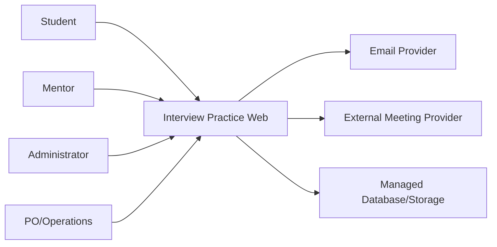
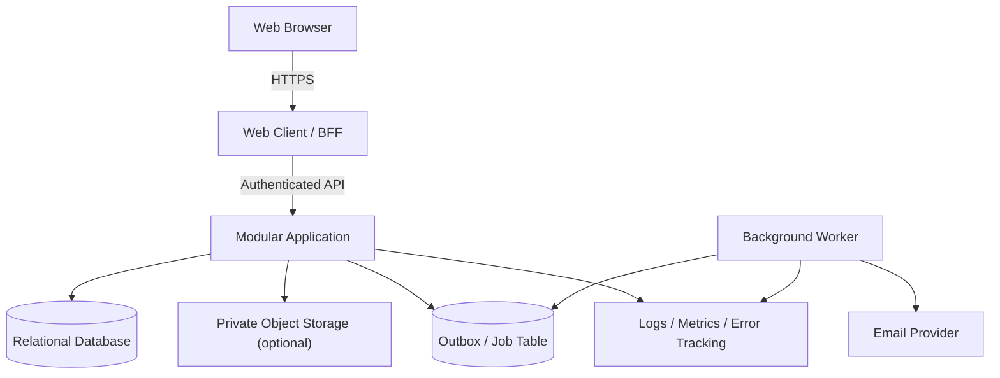
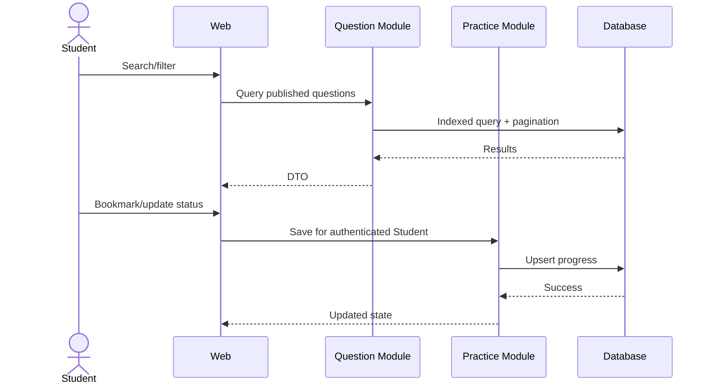

# Interview Practice Platform — Software Architecture and Design

## 1. Executive summary

Kiến trúc đề xuất cho MVP là **modular monolith** với relational database, web client và background worker cho notification. Cấu trúc này giữ transaction booking đơn giản, giảm chi phí vận hành và vẫn cho phép tách module sau khi sản phẩm chứng minh nhu cầu. Technology stack cụ thể phải được chốt bằng ADR sau khi có skill matrix; tài liệu này xác định boundary và quality requirement, không áp đặt framework chưa được xác nhận.

## 2. Goals, scope và architecture drivers

### 2.1 MVP goals

- Cung cấp Question Bank có search/filter và progress cơ bản.
- Quản lý mentor verification, availability và booking an toàn.
- Chống double booking dưới concurrent request.
- Bảo vệ meeting link, verification evidence và feedback.
- Gửi notification có retry mà không ảnh hưởng transaction nghiệp vụ.
- Thu event/KPI đủ cho pilot mà không thu thập dữ liệu thừa.

### 2.2 In scope

- Responsive web client.
- API/application service và relational database.
- Identity/RBAC; Student, Mentor, Admin workflow.
- Question, taxonomy, progress, mentor, slot, booking, feedback, review, report.
- Email/in-app notification, external meeting link.
- Audit log, telemetry, CI/CD, backup và environment configuration.

### 2.3 Out of scope

- Microservices, event streaming platform và multi-region deployment.
- AI interviewer/scoring, audio/video processing.
- Built-in WebRTC/video, recording và transcription.
- Payment/escrow/payout.
- Native mobile app và ML recommendation.

### 2.4 Quality priorities

1. Security/privacy và object-level authorization.
2. Data consistency cho slot/booking/state transition.
3. Reliability và recoverability của notification/operations.
4. Usability và accessibility của core workflow.
5. Maintainability/testability.
6. Performance phù hợp pilot; tránh tối ưu sớm.

## 3. Architecture decisions

| ADR | Quyết định đề xuất | Lý do | Trạng thái |
|---|---|---|---|
| ADR-001 | Modular monolith | Domain còn thay đổi; cần transaction đơn giản | Proposed |
| ADR-002 | Relational database | Constraint, transaction và audit booking | Proposed |
| ADR-003 | Background job + outbox cho notification | Tách provider failure khỏi booking | Proposed |
| ADR-004 | External meeting link | Giảm scope/security cost của video | Accepted by MVP scope |
| ADR-005 | Server-side authorization | Không tin role/ownership từ client | Proposed |
| ADR-006 | Technology stack | Chọn theo skill matrix/spike | Open |

### 3.1 Technology stack baseline

| Layer | Yêu cầu | Candidate — cần ADR |
|---|---|---|
| Web | Type-safe, accessible, testable | React/Next, Vue/Nuxt hoặc tương đương |
| API | Validation, transaction, background jobs | Node/.NET/Java/Python framework phù hợp team |
| Data | ACID, constraint, migration | PostgreSQL hoặc relational DB tương đương |
| Cache | Không bắt buộc ban đầu | Chỉ thêm khi measurement chứng minh cần |
| Job/queue | Retry và idempotency | DB-backed queue/outbox ở MVP |
| Auth | Secure session/token và reset flow | Managed hoặc in-app theo threat model |
| Hosting | TLS, secret, logs, backup | [CẦN CHỌN] |

## 4. System context



### Trust boundaries

- Browser/client là untrusted; server xác thực mọi input, role và ownership.
- Email/meeting provider nằm ngoài trust boundary; không làm nguồn chân lý cho booking.
- Verification document và meeting link là dữ liệu nhạy cảm, tách khỏi public profile.
- Admin action có quyền cao phải được audit.

## 5. Container và deployment view



Môi trường tối thiểu: local, test/CI, staging/UAT và production/pilot. Secret không nằm trong repository. Migration chạy theo quy trình có backup/rollback plan.

## 6. Backend module design

| Module | Trách nhiệm | Không được làm |
|---|---|---|
| Identity | Account, auth, role, session | Tự quyết định booking ownership |
| Student | Profile, goals | Quản lý mentor verification |
| Questions | Taxonomy, question, provenance, moderation | Gửi booking |
| Practice | Bookmark/progress | Công khai dữ liệu Student |
| Mentors | Profile, verification, service scope | Xác nhận slot trực tiếp không qua Booking |
| Availability | Slot và overlap rules | Tạo payment |
| Booking | State machine, lock slot, meeting-link access | Phụ thuộc email success |
| Feedback | Rubric, next action, review eligibility | Cho feedback trước Completed |
| Moderation | Report, content/mentor decisions | Sửa audit log |
| Notification | Event, template, retry, delivery status | Điều khiển business state |
| Analytics | Privacy-aware events/KPI | Lưu nội dung nhạy cảm không cần thiết |
| Audit | Security/business decision trail | Cho phép sửa/xóa thường xuyên |

### Dependency rules

- UI gọi application use case; không truy cập database trực tiếp.
- Module khác tham chiếu entity qua ID và public contract, không sửa bảng thuộc module khác tùy ý.
- Booking kiểm tra Mentor/Slot qua domain service trong cùng transaction khi cần.
- Notification nhận event sau commit từ outbox.
- Analytics không nằm trên critical path.

### Notification event model

Các event: `booking.requested`, `booking.confirmed`, `booking.reschedule_proposed`, `booking.cancelled`, `session.reminder_due`, `feedback.submitted`. Mỗi event có immutable ID, aggregate ID, type, occurred-at và payload tối thiểu. Worker xử lý idempotent, exponential backoff và dead-letter/manual retry state.

## 7. Core runtime flows

### 7.1 Tìm câu hỏi và lưu progress



### 7.2 Xác nhận booking và chống double booking

```mermaid
sequenceDiagram
    actor M as Mentor
    participant A as Booking API
    participant D as Database
    participant O as Outbox
    M->>A: Accept pending booking
    A->>D: Begin transaction; lock booking/slot
    A->>D: Validate owner, state, slot availability
    A->>D: Set Confirmed + reserve slot
    A->>O: Insert notification event
    A->>D: Commit
    A-->>M: Confirmed
    Note over A,D: Unique/partial constraint prevents a second confirmed booking for the same slot
```

### 7.3 Hoàn thành và gửi feedback

Mentor/Admin hợp lệ chuyển booking sang Completed theo policy. Feedback service kiểm tra Mentor ownership và Completed state, validate rubric, ghi feedback cùng audit event. Student xem feedback qua ownership policy; analytics chỉ ghi trạng thái hoàn chỉnh, không sao chép nội dung nhận xét.

## 8. Data design

| Entity | Trường/chức năng chính |
|---|---|
| User | id, email, status, roles, auth metadata |
| StudentProfile | user_id, target roles, goals, privacy settings |
| MentorProfile | user_id, expertise, bio, status, public fields |
| MentorVerification | mentor_id, evidence ref, status, decision audit |
| Position/Topic | taxonomy và trạng thái |
| Question | content, type, difficulty, status, provenance, version |
| QuestionTag | many-to-many question ↔ position/topic |
| PracticeProgress | student_id, question_id, bookmark, status |
| AvailabilitySlot | mentor_id, start/end UTC, timezone, status |
| Booking | student, mentor, slot, goal, type, state, meeting ref |
| BookingTransition | booking, from/to, actor, reason, timestamp |
| Feedback | booking_id unique, rubric, strengths, weaknesses, actions |
| Review | booking_id unique, rating, comment, moderation status |
| NotificationJob | event, channel, attempt, status, next_attempt |
| Report/AuditLog | target, actor, action, reason, timestamp |

### Data consistency

- Lưu instant theo UTC; giữ timezone nguồn để hiển thị/audit.
- Dùng database constraint để bảo đảm unique review/feedback per booking.
- Dùng transaction và lock/constraint để chống confirmed booking trùng slot.
- Booking state transition qua một domain service duy nhất.
- Soft-delete chỉ khi có lý do vận hành; privacy deletion phải có policy riêng.
- Migration có version và test rollback/forward phù hợp.

## 9. Dữ liệu nhạy cảm và lifecycle

- Public: display name, expertise, approved service scope, public rating.
- Private: email/contact, meeting link, booking goal, feedback và progress.
- Restricted: verification evidence, moderation note, security audit.
- Không log credential, token, meeting secret hoặc feedback text đầy đủ.
- Retention/deletion period: `[CẦN BỔ SUNG]` sau privacy/legal review.
- Nếu dùng object storage cho verification, bucket private và signed URL ngắn hạn.

## 10. External integration contracts và fallback

| Integration | Contract | Failure handling |
|---|---|---|
| Email | Template + recipient + idempotency key | Retry; in-app status; manual resend |
| Meeting | URL do mentor/admin cung cấp hoặc adapter | Cho sửa trước cutoff; không mất booking |
| Calendar — future/optional | Export/link, không phải source of truth | Manual schedule vẫn hoạt động |
| Analytics | Event schema versioned, no sensitive payload | Drop/retry ngoài critical path |

## 11. API design

Các nhóm route đề xuất:

- `/auth`, `/me`, `/student-profile`.
- `/questions`, `/topics`, `/positions`, `/practice-progress`.
- `/mentors`, `/mentor-verifications`, `/availability-slots`.
- `/bookings`, `/bookings/{id}/transitions`, `/bookings/{id}/feedback`, `/reviews`.
- `/admin/questions`, `/admin/mentors`, `/admin/reports`, `/admin/audit`.

### Contract conventions

- JSON schema/DTO rõ; server-side validation và error code ổn định.
- Cursor/page pagination và deterministic sort.
- Idempotency key cho create booking/critical transition khi phù hợp.
- Optimistic version hoặc ETag cho update dễ xung đột.
- Không nhận `userId/role` từ client làm nguồn authorization.
- API version/change policy được ghi bằng OpenAPI hoặc contract tương đương.

### High-risk routes trước release

Booking accept/reschedule/cancel/complete, meeting-link access, feedback create/read, mentor verification decision và admin moderation phải có integration test cho happy path, unauthorized, invalid state và concurrency.

## 12. Security architecture

### Authentication và session

- Password hash bằng thuật toán được khuyến nghị; rate limit login/reset.
- Secure, HttpOnly, SameSite cookie nếu dùng browser session.
- CSRF protection cho cookie-authenticated mutation.
- Session revoke, email verification và reset token ngắn hạn.

### Authorization

- RBAC cho khả năng cấp vai trò; ownership/relationship check cho object.
- Default deny; policy test cho Student, Mentor, Admin và unrelated user.
- Admin route tách rõ, audit quyết định quyền cao.
- Không dựa vào việc ẩn nút ở UI.

### Application và infrastructure

- Validate length/type/enum; encode output; parameterized query/ORM an toàn.
- TLS, secret manager/environment secret, dependency scan và patching.
- Rate limit với auth, search abuse, booking và review/report.
- Backup có kiểm tra restore; least-privilege DB/service account.
- Security incident runbook cho link/token/data exposure.

## 13. Reliability, performance và observability

### Initial service targets

| Target | Mục tiêu pilot |
|---|---:|
| Common API response | ≤ 3 giây trong điều kiện test |
| Critical workflow test pass | 100% |
| Critical/High open defect trước UAT | 0 |
| Notification | Retry được; không mất business transaction |
| Backup restore | Test trước pilot |

### Observability

- Structured log với correlation ID, actor pseudonymous ID và event type.
- Metrics: request latency/error, job backlog, notification failure, booking transition failure.
- Business events: question search, mentor view, booking requested/confirmed/completed, feedback submitted.
- Alert cho auth anomaly, booking conflict tăng, job backlog và provider failure.

## 14. UX routes và traceability

| Route/screen | Story | Module |
|---|---|---|
| `/questions` và detail | US-04–06 | Questions/Practice |
| `/mentors` và profile | US-10 | Mentors/Availability |
| `/bookings/new` | US-11 | Booking |
| `/bookings/{id}` | US-12–16,19 | Booking/Feedback/Notification |
| `/mentor/profile`, `/mentor/availability` | US-07,09 | Mentors/Availability |
| `/mentor/bookings` | US-12,13,15 | Booking/Feedback |
| `/admin/mentors`, `/admin/questions`, `/admin/reports` | US-08,18,20 | Moderation/Audit |

## 15. Technical POC và delivery plan

### POC-1: Booking consistency — acceptance gate

Chạy concurrent test với nhiều request accept/create cùng slot. Pass khi database chỉ cho phép một booking Confirmed, response còn lại xác định rõ conflict và không tạo side effect thừa.

### POC-2: Authorization

Tạo Student A/B, Mentor A/B và Admin; kiểm tra matrix read/write booking, meeting link, feedback và verification. Pass khi mọi access trái quyền bị chặn ở server.

### POC-3: Question filtering

Seed zero/one/many question, nhiều tag và trạng thái draft/published. Pass khi filter/pagination deterministic, không duplicate và draft không lộ.

### POC-4: Notification resilience

Giả lập provider timeout/duplicate delivery. Pass khi booking vẫn commit một lần, worker retry idempotent và có trạng thái để vận hành xử lý.

### Recommended delivery order

1. Repository, CI/CD, auth/RBAC, schema và audit foundation.
2. Taxonomy/Question Bank/Practice.
3. Mentor verification/profile/availability.
4. Booking state machine và concurrency POC.
5. Notification/meeting handoff.
6. Feedback/review/moderation.
7. Analytics, E2E, security test, UAT và release.

## 16. Risks, constraints và mitigation

| Risk | Mitigation |
|---|---|
| Double booking | DB constraint, transaction, lock và concurrency test |
| Broken object authorization | Central policy, default deny, matrix integration tests |
| Provider outage | Outbox/retry, fallback và source of truth nội bộ |
| Scope creep | ADR + release boundary + change control |
| PII leakage | Data classification, log redaction, private storage, retention |
| Content/review abuse | Provenance, moderation, report/appeal và audit |
| Stack mismatch với team | Spike và ADR sau skill matrix; tránh công nghệ mới không cần thiết |

