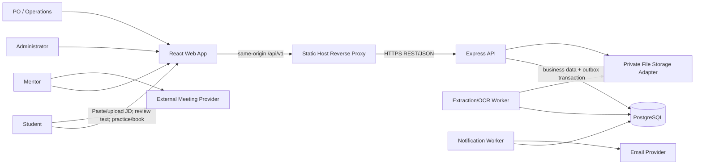
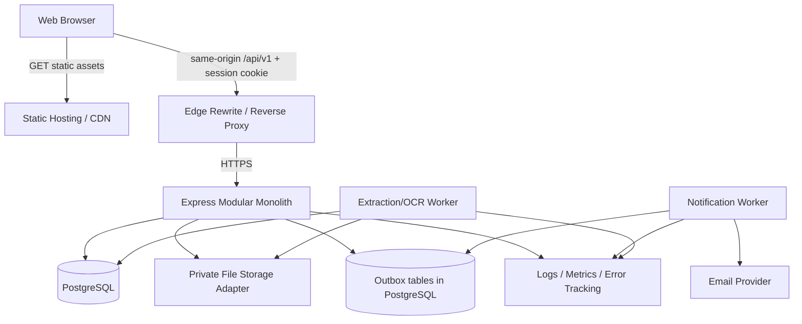
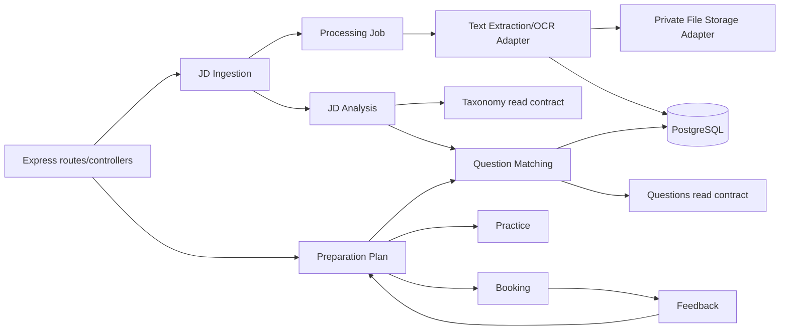
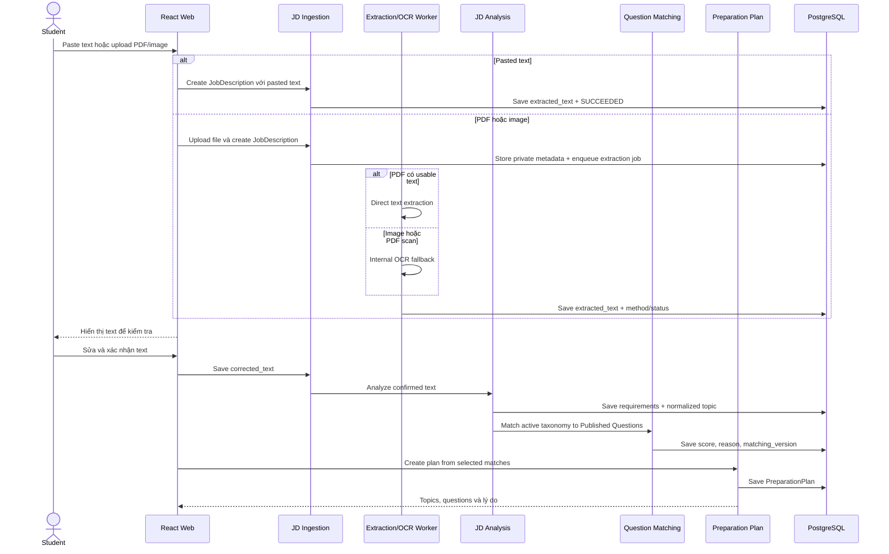
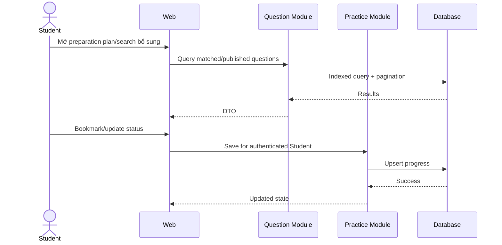
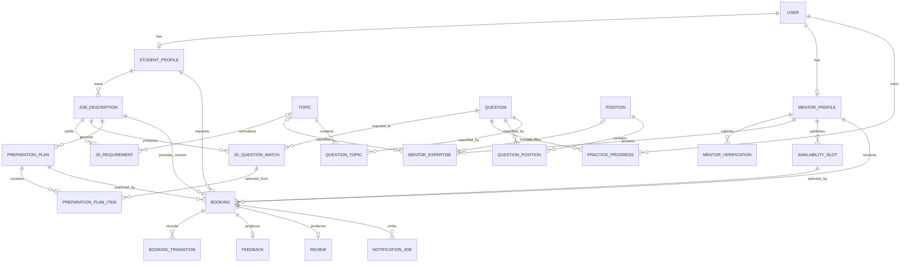

# Interview Practice Platform — Software Architecture and Design

| Thuộc tính | Giá trị |
|---|---|
| Phiên bản | 0.5 |
| Ngày cập nhật | 16/08/2026 |
| Architecture owner | Luân |
| Trạng thái | Proposed architecture baseline cho MVP/pilot; được xác nhận dần bằng PoC evidence |

## 1. Executive summary

Kiến trúc MVP là **React SPA và Express REST API triển khai độc lập**, trong đó backend là **modular monolith**, PostgreSQL là nguồn chân lý và notification chạy qua transactional outbox/worker. Stack dùng JavaScript xuyên suốt theo năng lực nhóm đã xác nhận: React, Tailwind CSS, Node.js, Express và PostgreSQL.

Luồng chính bắt đầu từ một JD cụ thể: nhập JD → extract text/OCR → Student kiểm tra và sửa text → phân tích requirement → chuẩn hóa taxonomy → mapping Question Bank → tạo preparation plan → tự luyện hoặc đặt mentor → feedback cập nhật kế hoạch. Mentor Marketplace vẫn được giữ nhưng là bước hỗ trợ sau preparation plan, không còn là điểm bắt đầu của sản phẩm.

Cấu trúc này giữ transaction booking trong một database, giảm chi phí vận hành và cho phép frontend/backend làm việc độc lập. Bốn quyết định kiến trúc được quản lý bằng ADR: technology stack, booking consistency, notification reliability và chiến lược xử lý JD/matching. Đây là kiến trúc mục tiêu cho MVP/pilot; PoC chỉ cung cấp evidence để chấp nhận, điều chỉnh hoặc thay thế từng quyết định qua các validation scenario ở mục 15.

## 2. Goals, scope và architecture drivers

### 2.1 MVP goals

- Chuyển một JD cụ thể thành text có thể kiểm tra/sửa và preparation plan có cấu trúc.
- Nhận diện requirement, chuẩn hóa alias theo taxonomy và mapping sang Question Bank bằng rule có thể giải thích.
- Cho mỗi câu hỏi đề xuất biết requirement nguồn, topic chuẩn hóa, match score/reason và matching version.
- Cho Student tự luyện hoặc chuyển preparation plan sang mentor booking có đầy đủ ngữ cảnh JD/topic/question.
- Quản lý mentor verification, availability và booking an toàn.
- Chống double booking dưới concurrent request.
- Bảo vệ meeting link, verification evidence và feedback.
- Gửi notification có retry mà không ảnh hưởng transaction nghiệp vụ.
- Thu event/KPI đủ cho pilot mà không thu thập dữ liệu thừa.

### 2.2 In scope

- Responsive web client.
- API/application service và relational database.
- Identity/RBAC; Student, Mentor, Admin workflow.
- JD dạng text, PDF có text, ảnh/PDF scan trong giới hạn PoC; extraction, OCR fallback và manual correction.
- Requirement analysis, taxonomy/alias normalization, deterministic question matching và preparation plan.
- Question, taxonomy, progress, mentor, slot, booking, feedback, review, report.
- Email/in-app notification, external meeting link.
- Audit log, telemetry, CI/CD, backup và environment configuration.

### 2.3 Out of scope

- Microservices, event streaming platform và multi-region deployment.
- AI interviewer/scoring, chatbot phỏng vấn và ML/semantic recommendation.
- OCR mọi định dạng/ngôn ngữ và phân tích tài liệu ngoài JD.
- Built-in WebRTC/video, recording và transcription.
- Payment/escrow/payout.
- Native mobile app.

### 2.4 Quality priorities

1. Security/privacy cho file, JD, meeting context và object-level authorization.
2. Tính giải thích, ổn định và kiểm thử được của question matching.
3. Data consistency cho slot/booking/state transition.
4. Reliability và recoverability của extraction job, notification và operations.
5. Usability/accessibility của luồng kiểm tra text và preparation plan.
6. Maintainability/testability; hiệu năng phù hợp pilot và tránh tối ưu sớm.

## 3. Architecture decisions

| ADR | Quyết định | Lý do | Trạng thái |
|---|---|---|---|
| [ADR-001](ADR/ADR-001-Technology-Stack.md) | React/Vite/Tailwind + Node.js/Express + PostgreSQL | Khớp năng lực nhóm, test/deploy tách biệt và chi phí pilot thấp | Accepted for PoC |
| [ADR-002](ADR/ADR-002-Booking-Consistency.md) | PostgreSQL transaction + row lock + partial unique index | Chống double booking ở nguồn chân lý | Accepted, pending PoC |
| [ADR-003](ADR/ADR-003-Notification-Reliability.md) | Transactional outbox + worker | Provider failure không làm mất booking | Accepted, pending PoC |
| [ADR-004](ADR/ADR-004-JD-Processing-and-Question-Matching.md) | Direct extraction trước, OCR nội bộ fallback; rule-based matching có version | Ít hạ tầng, giải thích được và deterministic cho PoC | Accepted for PoC; Proposed for MVP |
| Scope decision | External meeting link | Giảm scope/security cost của video | Accepted by MVP scope |
| Security decision | Server-side RBAC + object ownership policy | Không tin role/ownership từ client | Accepted for PoC |

### 3.1 Technology stack baseline

| Layer | Baseline | Quy tắc |
|---|---|---|
| Web | React SPA, Vite, JavaScript, Tailwind CSS | Static build; không truy cập database; dependency pin bằng lockfile |
| Routing/data | React Router, `fetch` wrapper, feature hooks | API URL qua environment; loading/error/permission state rõ |
| API | Node.js 24 LTS, Express 5, REST/JSON `/api/v1` | Modular monolith; schema validation tại boundary |
| Data access | `pg` + versioned SQL migrations | Parameterized SQL; transaction do application service quản lý |
| Data | PostgreSQL | ACID, constraint, row lock, index, audit và backup |
| Job/queue | PostgreSQL outbox + worker module | At-least-once, idempotent, retry/dead-letter state |
| JD processing | Direct text extraction + internal OCR adapter + PostgreSQL processing job | OCR chỉ cho ảnh/PDF scan; không gọi semantic/AI matching trong PoC |
| Matching | Taxonomy/alias dictionary + versioned rule-based scorer | Chỉ Published Question; lưu requirement nguồn, score và reason |
| Auth | Server-side session qua same-origin `/api` proxy | `__Host-` cookie `Secure`, `HttpOnly`, `SameSite=Lax`; CSRF control |
| Test | Vitest, React Testing Library, Supertest, Playwright | Integration/concurrency dùng PostgreSQL thật |
| CI/CD | Lint, audit, test, migration check, build | Frontend và backend pipeline độc lập |
| Deployment | Static frontend + containerized API/worker + managed PostgreSQL | Provider-neutral configuration; TLS và secret ngoài repository |
| Cache/broker | Không có trong baseline | Chỉ thêm khi measurement/ADR chứng minh cần |

## 4. System context



### Trust boundaries

- Browser/client là untrusted; Express API xác thực mọi input, session, role và ownership.
- Frontend và API là hai deployable độc lập, nhưng browser dùng cùng origin `/api`; static host reverse proxy request đến API để tránh phụ thuộc third-party cookie.
- API origin chỉ chấp nhận proxy/origin đã cấu hình; nếu mở direct cross-origin access thì CORS không dùng wildcard với credential.
- Email/meeting provider nằm ngoài trust boundary; không làm nguồn chân lý cho booking.
- Verification document và meeting link là dữ liệu nhạy cảm, tách khỏi public profile.
- JD file, extracted/corrected text, requirement và preparation plan là dữ liệu private theo Student; chỉ Mentor/Admin có quan hệ nghiệp vụ hợp lệ mới xem được phần tối thiểu cần thiết.
- OCR là một cách lấy text từ ảnh/PDF scan, không được dùng như tên chung cho JD analysis hoặc question matching.
- Admin action có quyền cao phải được audit.

## 5. Container và deployment view



Frontend và backend có build/deployment độc lập. JD processing là module/worker trong cùng modular monolith, không phải microservice. PoC một-instance có thể chạy worker cùng backend process và dùng temporary private storage sau adapter; MVP/pilot thay implementation này bằng private object storage. Khi OCR làm ảnh hưởng latency hoặc cần scale độc lập thì tách process qua cùng codebase và PostgreSQL job table. Môi trường tối thiểu: local, test/CI, staging/UAT và production/pilot. Secret không nằm trong repository. Migration chạy từ pipeline/job được kiểm soát, chỉ một runner tại một thời điểm và có backup/forward-fix plan.

### 5.1 Deployment profile và chi phí pilot

| Thành phần | Mặc định cho PoC/pilot | Chi phí tham chiếu 14/08/2026 | Giới hạn cần ghi nhận |
|---|---|---:|---|
| React static frontend + `/api` rewrite | Vercel Hobby | 0 USD cho personal/non-commercial | Fair-use/usage cap; pilot thương mại phải xem lại plan |
| Express API | Render Free web service | 0 USD | Cold start, 750 free instance-hours/workspace; không dùng cho production SLA |
| PostgreSQL | Neon Free | 0 USD | 0.5 GB/project, 100 CU-hours/project; scale-to-zero |
| Notification | Fake provider trong PoC; provider adapter ở pilot | TBD | Báo giá/quota phải được chốt trước pilot thật |
| JD storage/OCR | PoC: temporary private storage; MVP/pilot: private object storage; internal extraction/OCR adapter | Trong quota PoC | File PoC xóa sau extraction hoặc tối đa 24 giờ; external OCR chỉ qua ADR mới nếu internal OCR không đạt corpus pilot |
| Browser/API domain | URL frontend mặc định + same-origin rewrite | 0 USD | Custom domain và DNS là cost riêng khi pilot public |

Render Free PostgreSQL không được chọn làm baseline vì database free hết hạn sau 30 ngày. Worker được phép chạy cùng API process trong PoC một-instance; staging/production phải tách process hoặc chứng minh deployment platform bảo đảm singleton/idempotent worker. Mọi giá/quota phải được kiểm tra lại khi phê duyệt Cost–Time–Resource baseline.

### 5.2 Browser/API session topology

Baseline không để browser gọi trực tiếp `*.onrender.com` từ `*.vercel.app`. Browser luôn gọi `/api/v1` trên origin đang phục vụ React; static host rewrite/reverse proxy chuyển request đến Express API.

- Local: Vite development proxy chuyển `/api` đến API local.
- PoC/pilot: static host rewrite chuyển `/api/:path*` đến backend deployment.
- Session cookie dùng prefix `__Host-`, `Secure`, `HttpOnly`, `SameSite=Lax`, `Path=/` và không đặt `Domain`.
- Mutation dùng CSRF token/header; API kiểm tra `Origin`/`Sec-Fetch-Site` khi phù hợp.
- API base URL phía frontend là relative `/api/v1`; không nhúng backend origin vào production bundle.

Nếu sau này browser gọi trực tiếp `api.example.com` từ `app.example.com`, nhóm phải cập nhật ADR/security test cho CORS, cookie scope và CSRF trước khi đổi topology.

## 6. Backend module design

| Module | Trách nhiệm | Không được làm |
|---|---|---|
| Identity | Account, auth, role, session | Tự quyết định booking ownership |
| Student | Profile, goals | Quản lý mentor verification |
| Questions | Taxonomy, question, provenance, moderation | Gửi booking |
| JD Ingestion | Nhận pasted text/file, metadata, trạng thái và bản text được Student xác nhận | Tự phân tích skill hoặc công khai file |
| Text Extraction/OCR Adapter | Nhận dạng source, direct-extract text; chỉ OCR ảnh/PDF scan; chuẩn hóa lỗi adapter | Tự mapping question hoặc thay corrected text |
| JD Analysis | Phát hiện role, seniority, skill/technology/requirement và chuẩn hóa alias về taxonomy | Tạo nội dung AI hoặc sửa taxonomy âm thầm |
| Question Matching | Tính score deterministic theo requirement/topic, lọc Published Question, tạo reason và version | Trả Draft hoặc gọi semantic/AI matching trong PoC |
| Preparation Plan | Gom requirement/topic/question được chọn, theo dõi plan và cung cấp context cho Practice/Booking | Thay đổi booking state hoặc mentor feedback |
| Practice | Bookmark/progress | Công khai dữ liệu Student |
| Mentors | Profile, verification, service scope | Xác nhận slot trực tiếp không qua Booking |
| Availability | Slot và overlap rules | Tạo payment |
| Booking | State machine, lock slot, meeting-link access | Phụ thuộc email success |
| Feedback | Rubric, next action, review eligibility | Cho feedback trước Completed |
| Moderation | Report, content/mentor decisions | Sửa audit log |
| Notification | Event, template, retry, delivery status | Điều khiển business state |
| Analytics | Privacy-aware events/KPI | Lưu nội dung nhạy cảm không cần thiết |
| Audit | Security/business decision trail | Cho phép sửa/xóa thường xuyên |

### Dependency rules

- UI gọi application use case; không truy cập database trực tiếp.
- Module khác tham chiếu entity qua ID và public contract, không sửa bảng thuộc module khác tùy ý.
- Booking kiểm tra Mentor/Slot qua domain service trong cùng transaction khi cần.
- JD Analysis chỉ đọc `corrected_text` đã được Student xác nhận; không phân tích trực tiếp file hoặc tự ghi đè text.
- Question Matching dùng public read contract của Taxonomy/Questions; kết quả luôn gắn `matching_version` và không làm thay đổi Question Bank.
- Preparation Plan tham chiếu snapshot/version của match; Booking chỉ nhận `preparation_plan_id`/`job_description_id` thuộc Student và lưu context tối thiểu cho Mentor.
- Feedback ghi strength, weakness và next action; Preparation Plan áp dụng next action qua use case riêng, không cho Feedback sửa bảng plan trực tiếp.
- Notification nhận event sau commit từ outbox.
- Analytics không nằm trên critical path.

### 6.1 Component view cho luồng JD



Mũi tên thể hiện application contract được phép gọi, không phải quyền sửa trực tiếp bảng của module đích. Vòng `Feedback → Preparation Plan` là use case “áp dụng next action” do Student khởi tạo, không phải transaction ngầm khi Mentor submit feedback.

### Notification event model

Các event: `booking.requested`, `booking.confirmed`, `booking.reschedule_proposed`, `booking.cancelled`, `session.reminder_due`, `feedback.submitted`. Mỗi event có immutable ID, aggregate ID, type, occurred-at, deduplication key và payload tối thiểu. Worker xử lý at-least-once, idempotent, exponential backoff có jitter và dead-letter/manual retry state. Chi tiết nằm tại [ADR-003](ADR/ADR-003-Notification-Reliability.md).

## 7. Core runtime flows

### 7.1 Từ JD đến preparation plan



Extraction là asynchronous job có trạng thái `PENDING`, `PROCESSING`, `SUCCEEDED`, `FAILED` và error code an toàn. Cùng file/text hash và cùng extraction version có thể trả kết quả idempotent. Student luôn phải xác nhận `corrected_text`; analyze bị chặn nếu text chưa xác nhận hoặc extraction chưa ở trạng thái cuối phù hợp. Chi tiết lựa chọn direct extraction, OCR và matching nằm tại [ADR-004](ADR/ADR-004-JD-Processing-and-Question-Matching.md).

### 7.2 Tự luyện từ preparation plan



### 7.3 Từ preparation plan đến booking

Student chọn “Luyện với mentor” từ preparation plan. Booking service kiểm tra Student sở hữu plan/JD, mentor phù hợp topic và slot khả dụng; sau đó lưu `preparation_plan_id` và `job_description_id` trong booking. Mentor chỉ nhận corrected JD text, topics, nhóm câu hỏi và mục tiêu cần luyện sau khi có quan hệ booking hợp lệ; original file không được chia sẻ mặc định.

### 7.4 Xác nhận booking và chống double booking

```mermaid
sequenceDiagram
    actor M as Mentor
    participant A as Booking API
    participant D as Database
    participant O as Outbox
    M->>A: Accept pending booking
    A->>D: Begin transaction; lock slot then booking
    A->>D: Validate owner, state, slot availability
    A->>D: Set Confirmed + reserve slot
    A->>D: Insert transition + idempotency record
    A->>O: Insert deduplicated notification event
    A->>D: Commit
    A-->>M: Confirmed
    Note over A,D: Partial unique index protects occupied states for the same slot
```

Chi tiết transaction, conflict code, retry và concurrent acceptance test nằm tại [ADR-002](ADR/ADR-002-Booking-Consistency.md). Mọi path gồm Mentor, Student và Admin đều phải gọi cùng state-machine service; không có route update trạng thái trực tiếp.

### 7.5 Hoàn thành, feedback và quay lại plan

Mentor/Admin hợp lệ chuyển booking sang Completed theo policy. Feedback service kiểm tra Mentor ownership và Completed state, validate rubric, ghi strength, weakness, next action cùng audit event. Student xem feedback qua ownership policy; Student có thể chấp nhận next action để thêm/cập nhật mục trong preparation plan rồi luyện tiếp. Analytics chỉ ghi trạng thái hoàn chỉnh và outcome code, không sao chép JD hay nội dung nhận xét.

## 8. Data design

### 8.1 Conceptual ER model



Một slot có thể có nhiều booking `PENDING`, nhưng partial unique index chỉ cho một booking ở trạng thái chiếm slot. Booking tạo từ luồng JD phải tham chiếu preparation plan hoặc job description thuộc đúng Student; constraint/service validation ngăn context chéo owner. `Feedback` và `Review` đều unique theo `booking_id`; review chỉ thuộc Student của booking. `NotificationJob` là quan hệ logic qua aggregate ID/event key và không được điều khiển booking state.

### 8.2 Entity responsibilities

| Entity | Trường/chức năng chính |
|---|---|
| User | id, email, status, roles, auth metadata |
| StudentProfile | user_id, target roles, goals, privacy settings |
| JobDescription | id, student_id, source_type, original_file_ref, extracted_text, corrected_text, extraction_method/status/version, confirmed_at, created_at |
| JDRequirement | id, job_description_id, analysis_version, raw_text/source span, requirement_type, normalized_topic_id, confidence/rule evidence |
| JDQuestionMatch | job_description_id, requirement_id, question_id, match_score, match_reason, matching_version; unique theo version |
| PreparationPlan | id, student_id, job_description_id, status, matching_version, created_at, updated_at |
| PreparationPlanItem | plan_id, requirement/topic/question, source match, priority, practice state, mentor next action |
| MentorProfile | user_id, expertise, bio, status, public fields |
| MentorVerification | mentor_id, evidence ref, status, decision audit |
| MentorExpertise | mentor_id, topic_id hoặc position_id, evidence ref, status; constraint yêu cầu đúng một taxonomy target |
| Position/Topic | taxonomy và trạng thái |
| Question | content, type, difficulty, status, provenance, version |
| QuestionPosition/QuestionTopic | many-to-many question ↔ position/topic; composite unique key |
| PracticeProgress | student_id, question_id, bookmark, status |
| AvailabilitySlot | mentor_id, start/end UTC, timezone, status |
| Booking | student, mentor, slot, job_description_id/preparation_plan_id, goal, type, state, meeting ref |
| BookingTransition | booking, from/to, actor, reason, timestamp |
| Feedback | booking_id unique, rubric, strengths, weaknesses, actions |
| Review | booking_id unique, rating, comment, moderation status |
| NotificationJob | event, channel, attempt, status, next_attempt |
| IdempotencyRecord | actor, key, operation, request hash, response ref |
| Report/AuditLog | target, actor, action, reason, timestamp |

### 8.3 Data consistency

- Lưu instant theo UTC; giữ timezone nguồn để hiển thị/audit.
- Dùng database constraint để bảo đảm unique review/feedback per booking.
- Dùng transaction, ordered row lock và partial unique index để chống booking trùng slot.
- Booking state transition qua một domain service duy nhất.
- `corrected_text` có optimistic version; analyze nhận expected version để không lưu kết quả trên text cũ.
- Requirement/match là snapshot bất biến theo `analysis_version`/`matching_version`; chạy lại tạo version mới, không sửa lịch sử dùng bởi plan/booking.
- `MentorExpertise` phải tham chiếu đúng một `topic_id` hoặc `position_id`; chỉ expertise hợp lệ/được duyệt mới dùng để đề xuất mentor.
- Unique key ngăn cùng `(job_description_id, requirement_id, question_id, matching_version)` xuất hiện lặp.
- Matching chỉ join taxonomy active và Question `PUBLISHED`; score/rule có deterministic sort để cùng input/version cho cùng kết quả.
- Soft-delete chỉ khi có lý do vận hành; privacy deletion phải có policy riêng.
- Migration có version và test rollback/forward phù hợp.

## 9. Dữ liệu nhạy cảm và lifecycle

- Public: display name, expertise, approved service scope, public rating.
- Private: email/contact, JD text/file, requirements, preparation plan, meeting link, booking goal, feedback và progress.
- Restricted: verification evidence, moderation note, security audit.
- Không log credential, token, raw JD text, original filename, meeting secret hoặc feedback text đầy đủ.
- PoC chỉ nhận tối đa 50.000 ký tự văn bản dán hoặc một PDF/PNG/JPEG tối đa 10 MB; PDF tối đa 5 trang, PNG/JPEG là một ảnh. OCR nội bộ hỗ trợ tiếng Việt/Anh, tối đa 2 tác vụ đồng thời/tiến trình, hết hạn 60 giây và tối đa 2 lần chạy tự động. Kiểm tra magic bytes/MIME, không tin extension và không thực thi macro/script/embedded attachment.
- Trong PoC, original JD file nằm trong temporary private storage sau adapter và được xóa khi extraction hoàn tất hoặc chậm nhất 24 giờ. Trong MVP/pilot, adapter dùng private object storage với opaque ID; chỉ ingestion/worker có quyền đọc. Student không nhận durable file URL và Mentor không được xem original file mặc định.
- Extracted/corrected text, requirement, match và plan thuộc Student. Draft không hoạt động quá 90 ngày được đưa vào cleanup; xóa JD/account phải cascade hoặc anonymize artefact liên quan theo policy đã kiểm thử. Các mốc này là baseline PoC và cần privacy/legal review trước pilot thật.
- Mentor chỉ xem corrected text, topic/question và mục tiêu tối thiểu qua booking mình tham gia; không nhận original file hoặc metadata không cần thiết. Unrelated user bị default-deny.
- Trong MVP/pilot, verification/JD object storage dùng bucket private, encryption at rest và signed URL ngắn hạn khi thật sự cần tải.

## 10. Integration contracts và fallback

| Integration | Contract | Failure handling |
|---|---|---|
| Email | Template + recipient + idempotency key | Retry; in-app status; manual resend |
| Meeting | URL do mentor/admin cung cấp hoặc adapter | Cho sửa trước cutoff; không mất booking |
| Text extraction | Internal parser adapter cho pasted text/PDF có text | Nếu text rỗng/không đủ thì chuyển OCR; luôn cho sửa thủ công |
| OCR | Internal OCR adapter cho PNG/JPEG/PDF scan | Timeout/unsupported/low confidence trả trạng thái rõ; không tự phân tích JD |
| Calendar — future/optional | Export/link, không phải source of truth | Manual schedule vẫn hoạt động |
| Analytics | Event schema versioned, no sensitive payload | Drop/retry ngoài critical path |

## 11. API design

Các nhóm route đề xuất:

- `/api/v1/auth`, `/api/v1/me`, `/api/v1/student-profile`.
- `POST /api/v1/job-descriptions` — nhận pasted text hoặc file metadata/upload; tạo resource private.
- `POST /api/v1/job-descriptions/{id}/extract` — enqueue/idempotently retry extraction; trả job/status, không đồng nhất OCR với analysis.
- `PATCH /api/v1/job-descriptions/{id}/text` — lưu corrected text và version sau khi Student kiểm tra.
- `POST /api/v1/job-descriptions/{id}/analyze` — phân tích corrected text đã xác nhận và tạo requirement/match version mới.
- `GET /api/v1/job-descriptions/{id}/matches` — trả requirement nguồn, topic, Published Question, score/reason và matching version.
- `POST /api/v1/preparation-plans` — tạo plan từ JD và các match hợp lệ.
- `/api/v1/questions`, `/api/v1/topics`, `/api/v1/positions`, `/api/v1/practice-progress`.
- `/api/v1/mentors`, `/api/v1/mentor-verifications`, `/api/v1/availability-slots`.
- `/api/v1/bookings`, `/api/v1/bookings/{id}/transitions`, `/api/v1/bookings/{id}/feedback`, `/api/v1/reviews`.
- `/api/v1/admin/questions`, `/api/v1/admin/mentors`, `/api/v1/admin/reports`, `/api/v1/admin/audit`.

Các route JD ở trên là baseline để PoC và frontend/backend cùng thảo luận, chưa phải API contract được phê duyệt. OpenAPI và design review phải chốt payload, upload flow, polling/status, error code và version field trước implementation chính thức.

### Contract conventions

- JSON schema/DTO rõ; server-side validation và error code ổn định.
- Cursor/page pagination và deterministic sort.
- Header `Idempotency-Key` bắt buộc cho create booking và critical transition.
- `Idempotency-Key` cũng bắt buộc cho extraction/analyze retry; request analyze mang corrected-text version.
- Upload dùng streaming/bounded buffer, allowlist content type, size/page/time limit và error code riêng (`UNSUPPORTED_DOCUMENT`, `FILE_TOO_LARGE`, `EXTRACTION_FAILED`, `TEXT_NOT_CONFIRMED`).
- Optimistic version hoặc ETag cho update dễ xung đột.
- Không nhận `userId/role` từ client làm nguồn authorization.
- Contract được version hóa bằng OpenAPI; frontend sinh/kiểm tra client contract trong CI khi khả thi.
- Error envelope tối thiểu gồm `code`, `message`, `correlationId` và field errors; không lộ stack/SQL.

### High-risk routes trước release

JD upload/read/delete, extraction retry, corrected-text update, analyze/matches, booking-context access, booking accept/reschedule/cancel/complete, meeting-link access, feedback create/read, mentor verification decision và admin moderation phải có integration test cho happy path, malformed input, unauthorized access, invalid state và concurrency phù hợp.

## 12. Security architecture

### Authentication và session

- Server-side session lưu hash/token reference và expiry; session ID chỉ nằm trong cookie.
- Password hash bằng Argon2id hoặc thuật toán được security review chấp nhận; rate limit login/reset.
- Cookie `__Host-` có `Secure`, `HttpOnly`, `SameSite=Lax`, `Path=/`, không có `Domain`; frontend chỉ gọi relative `/api/v1`.
- Static host proxy request đến API; cookie-authenticated mutation có CSRF token và origin check.
- Nếu direct cross-origin API được bật sau này, CORS phải dùng allowlist chính xác và quyết định cookie scope phải qua security review.
- Session revoke, email verification và reset token ngắn hạn.

### Authorization

- RBAC cho khả năng cấp vai trò; ownership/relationship check cho object.
- Default deny; policy test cho Student, Mentor, Admin và unrelated user trên JD, matches, plan, booking context, meeting link và feedback.
- Student sở hữu JD/plan; Mentor chỉ có read projection tối thiểu khi thuộc booking còn hiệu lực. Admin access nội dung JD chỉ dùng cho support/security purpose được định nghĩa và phải audit.
- Admin route tách rõ, audit quyết định quyền cao.
- Không dựa vào việc ẩn nút ở UI.

### Application và infrastructure

- Validate length/type/enum; encode output; parameterized query/ORM an toàn.
- Upload kiểm tra magic bytes/MIME, size/page limit, filename sanitation, decompression/parse limit và timeout; parser/OCR chạy với least privilege, không có quyền mạng mặc định và không trả stack/parser detail cho client.
- Corrected text được coi là untrusted input khi render; không cho HTML/script từ JD chạy trong React.
- TLS, secret manager/environment secret, dependency scan và patching.
- Rate limit với auth, upload/extraction/analyze, search abuse, booking và review/report; quota theo Student ngăn OCR chiếm CPU/storage.
- Backup có kiểm tra restore; least-privilege DB/service account.
- Security incident runbook cho link/token/data exposure.

## 13. Reliability, performance và observability

### Initial service targets

Profile kiểm chứng pilot dùng một API instance, connection pool được cấu hình, PostgreSQL có ít nhất 1.000 Published Question, 100 Mentor, 1.000 future Slot và 500 Booking. Corpus JD phải có ít nhất 10 mẫu đã gắn nhãn, bao gồm pasted text, PDF có text, ảnh/PDF scan và ít nhất một file không hỗ trợ. Load test API thường chạy 20 virtual users đồng thời trong 10 phút sau warm-up; OCR benchmark chạy riêng để không che latency request path. Đây là baseline kỹ thuật để so sánh và phải cập nhật khi quy mô pilot thực tế được duyệt.

Các ngưỡng recall, precision@10 và task completion dưới đây là **đề xuất exit gate ban đầu**, chưa phải KPI sản phẩm đã phê duyệt. Trí phải báo cả số đo thực tế và corpus/rubric; Product Owner có thể đổi ngưỡng qua review có ghi nhận, không sửa kết quả PoC sau khi chạy.

| Target | Mục tiêu pilot | Cách kiểm chứng |
|---|---:|---|
| Search/list API | p95 ≤ 3 giây; HTTP 5xx < 1% | Load test theo profile trên với deterministic dataset |
| JD intake completion | 100% file hợp lệ trong corpus tạo được editable text hoặc trạng thái lỗi có thể xử lý | Corpus test + task analytics |
| Extraction quality | Báo extraction success theo source type và character/field accuracy trên corpus có ground truth | So sánh output trước manual correction; không gộp direct extract với OCR |
| Requirement detection | Recall ≥ 80% trên requirement đã gắn nhãn cho vị trí pilot | Golden dataset test; báo false positive/negative |
| Mapping relevance | Precision@10 ≥ 80% qua review rubric của domain reviewer | Blind review trên cùng corpus/version |
| Matching stability | 100% cùng corrected text + taxonomy + matching version cho cùng ordered result | Repeatability test và result hash |
| JD-to-plan task completion | ≥ 80% người dùng test hoàn thành không cần trợ giúp | Usability test năm màn hình |
| Booking detail/mutation | p95 ≤ 3 giây, không tính provider notification | Integration/load test trên staging |
| Booking consistency | Đúng 1 winner trong 20 concurrent confirm cùng slot | PostgreSQL concurrency test theo ADR-002 |
| Critical workflow test pass | 100% | Evidence report cho 8 architecture validation scenario và 10 acceptance criteria |
| Critical/High open defect trước UAT | 0 | Defect register và UAT exit review |
| Notification enqueue | Outbox cùng transaction; worker pickup p95 ≤ 10 giây khi provider hoạt động | Fake-provider integration test và job metrics |
| Backup/restore | RPO ≤ 24 giờ; RTO ≤ 4 giờ | Nightly logical backup và restore drill trước pilot |
| Transport security | TLS 1.2 trở lên | Deployment/security configuration check |

Free-tier deployment không có uptime SLA; availability target chỉ được baseline sau khi nhóm chọn paid pilot plan hoặc nhà cung cấp có SLA phù hợp.

### Observability

- Structured log với correlation ID, actor pseudonymous ID và event type.
- Metrics: request latency/error; extraction queue age, duration/failure theo source/method/error class; OCR fallback rate; manual-correction delta; requirement recall; mapping precision@10; result stability; notification backlog/failure; booking transition failure.
- Log/metric ghi `extraction_version`, `analysis_version`, `matching_version`, count và timing nhưng không ghi raw JD/requirement text.
- Business events: JD submitted, extraction completed/failed, text corrected/confirmed, plan created, question practiced, mentor selected, booking requested/confirmed/completed, feedback submitted và next action applied.
- Alert cho auth anomaly, repeated unauthorized JD access, extraction backlog/timeout, mapping result rỗng tăng bất thường, booking conflict, notification backlog và provider failure.

### 13.1 Test strategy

| Cấp kiểm thử | Phạm vi bắt buộc |
|---|---|
| Unit | Source classifier, alias normalization, requirement rules, scoring/tie-break, reason template, state transition và authorization policy |
| Adapter contract | Direct PDF extraction, OCR adapter, timeout/error normalization và fake fixtures; không phụ thuộc ảnh chụp UI |
| Golden dataset | So extracted text/requirements/matches với corpus đã gắn nhãn; đo recall, precision@10 và regression theo version |
| Integration | Upload limits, private storage, processing job retry/idempotency, corrected-text optimistic version, Published-only query, plan/booking FK và retention cleanup trên PostgreSQL thật |
| Security/privacy | MIME spoof, malformed/oversized file, parser timeout, XSS từ corrected text, owner/mentor/admin/unrelated matrix và log-redaction assertion |
| Concurrency/reliability | Repeat analyze, duplicate worker, 20 concurrent booking confirmations, outbox retry/dead-letter |
| E2E/usability | Năm trạng thái chính: nhập JD, kiểm tra text, plan có lý do, mentor/booking, session/feedback quay lại plan |

Test fixture JD phải là dữ liệu giả lập hoặc đã khử thông tin nhạy cảm. Mỗi kết quả benchmark ghi corpus version, taxonomy/alias/rule version, runtime và environment để tái lập được.

## 14. UX routes và traceability

| Route/screen | Story | Module |
|---|---|---|
| `/job-descriptions/new` | US-24–25 (proposed) | JD Ingestion/Text Extraction |
| `/job-descriptions/{id}/review` | US-26 (proposed) | JD Ingestion |
| `/preparation-plans/{id}` | US-27–29 (proposed) | JD Analysis/Question Matching/Preparation Plan |
| `/questions` và detail | US-04–06 | Questions/Practice |
| `/mentors` và profile | US-10 | Mentors/Availability |
| `/bookings/new?plan={id}` | US-11, US-30 (proposed) | Preparation Plan/Booking |
| `/bookings/{id}` | US-12–16,19 | Booking/Feedback/Notification |
| `/mentor/profile`, `/mentor/availability` | US-07,09 | Mentors/Availability |
| `/mentor/bookings` | US-12,13,15 | Booking/Feedback |
| `/admin/mentors`, `/admin/questions`, `/admin/reports` | US-08,18,20 | Moderation/Audit |

`US-24–30` là ID dự kiến từ change brief ngày 15/08/2026. Architecture không tự coi các ID này đã được baseline cho đến khi `Product_Backlog_and_Acceptance_Criteria.md` được Product Owner cập nhật mà không đổi ID cũ.

## 15. PoC validation của proposed MVP architecture

Các mục dưới đây là **architecture validation scenario**, không phải tám PoC độc lập và không tự động trở thành yêu cầu thay đổi implementation hiện tại. Architecture owner cập nhật trạng thái khi nhận được evidence; phần chưa có evidence giữ `Pending` và chỉ được giao cho thành viên PoC qua change request riêng.

| Phạm vi | Trạng thái hiện tại | Cách xử lý |
|---|---|---|
| Question filtering | Existing PoC; pending evidence review | Đối chiếu source/test/result trước khi đổi trạng thái ADR |
| Mentor booking, transition, meeting link và feedback | Existing PoC; pending evidence review | Giữ implementation hiện tại; chỉ yêu cầu bổ sung sau review |
| JD intake, extraction/OCR, analysis, matching và preparation plan | Pending PoC | Architecture mô tả target; chưa yêu cầu implementation ngay |
| Tích hợp JD preparation plan với mentor booking/feedback | Optional follow-up | Thực hiện nếu scope, thời gian và change request được duyệt |

### VS-1: JD intake, extraction và correction

Dùng corpus gồm pasted text, PDF có text, PNG/JPEG hoặc PDF scan và file không hỗ trợ. Pass khi direct extraction được ưu tiên, OCR chỉ chạy cho ảnh/scan, mọi JD hợp lệ tạo editable text hoặc lỗi có thể xử lý, Student sửa/xác nhận được text và file trái format/size bị chặn an toàn.

### VS-2: Requirement analysis và question matching

Chạy corrected text đã biết trước qua alias/taxonomy/rule set cố định. Pass khi hệ thống nhận diện skill kỳ vọng, chuẩn hóa được alias như `ReactJS → React`, không trả Draft/topic không active, mỗi result có requirement nguồn/topic/question/score/reason/version và repeat run cho cùng input/version có cùng ordered result. Đo recall và precision@10 theo mục 13; evidence theo ADR-004.

### VS-3: Preparation plan → mentor → feedback loop

Student tạo plan từ match, tự luyện hoặc chọn mentor, tạo booking có JD/plan context, Mentor xem đúng corrected text/topic/question cần luyện, mở external meeting link, hoàn thành và gửi strength/weakness/next action. Pass khi next action quay lại plan và unrelated user không xem được context.

### VS-4: Booking consistency

Chạy ít nhất 20 request concurrent accept cùng slot trên PostgreSQL thật. Pass khi đúng một booking chiếm slot, các response còn lại là conflict/idempotent và chỉ một transition/outbox event logic được tạo. Evidence theo ADR-002.

### VS-5: Authorization và privacy

Tạo Student A/B, Mentor A/B và Admin; kiểm tra matrix read/write JD, match, plan, booking context, original file, meeting link, feedback và verification. Pass khi mọi access trái quyền bị chặn ở server, original file không chia sẻ cho Mentor và log không chứa raw JD/secret.

### VS-6: Booking transition và audit

Kiểm tra happy path và invalid path của `PENDING → CONFIRMED → COMPLETED`, cancel/reschedule, actor ownership và retry. Pass khi chỉ transition hợp lệ được commit, mỗi transition có actor/reason/timestamp và không có route bypass state machine.

### VS-7: Question filtering

Seed zero/one/many question, nhiều tag và trạng thái draft/published. Pass khi filter/pagination deterministic, không duplicate, Draft không lộ qua search lẫn JD matching.

### VS-8: Notification resilience

Giả lập provider timeout, 5xx và duplicate worker. Pass khi booking vẫn commit một lần, worker retry idempotent, job lỗi vĩnh viễn vào `DEAD` và có trạng thái để vận hành xử lý. Evidence theo ADR-003.

Tám validation scenario trên dùng để thu thập evidence cho mười acceptance criteria trong change brief: editable text; expected skill; alias normalization; no Draft/invalid taxonomy; explainable match; deterministic version; booking từ plan; object authorization; booking/meeting/feedback vẫn hoạt động; feedback tạo next action quay lại plan. Scenario chưa nằm trong PoC hiện tại được giữ `Pending`, không được coi là thất bại.

### 15.1 Contract phối hợp với Trí

Mentor booking PoC đã tồn tại nhưng architecture owner chưa review đầy đủ source, test và result; JD/OCR/mapping PoC chưa được thực hiện tại ngày 15/08/2026. Khi nhóm phát hành change request hoặc bàn giao evidence, PoC owner trả lại các artifact áp dụng cho phạm vi được giao dưới thư mục PoC đã thống nhất:

| Artifact | Nội dung Luân cần để cập nhật architecture |
|---|---|
| `README.md` | Runtime, setup, environment variables, migration/seed/test commands |
| `POC_Result.md` | Bảng Pass/Fail/Pending cho validation scenario thuộc phạm vi đã giao, mapping tới acceptance criteria, evidence và limitation |
| `fixtures/jd/` | Corpus JD đã khử thông tin nhạy cảm, ground-truth text/requirement và rubric relevance |
| `database/` | Migration cho JD/requirement/match/plan, booking context, partial unique index, audit, processing job và outbox |
| `tests/` | Extraction/OCR, golden matching, repeatability, authorization matrix, concurrent booking, transition, filter và retry test |
| API contract | Route/payload/status/error code thực tế; đặc biệt upload/extraction/analyze version, `409` và `Idempotency-Key` |

Sau khi nhận result, Luân phải: (1) đối chiếu ADR assumption với evidence; (2) cập nhật trạng thái ADR; (3) sửa diagram/data/API nếu PoC khác baseline; (4) ghi deviation và trade-off, không âm thầm sửa lịch sử ADR.

Design review là gate bắt buộc trước khi chấp nhận architecture cho MVP:

| Mục | Trạng thái hiện tại | Exit evidence |
|---|---|---|
| Review backlog/module mapping | Prepared | Luân và Trí xác nhận module/API phục vụ validation scenario và acceptance criteria thuộc scope đã duyệt |
| Review JD processing/matching | Pending PoC | Corpus, extraction metrics, matching relevance/repeatability và ADR-004 được review |
| Review database/concurrency design | Pending PoC | Migration và concurrent test result được review |
| Review authorization/session topology | Pending PoC | Ownership matrix và deployed same-origin session test pass |
| Review notification/deployment | Pending PoC | Failure/retry evidence và worker topology được xác nhận |
| Quyết định cuối | Pending | Meeting note hoặc PR review ghi Accept/Revise và ADR status mới |

### Recommended delivery order

1. Repository, CI/CD, auth/RBAC, private storage, schema và audit foundation.
2. Taxonomy/alias và Question Bank seed cho vị trí pilot.
3. JD intake, direct extraction/OCR adapter và correction screen.
4. Requirement analysis, versioned matching, explainable result và preparation plan.
5. Self-practice cùng mentor discovery/profile/availability.
6. Booking context, state machine và concurrency PoC.
7. External meeting handoff, notification và feedback-to-plan loop.
8. Analytics, E2E, privacy/security test, UAT và release.

## 16. Risks, constraints và mitigation

| Risk | Mitigation |
|---|---|
| OCR quality phụ thuộc file/image | Direct extraction trước; supported-format limits; corpus benchmark; confidence/error state và manual correction bắt buộc |
| Extraction sai kéo theo mapping sai | Chỉ analyze corrected text đã xác nhận; version/hash; hiển thị requirement nguồn và cho rerun |
| Taxonomy/alias thiếu cho vị trí pilot | Giới hạn pilot role; golden dataset; review alias/version trước demo; không fallback sang AI âm thầm |
| Mapping trả kết quả không liên quan | Rule-based explainable score; chỉ Published/active taxonomy; precision@10 review và threshold/version gate |
| JD chứa PII/thông tin công ty | Private storage, least privilege, log redaction, file auto-delete, Student delete và retention review |
| Double booking | DB constraint, transaction, lock và concurrency test |
| Broken object authorization | Central policy, default deny, matrix integration tests |
| Provider outage | Outbox/retry, fallback và source of truth nội bộ |
| Scope creep | ADR + release boundary + change control |
| PII leakage | Data classification, log redaction, private storage, retention |
| Content/review abuse | Provenance, moderation, report/appeal và audit |
| Stack mismatch với team | Spike và ADR sau skill matrix; tránh công nghệ mới không cần thiết |
| Marketplace thiếu mentor | Preparation plan và self-practice vẫn tạo giá trị trước booking; giới hạn mentor pilot theo topic |

## 17. Traceability với slide tham chiếu

| Nội dung slide | Cách architecture đáp ứng |
|---|---|
| [03 — Slide 011: Which Architecture?](../refs/03-software-project-initiation.md) | ADR-001 giải thích architectural style, technology stack, framework và deployment platform |
| [06.1 — Slides 032–033: System Architecture](../refs/06-1-agile-planning.md) | Backlog traceability, system context, components, interfaces, NFR và design-review gate |
| [05.1 — Slide 024: Solution Engineering Decomposition](../refs/05-1-work-breakdown-structure.md) | ER model, module design, technology, external integrations và ADR patterns |
| [07 — Slides 041–050: SCM, CI/CD và DevOps](../refs/07-software-configuration-management.md) | Branch/lockfile, independent pipelines, Docker, environment configuration và monitoring |
| [10.1 — Slides 010–014: Technology risk](../refs/10-1-agile-risk-management.md) | Ưu tiên stack quen thuộc; PoC gates, transition indicator và contingency qua ADR |
| [11 — Slides 024–025: Quality requirements](../refs/11-software-quality-management.md) | NFR có metric, test profile, evaluation method và exit criteria |

