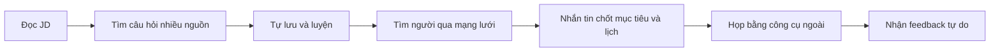

# Interview Practice Platform — Existing Tools Analysis

## 1. Kết luận điều hành

Người học hiện có đủ công cụ để ghép một quy trình luyện phỏng vấn thủ công, nhưng phải chuyển ngữ cảnh, nhập lại dữ liệu và tự đánh giá chất lượng ở mỗi bước. Cơ hội của dự án không nằm ở việc thay thế mọi công cụ; nó nằm ở việc nối Question Bank, mentor discovery, booking và feedback thành một vòng lặp duy nhất.

## 2. Các công cụ đang được dùng riêng lẻ

| Nhu cầu | Công cụ thường dùng | Giá trị | Hạn chế |
|---|---|---|---|
| Tìm việc/vị trí | Website tuyển dụng, LinkedIn | Có mô tả công việc thật | Không chuyển JD thành lộ trình luyện |
| Tìm câu hỏi | Google, blog, YouTube, ChatGPT | Nhiều nội dung, dễ tiếp cận | Rời rạc, trùng lặp, khó kiểm chứng |
| Luyện coding | LeetCode và kho bài tập | Có bài tập và test tự động | Hẹp về coding; thiếu feedback giao tiếp |
| Lưu tiến độ | Notes, bookmark, spreadsheet | Linh hoạt | Phải tổ chức thủ công, không gắn với booking |
| Tìm người hỗ trợ | Bạn bè, cộng đồng, LinkedIn | Có thể tìm đúng chuyên môn | Phụ thuộc mạng lưới; hồ sơ và chất lượng không đồng nhất |
| Điều phối lịch | Chat, calendar, email | Phổ biến | Trao đổi kéo dài, dễ thiếu thông tin hoặc trùng lịch |
| Họp trực tuyến | Google Meet, Zoom | Ổn định, quen thuộc | Không lưu mục tiêu và rubric của buổi luyện |
| Feedback | Tin nhắn, tài liệu tự do | Dễ triển khai | Khó so sánh và theo dõi hành động cải thiện |

## 3. Workflow kết hợp hiện tại

Mỗi chuyển tiếp phụ thuộc vào thao tác thủ công. Dữ liệu về vị trí, chủ đề yếu và mục tiêu buổi luyện không đi xuyên suốt quy trình.

## 4. Vì sao tổ hợp vẫn phức tạp

- Người học phải xác định nguồn nào đáng tin cậy và tự loại nội dung trùng lặp.
- Không có taxonomy chung giữa JD, câu hỏi, mentor và feedback.
- Mentor thường nhận yêu cầu thiếu mục tiêu, bối cảnh và phạm vi luyện.
- Lịch rảnh và trạng thái booking nằm trong hội thoại riêng.
- Không có quy tắc chống trùng slot, no-show hoặc review không hợp lệ.
- Feedback khó biến thành danh sách chủ đề cần luyện tiếp.

## 5. So sánh với giải pháp đề xuất

| Khả năng | Tổ hợp công cụ hiện tại | Interview Practice Platform MVP |
|---|---|---|
| Question taxonomy | Mỗi nguồn một cách phân loại | Một taxonomy theo vị trí/chủ đề/loại/mức độ |
| Theo dõi luyện tập | Ghi chú thủ công | Bookmark và trạng thái luyện cơ bản |
| Mentor discovery | Mạng lưới và tìm kiếm mở | Hồ sơ, phạm vi, xác minh, lịch và đánh giá |
| Booking | Nhắn tin và lịch riêng | Vòng đời booking và khóa slot |
| Context trước buổi | Gửi lại thủ công | Mục tiêu/chủ đề đi cùng booking |
| Feedback | Tự do | Rubric và hành động tiếp theo |
| Họp trực tuyến | Công cụ ngoài | Vẫn dùng công cụ ngoài trong MVP |

## 6. Hàm ý cho business case

MVP chỉ có giá trị khi giảm được ma sát giữa các bước. Nhóm phải đo thời gian tìm câu hỏi, tỷ lệ hoàn tất booking, tỷ lệ booking diễn ra và chất lượng feedback trước/sau pilot. Nếu người dùng chỉ dùng Question Bank mà không chuyển sang mentor, nhóm cần xem lại value proposition hoặc mô hình marketplace.

## 7. Giới hạn bằng chứng

Phân tích này kế thừa giả thuyết từ proposal. Nhóm cần customer discovery với sinh viên và mentor để xác nhận tần suất sử dụng từng công cụ, chi phí chuyển đổi và mức sẵn lòng trả tiền.

