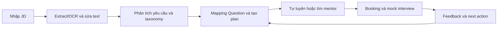

# Project Proposal — Interview Practice Platform

| Thuộc tính | Giá trị |
|---|---|
| Tên dự án | Interview Practice Platform — tên làm việc |
| Nhóm thực hiện | Gia Thành, Hùng, Hưng, Trí, Luân, Tuấn Anh |
| Phiên bản | 0.2 — đồng bộ hướng JD-first |
| Ngày cập nhật | 16/08/2026 |
| Nguồn kiểm soát | Project Vision and Scope, Product Backlog và `docs/refs/` |

Phân công vai trò chính được kế thừa từ Project Charter; proposal không tạo ra chức danh khác.

| Thành viên | Vai trò chính theo Charter |
|---|---|
| Gia Thành | PM/Scrum Master, initiation & estimation |
| Hùng | UI/UX |
| Hưng | Product Owner/BA |
| Trí | PoC/E2E |
| Luân | Architecture/technical lead |
| Tuấn Anh | Trưởng nhóm / leadership & governance |

## 1. Mục đích

Dự án xây dựng một ứng dụng web giúp ứng viên Việt Nam chuẩn bị cho kỳ thực tập hoặc công việc đầu tiên từ một Job Description (JD) cụ thể. Sản phẩm chuyển JD thành preparation plan có giải thích, rồi nối tự luyện với mock interview và feedback có cấu trúc.

## 2. Vấn đề

Ứng viên đọc một JD cụ thể nhưng phải tự suy luận vị trí, seniority, kỹ năng và câu hỏi cần ôn. Nội dung nằm trên nhiều website, video, mạng xã hội và cộng đồng; người học không biết requirement nào đã được bao phủ hoặc câu hỏi nào thực sự liên quan. Việc tìm mentor, thống nhất mục tiêu/lịch và công cụ họp chủ yếu diễn ra qua tin nhắn; mentor thường thiếu ngữ cảnh JD và feedback sau buổi khó chuyển thành hành động tiếp theo.

Vấn đề nghiệp vụ cốt lõi là: **ứng viên đọc một JD cụ thể nhưng không biết cần ôn kiến thức, kỹ năng và câu hỏi nào để chuẩn bị phỏng vấn; JD, câu hỏi, mock interview và feedback chưa được nối trong một workflow có truy vết.**

## 3. Giải pháp hiện tại

Người học thường kết hợp các công cụ sau:

- Website tuyển dụng để đọc mô tả công việc.
- Google, YouTube, blog, ChatGPT và kho bài tập để tìm câu hỏi.
- Ghi chú, bookmark hoặc bảng tính để lưu tài liệu.
- Bạn bè, cộng đồng, LinkedIn hoặc nền tảng mentoring để tìm người luyện cùng.
- Tin nhắn, lịch cá nhân và Google Meet/Zoom để điều phối buổi gặp.

Tổ hợp này giải quyết từng bước riêng lẻ nhưng không tạo thành vòng lặp JD → yêu cầu → câu hỏi/kế hoạch → thực hành → feedback → luyện lại.

## 4. Giải pháp đề xuất

MVP gồm ba năng lực liên kết:

1. **JD-to-Preparation Plan:** dán/tải JD, direct extraction hoặc OCR fallback, correction gate, requirement/taxonomy analysis và explainable Question mapping.
2. **Question Bank và self-practice:** câu hỏi đã quản trị theo vị trí/chủ đề/mức độ, tiêu chí trả lời, bookmark và trạng thái luyện.
3. **Mentor practice loop:** hồ sơ/xác minh/lịch rảnh, booking có JD/plan context, link họp ngoài, feedback theo rubric và đánh giá sau buổi.

Ba vai trò của hệ thống là Student, Mentor và Administrator. Workflow chính:

## 5. Giá trị khác biệt

- Tập trung vào JD Front-end Intern/Junior và ứng viên entry-level tại Việt Nam trong pilot.
- Mỗi Question đề xuất có requirement nguồn, topic và lý do mapping; preparation plan giữ trace tới JD.
- Booking mang theo JD/plan context tối thiểu và feedback cập nhật next action về cùng plan.
- Chuẩn hóa feedback theo kiến thức, cấu trúc trả lời, giao tiếp, xử lý câu hỏi tiếp nối và hành động cải thiện.
- Hiển thị rõ kinh nghiệm, phạm vi hỗ trợ, lịch và đánh giá của mentor.
- Dùng công cụ họp bên ngoài trong MVP để bảo vệ thời gian và ngân sách.

## 6. Mô hình kinh doanh giả định

Pilot dùng Question Bank/preparation plan miễn phí và Mentor tự nguyện; payment, escrow, payout và commission không thuộc MVP. Mô hình thu phí chỉ được nghiên cứu sau khi luồng JD-to-plan và plan-to-booking chứng minh giá trị; mọi giả thuyết willingness to pay cần phỏng vấn giá hoặc thử nghiệm riêng, không được suy ra từ pilot miễn phí.

## 7. Phạm vi MVP

### Trong phạm vi

- Đăng ký, đăng nhập và phân quyền Student/Mentor/Admin.
- Dán tối đa 50.000 ký tự hoặc upload một PDF/PNG/JPEG ≤10 MB; PDF ≤5 trang.
- Direct extraction cho text/PDF có chữ, OCR nội bộ Việt/Anh cho ảnh/PDF scan và correction gate trước analysis.
- Requirement detection, taxonomy/alias normalization, versioned rule-based Question mapping có source/topic/reason và preparation plan.
- Question Bank có tìm kiếm, lọc, chi tiết, bookmark và trạng thái luyện.
- Hồ sơ, xác minh và lịch rảnh của mentor.
- Vòng đời booking: tạo, xác nhận, từ chối, đề xuất đổi lịch, hủy và hoàn thành.
- Link họp ngoài và notification cho sự kiện quan trọng.
- Feedback theo rubric và review từ booking hợp lệ.
- Admin quản lý mentor, câu hỏi, booking, report và taxonomy.

### Ngoài phạm vi

- AI interviewer và tự động chấm câu trả lời.
- Video/audio call, ghi âm hoặc phiên âm tích hợp.
- Thanh toán, giữ tiền và payout tự động.
- Ứng dụng mobile native, ATS và recommendation bằng machine learning.

## 8. Kết quả mong đợi

- JD hợp lệ trở thành text có thể sửa; blind-set requirement recall và precision@10 đạt ≥80%.
- Người dùng hiểu lý do Question được đề xuất và bắt đầu self-practice hoặc Mentor booking từ preparation plan.
- Pilot đạt ít nhất 10 booking Confirmed và 8 Completed; feedback tạo strength, weakness và next action.
- Mentor quản lý yêu cầu và lịch trong một quy trình thống nhất.
- Nhóm thu được bằng chứng để quyết định Go, Pivot hoặc Stop.

## 9. Điều kiện phê duyệt

Planning baseline nội bộ đã xác định 6 thành viên, 8 tuần, khoảng 653 giờ capacity, 1.125.000 VNĐ cash ceiling, 20 JD, 12 Student, 4 Mentor và 12 booking hợp lệ. Trước khi cam kết phát hành, nhóm vẫn phải có:

- chữ ký Sponsor Ngô Huy Biên và Ngô Ngọc Đăng Khoa trong Project Charter;
- Planning Poker của Development Team, hai estimate độc lập đã cập nhật theo 27 câu chuyện Bắt buộc và khoảng velocity cho 4 sprint;
- corpus 20 JD hợp pháp/khử định danh với nhãn hai lượt;
- bằng chứng PoC về extraction/mapping, authorization, booking consistency và notification retry;
- kết quả prototype/UAT, không còn Critical/High defect và quyết định Go/Pivot/Stop dựa trên KPI.
