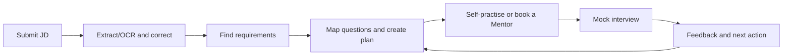

# Project Proposal — Interview Practice Platform

| Item         | Details                                             |
| ------------ | --------------------------------------------------- |
| Project name | Interview Practice Platform                         |
| Team         | Gia Thành, Hùng, Hưng, Trí, Luân, Tuấn Anh          |
| Version      | 0.2 — JD-first baseline                             |
| Updated      | 16 August 2026                                      |
| Status       | Internal baseline; Sponsor approval is not recorded |

## 1. Purpose

This project proposes a web application for Vietnamese candidates who prepare for an internship or first job. The application starts from one job description (JD). It creates a clear preparation plan and connects self-practice, mentor sessions, and feedback.

This proposal supports a Go, Pivot, or Stop decision. It is not a detailed project plan and does not authorise the project.

## 2. Problem

Candidates often read a JD but do not know what knowledge, skills, or questions to prepare. They use many separate tools for questions, notes, mentors, schedules, meetings, and feedback. As a result:

- requirements are difficult to track;
- study content is scattered;
- mentors may not receive enough JD context; and
- feedback is difficult to turn into the next study action.

The core problem is:

> The JD, interview questions, mock interview, and feedback are not connected in one clear workflow.

## 3. Proposed solution

The minimum viable product (MVP) has three connected parts:

1. **JD to Preparation Plan:** paste or upload a JD, extract the text, use OCR when needed, correct the text, find requirements, and map them to questions.
2. **Question Bank and self-practice:** search questions, save them, and track basic practice progress.
3. **Mentor practice loop:** find an approved Mentor, book a session with JD/plan context, use an external meeting link, and receive structured feedback.

The system supports Student, Mentor, and Administrator roles.

## 4. Main value

- Focus on Front-end Intern/Junior JDs for the pilot.
- Show the source requirement, topic, and reason for each mapped question.
- Keep the JD or preparation plan linked to the booking.
- Use one feedback form for strengths, weaknesses, and next actions.
- Use external meeting tools to reduce cost and scope.

These points are product hypotheses. They are not proven market results.

## 5. MVP scope

### In scope

- Accounts, authentication, and role-based access.
- JD input by text, PDF, PNG, or JPEG.
- Direct text extraction, Vietnamese/English OCR fallback, and text correction.
- Requirement analysis, shared taxonomy, question mapping, and preparation plans.
- Question Bank search, filters, bookmarks, and practice status.
- Mentor profile, approval, expertise, and availability.
- Booking, rescheduling, cancellation, completion, and external meeting links.
- Notifications, structured feedback, reviews, and basic administration.

### Out of scope

- AI interviewer and automatic answer scoring.
- Built-in video/audio calls, recording, or transcription.
- Payment, escrow, payout, or commission.
- Native mobile applications, applicant tracking, and ML recommendations.

ADR-005 later added optional Gemini support behind feature flags. It does not add an AI interviewer or automatic scoring. Proposal version 0.2 has not been updated for this decision.

## 6. Targets and constraints

| Item               | Baseline or target                                                        |
| ------------------ | ------------------------------------------------------------------------- |
| Team and duration  | 6 members, 8 weeks                                                        |
| Available capacity | About 653 hours after a 15% reserve                                       |
| Cash limit         | VND 1,125,000                                                             |
| Pilot size         | 20 legal and de-identified JDs, 12 Students, 4 Mentors, 12 valid bookings |
| Mapping quality    | Requirement recall and precision@10 of at least 80%                       |
| Booking target     | At least 10 `CONFIRMED` and 8 `COMPLETED` bookings                        |
| Feedback target    | Strength, weakness, and next action in completed-session feedback         |

These values are planning targets, not achieved results. A major scope change needs impact analysis and approval.

## 7. Competitors and alternatives

| Group                | Examples                      | Main overlap                                  |
| -------------------- | ----------------------------- | --------------------------------------------- |
| Interview coaching   | interviewing.io, MentorCruise | Practice with experienced people and feedback |
| Peer practice        | Pramp / Exponent Practice     | Matching, booking, and feedback               |
| Mentoring in Vietnam | Mentori Vietnam, Mentora      | Local users and Mentor connection             |
| Coding practice      | LeetCode Study Plans          | Technical questions and exercises             |

The proposed difference is the JD-first flow for entry-level candidates in Vietnam. This difference still needs user testing. See [Competitor Analysis](Competitor_Analysis.md).

## 8. Creation and update history

| Date              | Change                                                                  | Evidence                                    |
| ----------------- | ----------------------------------------------------------------------- | ------------------------------------------- |
| 9 August 2026     | Competitor sources recorded                                             | Competitor Analysis                         |
| 12–13 August 2026 | Version 0.1 created and committed                                       | Commit `0743a68`, Git author `tnnhuaa`      |
| 14–16 August 2026 | Compared with the Charter, Vision and Scope, resources, and feasibility | Project documents and Git history           |
| 16 August 2026    | Version 0.2 changed to the JD-first direction                           | Commit `7ca1f6e`, PR `#6`, Git author `Z3n` |

The main changes were:

- added JD extraction, OCR, and correction;
- added explainable question mapping;
- added measurable targets and project limits;
- removed payment from the MVP; and
- changed the paid-service idea to a free pilot with volunteer Mentors.

## 9. Review status

The team checked the proposal for:

- required proposal content;
- problem–solution fit;
- competitor position;
- scope, time, cost, and resource fit;
- links to the backlog, prototype, architecture, and code; and
- version changes in Git.

The repository proves internal updates, but it does not contain named review comments, customer interviews, survey data, willingness-to-pay results, or Sponsor signatures. The proposal must not be presented as formally approved.

## 10. Approval conditions

Before a release commitment, the team still needs:

- signed Sponsor approval in the Project Charter;
- agreed team estimates and a velocity range;
- a legal and labelled 20-JD test set;
- technical evidence for extraction, mapping, access control, booking, and notification retry; and
- UAT evidence, no open Critical/High defect, and a Go/Pivot/Stop decision.

## 11. References

- [Existing Tools Analysis](Existing_Tools_Analysis.md)
- [Competitor Analysis](Competitor_Analysis.md)
- [Project Vision and Scope](../Project_Vision_and_Scope/Project_Vision_and_Scope.md)
- [Project Charter](<../Project_Governance & Stakeholder/Project_Charter.md>)
- [Resource Plan](../Project_Resource_Plan/ResourcePlan.md)
- [Feasibility Study](../Project_Feasibility/feasibility.md)
