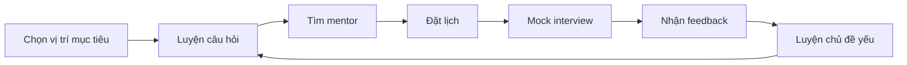

# Project Proposal — Interview Practice Platform

| Thuộc tính | Giá trị |
|---|---|
| Tên dự án | Interview Practice Platform — tên làm việc |
| Nhóm thực hiện | [CẦN BỔ SUNG] |
| Phiên bản | 0.1 |
| Ngày cập nhật | 12/08/2026 |
| Nguồn | `../../ClinicFlow/Interview_Practice_Platform_Proposal.md` |

## 1. Mục đích

Dự án xây dựng một ứng dụng web giúp sinh viên Việt Nam chuẩn bị cho kỳ thực tập hoặc công việc đầu tiên. Sản phẩm kết nối hai hoạt động đang rời rạc: tự luyện với bộ câu hỏi có cấu trúc và mock interview với mentor có kinh nghiệm.

## 2. Vấn đề

Sinh viên thường tìm câu hỏi từ nhiều website, video, mạng xã hội và cộng đồng. Họ có thể đọc kiến thức nhưng khó đánh giá câu trả lời của mình, rèn phản xạ trước câu hỏi tiếp nối hoặc tiếp cận đúng người để mock interview. Việc tìm mentor, thống nhất mục tiêu, lịch, chi phí và công cụ họp chủ yếu diễn ra qua tin nhắn; feedback sau buổi thiếu rubric và khó theo dõi.

Vấn đề nghiệp vụ cốt lõi là: **chưa có một workflow tập trung, phù hợp với sinh viên Việt Nam, giúp người học đi từ chuẩn bị câu hỏi đến mock interview và hành động cải thiện.**

## 3. Giải pháp hiện tại

Người học thường kết hợp các công cụ sau:

- Website tuyển dụng để đọc mô tả công việc.
- Google, YouTube, blog, ChatGPT và kho bài tập để tìm câu hỏi.
- Ghi chú, bookmark hoặc bảng tính để lưu tài liệu.
- Bạn bè, cộng đồng, LinkedIn hoặc nền tảng mentoring để tìm người luyện cùng.
- Tin nhắn, lịch cá nhân và Google Meet/Zoom để điều phối buổi gặp.

Tổ hợp này giải quyết từng bước riêng lẻ nhưng không tạo thành vòng lặp chuẩn bị → thực hành → feedback → luyện lại.

## 4. Giải pháp đề xuất

MVP gồm hai phân hệ liên kết:

1. **Question Bank:** phân loại câu hỏi theo vị trí, chủ đề, loại phỏng vấn và mức độ; cung cấp tiêu chí trả lời, bookmark và trạng thái luyện.
2. **Mentor Marketplace:** hồ sơ mentor, xác minh, lịch rảnh, booking, link họp ngoài, feedback theo rubric và đánh giá sau buổi.

Ba vai trò của hệ thống là Student, Mentor và Administrator. Workflow chính:

## 5. Giá trị khác biệt

- Tập trung vào sinh viên và vị trí entry-level tại Việt Nam.
- Liên kết câu hỏi đã luyện với mục tiêu của booking và feedback sau buổi.
- Chuẩn hóa feedback theo kiến thức, cấu trúc trả lời, giao tiếp, xử lý câu hỏi tiếp nối và hành động cải thiện.
- Hiển thị rõ kinh nghiệm, phạm vi hỗ trợ, lịch và đánh giá của mentor.
- Dùng công cụ họp bên ngoài trong MVP để bảo vệ thời gian và ngân sách.

## 6. Mô hình kinh doanh giả định

Question Bank cơ bản được cung cấp miễn phí để thu hút người dùng. Nền tảng có thể thu commission trên booking hoàn thành hoặc phí dịch vụ cố định. Mentor tự đặt phí trong khung chính sách. Mức giá, commission và willingness to pay vẫn là giả thuyết cần kiểm chứng bằng phỏng vấn giá, landing-page test hoặc pre-booking.

## 7. Phạm vi MVP

### Trong phạm vi

- Đăng ký, đăng nhập và phân quyền Student/Mentor/Admin.
- Question Bank có tìm kiếm, lọc, chi tiết, bookmark và trạng thái luyện.
- Hồ sơ, xác minh và lịch rảnh của mentor.
- Vòng đời booking: tạo, xác nhận, từ chối, đề xuất đổi lịch, hủy và hoàn thành.
- Link họp ngoài và notification cho sự kiện quan trọng.
- Feedback theo rubric và review từ booking hợp lệ.
- Admin quản lý mentor, câu hỏi, booking, report và taxonomy.

### Ngoài phạm vi

- AI interviewer và tự động chấm câu trả lời.
- Video/audio call, ghi âm hoặc phiên âm tích hợp.
- Thanh toán, giữ tiền và payout tự động.
- Ứng dụng mobile native, ATS và recommendation bằng machine learning.

## 8. Kết quả mong đợi

- Người dùng tìm được câu hỏi phù hợp trong thời gian ngắn.
- Sinh viên hoàn thành ít nhất một booking thực tế và nhận feedback có hành động tiếp theo.
- Mentor quản lý yêu cầu và lịch trong một quy trình thống nhất.
- Nhóm thu được bằng chứng để quyết định Go, Pivot hoặc Stop.

## 9. Điều kiện phê duyệt

Trước khi chuyển proposal thành baseline, nhóm phải bổ sung:

- Tên chính thức, thành viên, vai trò và Product Owner.
- Ngày bắt đầu/kết thúc, số tuần và giờ cam kết mỗi thành viên.
- Ngân sách trần, chi phí dự kiến và người phê duyệt.
- Phân khúc nghề nghiệp đầu tiên cho pilot.
- Danh sách mentor, sinh viên và stakeholder có thể tiếp cận.
- Mức giá/commission giả định và mục tiêu số booking.

