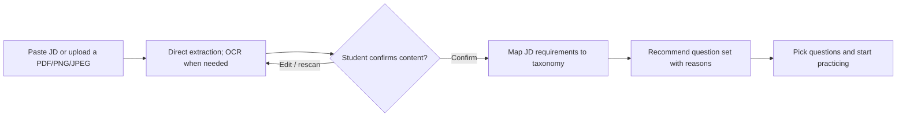
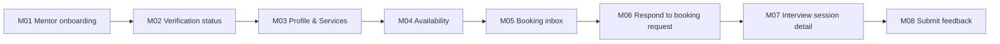
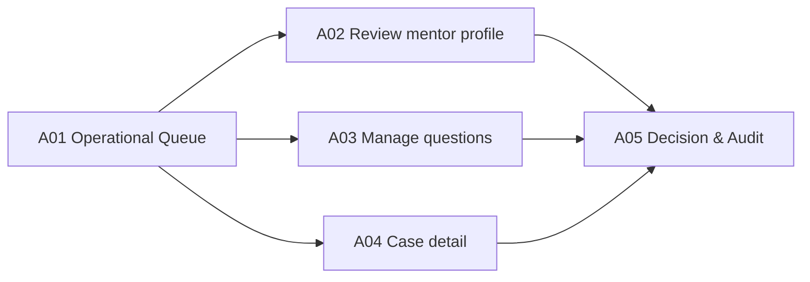

# PrepVI — Prototype Workflow Specification

## 1. Purpose

The prototype validates three persona flows: a Student moving from a real Job Description (JD) to a suitable question set, practicing, and receiving feedback; a Mentor moving from onboarding to submitting feedback; and an Admin approving and handling exceptions. The Proof of Concept (PoC) focus is validating the hypothesis: the system can help a candidate who does not know what to study move from a JD to an explainable practice plan. The prototype prioritizes logic, states, content, and usability; it is not evidence that extraction/OCR, backend, security, or concurrency are production-ready.

## 2. Prototype narrative

### Current-state story

An prepares for an application but does not know what content of the JD to study. An searches Front-end questions from many sources, takes notes, messages people to find a mentor, and receives fragmented feedback. An spends time choosing materials, coordinating, and does not know what to prioritize next.

### Future-state story

An pastes or uploads a Front-end Intern JD. After reviewing content extracted directly or via OCR when needed, An sees key requirements mapped to the taxonomy and receives a JavaScript/Front-end question set ranked by relevance. An starts practicing, finds a verified mentor, and picks a slot. The booking is confirmed, An joins via an external meeting link, receives a rubric, and reopens the question group suggested by the mentor.

### Shared entry screens

- **G01 — Homepage:** [G01-homepage.png](img/G01-homepage.png)
- **G02 — Login:** [G02-login.png](img/G02-login.png)

Screens `G01–G02` are the shared entry point before users move to persona-specific interfaces; they do not belong to Student, Mentor, or Admin individually.

## 3. Student prototype flow

```mermaid
flowchart LR
    S01["S01 Student home"] --> S02["S02 Question Bank"]
    S01 --> S11["S11 Upload Job Description"]
    S11 --> S12["S12 Review extracted content"]
    S12 --> S13["S13 Map JD requirements"]
    S13 --> S14["S14 Question set for JD"]
    S14 --> S03
    S14 --> S02
    S02 --> S03["S03 Question detail"]
    S03 --> S04["S04 Find a suitable mentor"]
    S04 --> S05["S05 Mentor profile"]
    S05 --> S06["S06 Submit booking request"]
    S06 --> S07["S07 Booking status"]
    S07 --> S08["S08 Interview session detail"]
    S08 --> S09["S09 Practice feedback"]
    S09 --> S02
    S09 --> S10["S10 Review mentor"]
```

### Screen S01 — Student home

**Prototype frame:** [S01-student-home.png](img/S01-student-home.png)

**Goal:** help the Student pick a role and see the next action.

- Target role, optional interview date, progress summary.
- CTAs by state: "Scan new JD", "Practice now", "Practice free questions", and "Find mentor".
- Empty state explains how to start.
- No fake scores when data is missing.

### Core PoC flow — JD to recommended questions

### Screen S11 — Upload Job Description

**Prototype frame:** [S11-jd-upload.png](img/S11-jd-upload.png)

**Goal:** lower the start barrier for Students who do not know what to prepare.

- Allow pasting up to 50,000 characters or uploading one PDF/PNG/JPEG up to 10 MB; PDFs up to 5 pages.
- Clear image guidance: well-lit, not cropped; show a preview and allow replacing/removing before submitting.
- State supported format, size, and page count; specific validation when a file is invalid.
- Privacy notice before submit: recommend masking emails, phone numbers, and unnecessary personal data.
- CTA "Extract content"; with progress and duplicate-submit protection.

### Screen S12 — Review extracted content

**Prototype frame:** [S12-ocr-review.png](img/S12-ocr-review.png)

**Goal:** let the Student control the input before the system makes recommendations.

- Show the JD source next to the extracted content; text is editable and low-confidence OCR segments must be marked.
- Mark low-confidence or unreadable segments; do not silently fill them in.
- CTAs "Rescan" and "Confirm content"; no mapping allowed when content is empty or too thin.
- For multi-page PDFs within supported limits, keep page order and warn that content may be duplicated.
- Allow discarding/deleting image data per PoC retention policy.

### Screen S13 — Map JD requirements

**Prototype frame:** [S13-jd-mapping.png](img/S13-jd-mapping.png)

**Goal:** explain how the system understands the JD before creating the question set.

- Separate key requirements such as position, seniority, skills, topics, and interview context.
- Each requirement maps to the existing taxonomy; show the JD source fragment for Student verification.
- Distinguish "mapped", "needs confirmation", and "not supported"; the Student can fix or remove incorrect mappings.
- Do not infer skills without basis in the JD; do not use company names or sensitive attributes for ranking.
- CTA "Generate question set" enabled only when at least one valid mapping exists.

### Screen S14 — Question set for JD

**Prototype frames:** [S14-recommended-question-set.png](img/S14-recommended-question-set.png), [S14-saved-question-set.png](img/S14-saved-question-set.png)

**Goal:** turn the JD into a concrete, explainable practice starting point.

- Show the question set in groups "To practice"/"Should practice"/"Optional", with topic, difficulty, and estimated duration.
- Each question shows a recommendation reason and links to the mapped requirement or JD fragment.
- The Student can remove unsuitable questions, add questions from the Question Bank, and save the set.
- CTA "Practice now" or "Start practicing" opens Question detail; CTA "View full Question Bank" keeps the filters from the mapping.
- Empty state states no suitable questions were found, allowing mapping edits or manual search.
- For the PoC, the recommendation order may use transparent taxonomy-based rules/weights; it is not claimed to be ML recommendation or candidate assessment.

### Screen S02 — Question Bank

**Prototype frame:** [S02-question-bank.png](img/S02-question-bank.png)

- Search; filter Position, Topic, Interview Type, Difficulty.
- Result item shows title, tag, difficulty, practice status.
- When coming from S14, show JD-derived filters/chips and allow removing each mapping.
- Zero-result state allows removing each filter.
- Clear pagination/load-more and sorting.
- Test case: a question with multiple tags does not appear duplicated.

### Screen S03 — Question detail

- Question content, context, answer criteria/hints, and provenance when applicable.
- Bookmark; status Not started/Practicing/Confident.
- CTA "Find mentor for this topic" passes topic/position to search.
- No "single correct answer" framing for behavioral questions.

### Screen S04 — Find a suitable mentor

**Prototype frame:** [S04-mentor-search.png](img/S04-mentor-search.png)

- Filter expertise, interview type, language, price placeholder, and availability.
- Only Approved mentors appear.
- Card shows experience, service scope, rating count, and nearest slot.
- Empty state distinguishes "no mentors" from "no slots matching filters".

### Screen S05 — Mentor profile

- Bio, expertise, explained verification badge, service format, rating, and policy.
- Availability in the Student's timezone with a timezone label.
- CTA to pick a slot; slots already held/confirmed cannot be selected.
- Disclosure that the session uses an external tool.

### Screen S06 — Submit booking request

**Prototype frame:** [S06-booking-request.png](img/S06-booking-request.png)

- Fixed mentor/slot summary.
- Required: target position/interview type, goal, and content to practice.
- Optional: selected questions/topics and a note.
- Cancel/no-show policy shown before submit.
- Specific validation; duplicate-submit protection.

### Screen S07 — Booking status

**Prototype frame:** [S07-booking-status.png](img/S07-booking-status.png)

- Timeline Pending/Confirmed/Reschedule proposed/Rejected/Cancelled.
- Shows actor, timestamp, and next valid action.
- Reschedule allows accepting or returning to pick another slot.
- Rejection/cancellation has a reason per policy; internal notes are not exposed.

### Screen S08 — Interview session detail

**Prototype frame:** [S08-interview-session.png](img/S08-interview-session.png)

- Goal, topic, mentor, local time, and countdown.
- Meeting link appears only when Confirmed and for the right actor.
- Add-to-calendar/export button if within capacity.
- Help/report link and no-show rules.

### Screen S09 — Practice feedback

**Prototype frame:** [S09-session-feedback.png](img/S09-session-feedback.png)

- Rubric: knowledge, structure, communication, follow-up handling.
- Strengths, weaknesses, evidence, and next actions.
- Links to suggested topic/questions.
- Feedback is not public; the Student controls sharing.

### Screen S10 — Review mentor

**Prototype frame:** [S10-mentor-review.png](img/S10-mentor-review.png)

- Rating, comment, guidelines, and report notice.
- Only one review per Completed booking.
- Success state explains moderation/visibility.

## 4. Mentor prototype flow

### Screen M01 — Mentor onboarding

- Expertise, experience, language, interview types, and service scope.
- Verification evidence upload/reference with a privacy notice.
- Draft/save and field validation.

### Screen M02 — Verification status

**Prototype frame:** [M02-verification-status.png](img/M02-verification-status.png)

- Draft/Pending/Approved/Rejected with reason/action.
- Pending/Rejected Mentors cannot publish slots.
- Re-submit creates an audit event and preserves decision history.

### Screen M03 — Profile & Services

**Prototype frame:** [M03-profile-services.png](img/M03-profile-services.png)

- Public preview separated from private contact/evidence.
- Duration, format, fee placeholder, and expectations.
- Policy/availability link.

### Screen M04 — Availability

**Prototype frame:** [M04-availability.png](img/M04-availability.png)

- Create/edit/delete future slots; clear timezone.
- Prevent slot end ≤ start, past slots, or overlaps.
- Slots with Confirmed bookings cannot be deleted directly.

### Screen M05 — Booking inbox

**Prototype frame:** [M05-booking-inbox.png](img/M05-booking-inbox.png)

- Tabs Pending/Upcoming/Completed/Cancelled.
- Card shows goal, target role, topic, and slot.
- No data beyond what is needed for the decision.

### Screen M06 — Respond to booking request

- Accept, Reject with reason, or Propose new slot.
- Confirmation dialog reminds that the slot will be locked.
- Clear conflict state if the slot was just confirmed by someone else.

### Screen M07 — Interview session detail

- Student goal, selected topics/questions, and meeting link.
- Actions mark completed/no-show per policy.
- Feedback CTA enabled only when Completed.

### Screen M08 — Submit feedback

- Score/level for each rubric criterion.
- Required strengths, improvement areas, and next actions.
- Suggested topic/questions from the taxonomy.
- Draft/save/submit; changes after submit follow policy/audit.

## 5. Admin prototype flow

### Screen A01 — Operational Queue

**Prototype frame:** [A01-operations-queue.png](img/A01-operations-queue.png)

- Pending mentor, draft/reported question, booking exception, and open report counts.
- No vanity metrics replacing the operational queue.

### Screen A02 — Review mentor profile

**Prototype frame:** [A02-mentor-review.png](img/A02-mentor-review.png)

- Public profile preview, restricted evidence, checklist, and prior decision history.
- Approve/Reject requires a reason; audit actor/time.

### Screen A03 — Manage questions

- CRUD, taxonomy, source/provenance, version, and Draft/In review/Published/Archived.
- Cannot publish when position/topic or required review is missing.

### Screen A04 — Case detail

- Booking timeline, policy, report reason, and minimal data needed to handle.
- Actions resolve, hide review, reschedule/credit placeholder per authority.
- Internal notes not public.

### Screen A05 — Decision & Audit

- Confirmation states impact and notified parties.
- Immutable audit summary after the decision.

## 6. Cross-flow states to prototype

| State | Required screens |
|---|---|
| Loading | Skeleton/progress without major layout shift |
| Empty | Questions, mentors, slots, bookings, feedback |
| Validation error | Inline, keeps entered data |
| Permission denied | Do not reveal existence/sensitive content |
| Conflict | Slot just held/confirmed; CTA to pick another slot |
| Provider failure | Booking still succeeds; notification/link actions have handling |
| Offline/timeout | Safe retry, avoid duplicate bookings/reviews |
| OCR low confidence | Mark segments to check; allow edit or rescan before mapping |
| Unsupported/poor image | Explain cause and guide retaking/re-uploading without losing valid images |
| No taxonomy match | Show unsupported parts; allow mapping edits or manual Question Bank search |
| No recommended question | Keep OCR/mapping results and offer CTA to change mapping/add manually |
| Sensitive data in JD | Remind the Student to mask personal data and support image/data deletion per PoC policy |

## 7. Prototype test plan

| Task | Persona | Success |
|---|---|---|
| Enter a JD and confirm extracted text | Student | Completed without help; detects and fixes critical extraction/OCR errors |
| Map JD into study topics | Student | Understands what is/not mapped and can fix wrong mappings |
| Get a question set from the JD | Student | Picks a question to start and explains why it was recommended |
| Find Front-end/JavaScript questions | Student | Correct result in ≤2 minutes without help |
| Bookmark and change status | Student | Sees saved state and understands its meaning |
| Find a mentor with a suitable slot | Student | Correct timezone/expertise |
| Submit a valid booking | Student | Completes and understands Pending |
| Handle reschedule | Student/Mentor | Both sides understand the state and next step |
| Submit rubric feedback | Mentor | Sufficient strength/weakness/next action |
| Review mentor | Admin | Decision with reason and audit |

Collect completion rate, time-on-task, errors, confidence, and qualitative evidence. Student task completion target: ≥80%. For the core PoC, also measure the share of extractions/OCR needing correction, the share of mappings accepted by the Student, and question-set usefulness (proposed survey target: ≥4/5).

## 8. Prototype handoff and traceability

| Screen group | Stories |
|---|---|
| S01–S03 | US-03–06 |
| S11–S14 | US-24–US-29; BR-12–BR-17; AC-24–AC-29 |
| S04–S08 | US-10–14,19 |
| S09–S10 | US-16–17 |
| M01–M04 | US-07–09 |
| M05–M08 | US-12–15 |
| A01–A05 | US-08,18,20 |

Each frame in the design tool and file name in `img/` use the same screen ID, following `<SCREEN-ID>-<screen-name>.png`. The two shared S14 frames are two access states of the same screen: freshly generated results and a saved set under "My JDs". The two shared pre-flow screens are named `G01-homepage.png` and `G02-login.png`.

The S11–S14 flow has been formalized by the Product Owner into US-24–US-29 and AC-24–AC-29. The prototype proposal is explainable taxonomy/rule-based mapping; using an external OCR service or ML in the real implementation requires a separate change-scope, privacy, and quality review.
