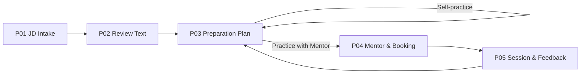
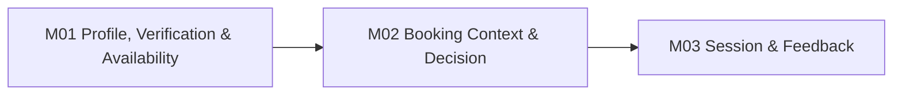
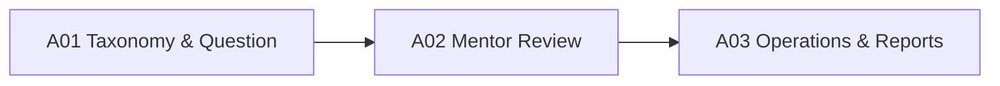

# Interview Practice Platform — Prototype Workflow Specification

## 1. Mục đích

Prototype kiểm chứng luồng JD → preparation plan → self-practice hoặc Mentor booking → session → feedback. Năm màn hình Student chính tập trung vào quyết định của người dùng, không tách mỗi trạng thái kỹ thuật thành một màn hình. Mentor/Admin dùng các view hỗ trợ cần thiết. Prototype kiểm chứng workflow, nội dung và usability; không phải bằng chứng rằng extraction, security, matching hoặc concurrency đã được triển khai.

## 2. Prototype narrative

### Current-state story

An đọc một JD Front-end Intern, tự đoán requirement, tìm câu hỏi trên nhiều nguồn và không biết phần nào đã bao phủ. Khi tìm được mentor, An phải mô tả lại mục tiêu qua tin nhắn; feedback sau buổi không liên kết rõ với JD hoặc nội dung đã luyện.

### Future-state story

An dán text hoặc upload JD, kiểm tra/sửa nội dung được trích xuất, rồi xem requirement/topic cùng Question được đề xuất và lý do mapping. An chọn item để tạo preparation plan, tự luyện hoặc tìm Mentor đúng topic. Booking mang theo context tối thiểu; sau session ngoài hệ thống, feedback cập nhật next action trong plan.

## 3. Student prototype flow — năm màn hình chính

### P01 — Nhập Job Description

**Mục tiêu:** bắt đầu bằng JD cụ thể thay vì yêu cầu người dùng tự chọn topic.

- Tab/choice cho paste text và upload file.
- Hiển thị: paste tối đa 50.000 ký tự hoặc một PDF/PNG/JPEG tối đa 10 MB; PDF tối đa 5 trang; OCR hỗ trợ tiếng Việt/Anh.
- Privacy notice: mục đích xử lý, ai có thể xem, retention/deletion link.
- File/text summary trước submit; chống submit lặp.
- State: idle, selected, validating, uploading, rejected và processing.
- Error riêng cho empty, multi-file, unsupported, corrupt/encrypted, >10 MB, PDF >5 trang hoặc processing failure.

### P02 — Kiểm tra và xác nhận text

**Mục tiêu:** Student kiểm soát input được dùng cho analysis.

- Nêu extraction method/status: pasted/direct extraction/internal OCR VI/EN; job có timeout 60 giây và OCR không được mô tả như toàn bộ analysis.
- Editable text area, original-file reference và cảnh báo đoạn nghi ngờ nếu có evidence.
- CTA “Xác nhận và phân tích”; analysis bị chặn khi text chưa xác nhận.
- Khi sửa một confirmed version, giải thích requirement/match/plan cũ cần regenerate.
- State: processing, succeeded, failed/retry, empty text, editing, confirmed.

### P03 — Kế hoạch ôn tập

**Mục tiêu:** giải thích JD và cho Student chọn hành động tiếp theo.

- Summary position, seniority và requirement được phát hiện.
- Mỗi requirement giữ raw evidence và normalized topic; item unmapped hiển thị coverage gap thay vì gán topic giả.
- Mỗi Question score ≥60 hiển thị title, topic, difficulty, requirement nguồn, match reason và version; tối đa 10/JD và 3/requirement, không hứa chắc xuất hiện trong phỏng vấn.
- Chỉ Question Published; có empty state khi không đủ Question relevant.
- Student chọn/bỏ item, bookmark, đặt trạng thái Not started/Practicing/Confident và tạo/cập nhật preparation plan.
- CTA trên cùng plan: “Tự luyện” hoặc “Luyện với mentor”.
- State: analyzing, no requirement, partial taxonomy, no match, plan ready, stale/regenerate.

### P04 — Mentor và booking

**Mục tiêu:** chuyển plan context sang một booking rõ ràng.

- Mentor list lọc theo plan topic, interview type, language và availability; chỉ Mentor Approved xuất hiện.
- Mentor detail và slot có timezone; empty state phân biệt không có mentor với không có slot phù hợp.
- Booking form giữ mentor/slot, JD/preparation-plan reference, selected topic/question và goal.
- Chỉ chia sẻ context tối thiểu; original file không tự động chia sẻ với Mentor.
- Hiển thị cutoff hủy/reschedule 12 giờ, tối đa 2 proposal và no-show grace 15 phút trước submit; giá/payment không thuộc MVP.
- Booking state nằm trong cùng view bằng timeline/tab: Pending, Confirmed, Reschedule proposed, Rejected, Cancelled.
- Validation và retry không được tạo booking trùng.

### P05 — Session và feedback

**Mục tiêu:** hoàn thành buổi luyện và đóng vòng lặp về plan.

- Booking summary, local time, Mentor, topic và goal.
- Mentor tạo meeting link; link chỉ hiện cho hai bên khi Confirmed đến 24 giờ sau session và chỉ sửa thông thường trước 2 giờ. Khi provider lỗi, Mentor có tối đa 15 phút để đưa alternate link; nếu vẫn không có link dùng được thì phải reschedule rõ ràng.
- Khi R1 Stretch US-22 được chọn, reminder 24 giờ và 1 giờ hiển thị theo timezone người dùng; reschedule/cancel xóa reminder cũ.
- Mentor mark Completed sau end time; Student có 24 giờ dispute. Dispute giữ review ở trạng thái chưa công bố cho đến khi Admin giải quyết và ghi audit. No-show cần report sau 15 phút và Admin/counterpart confirmation.
- Feedback view: rubric, strength, weakness, evidence và next action.
- CTA áp dụng next action vào preparation plan hoặc mở Question liên quan.
- Review Mentor chỉ sau Completed và chỉ một lần.
- State: upcoming, provider failure, completed-awaiting-feedback, feedback ready và reviewed.

## 4. Mentor supporting views

### M01 — Profile, verification và availability

- Expertise, experience, language, interview types và service scope.
- Verification evidence có privacy notice; Draft/Pending/Approved/Rejected và reason.
- Chỉ Mentor Approved được publish profile/slot.
- Slot có timezone; chặn past/invalid/overlap và không xóa trực tiếp slot đang bị booking chiếm.

### M02 — Booking context và decision

- Hiển thị Student goal, normalized topic, selected Questions và phần JD/plan tối thiểu được phép chia sẻ.
- Không cấp quyền xem original file/full text mặc định.
- Accept, Reject hoặc Propose reschedule; reason và next state rõ.
- Cảnh báo slot conflict; không làm UI như thể booking đã Confirmed trước server result.

### M03 — Session và feedback

- Meeting link/time/context giống Student nhưng theo Mentor ownership.
- Feedback CTA chỉ enable khi Completed.
- Rubric bắt buộc strength, weakness và next action; cho liên kết topic/Question từ plan.

## 5. Admin supporting views

### A01 — Taxonomy và Question management

- CRUD/moderation Question với Draft/In review/Published/Archived.
- Taxonomy/alias, provenance và matching coverage; không cho Draft xuất hiện trong plan.
- Hiển thị coverage gap từ JD pilot mà không lộ corrected text không cần thiết.

### A02 — Mentor review

- Verification evidence riêng tư, decision reason và audit.
- Approve/Reject theo authority; không sửa history.

### A03 — Operations và reports

- Booking/notification exceptions, report reason và audit timeline.
- JD/extraction failure chỉ hiện metadata cần vận hành; nội dung/file phải theo object authorization.
- Action resolve/reschedule/hide review theo authority; internal note không public.

## 6. Cross-flow states cần prototype

| State | Áp dụng |
|---|---|
| Loading/processing | Upload, extraction/OCR, analysis, matching, search, booking, feedback |
| Empty | Extracted text, requirement, taxonomy coverage, Question match, Mentor, slot, feedback |
| Validation error | File/text, corrected version, goal, slot, rubric, review |
| Permission denied | JD/plan, verification, booking, meeting link, feedback, admin |
| Conflict/stale | Corrected version changed, matching version changed, slot vừa bị giữ, duplicate submit |
| Provider failure | Extraction/OCR, email hoặc meeting; internal state vẫn rõ và có retry/fallback |
| Offline/timeout | Retry an toàn; không tạo Job/booking/review trùng |

## 7. Prototype test plan

| Task | Persona | Success signal |
|---|---|---|
| Dán hoặc upload JD và hiểu privacy/validation | Student | Biết giới hạn 50k/PDF-PNG-JPEG/10 MB/5 trang và original file xóa sau 24 giờ |
| Kiểm tra/sửa/confirm text | Student | Hiểu đây là text dùng cho analysis và biết cách sửa lỗi |
| Giải thích một Question được đề xuất | Student | Chỉ ra được requirement nguồn, topic và match reason |
| Xử lý requirement không map/không có Question | Student | Hiểu coverage gap, không tưởng hệ thống đã bao phủ đầy đủ |
| Tạo plan và bắt đầu tự luyện | Student | Chọn item và mở đúng Question |
| Chuyển plan sang Mentor booking | Student | Booking đúng Mentor/slot và có context phù hợp |
| Hiểu Pending/Confirmed/Reschedule | Student/Mentor | Chọn đúng hành động theo cutoff 12 giờ, tối đa 2 proposal và no-show grace 15 phút |
| Xem booking context và gửi feedback | Mentor | Chỉ thấy dữ liệu cần thiết; feedback đủ ba phần |
| Áp dụng feedback vào plan | Student | Next action quay về đúng plan/topic/Question |
| Duyệt taxonomy/Question/Mentor | Admin | Quyết định có reason và không lộ JD private content |

Quan sát task completion, error recovery, time-on-task và lời giải thích của participant. Prototype owner không tự kết luận usability chỉ từ việc frame tồn tại.

## 8. Prototype handoff và traceability

| Prototype | Stories | Acceptance/Test focus |
|---|---|---|
| P01 | US-24 | AC-24; TC-JD; NFR-09/11 |
| P02 | US-25, US-26 | AC-25/26; TC-JD |
| P03 | US-03–US-06, US-18, US-27–US-29 | AC-27/28/29; TC-MAP/PLAN/Q; NFR-10 |
| P04 | US-07–US-13, US-19, US-22, US-30 | AC-30/11/12/13; TC-M/SLOT/B/N |
| P05 | US-14–US-17 | AC-14/15/16/17; TC-SESSION/F |
| A01–A03 | US-08, US-18, US-20, US-23 | TC-ADM; NFR-01/08 |

Để đồng bộ với các frame chi tiết đã được Prototype owner dựng, năm composite view dùng mapping sau: `P01 ← S11`, `P02 ← S12`, `P03 ← S13/S14/S02/S03`, `P04 ← S04–S07`, `P05 ← S08–S10`. Mapping này gom các frame hiện có theo năm quyết định chính của người dùng; không yêu cầu xóa frame chi tiết hoặc tạo thêm màn hình kỹ thuật.

Handoff phải ghi composite P-ID và S-ID tương ứng, link đến story/acceptance criteria và đánh dấu dữ liệu giả. Ảnh chỉ được thêm vào `img/` khi có artifact thật; specification này không tuyên bố clickable prototype đã được tạo hoặc test.
