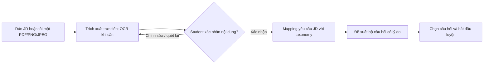
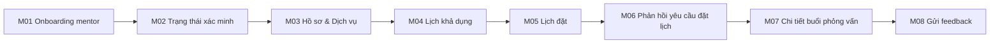
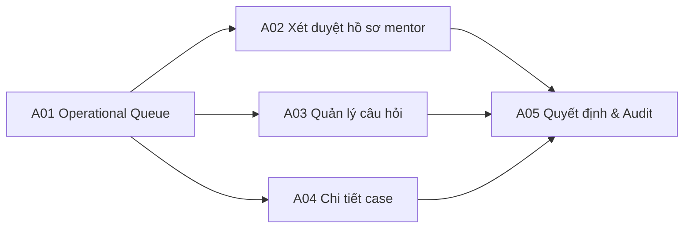

# PrepVI — Prototype Workflow Specification

## 1. Mục đích

Prototype kiểm chứng ba luồng persona: Student đi từ một Job Description (JD) thực tế đến bộ câu hỏi phù hợp, luyện tập và nhận feedback; Mentor đi từ onboarding đến gửi feedback; Admin duyệt và xử lý ngoại lệ. Trọng tâm Proof of Concept (PoC) là kiểm chứng giả thuyết: hệ thống có thể giúp ứng viên chưa biết ôn gì chuyển từ một JD sang kế hoạch luyện tập có giải thích. Prototype ưu tiên logic, trạng thái, nội dung và usability; không dùng như bằng chứng rằng extraction/OCR, backend, security hoặc concurrency đã hoàn thành ở mức production.

## 2. Prototype narrative

### Current-state story

An chuẩn bị ứng tuyển nhưng không biết nên ôn nội dung nào trong JD. An tìm câu hỏi Front-end từ nhiều nguồn, tự ghi chú, nhắn nhiều người để tìm mentor và nhận feedback rời rạc. An mất thời gian chọn tài liệu, điều phối và không biết nên ưu tiên luyện gì tiếp.

### Future-state story

An dán hoặc tải lên một JD Front-end Intern. Sau khi kiểm tra nội dung được trích xuất trực tiếp hoặc qua OCR khi cần, An thấy các yêu cầu chính được mapping sang taxonomy và nhận bộ câu hỏi JavaScript/Front-end được xếp theo mức độ liên quan. An bắt đầu luyện, tìm mentor đã xác minh và chọn slot. Booking được xác nhận, An tham gia bằng link họp ngoài, nhận rubric và mở lại nhóm câu hỏi được mentor gợi ý.

### Màn hình đầu vào dùng chung

- **G01 — Homepage:** [G01-homepage.png](img/G01-homepage.png)
- **G02 — Đăng nhập:** [G02-login.png](img/G02-login.png)

Hai màn hình `G01–G02` là điểm vào dùng chung trước khi người dùng chuyển đến giao diện theo persona; chúng không thuộc riêng Student, Mentor hoặc Admin.

## 3. Student prototype flow

```mermaid
flowchart LR
    S01["S01 Trang chủ học viên"] --> S02["S02 Question Bank"]
    S01 --> S11["S11 Tải lên Job Description"]
    S11 --> S12["S12 Kiểm tra nội dung trích xuất"]
    S12 --> S13["S13 Mapping yêu cầu JD"]
    S13 --> S14["S14 Bộ câu hỏi dành cho JD"]
    S14 --> S03
    S14 --> S02
    S02 --> S03["S03 Chi tiết câu hỏi"]
    S03 --> S04["S04 Tìm mentor phù hợp"]
    S04 --> S05["S05 Hồ sơ mentor"]
    S05 --> S06["S06 Gửi yêu cầu đặt lịch"]
    S06 --> S07["S07 Trạng thái đặt lịch"]
    S07 --> S08["S08 Chi tiết buổi phỏng vấn"]
    S08 --> S09["S09 Feedback buổi luyện tập"]
    S09 --> S02
    S09 --> S10["S10 Đánh giá mentor"]
```

### Screen S01 — Trang chủ học viên

**Prototype frame:** [S01-student-home.png](img/S01-student-home.png)

**Mục tiêu:** giúp Student chọn vị trí và thấy hành động tiếp theo.

- Target role, interview date optional, progress summary.
- CTA theo trạng thái: “Quét JD mới”, “Luyện ngay”, “Luyện câu hỏi tự do” và “Tìm mentor”.
- Trạng thái rỗng giải thích cách bắt đầu.
- Không hiển thị score giả khi chưa có dữ liệu.

### Core PoC flow — JD to recommended questions

### Screen S11 — Tải lên Job Description

**Prototype frame:** [S11-jd-upload.png](img/S11-jd-upload.png)

**Mục tiêu:** giảm rào cản bắt đầu cho Student chưa biết nên ôn nội dung nào.

- Cho phép dán tối đa 50.000 ký tự hoặc tải một PDF/PNG/JPEG tối đa 10 MB; PDF tối đa 5 trang.
- Hướng dẫn ảnh rõ, đủ sáng, không bị cắt; hiển thị preview và cho phép thay/xóa ảnh trước khi gửi.
- Nêu rõ định dạng, dung lượng và số trang được hỗ trợ; validation cụ thể khi file không hợp lệ.
- Privacy notice trước khi gửi: khuyến nghị che email, số điện thoại và dữ liệu cá nhân không cần thiết.
- CTA “Trích xuất nội dung”; có progress và chống submit lặp.

### Screen S12 — Kiểm tra nội dung trích xuất

**Prototype frame:** [S12-ocr-review.png](img/S12-ocr-review.png)

**Mục tiêu:** để Student kiểm soát đầu vào trước khi hệ thống đưa ra đề xuất.

- Hiển thị nguồn JD cạnh nội dung được trích xuất; văn bản có thể chỉnh sửa và đoạn OCR có độ tin cậy thấp phải được đánh dấu.
- Đánh dấu đoạn có độ tin cậy thấp hoặc không đọc được, không âm thầm tự điền.
- CTA “Quét lại” và “Xác nhận nội dung”; không cho mapping khi nội dung rỗng hoặc quá ít thông tin.
- Với PDF nhiều trang trong giới hạn hỗ trợ, giữ đúng thứ tự trang và cảnh báo nội dung có thể bị trùng.
- Cho phép bỏ qua/xóa dữ liệu ảnh theo chính sách lưu trữ của PoC.

### Screen S13 — Mapping yêu cầu JD

**Prototype frame:** [S13-jd-mapping.png](img/S13-jd-mapping.png)

**Mục tiêu:** giải thích hệ thống hiểu JD như thế nào trước khi tạo bộ câu hỏi.

- Tách các yêu cầu chính như position, seniority, skills, topics và interview context.
- Mỗi yêu cầu được mapping sang taxonomy hiện có; hiển thị đoạn JD nguồn để Student kiểm tra.
- Phân biệt “được mapping”, “cần xác nhận” và “chưa hỗ trợ”; Student có thể sửa hoặc bỏ mapping sai.
- Không suy diễn kỹ năng không có căn cứ trong JD; không dùng tên công ty hay thuộc tính nhạy cảm để xếp hạng.
- CTA “Tạo bộ câu hỏi” chỉ enable khi có ít nhất một mapping hợp lệ.

### Screen S14 — Bộ câu hỏi dành cho JD

**Prototype frames:** [S14-recommended-question-set.png](img/S14-recommended-question-set.png), [S14-saved-question-set.png](img/S14-saved-question-set.png)

**Mục tiêu:** biến JD thành một điểm bắt đầu luyện tập cụ thể và có thể giải thích.

- Hiển thị bộ câu hỏi theo nhóm “Cần luyện”/“Nên luyện”/“Tùy chọn”, kèm topic, difficulty và thời lượng ước tính.
- Mỗi câu hỏi có lý do đề xuất, liên kết tới yêu cầu hoặc đoạn JD đã mapping.
- Student có thể bỏ câu không phù hợp, thêm câu từ Question Bank và lưu bộ câu hỏi.
- CTA “Luyện ngay” hoặc “Bắt đầu luyện” mở Chi tiết câu hỏi; CTA “Xem toàn bộ Question Bank” giữ các filter từ mapping.
- Empty state nêu rõ không tìm thấy câu hỏi phù hợp, cho phép sửa mapping hoặc chuyển sang tìm thủ công.
- Với PoC, thứ tự đề xuất có thể dùng rule/weight minh bạch dựa trên taxonomy; không tuyên bố là ML recommendation hay đánh giá năng lực ứng viên.

### Screen S02 — Question Bank

**Prototype frame:** [S02-question-bank.png](img/S02-question-bank.png)

- Search; filter Position, Topic, Interview Type, Difficulty.
- Result item có title, tag, difficulty, practice status.
- Khi đi từ S14, hiển thị filter/chip bắt nguồn từ JD và cho phép xóa từng mapping.
- Zero-result state cho phép bỏ từng filter.
- Pagination/load-more và sort rõ.
- Test case: một question có nhiều tag không xuất hiện trùng.

### Screen S03 — Chi tiết câu hỏi

- Question content, context, answer criteria/hints và provenance nếu phù hợp.
- Bookmark; trạng thái Not started/Practicing/Confident.
- CTA “Tìm mentor cho chủ đề này” truyền topic/position sang search.
- Không dùng “đáp án duy nhất” cho behavioral question.

### Screen S04 — Tìm mentor phù hợp

**Prototype frame:** [S04-mentor-search.png](img/S04-mentor-search.png)

- Filter expertise, interview type, language, price placeholder và availability.
- Chỉ mentor Approved xuất hiện.
- Card có kinh nghiệm, service scope, rating count và slot gần nhất.
- Empty state phân biệt “không có mentor” và “không có slot theo filter”.

### Screen S05 — Hồ sơ mentor

- Bio, expertise, verification badge có giải thích, service format, rating và policy.
- Availability theo timezone của Student, có nhãn timezone.
- CTA chọn slot; slot đã giữ/xác nhận không thể chọn.
- Disclosure rằng buổi họp dùng công cụ ngoài.

### Screen S06 — Gửi yêu cầu đặt lịch

**Prototype frame:** [S06-booking-request.png](img/S06-booking-request.png)

- Mentor/slot summary cố định.
- Required: target position/interview type, goal và nội dung muốn luyện.
- Optional: câu hỏi/topic đã chọn và note.
- Policy hủy/no-show hiển thị trước submit.
- Validation cụ thể; chống submit lặp.

### Screen S07 — Trạng thái đặt lịch

**Prototype frame:** [S07-booking-status.png](img/S07-booking-status.png)

- Timeline Pending/Confirmed/Reschedule proposed/Rejected/Cancelled.
- Hiển thị actor, thời điểm và hành động hợp lệ tiếp theo.
- Reschedule cho phép chấp nhận hoặc quay lại chọn slot.
- Rejection/cancellation có reason theo policy, không lộ note nội bộ.

### Screen S08 — Chi tiết buổi phỏng vấn

**Prototype frame:** [S08-interview-session.png](img/S08-interview-session.png)

- Goal, topic, mentor, thời gian địa phương và countdown.
- Meeting link chỉ xuất hiện khi Confirmed và đúng actor.
- Nút add-to-calendar/export nếu nằm trong capacity.
- Link hỗ trợ/report và rule khi no-show.

### Screen S09 — Feedback buổi luyện tập

**Prototype frame:** [S09-session-feedback.png](img/S09-session-feedback.png)

- Rubric: knowledge, structure, communication, follow-up handling.
- Strengths, weaknesses, evidence và next actions.
- Link đến topic/question được đề xuất.
- Không công khai feedback; Student kiểm soát việc chia sẻ.

### Screen S10 — Đánh giá mentor

**Prototype frame:** [S10-mentor-review.png](img/S10-mentor-review.png)

- Rating, comment, guideline và report notice.
- Chỉ một review cho booking Completed.
- Success state giải thích moderation/visibility.

## 4. Mentor prototype flow

### Screen M01 — Onboarding mentor

- Expertise, experience, language, interview types và service scope.
- Verification evidence upload/reference với privacy notice.
- Draft/save và field validation.

### Screen M02 — Trạng thái xác minh

**Prototype frame:** [M02-verification-status.png](img/M02-verification-status.png)

- Draft/Pending/Approved/Rejected cùng reason/action.
- Mentor Pending/Rejected không thể publish slot.
- Re-submit tạo audit event và giữ lịch sử quyết định.

### Screen M03 — Hồ sơ & Dịch vụ

**Prototype frame:** [M03-profile-services.png](img/M03-profile-services.png)

- Public preview tách khỏi private contact/evidence.
- Duration, format, fee placeholder và expectations.
- Policy/availability link.

### Screen M04 — Lịch khả dụng

**Prototype frame:** [M04-availability.png](img/M04-availability.png)

- Create/edit/delete future slot; timezone rõ.
- Ngăn slot end ≤ start, quá khứ hoặc overlap.
- Slot có booking Confirmed không được xóa trực tiếp.

### Screen M05 — Lịch đặt

**Prototype frame:** [M05-booking-inbox.png](img/M05-booking-inbox.png)

- Tabs Pending/Upcoming/Completed/Cancelled.
- Card có goal, target role, topic và slot.
- Không lộ dữ liệu ngoài phần cần cho quyết định.

### Screen M06 — Phản hồi yêu cầu đặt lịch

- Accept, Reject có reason hoặc Propose new slot.
- Confirmation dialog nhắc việc slot sẽ bị khóa.
- Conflict state rõ nếu slot vừa được người khác xác nhận.

### Screen M07 — Chi tiết buổi phỏng vấn

- Student goal, selected topics/questions và meeting link.
- Action mark completed/no-show theo policy.
- Feedback CTA chỉ enable khi Completed.

### Screen M08 — Gửi feedback

- Score/level cho từng rubric criterion.
- Required strengths, improvement areas và next actions.
- Gợi ý topic/question từ taxonomy.
- Draft/save/submit; sau submit thay đổi theo policy/audit.

## 5. Admin prototype flow

### Screen A01 — Operational Queue

**Prototype frame:** [A01-operations-queue.png](img/A01-operations-queue.png)

- Pending mentor, draft/reported question, booking exception và open report counts.
- Không dùng vanity metric thay operational queue.

### Screen A02 — Xét duyệt hồ sơ mentor

**Prototype frame:** [A02-mentor-review.png](img/A02-mentor-review.png)

- Public profile preview, restricted evidence, checklist và prior decision history.
- Approve/Reject yêu cầu reason; audit actor/time.

### Screen A03 — Quản lý câu hỏi

- CRUD, taxonomy, source/provenance, version và Draft/In review/Published/Archived.
- Không publish khi thiếu position/topic hoặc required review.

### Screen A04 — Chi tiết case

- Timeline booking, policy, report reason và dữ liệu tối thiểu cần xử lý.
- Action resolve, hide review, reschedule/credit placeholder theo authority.
- Internal note không hiển thị cho public.

### Screen A05 — Quyết định & Audit

- Confirmation nêu tác động và đối tượng được thông báo.
- Immutable audit summary sau quyết định.

## 6. Cross-flow states cần prototype

| Trạng thái | Màn hình bắt buộc |
|---|---|
| Loading | Skeleton/progress không gây layout shift lớn |
| Empty | Câu hỏi, mentor, slot, booking, feedback |
| Validation error | Inline, giữ dữ liệu đã nhập |
| Permission denied | Không lộ sự tồn tại/nội dung nhạy cảm |
| Conflict | Slot vừa bị giữ/xác nhận; CTA chọn slot khác |
| Provider failure | Booking vẫn thành công; notification/link action có hướng xử lý |
| Offline/timeout | Retry an toàn, tránh tạo booking/review trùng |
| OCR low confidence | Đánh dấu đoạn cần kiểm tra; cho sửa hoặc quét lại trước mapping |
| Unsupported/poor image | Nêu nguyên nhân và hướng dẫn chụp/tải lại, không làm mất các ảnh hợp lệ |
| No taxonomy match | Hiển thị phần chưa hỗ trợ; cho sửa mapping hoặc tìm Question Bank thủ công |
| No recommended question | Giữ kết quả OCR/mapping và cung cấp CTA thay đổi mapping/thêm câu thủ công |
| Sensitive data in JD | Nhắc Student che dữ liệu cá nhân và hỗ trợ xóa ảnh/dữ liệu theo policy PoC |

## 7. Prototype test plan

| Task | Persona | Success |
|---|---|---|
| Nhập JD và xác nhận văn bản trích xuất | Student | Hoàn tất không trợ giúp; phát hiện và sửa được lỗi trích xuất/OCR quan trọng |
| Mapping JD thành chủ đề ôn tập | Student | Hiểu yêu cầu nào đã/chưa được mapping và sửa được mapping sai |
| Nhận bộ câu hỏi từ JD | Student | Chọn được câu để bắt đầu luyện và giải thích được vì sao câu đó được đề xuất |
| Tìm câu hỏi Front-end/JavaScript | Student | Đúng result trong ≤2 phút, không trợ giúp |
| Bookmark và đổi trạng thái | Student | Thấy state được lưu và hiểu ý nghĩa |
| Tìm mentor có slot phù hợp | Student | Chọn đúng timezone/chuyên môn |
| Gửi booking hợp lệ | Student | Hoàn tất và hiểu Pending |
| Xử lý reschedule | Student/Mentor | Hai bên hiểu trạng thái và bước tiếp theo |
| Gửi feedback rubric | Mentor | Đủ strength/weakness/next action |
| Duyệt mentor | Admin | Quyết định có reason và audit |

Thu completion rate, time-on-task, error, confidence và qualitative evidence. Mục tiêu Student task completion: ≥80%. Với core PoC, đo thêm tỷ lệ trích xuất/OCR cần sửa, tỷ lệ mapping được Student chấp nhận và mức độ hữu ích của bộ câu hỏi (target khảo sát đề xuất: ≥4/5).

## 8. Prototype handoff và traceability

| Screen group | Stories |
|---|---|
| S01–S03 | US-03–06 |
| S11–S14 | US-24–US-29; BR-12–BR-17; AC-24–AC-29 |
| S04–S08 | US-10–14,19 |
| S09–S10 | US-16–17 |
| M01–M04 | US-07–09 |
| M05–M08 | US-12–15 |
| A01–A05 | US-08,18,20 |

Mỗi frame trong công cụ thiết kế và tên file trong `img/` dùng cùng screen ID, theo dạng `<SCREEN-ID>-<screen-name>.png`. Hai frame dùng chung S14 là hai trạng thái truy cập của cùng màn hình: kết quả vừa được tạo và bộ câu hỏi đã lưu trong “JD của tôi”. Hai màn hình dùng chung trước khi vào flow persona được đặt tên `G01-homepage.png` và `G02-login.png`.

Luồng S11–S14 đã được Product Owner formalize trong US-24–US-29 và AC-24–AC-29. Việc đề xuất trong prototype là mapping dựa trên taxonomy/rule có thể giải thích; nếu dùng OCR service ngoài hoặc ML ở implementation thật thì cần change-scope, privacy và quality review riêng.
