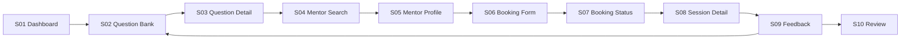
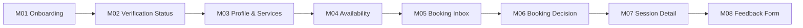
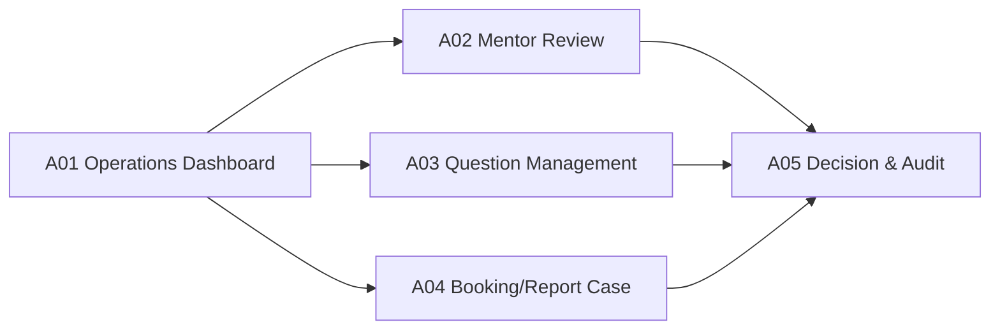

# Interview Practice Platform — Prototype Workflow Specification

## 1. Mục đích

Prototype kiểm chứng ba luồng: Student đi từ Question Bank đến feedback; Mentor đi từ onboarding đến gửi feedback; Admin duyệt và xử lý ngoại lệ. Prototype ưu tiên logic, trạng thái, nội dung và usability; không dùng như bằng chứng rằng backend, security hoặc concurrency đã hoàn thành.

## 2. Prototype narrative

### Current-state story

An tìm câu hỏi Front-end từ nhiều nguồn, tự ghi chú, nhắn nhiều người để tìm mentor và nhận feedback rời rạc. An mất thời gian điều phối và không biết nên luyện gì tiếp.

### Future-state story

An chọn Front-end Intern, luyện câu hỏi JavaScript, tìm mentor đã xác minh và chọn slot. Booking được xác nhận, An tham gia bằng link họp ngoài, nhận rubric và mở lại nhóm câu hỏi được mentor gợi ý.

## 3. Student prototype flow

### Screen S01 — Dashboard / Goal

**Mục tiêu:** giúp Student chọn vị trí và thấy hành động tiếp theo.

- Target role, interview date optional, progress summary.
- CTA “Luyện câu hỏi” và “Tìm mentor”.
- Trạng thái rỗng giải thích cách bắt đầu.
- Không hiển thị score giả khi chưa có dữ liệu.

### Screen S02 — Question Bank

- Search; filter Position, Topic, Interview Type, Difficulty.
- Result item có title, tag, difficulty, practice status.
- Zero-result state cho phép bỏ từng filter.
- Pagination/load-more và sort rõ.
- Test case: một question có nhiều tag không xuất hiện trùng.

### Screen S03 — Question Detail

- Question content, context, answer criteria/hints và provenance nếu phù hợp.
- Bookmark; trạng thái Not started/Practicing/Confident.
- CTA “Tìm mentor cho chủ đề này” truyền topic/position sang search.
- Không dùng “đáp án duy nhất” cho behavioral question.

### Screen S04 — Mentor Search

- Filter expertise, interview type, language, price placeholder và availability.
- Chỉ mentor Approved xuất hiện.
- Card có kinh nghiệm, service scope, rating count và slot gần nhất.
- Empty state phân biệt “không có mentor” và “không có slot theo filter”.

### Screen S05 — Mentor Profile

- Bio, expertise, verification badge có giải thích, service format, rating và policy.
- Availability theo timezone của Student, có nhãn timezone.
- CTA chọn slot; slot đã giữ/xác nhận không thể chọn.
- Disclosure rằng buổi họp dùng công cụ ngoài.

### Screen S06 — Booking Form

- Mentor/slot summary cố định.
- Required: target position/interview type, goal và nội dung muốn luyện.
- Optional: câu hỏi/topic đã chọn và note.
- Policy hủy/no-show hiển thị trước submit.
- Validation cụ thể; chống submit lặp.

### Screen S07 — Booking Status

- Timeline Pending/Confirmed/Reschedule proposed/Rejected/Cancelled.
- Hiển thị actor, thời điểm và hành động hợp lệ tiếp theo.
- Reschedule cho phép chấp nhận hoặc quay lại chọn slot.
- Rejection/cancellation có reason theo policy, không lộ note nội bộ.

### Screen S08 — Session Detail

- Goal, topic, mentor, thời gian địa phương và countdown.
- Meeting link chỉ xuất hiện khi Confirmed và đúng actor.
- Nút add-to-calendar/export nếu nằm trong capacity.
- Link hỗ trợ/report và rule khi no-show.

### Screen S09 — Feedback

- Rubric: knowledge, structure, communication, follow-up handling.
- Strengths, weaknesses, evidence và next actions.
- Link đến topic/question được đề xuất.
- Không công khai feedback; Student kiểm soát việc chia sẻ.

### Screen S10 — Mentor Review

- Rating, comment, guideline và report notice.
- Chỉ một review cho booking Completed.
- Success state giải thích moderation/visibility.

## 4. Mentor prototype flow

### Screen M01 — Mentor onboarding

- Expertise, experience, language, interview types và service scope.
- Verification evidence upload/reference với privacy notice.
- Draft/save và field validation.

### Screen M02 — Verification status

- Draft/Pending/Approved/Rejected cùng reason/action.
- Mentor Pending/Rejected không thể publish slot.
- Re-submit tạo audit event và giữ lịch sử quyết định.

### Screen M03 — Profile and services

- Public preview tách khỏi private contact/evidence.
- Duration, format, fee placeholder và expectations.
- Policy/availability link.

### Screen M04 — Availability

- Create/edit/delete future slot; timezone rõ.
- Ngăn slot end ≤ start, quá khứ hoặc overlap.
- Slot có booking Confirmed không được xóa trực tiếp.

### Screen M05 — Booking inbox

- Tabs Pending/Upcoming/Completed/Cancelled.
- Card có goal, target role, topic và slot.
- Không lộ dữ liệu ngoài phần cần cho quyết định.

### Screen M06 — Booking decision

- Accept, Reject có reason hoặc Propose new slot.
- Confirmation dialog nhắc việc slot sẽ bị khóa.
- Conflict state rõ nếu slot vừa được người khác xác nhận.

### Screen M07 — Session detail

- Student goal, selected topics/questions và meeting link.
- Action mark completed/no-show theo policy.
- Feedback CTA chỉ enable khi Completed.

### Screen M08 — Feedback form

- Score/level cho từng rubric criterion.
- Required strengths, improvement areas và next actions.
- Gợi ý topic/question từ taxonomy.
- Draft/save/submit; sau submit thay đổi theo policy/audit.

## 5. Admin prototype flow

### Screen A01 — Operations dashboard

- Pending mentor, draft/reported question, booking exception và open report counts.
- Không dùng vanity metric thay operational queue.

### Screen A02 — Mentor review

- Public profile preview, restricted evidence, checklist và prior decision history.
- Approve/Reject yêu cầu reason; audit actor/time.

### Screen A03 — Question management

- CRUD, taxonomy, source/provenance, version và Draft/In review/Published/Archived.
- Không publish khi thiếu position/topic hoặc required review.

### Screen A04 — Booking/report case

- Timeline booking, policy, report reason và dữ liệu tối thiểu cần xử lý.
- Action resolve, hide review, reschedule/credit placeholder theo authority.
- Internal note không hiển thị cho public.

### Screen A05 — Decision and audit

- Confirmation nêu tác động và đối tượng được thông báo.
- Immutable audit summary sau quyết định.

## 6. Cross-flow states cần prototype

| Trạng thái | Màn hình bắt buộc |
|---|---|
| Loading | Skeleton/progress không gây layout shift lớn |
| Empty | Câu hỏi, mentor, slot, booking, feedback |
| Validation error | Inline, giữ dữ liệu đã nhập |
| Permission denied | Không lộ sự tồn tại/nội dung nhạy cảm |
| Conflict | Slot vừa bị giữ/xác nhận; CTA chọn slot khác |
| Provider failure | Booking vẫn thành công; notification/link action có hướng xử lý |
| Offline/timeout | Retry an toàn, tránh tạo booking/review trùng |

## 7. Prototype test plan

| Task | Persona | Success |
|---|---|---|
| Tìm câu hỏi Front-end/JavaScript | Student | Đúng result trong ≤2 phút, không trợ giúp |
| Bookmark và đổi trạng thái | Student | Thấy state được lưu và hiểu ý nghĩa |
| Tìm mentor có slot phù hợp | Student | Chọn đúng timezone/chuyên môn |
| Gửi booking hợp lệ | Student | Hoàn tất và hiểu Pending |
| Xử lý reschedule | Student/Mentor | Hai bên hiểu trạng thái và bước tiếp theo |
| Gửi feedback rubric | Mentor | Đủ strength/weakness/next action |
| Duyệt mentor | Admin | Quyết định có reason và audit |

Thu completion rate, time-on-task, error, confidence và qualitative evidence. Mục tiêu Student task completion: ≥80%.

## 8. Prototype handoff và traceability

| Screen group | Stories |
|---|---|
| S01–S03 | US-03–06 |
| S04–S08 | US-10–14,19 |
| S09–S10 | US-16–17 |
| M01–M04 | US-07–09 |
| M05–M08 | US-12–15 |
| A01–A05 | US-08,18,20 |

Mỗi frame trong công cụ thiết kế phải dùng screen ID trên, có link đến story/acceptance criteria và ghi rõ dữ liệu giả. Ảnh prototype chưa được tạo trong đợt tài liệu này; thư mục `img/` chỉ nên được thêm khi có artifact thật.

