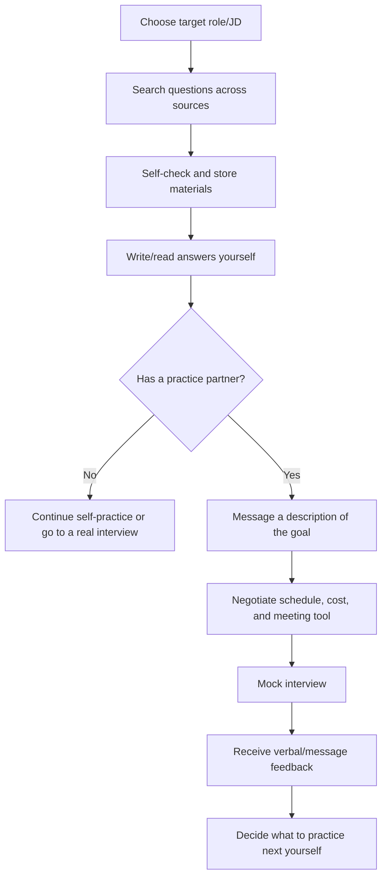

# Interview Practice Platform — Current-State Workflow

## 1. Workflow definition

The current state describes how a Student prepares for interviews today, without an integrated platform. The process starts when the Student picks a target role and ends when they receive fragmented feedback or walk into a real interview.

## 2. Main scenario

An prepares for a Front-end Intern application. An reads a JD, searches for questions across many sources, notes down answers, and asks an acquaintance for a mock session. Most of the time goes into selecting materials and coordination; An has no rubric telling them where the answer needs improvement.

## 3. Current end-to-end workflow

## 4. Workflow specification

| Step | Actor | Input | Activity | Output | Pain/risk |
|---|---|---|---|---|---|
| CS-01 | Student | JD or role name | Determine topics to prepare | Self-inferred topic list | Unstructured, depends on experience |
| CS-02 | Student | Search keywords | Find blogs, videos, social, AI, question banks | Many content sources | Duplicate, hard to verify |
| CS-03 | Student | Link/content | Save to notes/bookmarks/spreadsheet | Personal material set | Hard to maintain and retrieve |
| CS-04 | Student | Questions | Read/write answers, self-assess | Draft answers | No reliable feedback |
| CS-05 | Student | Personal network | Find friends/mentor/HR | Some contacts | Hard to match expertise/schedule |
| CS-06 | Both sides | Goal, schedule, price | Negotiate via messages | Unstructured agreement | Slow, incomplete, schedule conflicts |
| CS-07 | Both sides | Meeting link | Mock interview | Practice experience | Quality depends on the helper |
| CS-08 | Mentor/peer | Free-form notes | Give verbal/message feedback | Fragmented feedback | No rubric, hard to compare |
| CS-09 | Student | Feedback | Choose next topics yourself | Personal plan | Actions may be vague |

## 5. Current data model

### Position and question information

- Company/role/JD name.
- Source link, questions, draft answers.
- Tags or folders created by the learner.
- Practice status is often inconsistent.

### Mentor and schedule information

- Social profile/link.
- Conversation content about experience, goals, price, and schedule.
- Meeting link or private contact.
- No shared booking record.

### Feedback

- Messages, emails, documents, or spoken words.
- Rarely uses the same criteria between sessions.
- Not linked directly to the question/topic that needs practice.

## 6. Common variations

### 6.1 Fully self-directed practice

The learner reads questions and uses AI or sample answers to self-check. This is accessible but does not simulate pressure, follow-up questions, or human assessment.

### 6.2 Peer practice

Two candidates practice together. Cost is low and it is easy to repeat, but feedback accuracy and depth depend on the peer's ability.

### 6.3 Mentor/coaching on another platform

The learner books a coach on a mentoring platform. Quality can be high, but the Question Bank and practice history usually stay outside the service.

### 6.4 Asking acquaintances/colleagues

Personal trust is high but it depends on network, goodwill, and free time; hard to scale or sustain consistently.

## 7. Pain point analysis

### 7.1 Finding and verifying content is the first bottleneck

The learner spends time searching, cross-checking, and organizing questions before actually practicing.

### 7.2 Self-practice does not fully mirror an interview

Reading answers does not test speaking aloud, reacting to follow-ups, or staying on topic.

### 7.3 Mentor coordination creates friction

Goal, scope, schedule, price, and meeting tools are negotiated over many message rounds.

### 7.4 Feedback is unstructured

The learner gets general comments without strength, weakness, evidence, and next action.

### 7.5 Data does not form a loop

JD, questions, mentors, bookings, and feedback live in many places. The learner must convert feedback into a practice plan themselves.

## 8. Evidence to collect

- Average time to find a suitable question set.
- Share of students who ever did a mock interview and reasons for not trying.
- Time from finding a mentor to confirming a schedule.
- Current feedback quality against a sample rubric.
- Confidence before/after a practice session.
- Willingness to pay and the most recent actual cost.

## 9. Current-state findings

The current workflow is usable but fragmented. This baseline must be validated with discovery before being used as evidence that the MVP improved the experience.
