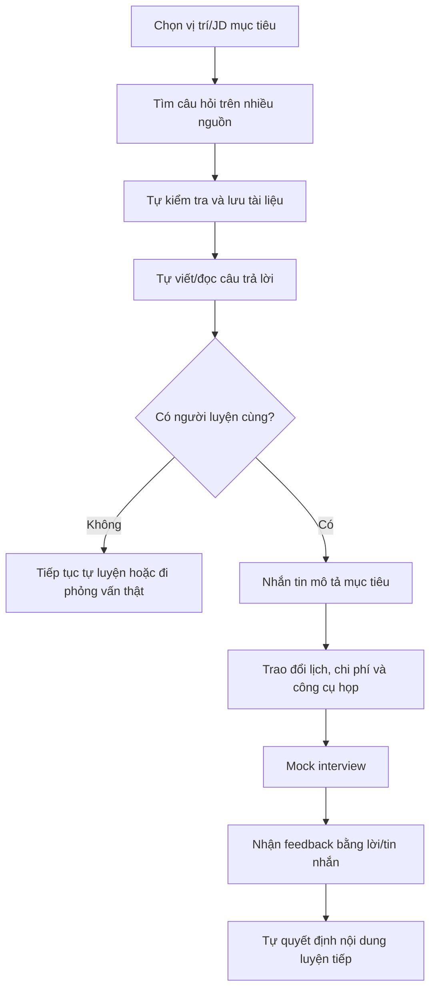

# Interview Practice Platform — Current-State Workflow

## 1. Định nghĩa workflow

Current state mô tả cách sinh viên hiện chuẩn bị phỏng vấn khi chưa có nền tảng tích hợp. Quy trình bắt đầu từ lúc người học chọn vị trí mục tiêu và kết thúc khi họ nhận feedback rời rạc hoặc bước vào buổi phỏng vấn thật.

## 2. Kịch bản chính

An chuẩn bị ứng tuyển Front-end Intern. An đọc JD, tìm câu hỏi từ nhiều nguồn, ghi chú câu trả lời và nhờ người quen luyện cùng. Phần lớn thời gian bị dùng cho việc chọn tài liệu và điều phối; An không có rubric để biết câu trả lời cần cải thiện ở đâu.

## 3. End-to-end workflow hiện tại

## 4. Đặc tả workflow

| Bước | Actor | Input | Hoạt động | Output | Pain/risk |
|---|---|---|---|---|---|
| CS-01 | Student | JD hoặc tên vị trí | Xác định chủ đề cần chuẩn bị | Danh sách chủ đề tự suy luận | Thiếu cấu trúc, phụ thuộc kinh nghiệm |
| CS-02 | Student | Từ khóa tìm kiếm | Tìm blog, video, social, AI, kho bài | Nhiều nguồn nội dung | Trùng lặp, khó kiểm chứng |
| CS-03 | Student | Link/nội dung | Lưu notes/bookmark/spreadsheet | Bộ tài liệu cá nhân | Khó duy trì và tìm lại |
| CS-04 | Student | Câu hỏi | Đọc/viết đáp án, tự đánh giá | Câu trả lời nháp | Không có feedback đáng tin cậy |
| CS-05 | Student | Mạng lưới cá nhân | Tìm bạn/mentor/HR | Một số contact | Khó đúng chuyên môn/lịch |
| CS-06 | Hai bên | Mục tiêu, lịch, giá | Trao đổi qua tin nhắn | Thỏa thuận không cấu trúc | Chậm, thiếu thông tin, trùng lịch |
| CS-07 | Hai bên | Link họp | Mock interview | Trải nghiệm luyện tập | Chất lượng phụ thuộc người hỗ trợ |
| CS-08 | Mentor/peer | Ghi chú tự do | Nhận xét qua lời/tin nhắn | Feedback rời rạc | Không theo rubric, khó so sánh |
| CS-09 | Student | Feedback | Tự chọn nội dung luyện tiếp | Kế hoạch cá nhân | Hành động có thể mơ hồ |

## 5. Mô hình dữ liệu hiện tại

### Thông tin vị trí và câu hỏi

- Tên công ty/vị trí/JD.
- Link nguồn, câu hỏi, câu trả lời nháp.
- Tag hoặc folder do người học tự đặt.
- Trạng thái luyện thường không nhất quán.

### Thông tin mentor và lịch

- Profile/link mạng xã hội.
- Nội dung hội thoại về kinh nghiệm, mục tiêu, giá và lịch.
- Link họp hoặc contact riêng.
- Không có một booking record dùng chung.

### Feedback

- Tin nhắn, email, tài liệu hoặc lời nói.
- Ít khi có cùng tiêu chí giữa hai buổi.
- Không nối trực tiếp đến câu hỏi/chủ đề cần luyện.

## 6. Các biến thể phổ biến

### 6.1 Tự luyện hoàn toàn

Người học đọc câu hỏi, dùng AI hoặc đáp án mẫu để tự kiểm tra. Cách này dễ tiếp cận nhưng không mô phỏng áp lực, câu hỏi tiếp nối và đánh giá của con người.

### 6.2 Peer practice

Hai ứng viên luyện cùng nhau. Chi phí thấp và dễ lặp lại, nhưng độ chính xác và chiều sâu feedback phụ thuộc năng lực của peer.

### 6.3 Mentor/coaching qua nền tảng khác

Người học đặt coach trên một nền tảng mentoring. Chất lượng có thể cao, nhưng Question Bank và lịch sử luyện thường nằm ngoài dịch vụ.

### 6.4 Nhờ người quen/đồng nghiệp

Có độ tin cậy cá nhân nhưng phụ thuộc mạng lưới, thiện chí và lịch rảnh; khó mở rộng hoặc duy trì đều đặn.

## 7. Phân tích pain point

### 7.1 Tìm và kiểm tra nội dung là nút thắt đầu tiên

Người học dành thời gian tìm, đối chiếu và tổ chức câu hỏi trước khi thực sự luyện tập.

### 7.2 Tự luyện không phản ánh đầy đủ buổi phỏng vấn

Đọc đáp án không kiểm tra được cách nói thành tiếng, phản ứng trước follow-up và khả năng giữ câu trả lời đúng trọng tâm.

### 7.3 Điều phối mentor tạo ma sát

Mục tiêu, phạm vi, lịch, giá và công cụ họp được thương lượng qua nhiều lượt tin nhắn.

### 7.4 Feedback thiếu cấu trúc

Người học nhận xét chung nhưng thiếu strength, weakness, evidence và next action.

### 7.5 Dữ liệu không tạo thành vòng lặp

JD, câu hỏi, mentor, booking và feedback nằm ở nhiều nơi. Người học phải tự chuyển feedback thành kế hoạch luyện tiếp.

## 8. Evidence cần thu

- Thời gian trung bình để tìm một bộ câu hỏi phù hợp.
- Tỷ lệ sinh viên từng mock interview và lý do chưa thử.
- Thời gian từ lúc tìm mentor đến lúc xác nhận lịch.
- Chất lượng feedback hiện tại theo rubric mẫu.
- Mức tự tin trước/sau một buổi luyện.
- Willingness to pay và chi phí thực tế gần nhất.

## 9. Kết quả current state

Workflow hiện tại khả dụng nhưng phân mảnh. Baseline này cần được kiểm chứng bằng discovery trước khi dùng làm bằng chứng rằng MVP đã cải thiện trải nghiệm.

