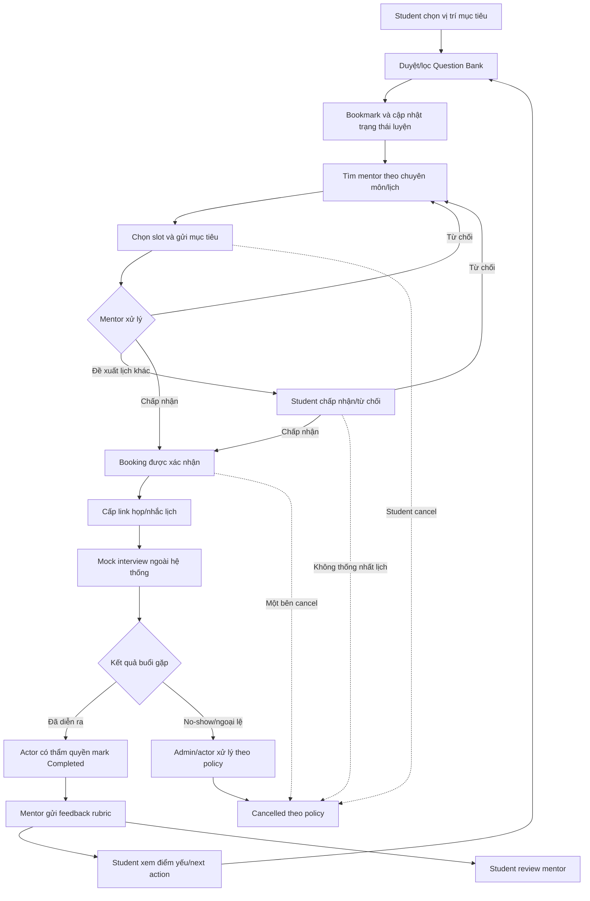
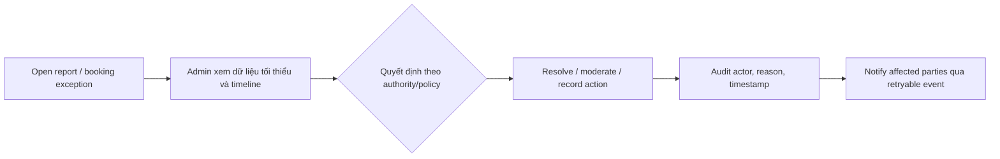
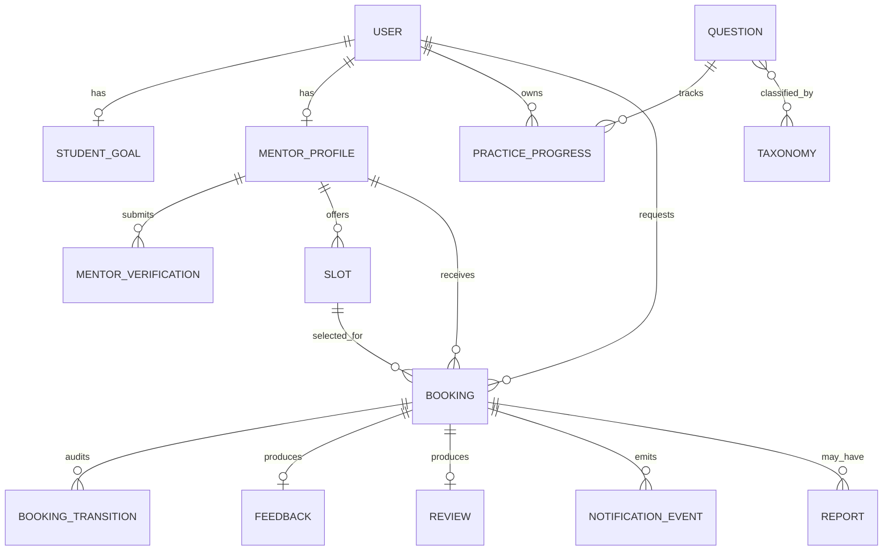

# Interview Practice Platform — Future-State Workflow

> **AI-assisted reference version — Pending human audit.** Codex hỗ trợ đồng bộ state/rule/traceability; Hưng, Product Owner và các owner Prototype/PoC phải walkthrough và chốt policy. Đây chưa phải Approved workflow baseline.

## 0. Kiểm soát tài liệu

| Thuộc tính | Giá trị |
|---|---|
| Owner/Producer | Hưng — Thành viên 3 |
| Công cụ hỗ trợ | Codex |
| Phiên bản | 0.3-ai-cross-branch-reference |
| Trạng thái | Cross-branch AI reconciliation completed; pending human walkthrough/PO approval |
| Branch | `feat/member-3-scope-backlog` |
| Ngày cập nhật | 14/08/2026 |
| Reviewer/Approver | `[CẦN BỔ SUNG — Hùng/Trí/PO]` |

Future workflow là black-box view của solution, không phải bằng chứng backend/concurrency/security đã hoàn thành. Vision & Scope cần future business use case/domain view theo [User Requirements, Slide 017](../refs/03-2-user-requirements.md#slide-017--project-vision-and-scope-4).

## 1. Định nghĩa workflow

Future state mô tả trải nghiệm mục tiêu của MVP: dữ liệu về vị trí, câu hỏi, mentor, booking và feedback nằm trong một workflow; video meeting vẫn do công cụ ngoài cung cấp.

## 2. Kịch bản chính

An chọn Front-end Intern, lọc nhóm JavaScript Fundamentals và đánh dấu câu hỏi đã luyện. An tìm mentor theo chuyên môn và lịch rảnh, gửi booking kèm mục tiêu. Mentor xác nhận, hai bên dùng link Google Meet/Zoom. Sau buổi luyện, mentor gửi rubric; An thấy chủ đề yếu và quay lại Question Bank.

## 3. End-to-end workflow tương lai

`Completed` là transition bắt buộc trước Feedback; feedback không phải booking state. Nhánh dotted thể hiện exception/policy còn cần PO xác nhận, không tuyên bố policy đã được duyệt.

## 4. Đặc tả workflow

| Bước | Actor | Precondition | Hoạt động | Postcondition |
|---|---|---|---|---|
| FS-01 | Student | Đã đăng nhập | Chọn vị trí/chủ đề mục tiêu | Profile có learning goal |
| FS-02 | Student | Có câu hỏi Published | Search/filter và xem chi tiết | Câu hỏi phù hợp được hiển thị |
| FS-03 | Student | Có quyền Student | Bookmark/đổi trạng thái luyện | Progress được lưu |
| FS-04 | Student | Có mentor Approved | Lọc mentor và xem profile/slot | Chọn được mentor/slot |
| FS-05 | Student | Slot còn trống | Gửi goal, interview type, topic | Booking Pending |
| FS-06 | Mentor | Là chủ slot | Accept/Reject/Propose change | Booking đổi trạng thái hợp lệ |
| FS-07 | System | Booking Confirmed | Khóa slot, gửi thông báo, cấp link | Hai bên có thông tin buổi gặp |
| FS-08 | Hai bên | Đến lịch | Thực hiện mock interview ngoài hệ thống | Booking đủ điều kiện Complete |
| FS-08A | Actor có thẩm quyền `[DEC-03]` | Buổi gặp đã diễn ra và đủ điều kiện policy | Mark booking `Completed`; ghi actor/timestamp/audit | Booking `Completed` |
| FS-09 | Mentor | Booking Completed | Chấm rubric và ghi next action | Feedback chỉ hai bên xem được |
| FS-10 | Student | Booking Completed | Review mentor | Review gắn booking hợp lệ |
| FS-11 | Student | Có feedback | Mở chủ đề/câu hỏi được gợi ý | Vòng lặp luyện tiếp bắt đầu |

### 4.1 Canonical booking states

| State | Ý nghĩa | Terminal? |
|---|---|---|
| `Pending` | Student đã gửi yêu cầu, chờ Mentor xử lý | Không |
| `Confirmed` | Mentor đã chấp nhận và slot được khóa | Không |
| `RescheduleProposed` | Một bên đề xuất slot mới, chờ bên còn lại quyết định; proposal không giữ slot mới, còn old slot của booking trước đó Confirmed phải tiếp tục được bảo vệ | Không cho slot mới; conditional cho old slot |
| `Rejected` | Mentor từ chối yêu cầu Pending | Có cho booking hiện tại |
| `Cancelled` | Booking bị hủy theo policy bởi actor được phép | Có |
| `Completed` | Buổi gặp đã diễn ra và actor có thẩm quyền xác nhận | Có cho booking lifecycle; cho phép feedback/review |
| `NoShow` | Ngoại lệ vắng mặt được ghi nhận theo policy | Có/conditional — PO phải chốt |

Không dùng lẫn `Reschedule`, `Propose change` và `Reschedule proposed`; canonical business term là `RescheduleProposed`, API/storage token là `RESCHEDULE_PROPOSED` và UI có thể dùng “Đề xuất đổi lịch”. Các token khác lần lượt là `PENDING`, `CONFIRMED`, `REJECTED`, `CANCELLED`, `COMPLETED` và conditional `NO_SHOW` theo backlog mục 2.1.

### 4.2 Booking transition table

| From | Event/actor | Guard | To | Side effect/audit | Trace |
|---|---|---|---|---|---|
| — | Student `CreateBooking` | Slot available; goal/type/position hợp lệ | `Pending` | Tạo một booking, audit creation | US-11, BR-02/03/08, AC-11-01 |
| `Pending` | Owning Mentor `Accept` | Slot chưa thuộc booking occupying-state khác; request retry-safe | `Confirmed` | Atomic slot lock; transition audit; emit one deduplicated notification event | US-12, BR-02/08/09/10, AC-12-01 |
| `Pending` | Owning Mentor `Reject` | Reason hợp lệ | `Rejected` | Release/keep slot availability; audit reason | US-12, BR-08, AC-12-02 |
| `Pending`/`Confirmed` | Authorized party `ProposeReschedule` | Proposed slot hợp lệ; policy cho phép; nếu source là Confirmed thì old slot vẫn được bảo vệ | `RescheduleProposed` | Lưu previous state/old-new slot/requester/reason; không giữ new slot trước acceptance | US-12, US-13; BR-02, BR-08; AC-12-02, AC-12-03, AC-13-01 |
| `RescheduleProposed` | Other party `AcceptReschedule` | New slot vẫn available | `Confirmed` | Atomic switch/lock; release old slot; audit | US-13; BR-02, BR-08; AC-13-01 |
| `RescheduleProposed` | Other party `RejectReschedule` | DEC-03 policy | Previous state hoặc `Cancelled` `[DEC-03]` | Audit decision/reason | US-13, BR-08, AC-13-01 |
| `Pending`/`Confirmed`/`RescheduleProposed` | Authorized party `Cancel` | Cutoff/reason/policy `[DEC-03]` | `Cancelled` | Release slot if applicable; audit/notify | US-13; BR-08, BR-09; AC-13-01, AC-19-01 |
| `Confirmed` | Authorized actor `MarkCompleted` | Session time reached; completion policy `[DEC-03]` | `Completed` | Audit actor/time; enable feedback/review | US-15, US-17; BR-05, BR-06, BR-08; AC-15-01, AC-17-01 |
| `Confirmed` | Authorized actor/Admin `MarkNoShow` | No-show evidence/policy `[DEC-03]` | `NoShow` `[conditional]` | Audit evidence/decision; exception handling | US-13, US-20; BR-08; AC-13-01, AC-20-01 |

Invalid transition must fail without partial state/slot side effect. Notification failure never changes the committed target state.

## 5. Input model

### Student goal

- Vị trí mục tiêu, seniority và loại phỏng vấn.
- Chủ đề/câu hỏi muốn luyện.
- Mốc phỏng vấn dự kiến và ghi chú cần thiết.

### Mentor profile và availability

- Chuyên môn, kinh nghiệm, phạm vi hỗ trợ và ngôn ngữ.
- Bằng chứng xác minh và trạng thái duyệt.
- Duration, fee placeholder, timezone và time slot.

### Booking request

- Student, mentor, slot, mục tiêu và interview type.
- Trạng thái, meeting link, lý do từ chối/hủy/đổi lịch.
- Timestamp và audit trail của transition.

### Feedback rubric

- Kiến thức/chuyên môn.
- Cấu trúc và độ rõ câu trả lời.
- Giao tiếp và sự tự tin.
- Xử lý câu hỏi tiếp nối.
- Điểm mạnh, điểm yếu, evidence và next action.

## 6. Các stage xử lý

### 6.1 Discover và self-practice

Hệ thống chỉ hiển thị câu hỏi Published. Filter kết hợp vị trí, chủ đề, loại và độ khó; không làm mất câu hỏi có nhiều tag. Progress là dữ liệu riêng của Student.

### 6.2 Mentor discovery và booking

Chỉ mentor Approved có profile/slot công khai. Khi Student gửi booking, hệ thống kiểm tra slot còn khả dụng. Một slot chỉ có tối đa một booking ở occupying state theo BR-02; retry create/transition phải idempotent theo BR-10.

### 6.3 Confirmation và session

Transition phải tuân theo state machine. Notification failure không được làm mất booking; trạng thái nội bộ là nguồn chân lý. Meeting link chỉ hiển thị cho đúng hai bên và admin có thẩm quyền.

### 6.4 Feedback và review

Mentor chỉ gửi feedback cho booking Completed. Student chỉ review mentor từ booking hợp lệ. Feedback riêng tư; review công khai phải qua policy và report flow.

## 7. Business rules và ngoại lệ

Canonical rule catalogue, source/changeability/owner nằm trong [Product Backlog and Acceptance Criteria, mục 2](Product_Backlog_and_Acceptance_Criteria.md#2-canonical-business-rules-and-semantics). Workflow phải thực thi cùng nghĩa, không tạo biến thể cục bộ.

| ID | Quy tắc workflow |
|---|---|
| BR-01 | Chỉ mentor `Approved` được công khai profile/slot và nhận booking. |
| BR-02 | Một slot có tối đa một booking ở occupying state (`Confirmed`, `Completed`, conditional `NoShow`); old slot của confirmed-source reschedule vẫn được bảo vệ đến khi proposal được giải quyết. |
| BR-03 | Booking phải có goal, position/interview type và slot hợp lệ. |
| BR-04 | Chỉ Student/Mentor thuộc booking và Admin có thẩm quyền được xem booking/meeting link/feedback. |
| BR-05 | Feedback chỉ được tạo cho booking `Completed`. |
| BR-06 | Student chỉ review một lần cho booking hợp lệ đã `Completed`. |
| BR-07 | Question chỉ công khai khi `Published`, có taxonomy và provenance hợp lệ. |
| BR-08 | Booking transition phải theo canonical state machine và audit actor/reason/timestamp phù hợp. |
| BR-09 | Notification failure không rollback/điều khiển booking state; retry/fallback/idempotent, internal state là source of truth. |
| BR-10 | Create booking và critical transition phải retry-safe bằng idempotency key; retry giống nhau không tạo booking/transition/event trùng. |
| BR-11 | Meeting link, verification evidence, feedback và private profile data không public/log đầy đủ; retention/deletion theo DEC-05. |

### 7.1 Exception workflow

| Exception | Expected workflow/result | Trace |
|---|---|---|
| Slot vừa thuộc booking occupying-state khác | Accept/create thất bại với stable conflict; chọn slot khác; không tạo owner/transition/event thứ hai | BR-02, BR-10, AC-12-01, TC-B/TC-SLOT |
| Invalid/unauthorized transition | Trả lỗi an toàn; state/slot không đổi; ghi security/audit phù hợp | BR-04, BR-08, AC-02-01, AC-13-01 |
| Reject | Booking `Rejected`; reason/audit; Student quay lại mentor/slot search | BR-08, AC-12-02 |
| Reschedule | `RescheduleProposed`; old confirmed slot vẫn được bảo vệ, new slot chưa bị giữ; bên còn lại accept/reject và switch atomic | BR-02, BR-08, AC-12-03, AC-13-01 |
| Cancellation | `Cancelled` theo DEC-03; slot được release phù hợp; notification không điều khiển state | BR-08, BR-09, AC-13-01, AC-19-01 |
| No-show | Gửi tới Admin/actor có thẩm quyền; `NoShow` chỉ dùng sau khi DEC-03 được duyệt | BR-08, AC-20-01 |
| Meeting provider outage | Booking giữ `Confirmed`; hiển thị hướng xử lý/fallback; không tự Complete/Cancel | BR-09, AC-19-01 |
| Notification timeout/duplicate | Booking đã commit; job retry idempotent; operation queue thấy failure | BR-09, AC-19-01 |
| Feedback actor/state sai | Chặn; không tạo feedback partial; không lộ booking | BR-04, BR-05, AC-15-01 |

### 7.2 Admin/operations flow

Internal note/evidence không hiển thị public. Admin action không được bypass state machine hoặc sửa history âm thầm.

## 8. Future domain mapping

Đây là conceptual mapping để giữ consistency; field/schema/constraint chi tiết thuộc Architecture. Question–Taxonomy là many-to-many về khái niệm; implementation phải đảm bảo filter không duplicate.

## 9. Rủi ro và giới hạn

- Mentor supply thấp có thể làm kết quả tìm kiếm rỗng.
- No-show và đổi lịch cần quy trình admin thủ công trong pilot.
- Meeting provider outage nằm ngoài quyền kiểm soát trực tiếp.
- Nội dung và feedback có thể sai hoặc không phù hợp; cần moderation/report.
- Payment thủ công hoặc miễn phí làm giới hạn việc kiểm chứng unit economics.
- Recommendation cá nhân hóa chưa thuộc MVP.

## 10. Traceability

| Workflow | Stories | BR | AC | Prototype/verification |
|---|---|---|---|---|
| FS-01 | US-01, US-03 | BR-03, BR-04 | AC-01-01, AC-03-01 | S01; TC-AUTH/TC-STUDENT |
| FS-02 | US-04, US-05, US-18 | BR-07 | AC-04-01, AC-05-01, AC-18-01 | S02-S03, A03; TC-Q |
| FS-03 | US-06 | BR-04 | AC-06-01 | S02-S03; TC-Q |
| FS-04 | US-07, US-08, US-09, US-10 | BR-01, BR-02, BR-08 | AC-07-01, AC-08-01, AC-09-01, AC-10-01 | S04-S05, M01-M04, A02; TC-M/TC-SLOT |
| FS-05 | US-11 | BR-02, BR-03, BR-08, BR-10 | AC-11-01, AC-11-02 | S06; TC-B |
| FS-06 | US-12, US-13 | BR-02, BR-08, BR-10 | AC-12-01, AC-12-02, AC-12-03, AC-13-01, AC-13-02 | S07, M05-M06; TC-B |
| FS-07 | US-14, US-19 | BR-04, BR-09, BR-11 | AC-14-01, AC-14-02, AC-19-01, AC-19-02 | S08/M07; TC-SESSION/TC-N |
| FS-08, FS-08A | US-13, US-14, US-20 | BR-04, BR-08, BR-11 | AC-13-01, AC-13-02, AC-14-01, AC-14-02, AC-20-01 | Session/Admin; TC-B/TC-ADM |
| FS-09 | US-15 | BR-04, BR-05, BR-11 | AC-15-01, AC-15-02 | M08; TC-F |
| FS-10 | US-17 | BR-06 | AC-17-01 | S10; TC-F |
| FS-11 | US-06, US-16 | BR-04 | AC-06-01, AC-16-01 | S09 -> S02; TC-F/TC-Q |

## 11. Workflow validation scenarios

| ID | Scenario | Pass condition |
|---|---|---|
| WV-01 | Question multi-tag, zero/one/many result | Correct deterministic result; no duplicate/draft leak |
| WV-02 | Happy booking -> Confirmed -> Completed -> Feedback | State order đúng; feedback chỉ sau Completed |
| WV-03 | Concurrent accept cùng slot | Chính xác một Confirmed; request còn lại conflict an toàn |
| WV-04 | Reject/reschedule/cancel | Actor/action/next state/reason rõ; không có dead end trái policy |
| WV-05 | Unauthorized meeting/feedback access | Bị chặn server-side, không lộ dữ liệu/object existence không cần thiết |
| WV-06 | Notification/meeting provider failure | Booking source of truth giữ đúng; retry/fallback hiển thị |
| WV-07 | No-show/report/admin resolution | Authority/policy/audit rõ hoặc đánh dấu blocked bởi DEC-03 |
| WV-08 | Feedback-to-question loop | Student thấy next action và quay về taxonomy/topic phù hợp |

Prototype/workflow cần exploratory test với input xấu/đối nghịch theo [Software Quality Management, Slide 007](../refs/11-software-quality-management.md#slide-007--how-to-meet-user-requirements). Bản AI reference chỉ định nghĩa scenario, không tuyên bố đã test.

## 12. Open decisions

| ID | Decision | Owner | Blocked content |
|---|---|---|---|
| DEC-03 | Cancellation/reschedule/no-show/mark-complete authority, cutoff, evidence và old-slot handling | PO/Operations | Transition conditional, US-12/13/15/20 readiness |
| DEC-08 | Review/Admin exception có thuộc minimum releasable feature | PO | AI proposal includes US-17/20 as Must; PO inspection pending |
| DEC-09 | Reminder cadence/timezone/suppression/fallback | PO/Operations | US-22, notification UX |
| DEC-07 | Meeting-link creation/update authority và outage fallback | PO/Technical | FS-07/exception UI |

## 13. Kết quả future state và readiness

Workflow thành công khi Student hoàn thành vòng lặp từ câu hỏi đến feedback mà không cần điều phối cốt lõi qua kênh riêng, và dữ liệu thu được đủ để đánh giá KPI cùng giả thuyết kinh doanh.

**Readiness:** `AI-assisted reference — conditionally ready for human walkthrough`. Chưa Approved cho đến khi DEC-03/07 được chốt ở mức MVP, DEC-08 được PO xác nhận, Hùng cung cấp prototype/usability evidence, Trí cung cấp PoC evidence đạt các EN-03..EN-07, và PO inspection/acceptance được ghi nhận.

## 14. Ref compliance index

| Tiêu chí | Ref | Vị trí |
|---|---|---|
| User/problem/feature/prototype | [03.2, Slides 005, 014-015](../refs/03-2-user-requirements.md#slide-005--discovering-user-requirements) | 2-4, 11 |
| Future use case/domain/risk/conclusion | [03.2, Slide 017](../refs/03-2-user-requirements.md#slide-017--project-vision-and-scope-4) | 3-14 |
| Traceability/inspection | [09, Slides 039-042](../refs/09-software-project-monitoring-and-control.md#slide-039--9-validate-scope) | 10-13 |
| Negative/exploratory workflow | [11, Slide 007](../refs/11-software-quality-management.md#slide-007--how-to-meet-user-requirements) | 7, 11 |

