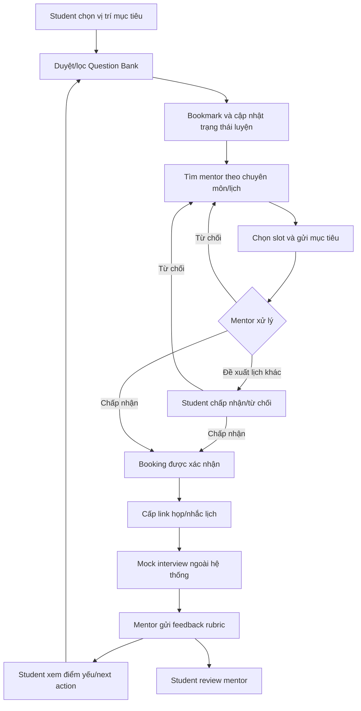

# Interview Practice Platform — Future-State Workflow

## 1. Định nghĩa workflow

Future state mô tả trải nghiệm mục tiêu của MVP: dữ liệu về vị trí, câu hỏi, mentor, booking và feedback nằm trong một workflow; video meeting vẫn do công cụ ngoài cung cấp.

## 2. Kịch bản chính

An chọn Front-end Intern, lọc nhóm JavaScript Fundamentals và đánh dấu câu hỏi đã luyện. An tìm mentor theo chuyên môn và lịch rảnh, gửi booking kèm mục tiêu. Mentor xác nhận, hai bên dùng link Google Meet/Zoom. Sau buổi luyện, mentor gửi rubric; An thấy chủ đề yếu và quay lại Question Bank.

## 3. End-to-end workflow tương lai

## 4. Đặc tả workflow

| Bước | Actor | Precondition | Hoạt động | Postcondition |
|---|---|---|---|---|
| FS-01 | Student | Đã đăng nhập | Chọn vị trí/chủ đề mục tiêu | Profile có learning goal |
| FS-02 | Student | Có câu hỏi Published | Search/filter và xem chi tiết | Câu hỏi phù hợp được hiển thị |
| FS-03 | Student | Có quyền Student | Bookmark/đổi trạng thái luyện | Progress được lưu |
| FS-04 | Student | Có mentor Approved | Lọc mentor và xem profile/slot | Chọn được mentor/slot |
| FS-05 | Student | Slot còn trống | Gửi goal, interview type, topic | Booking Pending |
| FS-06 | Mentor | Là chủ slot | Accept/Reject/Propose change | Booking đổi trạng thái hợp lệ |
| FS-07 | System | Booking Confirmed | Khóa slot, gửi thông báo, cấp link | Hai bên có thông tin buổi gặp |
| FS-08 | Hai bên | Đến lịch | Thực hiện mock interview ngoài hệ thống | Booking đủ điều kiện Complete |
| FS-09 | Mentor | Booking Completed | Chấm rubric và ghi next action | Feedback chỉ hai bên xem được |
| FS-10 | Student | Booking Completed | Review mentor | Review gắn booking hợp lệ |
| FS-11 | Student | Có feedback | Mở chủ đề/câu hỏi được gợi ý | Vòng lặp luyện tiếp bắt đầu |

## 5. Input model

### Student goal

- Vị trí mục tiêu, seniority và loại phỏng vấn.
- Chủ đề/câu hỏi muốn luyện.
- Mốc phỏng vấn dự kiến và ghi chú cần thiết.

### Mentor profile và availability

- Chuyên môn, kinh nghiệm, phạm vi hỗ trợ và ngôn ngữ.
- Bằng chứng xác minh và trạng thái duyệt.
- Duration, fee placeholder, timezone và time slot.

### Booking request

- Student, mentor, slot, mục tiêu và interview type.
- Trạng thái, meeting link, lý do từ chối/hủy/đổi lịch.
- Timestamp và audit trail của transition.

### Feedback rubric

- Kiến thức/chuyên môn.
- Cấu trúc và độ rõ câu trả lời.
- Giao tiếp và sự tự tin.
- Xử lý câu hỏi tiếp nối.
- Điểm mạnh, điểm yếu, evidence và next action.

## 6. Các stage xử lý

### 6.1 Discover và self-practice

Hệ thống chỉ hiển thị câu hỏi Published. Filter kết hợp vị trí, chủ đề, loại và độ khó; không làm mất câu hỏi có nhiều tag. Progress là dữ liệu riêng của Student.

### 6.2 Mentor discovery và booking

Chỉ mentor Approved có profile/slot công khai. Khi Student gửi booking, hệ thống kiểm tra slot còn khả dụng. Một slot chỉ có tối đa một booking Confirmed.

### 6.3 Confirmation và session

Transition phải tuân theo state machine. Notification failure không được làm mất booking; trạng thái nội bộ là nguồn chân lý. Meeting link chỉ hiển thị cho đúng hai bên và admin có thẩm quyền.

### 6.4 Feedback và review

Mentor chỉ gửi feedback cho booking Completed. Student chỉ review mentor từ booking hợp lệ. Feedback riêng tư; review công khai phải qua policy và report flow.

## 7. Business rules và ngoại lệ

| ID | Quy tắc |
|---|---|
| BR-01 | Chỉ mentor Approved được công khai profile, slot và nhận booking |
| BR-02 | Một slot có tối đa một booking Confirmed |
| BR-03 | Booking phải có goal, position/interview type và slot hợp lệ |
| BR-04 | Chỉ Student/Mentor thuộc booking và Admin có thẩm quyền được xem dữ liệu riêng |
| BR-05 | Feedback chỉ được tạo cho booking Completed |
| BR-06 | Review chỉ được tạo một lần bởi Student của booking hợp lệ |
| BR-07 | Question chỉ công khai khi Published và có ít nhất một position/topic |
| BR-08 | Cancellation/reschedule/no-show tuân theo policy được hiển thị trước xác nhận |
| BR-09 | Notification có retry/fallback và không điều khiển trạng thái booking |

## 8. Rủi ro và giới hạn

- Mentor supply thấp có thể làm kết quả tìm kiếm rỗng.
- No-show và đổi lịch cần quy trình admin thủ công trong pilot.
- Meeting provider outage nằm ngoài quyền kiểm soát trực tiếp.
- Nội dung và feedback có thể sai hoặc không phù hợp; cần moderation/report.
- Payment thủ công hoặc miễn phí làm giới hạn việc kiểm chứng unit economics.
- Recommendation cá nhân hóa chưa thuộc MVP.

## 9. Kết quả future state

Workflow thành công khi Student hoàn thành vòng lặp từ câu hỏi đến feedback mà không cần điều phối cốt lõi qua kênh riêng, và dữ liệu thu được đủ để đánh giá KPI cùng giả thuyết kinh doanh.

