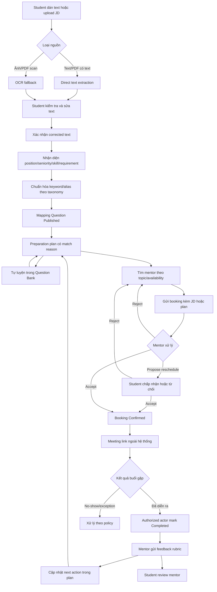
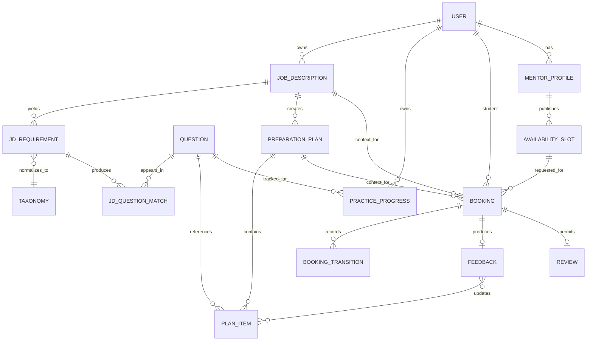

# Interview Practice Platform — Future-State Workflow

## 1. Định nghĩa workflow

Future state mô tả black-box business workflow của MVP: Student đưa một Job Description (JD) vào hệ thống, kiểm tra text, nhận preparation plan có question mapping, rồi tự luyện hoặc đặt mentor và dùng feedback để cập nhật kế hoạch. Field/schema/constraint kỹ thuật thuộc Architecture. Cách mô tả current/future use case và domain nằm trong cấu trúc Vision & Scope của [User Requirements, Slide 017](https://github.com/tnnhuaa/InterviewQuestionBank/blob/05ff4b99ae133de9b0f7c2f0de3585390b933718/docs/refs/03-2-user-requirements.md#slide-017--project-vision-and-scope-4).

## 2. Kịch bản chính

An có một JD Front-end Intern. An dán text hoặc upload file, xem nội dung được trích xuất và sửa lỗi trước khi xác nhận. Hệ thống nhận diện position, seniority, skill/technology, chuẩn hóa alias theo taxonomy và mapping các Question Published kèm requirement nguồn và lý do. An tạo preparation plan, tự luyện một số câu hỏi rồi chọn mentor phù hợp với topic trong plan. Booking mang theo JD/plan context; mentor xác nhận, hai bên dùng meeting link ngoài hệ thống. Sau buổi luyện, feedback gồm strength, weakness và next action được đưa trở lại preparation plan.

## 3. End-to-end workflow tương lai

`Completed` là booking transition bắt buộc trước feedback; feedback không phải booking state. Flow no-show/cancel/reschedule chỉ được bật theo policy đã phê duyệt. Extraction/OCR thành công không đồng nghĩa analysis đúng; Student confirmation là gate bắt buộc.

## 4. Đặc tả workflow

| Bước | Actor | Precondition | Hoạt động | Postcondition |
|---|---|---|---|---|
| FS-01 | Student | Đã đăng nhập | Dán JD text hoặc upload file trong giới hạn được phê duyệt | JobDescription thuộc Student được tạo |
| FS-02 | System/worker | Nguồn hợp lệ | Direct extract text; OCR chỉ khi ảnh/PDF scan cần thiết | Extraction kết thúc với text hoặc failure code an toàn |
| FS-03 | Student | Có extracted/pasted text | Xem, sửa và xác nhận corrected text | Một text version được xác nhận cho analysis |
| FS-04 | System | Corrected text đã xác nhận | Nhận diện position, seniority, skill, technology và requirement chính | Requirement giữ raw evidence và trạng thái normalize |
| FS-05 | System | Có taxonomy/alias pilot | Chuẩn hóa requirement và mapping Question Published | Match ổn định theo matching version; có score/reason |
| FS-06 | Student/System | Có match hợp lệ | Chọn/ghi nhận topic, question và tạo preparation plan | Plan thuộc Student, tham chiếu JD và match version |
| FS-07 | Student | Có plan hoặc Question Published | Mở câu hỏi, bookmark và cập nhật trạng thái luyện | Practice progress riêng tư được lưu |
| FS-08 | Student | Có topic/plan và mentor Approved | Lọc mentor theo expertise/availability | Chọn được mentor/slot hoặc nhận empty state rõ |
| FS-09 | Student | Slot khả dụng; có JD/plan thuộc quyền sở hữu | Gửi booking với context tối thiểu cần thiết | Booking `Pending` tham chiếu JD hoặc plan |
| FS-10 | Mentor | Là chủ slot/booking | Accept/Reject/Propose reschedule | Booking chuyển trạng thái hợp lệ và có audit |
| FS-11 | System/hai bên | Booking `Confirmed` | Khóa slot, notification và cấp quyền meeting link | Hai bên có thông tin buổi gặp; provider không là source of truth |
| FS-12 | Hai bên | Đến lịch | Mock interview qua công cụ ngoài | Booking đủ điều kiện xử lý completion/no-show |
| FS-13 | Mentor/authorized actor | Booking `Completed` | Gửi feedback rubric | Feedback riêng tư có strength, weakness, next action |
| FS-14 | Student/System | Có feedback | Áp dụng next action vào plan; Student có thể review mentor | Vòng lặp luyện tiếp bắt đầu |

### 4.1 Canonical booking states

| Business state | API/storage token | Slot occupancy | Ý nghĩa |
|---|---|---|---|
| Pending | `PENDING` | Không | Booking đang chờ Mentor quyết định |
| Confirmed | `CONFIRMED` | Có | Mentor đã nhận và slot được giữ |
| Reschedule proposed | `RESCHEDULE_PROPOSED` | Slot cũ giữ; slot mới chưa chiếm | Bên còn lại phải chấp nhận/từ chối đề xuất |
| Rejected | `REJECTED` | Không | Mentor từ chối request hiện tại |
| Cancelled | `CANCELLED` | Không | Booking được hủy theo policy |
| Completed | `COMPLETED` | Có dưới dạng lịch sử | Buổi luyện đã diễn ra và completion được ghi nhận |
| No-show | `NO_SHOW` | Có điều kiện | Ngoại lệ attendance; chỉ dùng khi policy/evidence được duyệt |

Không dùng `OCR` để gọi toàn bộ JD analysis; không dùng lẫn `Reschedule`, `Propose change` và `Reschedule proposed`. Vocabulary đầy đủ nằm tại [Backlog mục 1.3](Product_Backlog_and_Acceptance_Criteria.md#13-booking-state-vocabulary).

### 4.2 Booking transition table

| From | Command/actor | Guard | To | Side effect | Trace |
|---|---|---|---|---|---|
| — | `CreateBooking` / Student | Slot khả dụng; JD/plan thuộc Student; context hợp lệ | Pending | Ghi booking + event idempotent | US-11, US-30; BR-03/10/18 |
| Pending | `Accept` / owning Mentor | Mentor/slot hợp lệ; transaction lock/constraint pass | Confirmed | Giữ slot + outbox event | US-12; BR-02/08/10 |
| Pending | `Reject` / owning Mentor | Reason hợp lệ | Rejected | Audit + event | US-12; BR-08 |
| Pending/Confirmed | `ProposeReschedule` / authorized party | Policy cho phép; slot mới hợp lệ | Reschedule proposed | Giữ slot cũ; lưu proposal | US-12/13; BR-02/08/10 |
| Reschedule proposed | `AcceptReschedule` / other party | Slot mới còn khả dụng tại commit | Confirmed | Chuyển slot atomically | US-13; BR-02/08/10 |
| Reschedule proposed | `RejectReschedule` / other party | Policy xác định trạng thái an toàn | Policy-defined | Giải phóng/giữ slot theo quyết định | US-13; BR-08 |
| Pending/Confirmed/Reschedule proposed | `Cancel` / authorized party | Cutoff/reason theo policy | Cancelled | Giải phóng slot phù hợp + event | US-13; BR-08/10 |
| Confirmed | `MarkCompleted` / authorized actor | Đã tới thời điểm; completion policy pass | Completed | Audit; enable feedback/review | US-15/17; BR-05/06/08 |
| Confirmed | `MarkNoShow` / authorized actor | Authority/evidence policy pass | No-show | Audit + operations action | US-20; BR-08 |

Invalid transition phải thất bại mà không để lại state/slot side effect. Notification failure không đổi target state đã commit.

## 5. Input và output model nghiệp vụ

### JD source

- `source_type`: pasted text hoặc PDF/PNG/JPEG theo baseline PoC; file không quá 10 MB.
- Original file reference, filename/media type, processing status và ownership.
- Page/language/time limits, malware checks, retention và việc ratify giới hạn cho MVP là policy/architecture decision; không được client tự quyết định.

### Extraction và correction

- `extracted_text`, extraction method/version/status và error code an toàn.
- `corrected_text`, correction version, confirmed timestamp và confirming Student.
- Analysis chỉ dùng corrected version đã xác nhận.

### Requirement và question-mapping data

- Raw requirement/evidence span từ corrected text.
- Position, seniority, skill/technology và normalized taxonomy topic.
- Question ID, match score, match reason và matching version.
- Chỉ Question `Published` có taxonomy/provenance hợp lệ được đưa vào kết quả.

### Preparation plan

- Student, JobDescription, selected requirement/topic/question và plan status.
- Plan lưu reference/version; không sao chép nội dung nhạy cảm không cần thiết.
- Feedback next action có thể thêm/chuyển ưu tiên item nhưng không ghi đè lịch sử.

### Mentor, booking và feedback

- Mentor expertise/availability và verification status.
- Booking tham chiếu `job_description_id` hoặc `preparation_plan_id`, mentor, slot, mục tiêu và interview type.
- Mentor chỉ xem context tối thiểu cần luyện; original file không tự động được chia sẻ.
- Feedback gồm rubric, strength, weakness, evidence và next action.

## 6. Các stage xử lý

### 6.1 JD intake và text confirmation

Hệ thống phân biệt pasted text, PDF có text và PNG/JPEG/PDF scan. Baseline PoC nhận file tối đa 10 MB; direct extraction được ưu tiên và internal OCR là fallback. Unsupported/corrupt/empty/password-protected/over-limit input phải thất bại an toàn. Student luôn xem và sửa text trước analysis.

### 6.2 Requirement analysis và taxonomy normalization

PoC dùng keyword, alias, taxonomy và rule; kết quả giữ raw evidence để người review hiểu vì sao requirement được tạo. Unknown term không được tự gán topic như một sự thật; phải ở trạng thái unmapped/reviewable.

### 6.3 Question mapping và preparation plan

Mapping chỉ lấy Question Published hợp lệ, tạo kết quả ổn định với cùng corrected text, taxonomy và matching version. Mỗi kết quả hiển thị requirement nguồn, topic, câu hỏi và reason. Student có thể loại/chọn item trước khi tạo plan.

### 6.4 Self-practice và mentor booking

Student có thể luyện trực tiếp hoặc tìm mentor từ topic/plan. Booking phải giữ reference đến JD hoặc plan thuộc Student; mentor được xem context tối thiểu theo ownership policy.

### 6.5 Session, feedback và learning loop

Booking transition dùng canonical state machine; meeting link ngoài hệ thống. Feedback chỉ sau `Completed`, riêng tư theo booking và tạo next action quay về plan/Question Bank.

## 7. Business rules và ngoại lệ

Canonical rule catalogue, source/owner và changeability nằm tại [Product Backlog and Acceptance Criteria, mục 1.2](Product_Backlog_and_Acceptance_Criteria.md#12-business-rules). Workflow áp dụng các nhóm rule sau:

- `BR-12`–`BR-14`: input/file validation, direct extraction/OCR routing và corrected-text confirmation.
- `BR-15`–`BR-17`: requirement evidence, taxonomy normalization, deterministic mapping và plan ownership.
- `BR-18`–`BR-19`: booking context cùng privacy/retention của JD, mapping và plan.
- `BR-01`–`BR-11`: mentor, booking, Question, notification, meeting link và feedback hiện có.

| Ngoại lệ | Hành vi yêu cầu | Rule/verification |
|---|---|---|
| File unsupported/corrupt/encrypted/over limit | Từ chối trước xử lý; báo lỗi an toàn; không tạo analysis/match | BR-12/19; AC-24-01/02 |
| Direct extraction không có usable text | Chuyển OCR chỉ khi loại nguồn/policy cho phép; nếu không thì failure có retry/manual action | BR-13; AC-25-01/02 |
| Extraction/OCR sai | Student sửa; analysis cũ bị invalidated khi corrected version đổi | BR-14; AC-26-01 |
| Requirement không map taxonomy | Giữ raw evidence ở trạng thái unmapped; không bịa topic/question | BR-15; AC-27-01 |
| Không có Question relevant | Empty state nêu coverage gap; không trả Draft hoặc hạ threshold ngầm | BR-16; AC-28-01/02 |
| Matching chạy lại cùng version | Kết quả order/score/reason ổn định; version mới tạo result set mới | BR-16; AC-28-01 |
| User khác truy cập JD/plan | Từ chối server-side; không lộ object/file/text | BR-19; NFR-01/11 |
| Mentor mở booking context | Chỉ thấy context tối thiểu của booking thuộc mình | BR-18/19; AC-30-01 |
| Booking/notification/provider failure | Booking state nội bộ vẫn authoritative; retry/fallback không tạo duplicate | BR-09/10; TC-B/TC-N |

## 8. Future domain mapping

Đây là conceptual domain mapping để đồng bộ thuật ngữ và quan hệ. Schema, nullable/unique constraint, storage và API chi tiết thuộc Architecture. `JDQuestionMatch` là mapping data giữa requirement và Question, không phải một lời khẳng định rằng recommendation luôn đúng.

## 9. Rủi ro và giới hạn

- OCR quality phụ thuộc file/ảnh; correction không được bỏ qua.
- Taxonomy/alias thiếu làm giảm requirement recall và mapping relevance.
- JD có thể chứa PII hoặc thông tin công ty; cần data minimization, authorization, retention và deletion.
- Rule-based matching có thể bỏ sót synonym mới; phải version và đánh giá bằng bộ JD pilot.
- Mentor supply thấp vẫn ảnh hưởng booking, nhưng không chặn preparation plan/self-practice.
- Meeting/OCR/email provider outage nằm ngoài quyền kiểm soát trực tiếp.
- Semantic/ML matching, payment và video tích hợp không thuộc MVP.

## 10. Traceability

| Workflow area | Requirement | Stories | Verification |
|---|---|---|---|
| JD intake/extraction/correction | RQ-11 | US-24, US-25, US-26 | AC-24/25/26; TC-JD; OBJ-02 |
| Requirement analysis/mapping/plan | RQ-12 | US-27, US-28, US-29 | AC-27/28/29; TC-MAP/PLAN; OBJ-03/04/05 |
| Question self-practice | RQ-03 | US-04, US-05, US-06, US-18 | TC-Q; OBJ-05 |
| Mentor discovery | RQ-05 | US-07–US-10 | TC-M/TC-SLOT |
| Plan-to-booking context | RQ-13 | US-30, US-11 | AC-30-01/AC-11; TC-B; OBJ-06 |
| Booking/session/notification | RQ-06/07/09 | US-12–US-14, US-19, US-22 | TC-B/SESSION/N; OBJ-06 |
| Feedback/review/loop | RQ-08 | US-15–US-17 | TC-F; OBJ-07/08 |
| Moderation/operations | RQ-10 | US-18, US-20, US-23 | TC-ADM; NFR-08 |

## 11. Workflow validation scenarios

Các scenario dưới đây là điều kiện cần kiểm thử, không phải tuyên bố đã pass. Việc dùng happy, negative, boundary, malicious và workflow test bám theo [Software Quality Management, Slide 007](https://github.com/tnnhuaa/InterviewQuestionBank/blob/05ff4b99ae133de9b0f7c2f0de3585390b933718/docs/refs/11-software-quality-management.md#slide-007--how-to-meet-user-requirements).

| ID | Scenario | Expected outcome |
|---|---|---|
| WV-01 | Paste một JD hợp lệ | Text xuất hiện trong review; Student sửa/xác nhận trước analysis |
| WV-02 | Upload PDF có text và ảnh/PDF scan | Direct extraction được ưu tiên; OCR chỉ dùng khi cần và có trạng thái rõ |
| WV-03 | File unsupported/corrupt/empty/over limit | Từ chối an toàn, không tạo match/plan rác |
| WV-04 | Alias `ReactJS` trong corrected text | Normalize về topic `React`, giữ raw evidence |
| WV-05 | JD có requirement không có taxonomy | Hiển thị unmapped/coverage gap, không bịa Question |
| WV-06 | Mapping lặp cùng input/version | Cùng result order, score và reason; không có Draft Question |
| WV-07 | Student tạo preparation plan | Mỗi item trace được về requirement/topic/question/reason |
| WV-08 | Student chuyển plan sang mentor booking | Booking tham chiếu JD/plan thuộc Student; Mentor thấy context tối thiểu |
| WV-09 | User không thuộc booking mở JD/plan/feedback | Bị từ chối server-side, không lộ object existence/content không cần thiết |
| WV-10 | Happy booking → Completed → Feedback | Feedback đủ rubric/next action và quay lại plan |
| WV-11 | Double booking/reschedule race | Một slot chỉ có một booking chiếm chỗ; loser ở safe state |
| WV-12 | Notification/provider failure | Booking đã commit giữ nguyên; retry/deduplication/fallback hoạt động |

## 12. Kết quả future state

Workflow đạt mục tiêu khi Student chuyển được một JD hợp lệ thành corrected text, requirement/mapping có thể giải thích và preparation plan; từ đó tự luyện hoặc hoàn thành mentor booking/feedback mà vẫn giữ trace về JD. Các policy chưa đủ context để tự suy luận được quản lý trong [Open product decisions](Product_Backlog_and_Acceptance_Criteria.md#10-open-product-decisions).
