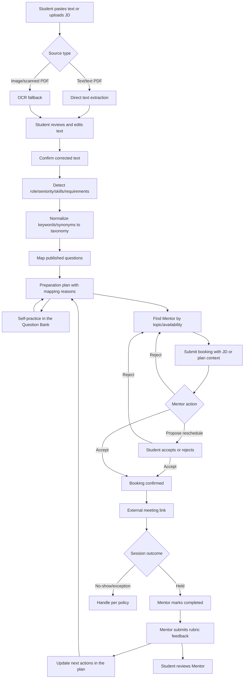
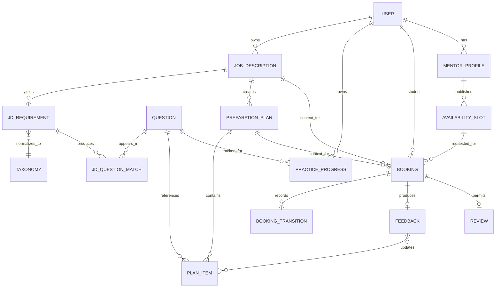

# Interview Practice Platform — Future-State Workflow

## 1. Workflow definition

The future state describes the black-box business process of the MVP: a Student submits a Job Description (JD) to the system, reviews the extracted text, receives a mapped preparation plan, then self-practices or books a Mentor, and uses feedback to update the plan. Technical schema/constraints belong to the Architecture document.

Per the Project Charter assignment, Hưng (Product Owner / Business Analyst) owns the business process; Hùng (UI/UX Designer / Front-end Developer) checks experience/prototype and interface; Trí (PoC / Integration & E2E Developer) validates end-to-end feasibility; Luân (Architecture / Technical Lead) checks architecture constraints; Tuấn Anh (Project Manager / Team Leader / Timekeeper) coordinates time, Kanban, integration, and readiness; Gia Thành (Project Planning & Estimation Analyst / Full-stack Developer) analyzes baseline impact and supports implementation.

## 2. Main scenario

An has a Front-end Intern JD. An pastes the text or uploads a file, reviews the extracted content, and fixes errors before confirming. The system detects role, seniority, skills/technologies, normalizes synonyms against the taxonomy, and maps `PUBLISHED` questions with source requirements and reasons. An creates a preparation plan, self-practices some questions, then picks a Mentor matching the plan's topics. The booking carries JD/plan context; the Mentor confirms, and both sides use an external meeting link. After the session, feedback with strengths, weaknesses, and next actions is fed back into the preparation plan.

## 3. Future end-to-end process

`COMPLETED` is the mandatory booking state before feedback; feedback is not a booking state. The no-show/cancel/reschedule flow is enabled only per approved policy. Successful extraction/OCR does not mean analysis is correct; Student confirmation is the mandatory gate.

## 4. Process specification

| Step | Actor | Precondition | Activity | Postcondition |
|---|---|---|---|---|
| FS-01 | Student | Logged in | Paste JD text or upload a file within approved limits | `JobDescription` created for the Student |
| FS-02 | System/process | Valid source | Direct extraction; OCR only when the image/scanned PDF requires it | Extraction finishes with text or a safe error code |
| FS-03 | Student | Extracted/pasted text available | View, edit, and confirm corrected text | One confirmed text version for analysis |
| FS-04 | System | Corrected text confirmed | Detect role, seniority, skills, technologies, and key requirements | Requirements keep source evidence and normalization status |
| FS-05 | System | Taxonomy/synonyms available | Normalize requirements and map `PUBLISHED` questions | Results stable per mapping version; include score/reason |
| FS-06 | Student/System | Valid results available | Select/acknowledge topics and questions, create a preparation plan | Plan owned by the Student, referencing JD and mapping version |
| FS-07 | Student | Plan or `PUBLISHED` questions available | Open a question, bookmark, and update practice status | Private practice progress stored |
| FS-08 | Student | Topics/plan plus `APPROVED` Mentors | Filter Mentors by expertise/availability | Pick a Mentor/slot or receive a clear empty state |
| FS-09 | Student | Slot available; owns JD/plan | Submit a booking with minimal required context | `PENDING` booking referencing JD or plan |
| FS-10 | Mentor | Owns the slot/booking | Accept/Reject/Propose reschedule | Booking transitions validly with audit trail |
| FS-11 | System/both sides | Booking `CONFIRMED` | Lock the slot, notify, and grant meeting-link access | Both sides have session info; provider is not the source of truth |
| FS-12 | Both sides | Time arrives | Mock interview via external tool | Booking eligible for completion/no-show handling |
| FS-13 | Mentor owning the booking | Booking `COMPLETED` | Submit rubric feedback | Private feedback with strengths, weaknesses, next actions |
| FS-14 | Student/System | Feedback available | Apply next actions to the plan; Student may review the Mentor | Next practice loop starts |

### 4.1 Standard booking states

| Business state | API/storage code | Holds the slot | Meaning |
|---|---|---|---|
| Pending | `PENDING` | No | Booking awaits the Mentor's decision |
| Confirmed | `CONFIRMED` | Yes | Mentor accepted; the slot is held |
| Reschedule proposed | `RESCHEDULE_PROPOSED` | Old slot held; new slot not held | The other side must accept/reject the proposal |
| Rejected | `REJECTED` | No | Mentor rejected the current request |
| Cancelled | `CANCELLED` | No | Booking cancelled per policy |
| Completed | `COMPLETED` | Yes, as history | Session held and recorded as completed |
| No-show | `NO_SHOW` | History/exception | Reported after 15 minutes; confirmed only when the Administrator or the other side verifies timestamped evidence |

Do not use `OCR` to describe the whole JD analysis; do not mix "reschedule", "change proposal", and `RESCHEDULE_PROPOSED`. The full vocabulary is in [Product Backlog, section 1.3](Product_Backlog_and_Acceptance_Criteria.md#14-booking-state-vocabulary).

### 4.2 Booking state transition table

| From | Command/actor | Guard condition | To | Side effects | Traceability |
|---|---|---|---|---|---|
| — | `CreateBooking` / Student | Slot available; JD/plan owned by Student; valid context | `PENDING` | Record booking + anti-duplicate event | US-11, US-30; BR-03/10/18 |
| `PENDING` | `Accept` / owning Mentor | Valid Mentor/slot; lock or transaction constraint met | `CONFIRMED` | Hold slot + outbox event | US-12; BR-02/08/10 |
| `PENDING` | `Reject` / owning Mentor | Valid reason | `REJECTED` | Audit trail + event | US-12; BR-08 |
| `PENDING`/`CONFIRMED` | `ProposeReschedule` / authorized side | ≥12 hours left; new slot valid; not more than 2 proposals | `RESCHEDULE_PROPOSED` | Keep old slot; record proposal | US-12/13; BR-02/08/10 |
| `RESCHEDULE_PROPOSED` | `AcceptReschedule` / other side | New slot still available at write time | `CONFIRMED` | Atomically move the slot | US-13; BR-02/08/10 |
| `RESCHEDULE_PROPOSED` | `RejectReschedule` / other side | Valid proposal | State before proposal | Keep old slot if previously `CONFIRMED`; audit trail | US-13; BR-08 |
| `PENDING`/`CONFIRMED`/`RESCHEDULE_PROPOSED` | `Cancel` / authorized side | ≥12 hours left; later requires Administrator/other side | `CANCELLED` | Release the slot as appropriate + event | US-13; BR-08/10 |
| `CONFIRMED` | `MarkCompleted` / owning Mentor | Past the end time | `COMPLETED` | Audit trail; Student has 24 hours to dispute; private feedback and review stay unpublished until the window ends or the dispute is resolved | US-15/17; BR-05/06/08 |
| `CONFIRMED` | `ReportNoShow` / either side | Past start time + 15 minutes | `CONFIRMED`/awaiting resolution | Store timestamped evidence; no terminal state change yet | US-20; BR-08 |
| `CONFIRMED`/awaiting resolution | `ConfirmNoShow` / Administrator or other side | Valid report/evidence | `NO_SHOW` | Audit trail + operational action | US-20; BR-08 |

Invalid transitions must fail without affecting the current state or slot. Notification errors do not alter the recorded target state.

## 5. Business input and output model

### JD sources

- `source_type`: up to 50,000 characters of pasted text or one PDF/PNG/JPEG; file up to 10 MB, PDF up to 5 pages, PNG/JPEG a single image.
- Reference to the original file, name/content type, processing status, and ownership.
- File signature/MIME, encoded/embedded/multi-file data, and analysis safety are checked server-side; the original file self-deletes within 24 hours after extraction finishes.

### Extraction and correction

- `extracted_text`, extraction method/version/status, duration, and safe error code; OCR supports Vietnamese/English only, times out at 60 seconds, max 2 runs and 2 concurrent tasks/processes.
- `corrected_text`, correction version, confirmation time, and the confirming Student.
- Analysis uses only the confirmed corrected version.

### Requirements and question mapping data

- Original requirement/evidence fragment from the corrected text.
- Role, seniority, skills/technologies, and normalized taxonomy topics.
- Question code, match score 0–100, reason, and mapping version; weights are 40 topic/synonym, 30 keyword coverage, 15 role, 15 seniority/difficulty.
- Only `PUBLISHED` questions with valid taxonomy/provenance enter the results.
- Keep only score ≥60; max 10 questions per JD and 3 per requirement; tie-breaking must be stable.

### Preparation plan

- Student, `JobDescription`, selected requirements/topics/questions, and plan status.
- Plans store references/versions; do not copy sensitive content unnecessarily.
- Next actions from feedback may add/reprioritize items but must not overwrite history.

### Mentors, booking, and feedback

- Mentor expertise/slots and verification status.
- Booking references `job_description_id` or `preparation_plan_id`, Mentor, slot, goal, and interview type.
- The Mentor sees only the minimal context needed to practice; the original file is not shared automatically.
- Feedback includes rubric scores, strengths, weaknesses, evidence, and next actions.
- The Mentor creates the meeting link; only both sides see it from `CONFIRMED` until 24 hours after the session. When US-22 Extended is selected, reminders run at 24 hours and 1 hour in the recipient's timezone.
- JD-derived data expires after 90 days of inactivity; booking/feedback history after 180 days; user deletion requests remove active data within 7 days and backups within 30 days.

## 6. Processing phases

### 6.1 JD intake and text confirmation

The system distinguishes pasted text, text PDFs, and PNG/JPEG/scanned PDFs. Input respects the 50,000-character limit or one 10 MB/5-page file; direct extraction is preferred, with internal Vietnamese/English OCR as fallback. Unsupported/corrupt/empty/password-protected/over-limit data must fail safely. The Student always reviews and edits the text before analysis.

### 6.2 Requirement analysis and taxonomy normalization

The PoC uses keywords, synonyms, taxonomy, and rules; results keep source evidence so reviewers understand why a requirement was created. Unknown terms are not auto-assigned a topic as fact; they remain unmapped/reviewable.

### 6.3 Question mapping and preparation plan

Mapping takes only `PUBLISHED` questions with score ≥60, creating at most 10 questions per JD and 3 per requirement using the 40/30/15/15 rule. The same corrected text, taxonomy, and mapping version must reproduce the same order/hash. Each result shows the source requirement, topic, question, and reason. The Student may drop/select items before creating the plan.

### 6.4 Self-practice and Mentor booking

The Student can practice directly or find a Mentor from the topics/plan. A booking must keep a reference to the JD or plan owned by the Student; the Mentor sees the minimal context per the ownership policy.

### 6.5 Session, feedback, and learning loop

Booking transitions use the standard state machine and the 12-hour mark. The Mentor creates the external meeting link; 24-hour/1-hour reminders belong only to US-22 Extended. Feedback exists only after `COMPLETED`, is private per booking, and produces next actions that return to the plan/Question Bank. The Student may dispute completion within 24 hours; a dispute keeps the review unpublished until the Administrator resolves it with an audited decision.

## 7. Business rules and exceptions

The standard rule catalog, source/owner, and changeability are in [Product Backlog and Acceptance Criteria, section 1.2](Product_Backlog_and_Acceptance_Criteria.md#13-business-rules). The process applies these rule groups:

- `BR-12`–`BR-14`: input/file checks, direct-extraction/OCR routing, and corrected-text confirmation.
- `BR-15`–`BR-17`: requirement evidence, taxonomy normalization, stable mapping, and plan ownership.
- `BR-18`–`BR-19`: booking context plus JD/mapping/plan privacy and retention.
- `BR-01`–`BR-11`: Mentors, booking, Questions, notifications, meeting links, and feedback.

| Exception | Required behavior | Rule/verification |
|---|---|---|
| Unsupported/corrupt/encrypted/multi-file/>10 MB/PDF >5 pages | Reject before processing; safe error; no analysis/mapping created | BR-12/19; AC-24-01/02 |
| Direct extraction yields no usable text | Switch to internal VI/EN OCR; 60-second timeout, ≤2 runs; if it fails, allow paste/edit/manual handling | BR-13; AC-25-01/02 |
| Extraction/OCR incorrect | Student edits; stale analysis invalidated when the corrected version changes | BR-14; AC-26-01 |
| Requirement does not map to the taxonomy | Keep source evidence unmapped; do not invent topics/questions | BR-15; AC-27-01 |
| No question reaches score ≥60 | Empty state states the coverage gap; do not return drafts or silently lower the threshold | BR-16; AC-28-01/02 |
| Re-running mapping with the same version | Order/scores/reasons stable; a new version creates a new result set | BR-16; AC-28-01 |
| Another user accesses JD/plan | Reject server-side; do not reveal object/file/text | BR-19; NFR-01/11 |
| Mentor opens booking context | Sees only the minimal context of their own booking | BR-18/19; AC-30-01 |
| Booking/notification/provider error | Internal booking state stays the source of truth; notifications retry at minute 1/5; Mentor has 15 minutes for a replacement link, otherwise an explicit reschedule | BR-09/10/11; TC-B/TC-N |

## 8. Future-state domain mapping

This is a conceptual domain mapping to align terms and relations. Schema, null/unique constraints, storage, and API details belong to the Architecture document. `JDQuestionMatch` is the mapping between a requirement and a Question, not a claim that a suggestion is always correct.

## 9. Risks and limits

- OCR quality depends on the file/image; never skip correction.
- Missing taxonomy/synonyms reduce requirement coverage and mapping relevance.
- JDs may contain PII or company information; minimize data, access control, retention, and deletion.
- Rule-based mapping may miss new synonyms; versioning and evaluation against a test JD set are required.
- Low Mentor supply still affects booking but does not block the preparation plan/self-practice.
- Meeting/OCR/email provider outages are outside direct control.
- Semantic/ML mapping, payment, and built-in video are not in the MVP.

## 10. Traceability

| Process area | Requirement | Stories | Verification |
|---|---|---|---|
| JD input/extraction/correction | RQ-11 | US-24, US-25, US-26 | AC-24/25/26; TC-JD; OBJ-02 |
| Requirement analysis/mapping/plan | RQ-12 | US-27, US-28, US-29 | AC-27/28/29; TC-MAP/PLAN; OBJ-03/04/05 |
| Question self-practice | RQ-03 | US-04, US-05, US-06, US-18 | TC-Q; OBJ-05 |
| Mentor discovery | RQ-05 | US-07–US-10 | TC-M/TC-SLOT |
| Plan-to-booking context | RQ-13 | US-30, US-11 | AC-30-01/AC-11; TC-B; OBJ-06 |
| Booking/session/notification | RQ-06/07/09 | US-12–US-14, US-19, US-22 | TC-B/SESSION/N; OBJ-06 |
| Feedback/review/loop | RQ-08 | US-15–US-17 | TC-F; OBJ-07/08 |
| Moderation/operations | RQ-10 | US-18, US-20, US-23 | TC-ADM; NFR-08 |

## 11. Process verification scenarios

The scenarios below are required test conditions, not statements of achievement. Test scope includes happy, negative, boundary, malicious, and process workflow cases.

| Code | Scenario | Expected result |
|---|---|---|
| WV-01 | Paste a valid JD | Text appears for review; Student edits/confirms before analysis |
| WV-02 | Upload text PDF and VI/EN image/scanned PDF | Direct extraction preferred; OCR used only when needed, ≤60 seconds/run with clear status |
| WV-03 | Unsupported/corrupt/empty/>10 MB/PDF >5 pages | Safe rejection; no garbage mapping/plan created |
| WV-04 | Synonym `ReactJS` in the corrected text | Normalized to topic `React`, keeping source evidence |
| WV-05 | JD has a requirement outside the taxonomy | Show unmapped/coverage gap, do not invent Questions |
| WV-06 | Re-run mapping with the same input/version | Same result hash; only score ≥60, max 10 questions and 3 per requirement; no `DRAFT` questions |
| WV-07 | Student creates a preparation plan | Each item traces to requirement/topic/question/reason |
| WV-08 | Student moves the plan into Mentor booking | Booking references Student-owned JD/plan; Mentor sees minimal context |
| WV-09 | User not part of the booking opens JD/plan/feedback | Rejected server-side; no unnecessary reveal of object existence/content |
| WV-10 | Booking milestones/reminders → `COMPLETED` → Feedback | 12-hour/15-minute/24-hour policy, reminders, and full rubric/next-action feedback work correctly |
| WV-11 | Concurrent booking/reschedule contention | One slot has only one holding booking; the losing booking stays safe |
| WV-12 | Notification/provider error | Recorded booking unchanged; retry/dedupe/fallback work |

## 12. Future-state outcome

The process meets its goal when a Student turns a valid JD into corrected text, explainable requirements/mapping, and a preparation plan; from there they can self-practice or complete Mentor booking/feedback while keeping traceability to the JD. Baselines and tradeoffs are managed in [Approved Product Decisions](Product_Backlog_and_Acceptance_Criteria.md#10-approved-product-decisions) and [Product Decision Estimation Notes](Product_Decision_Estimation_Notes.md).
